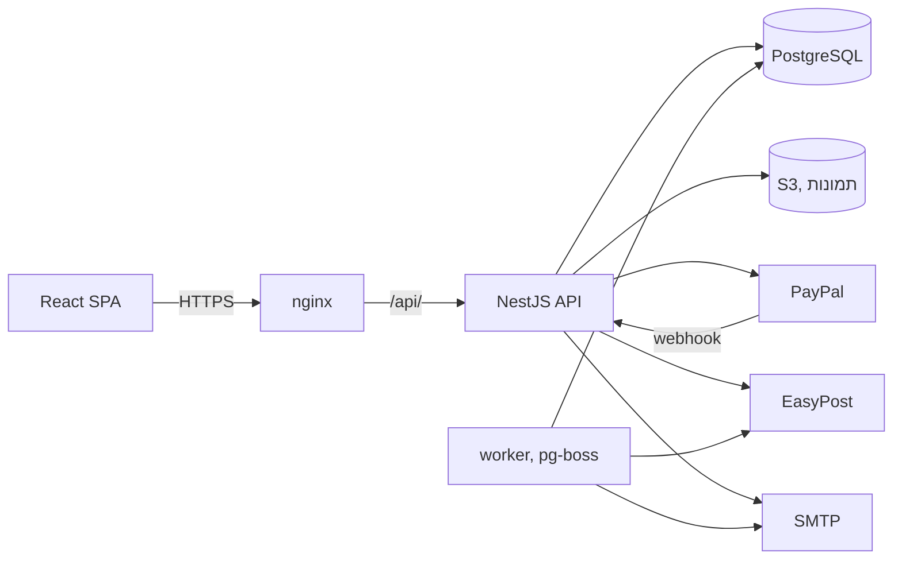
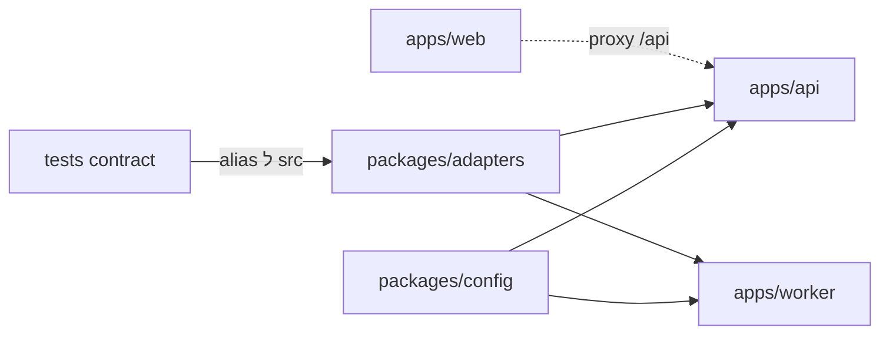
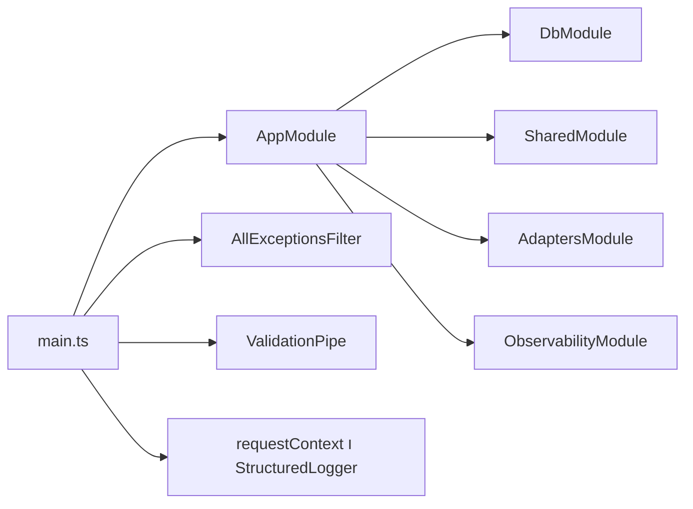
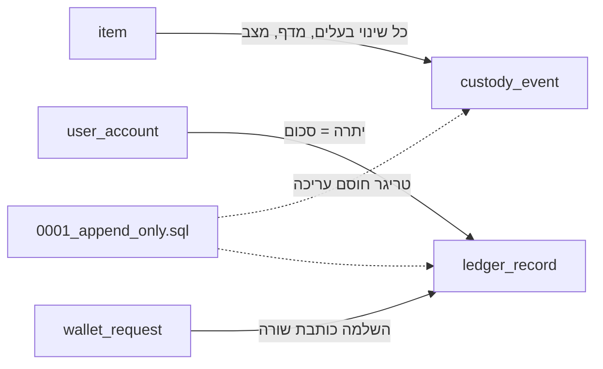
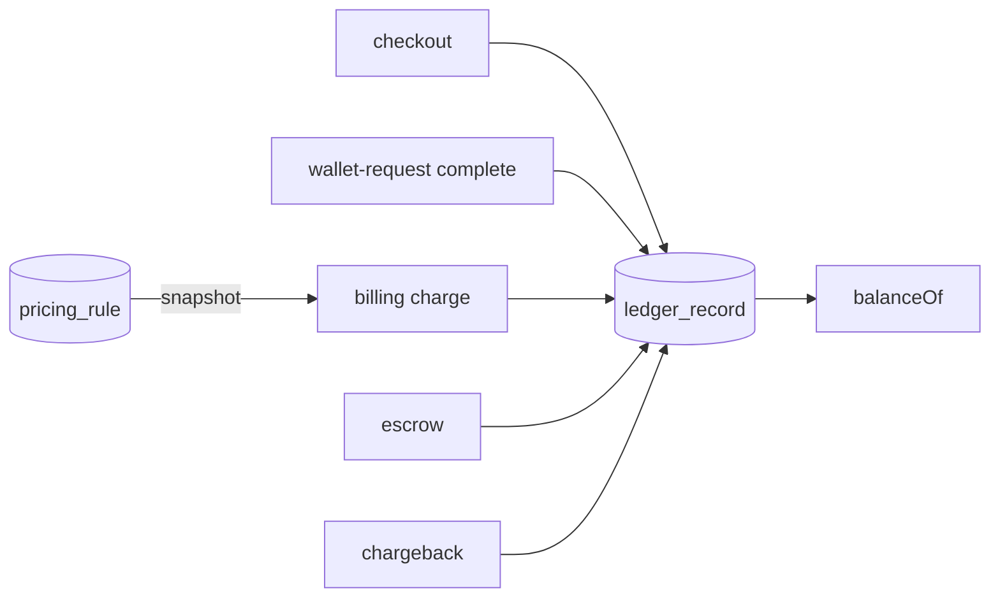
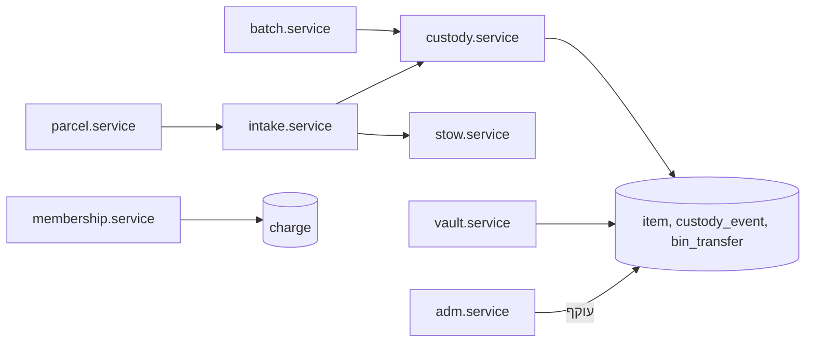
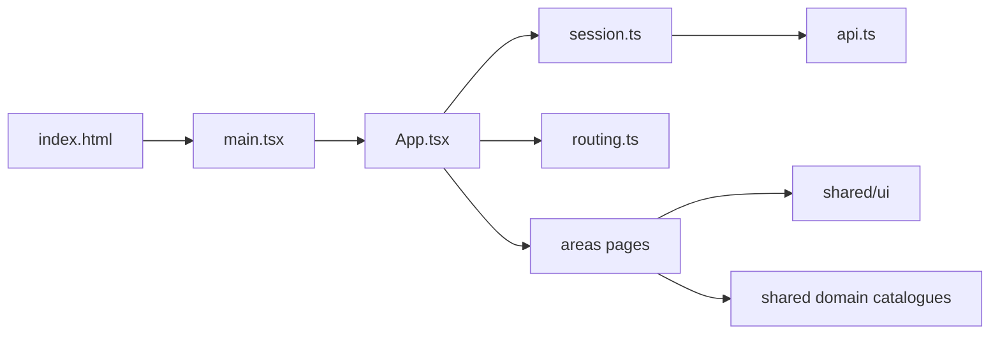

# DIVE2, המדריך המקוצר, כל קובץ בריפו

**הערה.** המדריך הזה הוחלף ב `docs/DIVE2-fast.md`. הוא מכסה את אותם קבצים ברמת הבלוק, בפחות מעשר שעות, וכל טענה בו נבדקה פעמיים מול הקוד. קראו אותו במקום המדריך הזה.

המסמך הזה הוא גרסה מקוצרת של `docs/DIVE2.md`, והוא מכסה את אותם 475 קבצי קוד. ההבדל הוא בעומק. במקום הסבר שורה אחרי שורה, כל קובץ מקבל בדיוק את מה שצריך כדי לפתוח אותו ולהבין אותו. קבצים מרכזיים מקבלים הסבר מלא יותר, קבצים רגילים מקבלים פסקה ונקודות, וקבצים טריוויאליים מקבלים שורה בטבלה.

המסמך מבוסס על אותו ניתוח שנבדק מול הקוד ב `docs/DIVE2.md`, ולא משנה שום קוד בריפו. כאשר צריך עוד עומק בקובץ מסוים, כל סעיף מפנה לקובץ המקביל בספר המלא.

## איך לקרוא

- פתחו את הריפו בחלון אחד ואת המסמך בחלון שני. קראו את הסעיף על קובץ, ואז הציצו בקובץ עצמו לדקה או שתיים. כך לומדים מהר יותר מקריאה של כל אחד מהם לבד.
- קראו קודם את העמוד הבא, המערכת בעמוד אחד. הוא המפה של כל השאר.
- אחר כך קראו את הפרקים לפי הסדר. כל פרק נפתח בסקירה שאומרת באיזה סדר לקרוא את הקבצים שלו.
- כאשר מופיע מזהה כמו E4, זה ממצא מאומת מחלק ב של הספר המלא. הטבלה בסוף העמוד הבא מסבירה כל מזהה בשורה אחת.
- קבצים בטבלאות אפשר לסרוק במהירות. אין צורך לפתוח אותם עכשיו.

## כמה זמן זה לוקח

| פרק | נושא | מילים | זמן משוער |
|---|---|---|---|
| 1 | שלד הריפו, החבילות המשותפות, הסקריפטים, התשתית וה CI | 3,772 | 0.6 עד 0.8 שעות |
| 2 | תהליך ה API, עלייה, תשתית משותפת וה seed | 3,452 | 0.6 עד 0.7 שעות |
| 3 | מודל הנתונים וה migrations | 6,337 | 1.1 עד 1.4 שעות |
| 4 | חשבונות, אימות, אבטחה, מדיה, תמיכה, כסף, תמחור ונאמנות | 5,610 | 0.9 עד 1.2 שעות |
| 5 | קליטה, משמורת, הכספת, חברויות וקונסולת הניהול בצד השרת | 4,185 | 0.7 עד 0.9 שעות |
| 6 | השוק, התראות, שירותים על פריט מאוחסן ומשלוחים | 4,858 | 0.8 עד 1.1 שעות |
| 7 | ה worker והבדיקות | 4,918 | 0.8 עד 1.1 שעות |
| 8 | ה SPA, עלייה, רכיבי יסוד, מודולים משותפים ומסכי לקוח ראשונים | 5,799 | 1.0 עד 1.3 שעות |
| 9 | שאר מסכי הלקוח, המחסן והמנהל | 3,689 | 0.6 עד 0.8 שעות |
| | הכל, כולל העמודים הפותחים | 43,493 | 7 עד 9 שעות |

ההערכה מניחה קריאה של 100 עד 130 מילים בדקה, ועוד בערך 30 אחוז זמן להצצה בקוד עצמו. בקצב של שעה ביום זה בערך שבועיים.

## המערכת בעמוד אחד

Bault הוא כספת ושוק לקלפי אספנות. אספן שולח חבילה למחסן, המחסן פותח, מצלם, מקצה מספר סידורי ומאחסן כל קלף בתא. מאותו רגע הקלף הוא רשומה עם בעלים, מיקום, מצב ותקופת אחסון שמחויבת אוטומטית. הבעלים יכול למכור בשוק הפנימי, להחליף, לשלוח לדירוג או לצילום, לבקש משלוח הביתה, או למכור ל Bault עצמה.

המערכת בנויה משלושה תהליכים.

- **ה API** ב `apps/api`. מונוליט NestJS אחד עם 15 מודולים עסקיים ו 245 routes תחת `/api/v1`. כל הלוגיקה העסקית יושבת כאן.
- **ה SPA** ב `apps/web`. אפליקציית React עם Vite, ניתוב לפי hash, עברית ואנגלית, ושלושה אזורים לפי תפקיד, לקוח, מחסן ומנהל.
- **ה worker** ב `apps/worker`. תהליך Node שמריץ שמונה עבודות מתוזמנות עם pg-boss, למשל חיוב אחסון, ריבית על חוב ומעקב משלוחים.

מסביבם יש מסד PostgreSQL יחיד שמחזיק גם את התורים, אחסון S3 לתמונות, PayPal לכסף, EasyPost למשלוחים ו SMTP למייל. שלוש חבילות משותפות ב `packages` מחזיקות את סכמת משתני הסביבה, את ה adapters לספקים החיצוניים, ומקום לטיפוסים משותפים.

### ארבעה דברים שכדאי לזכור לאורך כל הקריאה

1. **שלושה יומנים שאי אפשר לשנות הם הלב.** יומן המשמורת מתעד כל מעבר של פריט בין מצבים ובין בעלים. יומן ההעברות מתעד כל מעבר בין תאים. יומן הכסף מתעד כל תנועה כספית. triggers במסד חוסמים עדכון ומחיקה של שורות בהם. יתרת ארנק לא נשמרת בשום מקום, היא תמיד סכום השורות ביומן הכסף. כל שינוי בבעלות, במיקום או בכסף צריך לעבור דרך `CustodyService` ו `LedgerService` בטרנזקציה אחת.
2. **כל route סגור כברירת מחדל.** הבקשה עוברת קודם הגבלת קצב, אחר כך בדיקת session, ואחר כך בדיקת תפקיד. route פתוח חייב להיות מסומן במפורש.
3. **ה worker לא משתף קוד עם ה API.** הוא כותב SQL גולמי לאותן טבלאות. שינוי בטבלה חייב להיבדק גם מולו.
4. **הערות בקוד מתארות לרוב כוונה ולא מציאות.** איפה שהן סותרות את הקוד, המדריך אומר את זה.

### הממצאים המאומתים בשורה אחת

| מזהה | חומרה | מה הבעיה |
|---|---|---|
| E1 | P0 | קניות מקבילות של אותו קונה מוציאות יותר כסף ממה שיש לו, כי היתרה נבדקת בלי נעילה |
| E2 | P0 | ה migrator המקומפל ב image לא מתקין את ה triggers שמגנים על היומנים |
| E3 | P0 | אין יצירה של הזמנת PayPal בשום מקום, ולכן טעינה מיידית של הארנק לא עובדת |
| E4 | P0 | העברת בעלות לא בודקת מי הבעלים הנוכחי |
| E5 | P0 | אין גיבוי שנבדק ואין PITR |
| E6 | P1 | מסד חדש בלי seed לא יכול לתמחר שום פעולה |
| E7 | P1 | `EXPOSE_API_DOCS=false` דווקא מדליק את תיעוד ה API |
| E8 | P1 | ה API מקבל גוף מקודד כטופס, ולכן login CSRF אפשרי |
| E9 | P1 | כל משתמש מחובר יכול להעלות קבצים, ותוכן הקובץ לא נבדק |
| E10 | P1 | כשל באחסון מחזיר שגיאת 500 כללית |
| E11 | P1 | ה seed שמוחק את כל המסד נמצא בתוך image הייצור |
| E12 | P1 | שש פגיעויות בחומרה גבוהה בתלויות הייצור |
| E13 | P1 | זמן התגובה של ההתחברות חושף אם חשבון קיים |
| E14 | P1 | ברירת המחדל של `TRUST_PROXY` גורמת לכל הלקוחות להיראות כאותו IP |
| E15 | P1 | ל worker אין כיבוי מסודר ואין אות חיים |
| E16 | P2 | חבילות הבדיקות תלויות במצב המסד ובסדר ההרצה |
| E17 | P1 | מעקב המשלוחים ב worker תמיד משתמש ב adapter המזויף |
| E18 | P1 | תשלום משלוח, הצעת white glove ומימון escrow בודקים יתרה מחוץ לטרנזקציה |
| E19 | P1 | הסיסמה של `/docs` לא מגינה על `/docs-json` |
| E20 | P1 | ה FAQ הוא העתק של ה FAQ של ShipMyCards |
| E21 | P1 | אין תנאי שימוש ואין מדיניות פרטיות |
| E22 | P1 | כותרות האבטחה של nginx לא מגיעות לדף ה HTML |

הפירוט המלא של כל ממצא, איך הוא אומת ואיך מתקנים אותו, נמצא בפרק 27 של `docs/DIVE2.md`.

## תוכן העניינים

- פרק 1. שלד הריפו, החבילות המשותפות, הסקריפטים, התשתית וה CI
- פרק 2. תהליך ה API, עלייה, תשתית משותפת וה seed
- פרק 3. מודל הנתונים וה migrations
- פרק 4. חשבונות, אימות, אבטחה, מדיה, תמיכה, כסף, תמחור ונאמנות
- פרק 5. קליטה, משמורת, הכספת, חברויות וקונסולת הניהול בצד השרת
- פרק 6. השוק, התראות, שירותים על פריט מאוחסן ומשלוחים
- פרק 7. ה worker והבדיקות
- פרק 8. ה SPA, עלייה, רכיבי יסוד, מודולים משותפים ומסכי לקוח ראשונים
- פרק 9. שאר מסכי הלקוח, המחסן והמנהל

## פרק 1. שלד הריפו, החבילות המשותפות, הסקריפטים, התשתית וה CI

### סקירה

האזור הזה הוא השלד של הריפו. אין בו לוגיקה עסקית, אבל כל דבר אחר נשען עליו. Bault הוא monorepo של pnpm עם שלושה יישומים תחת `apps/` ושלוש חבילות משותפות תחת `packages/`. היישומים תלויים בחבילות בשם, למשל `@bault/config`, דרך `workspace:*`. החבילות נפתרות דרך `dist/`, שלא נמצא בגיט, ולכן בכל מקום שמריץ קוד, סקריפט `dev`, ה CI וה Dockerfile, בונים קודם את `packages/config` ואת `packages/adapters`. הבדיקות לבדן עוקפות את זה ב alias אל `src`.

סדר קריאה מומלץ. קודם קבצי השורש שמגדירים את ה workspace. אחר כך `packages/config/src/env.ts`, המקום היחיד שבו הסביבה נטענת ומאומתת. אחר כך ה adapters, שהם כל המגע עם העולם החיצוני, תשלום, משלוח, דואר ואחסון. אחר כך הסקריפטים, התשתית המקומית, ה Dockerfile ו nginx, ולבסוף ה CI. קבצי כלי ה AI בסוף, כי הם לא רצים אף פעם.

#### `package.json`
המניפסט של שורש ה monorepo. הוא לא מכיל קוד מוצר, רק זהות, סקריפטים שמתזמרים את היישומים וכלי פיתוח משותפים. כמעט כל פקודה שתריץ ביום הראשון עוברת דרכו.
- `packageManager` נועל את `pnpm@9.15.0`, ו corepack וה CI סומכים עליו.
- `engines.node` דורש Node 22 או 24, בגלל jsdom 30. בלי `engine-strict` זו רק אזהרה, ולכן שלושת ה Dockerfile רצים על Node 20 בלי להיכשל.
- `test` מריץ את `scripts/test.mjs`, ולא vitest ישירות. סקריפטי `test:*` של הפרויקטים החיים מוסיפים `--no-file-parallelism`, וזה מה שבאמת אוכף ריצה סדרתית.
- `db:reset` הוא בעצם ה seed של ה API, שמוחק הכל ב TRUNCATE.
- אין `format:check`, כלומר אף אחד לא אוכף פורמט.

**שים לב.** `users:remove-test` ו `test` פועלים על כל מסד שה `.env` מצביע עליו. אל תריץ אותם כשה `.env` מצביע על מסד אמיתי.
לעומק, ראה את ההסבר על `package.json`

#### `.npmrc`
שלוש הגדרות של pnpm שמעצבות את `node_modules`. `link-workspace-packages=true` מקשר חבילות workspace מקומית. `auto-install-peers=true` מתקין peer dependencies חסרים. `strict-peer-dependencies=false` מונע כשל על אי התאמת peer, וההערה שטוענת שהוא שומר על עץ קפדני אומרת את ההפך מהאמת.
- אין `shamefully-hoist`, ולכן קוד שרץ מהשורש, `tests/` ו `scripts/`, רואה רק את תלויות השורש. זה המקור לכל ה aliases ב `vitest.workspace.ts` ולכשל של `scripts/remove-test-users.mjs`.

**שים לב.** הוספת `engine-strict=true` תשבור מיד את שלושת ה Dockerfile, כי הם על Node 20.
לעומק, ראה את ההסבר על `.npmrc`

#### `tsconfig.base.json`
אפשרויות הקומפיילר שכל חבילה ויישום מרחיבים. `target` ו `lib` הם ES2022, `declaration` דלוק כדי שהחבילות ייצרו `.d.ts`.
- `strict` ו `noUncheckedIndexedAccess` הם ההגדרות שהכי משפיעות על הקוד. כל גישה לפי אינדקס מחזירה אולי `undefined`, וזה מסביר את שרשראות `?.` הארוכות ב adapters.
- `exactOptionalPropertyTypes` כבוי במכוון, וה adapters מסתמכים על זה.
- שלוש החבילות דורסות `isolatedModules` ל `false`.

**שים לב.** הדלקת `exactOptionalPropertyTypes` תשבור עשרות מקומות. כיבוי `noUncheckedIndexedAccess` יעבור בשקט ויסיר הגנה אמיתית.
לעומק, ראה את ההסבר על `tsconfig.base.json`

| קובץ | מה הוא עושה |
|---|---|
| `pnpm-workspace.yaml` | מכריז ש `apps/*` ו `packages/*` הם חבילות. תיקייה חדשה כאן מחייבת `COPY` של המניפסט שלה בכל Dockerfile |
| `pnpm-lock.yaml` | קובץ הנעילה, 6910 שורות, לא נערך ביד. `--frozen-lockfile` ב CI וב Docker נכשל אם הוא לא תואם ל `package.json` |
| `eslint.config.mjs` | flat config מינימלי בלי type aware linting. `any` ומשתנים לא בשימוש הם אזהרה בלבד, וקבצי `*.config.*` לא נבדקים |
| `.prettierrc.json` | גרשיים בודדים, רוחב 100, LF. רץ רק דרך `pnpm format` ולא נאכף ב CI |
| `.editorconfig` | `utf-8`, LF, שני רווחים. בפועל עץ העבודה ב Windows היה CRLF, ולכן `design-lint` ממיר |
| `.gitignore` | מסתיר `dist/`, `.env` חוץ מ `.env.example`, `.playwright-cli/` ו `_local/`. חסר בו `backups/` |

#### `.env.example`
התבנית שמפתח חדש מעתיק ל `.env` בשורש. שום קוד לא קורא אותה. המקור הקובע הוא הסכמה ב `packages/config/src/env.ts`, והחלק המעניין בתבנית הוא הפערים בינה לבין הסכמה.
- `DATABASE_URL` מצביע על PgBouncer בפורט 6432, `DIRECT_DATABASE_URL` על Postgres ב 5432, עם `bault:bault` כמו ב compose.
- `PAYMENT_PROVIDER=paypal` עם ערכי PayPal ריקים, ולכן העתקה כמו שהיא נכשלת באתחול עד שממלאים אותם או עוברים ל `sandbox`.
- `EXPOSE_API_DOCS=true` מדליק את ה explorer, ו `AUTH_RATE_LIMIT_PER_MINUTE=10` נשאר על ערך שהסכמה כבר העלתה ל 30.
- שורות 44 עד 49 הן שארית שבורה שנקטעת באמצע משפט.
- `SESSION_COOKIE_SECRET`, `EMAIL_API_KEY` ו `SENTRY_DSN` מופיעים, אבל אף קוד לא קורא אותם.

**שים לב.** משתנה חובה חדש בסכמה בלי ברירת מחדל ובלי שורה כאן יתקע כל מפתח חדש באתחול.
לעומק, ראה את ההסבר על `.env.example`

| קובץ | מה הוא עושה |
|---|---|
| `apps/web/.env.example` | תבנית למשתנה אחד, `VITE_API_PROXY_TARGET`, עם אזהרה שכל `VITE_` נכנס לבנדל של הדפדפן |
| `packages/config/package.json` | המניפסט של `@bault/config`, CommonJS, `main` על `dist/`, תלויות `dotenv` ו `zod` |
| `packages/config/tsconfig.json` | פלט CommonJS מ `src` ל `dist`. הקבצים המקבילים בשתי החבילות האחרות זהים בתוכן |
| `packages/config/src/index.ts` | barrel שמייצא את `loadEnv` ואת הטיפוס `Env` |

#### `packages/config/src/env.ts`
הקובץ שמגדיר מה נחשב קונפיגורציה תקינה. כל משתנה סביבה מוצהר בו פעם אחת בסכמת zod, הכל מאומת באתחול, ושרת עם קונפיגורציה שגויה פשוט לא עולה ומדפיס את כל הבעיות בבת אחת. ה API, ה worker, `migrate.ts` ו `drizzle.config.ts` קוראים כולם ל `loadEnv`, כך שיש מקום אחד שבו הסביבה מוגדרת ומקום אחד שבו היא נכשלת. אל תתבלבל עם `loadEnv` של Vite, שהיא פונקציה אחרת.
- `loadDotenvFromRoot`, שורות 12 עד 25, עולה מתיקיית העבודה עד שש רמות ומחפש `.env`. משתנה שכבר קיים בסביבה, מ shell או מ CI, תמיד מנצח את הקובץ.
- `booleanFromEnv`, שורות 34 עד 40, מתרגם מחרוזת לבוליאני נכון, כי `Boolean('false')` הוא `true`. הוא משמש רק ל `SMTP_SECURE`.
- הסכמה, שורות 53 עד 286, מכסה מסד, אחסון, תשלום, משלוח, דואר, מדיניות חוב, rate limits ו `TRUST_PROXY`, שה `refine` שלו חוסם רק את הערך המילולי `true`.
- `superRefine`, שורות 287 עד 331, מוסיף בדיקות מותנות, למשל `STORAGE_PROVIDER=s3` מחייב את חמשת ערכי `STORAGE_*`. שורות 333 עד 412 חוסמות ב production כל ספק sandbox או console, ו explorer בלי סיסמה.
- `loadEnv`, שורות 415 עד 438, מקפיא את התוצאה ושומר אותה ב cache ברמת המודול. כל קריאה אחרי הראשונה מתעלמת מהפרמטר `source`.

**שים לב.** `EXPOSE_API_DOCS` בשורה 145 משתמש ב `z.coerce.boolean()`, ולכן `false`, `0` ו `no` מדליקים את ה explorer. זה E7. ברירת המחדל `TRUST_PROXY=loopback` שגויה מאחורי nginx במכולה נפרדת, וזה E14. אין בדיקה ש `PAYPAL_ENVIRONMENT` הוא `live` ב production, וזו החלטה עסקית ולא טכנית.
לעומק, ראה את ההסבר על `packages/config/src/env.ts`

| קובץ | מה הוא עושה |
|---|---|
| `packages/contracts/package.json` | מניפסט של `@bault/contracts`. אף יישום לא תלוי בה |
| `packages/contracts/tsconfig.json` | זהה ל `packages/config/tsconfig.json` |
| `packages/contracts/src/index.ts` | placeholder עם `export {}` בלבד. הטיפוסים מ `openapi.yaml` שהובטחו בהערה לא נוצרו. מועמדת למחיקה |
| `packages/adapters/package.json` | מניפסט של `@bault/adapters`. תלות ריצה אחת, `nodemailer`, בלי SDK של PayPal, EasyPost או S3 |
| `packages/adapters/tsconfig.json` | זהה ל `packages/config/tsconfig.json` |
| `packages/adapters/src/index.ts` | barrel עם `export *` לכל ששת הקבצים. adapter חדש חייב שורה כאן |

החבילה `@bault/adapters` לא קוראת משתני סביבה בכלל. כל קונפיגורציה מגיעה דרך הבנאים, מ `apps/api/src/shared/adapters/adapters.module.ts` ומה worker. כל adapter אמיתי כתוב עם `fetch` ביד, וזה הופך אותם לקריאים אבל משאיר אותם בלי timeout ובלי retry.

#### `packages/adapters/src/payment.ts`
הממשק `PaymentAdapter` ושני מימושים, `PayPalPaymentAdapter` מול ה REST API של PayPal ו `SandboxPaymentAdapter` שמאשר הכל. זה הקובץ היחיד שמזיז כסף אמיתי אל Bault וממנו. הוא נבנה ב `adapters.module.ts` ונצרך על ידי שירותי `apps/api/src/modules/pay/`.
- `accessToken`, שורות 161 עד 185, מבקש token בשיטת client credentials ושומר אותו ב cache עד דקה לפני שפג. אין ניקוי של ה cache על `401`.
- `call`, שורות 187 עד 204, עוטף כל קריאה ומוסיף `PayPal-Request-Id` מתוך `idempotencyKey`, כך ש retry עם אותו מפתח לא מבצע פעמיים. אין timeout, ו `fetch` של Node ממתין עד 300 שניות.
- `capture`, שורות 213 עד 243, הוא לב האינטגרציה. הלקוח מאשר order בחלון של PayPal, והשרת מבצע capture ומחזיר את הסכום שבאמת נסלק, כדי שהקורא ישווה אותו לסכום שביקש.
- `createPayout`, שורות 260 עד 295, שולח כסף לכתובת דואר של PayPal עם שתי שכבות idempotency. התשובה כמעט תמיד `pending`, וה webhook שאמור לסגור אותה לא עושה כלום מעבר לבדיקת כפילות.
- `verifyWebhook`, שורות 306 עד 345, שולח את כותרות השידור ל endpoint האימות של PayPal וזורק על כותרת חסרה.

**שים לב.** `capture` מחזיר `succeeded` לפי הסטטוס של ה order ולא של ה capture, ולכן capture שעדיין בהמתנה עלול לזכות ארנק מיד. אין כאן יצירת order בכלל, וזה חלק מ E3.
לעומק, ראה את ההסבר על `packages/adapters/src/payment.ts`

#### `packages/adapters/src/shipping.ts`
הממשק `ShippingAdapter`, הטיפוסים של כתובת, תעריף, תווית ומעקב, ו `SandboxShippingAdapter`. חשוב לזכור שזה גם ספריית חישוב המשקל של כל המערכת, ו `apps/api/src/modules/shp/carriers.ts` מייבא ממנו קבועים.
- `DIM_DIVISOR = 167` הוא מחלק המשקל הנפחי, שונה מ 139 בכוונה כדי להתאים לשירות הייחוס.
- `billableGrams` לוקח את הגדול מבין המשקל בפועל למשקל הנפחי, ורק אז מעגל ליחידת החיוב של השירות.
- `SANDBOX_SERVICES` הם שבעה שירותים עם מחירים מומצאים, ו `getRates` מחשב מחיר שזז עם משקל ויעד.
- `getTracking` של ה sandbox מחזיר תמיד `in_transit`.

**שים לב.** `apps/worker/src/jobs/tracking-refresh.ts` בונה את `SandboxShippingAdapter` ישירות בכל סביבה, ולכן בייצור שום משלוח לא מגיע ל `delivered`. זה E17.
לעומק, ראה את ההסבר על `packages/adapters/src/shipping.ts`

#### `packages/adapters/src/easypost.ts`
המימוש האמיתי של `ShippingAdapter` מול EasyPost, בלי SDK. שלוש פעולות, יצירת shipment שמחזירה תעריפים, קניית תעריף לפי מזהה, ויצירת tracker.
- `address` זורק אם חסרים רחוב או עיר, כי תמחור לפי מיקוד בלבד היה משתנה בזמן הקנייה.
- `getRates` יוצר shipment חדש בכל הצעת מחיר ומחזיר `providerShipmentId` ו `providerRateId`, כדי שהלקוח ישלם בדיוק את מה שראה.
- `buyLabel` מחזיר את ה URL של EasyPost בשדה `labelObjectKey`, שאינו מפתח אחסון.
- `TEST_HOST` הוא בעצם הכתובת היחידה של EasyPost. מצב test נקבע לפי קידומת המפתח.

**שים לב.** `shipment.service.ts` מחפש תעריף לפי שם שירות זהה לקטלוג ב `carriers.ts`, ושמות כמו `Priority Mail` לא תואמים לשמות ש EasyPost מחזיר. סביר שעם `SHIPPING_PROVIDER=easypost` הלקוח יקבל רשימת משלוחים ריקה. זה לא נבדק מול EasyPost אמיתי.
לעומק, ראה את ההסבר על `packages/adapters/src/easypost.ts`

#### `packages/adapters/src/email.ts`
הממשק `EmailAdapter`, מנוע תבניות קטן שמייצר טקסט ו HTML, ושני מימושים. `ConsoleEmailAdapter` מדפיס ללוג, כולל קישורי האימות, ו `SmtpEmailAdapter` שולח דרך nodemailer.
- `renderEmail` מטפל בשלוש תבניות, `email_verification`, `password_reset` ו `notification_event`. תבנית לא מוכרת לא זורקת אלא מדפיסה את המשתנים.
- `escapeHtml` מקודד כל ערך, כולל ה `href`.
- `SmtpEmailAdapter` לא קורא ל `verify()`, כדי שה API יעלה גם כששרת הדואר למטה.

**שים לב.** אין `requireTLS`, ולכן בפורט 587 תוקף יכול להסיר את STARTTLS והסיסמה תישלח גלויה. גם אין timeouts מפורשים.
לעומק, ראה את ההסבר על `packages/adapters/src/email.ts`

| קובץ | מה הוא עושה |
|---|---|
| `packages/adapters/src/storage.ts` | הממשק `StorageAdapter` עם `putObject` ו `getSignedUrl`, ו sandbox שלא שומר כלום ומחזיר URL לא חתום |

#### `packages/adapters/src/s3.ts`
מימוש של `StorageAdapter` מול כל שירות תואם S3, עם חתימת AWS SigV4 שנכתבה ביד. ה API משתמש בו לתמונות הפריטים, כולל צילומי הקבלה.
- `signingKey` בונה את שרשרת ארבעת ה HMAC של SigV4.
- `urlFor` בונה כתובת בסגנון path, `endpoint/bucket/key`, שמתאים ל MinIO.
- `putObject` חותם גם על hash של הגוף ועל `content-type`, ולכן כל header חדש חייב להיכנס לרשימה החתומה.
- `getSignedUrl` מקומי לגמרי, בלי רשת, ומגביל תוקף בין שנייה לשבעה ימים. ה URL הולך ישר ל `` בדפדפן.

**שים לב.** כשל של ה bucket מגיע לקורא כשגיאה כללית ויוצא כ 500, וזה E10. מפתח עם `..` היה עובר נרמול URL, אבל היום המפתחות נוצרים בשרת.
לעומק, ראה את ההסבר על `packages/adapters/src/s3.ts`

#### `vitest.workspace.ts`
מגדיר את שמונת פרויקטי הבדיקה, `integration`, `concurrency`, `property`, `contract`, `core`, `core-contract`, `web` ו `ux`. הבדיקות עצמן חיות בשורש, ב `tests/` וב `tests3/`, ולכן הקובץ בשורש.
- `ADAPTERS_SRC` בשורה 14 מפנה ב alias אל `packages/adapters/src/index.ts`, כי השורש לא מצהיר על `@bault/adapters`. כך `contract` ו `core-contract` רצים בלי build ובלי מסד.
- `WEB_MODULES` בשורה 27 עושה אותו דבר ל React, שמותקן רק תחת `apps/web`. בפרויקט `ux` סדר ה aliases חשוב, `react-dom/client` לפני `react-dom`.
- `fileParallelism: false` לא עובד ברמת פרויקט ב Vitest 2, וההערה מודה בזה. האכיפה האמיתית היא הדגל בסקריפטים.
- ההערה הכללית בשורות 29 עד 55 מדברת על ארבע חבילות, והקובץ מכיל שמונה. היא פשוט ישנה.

**שים לב.** שינוי שם פרויקט מחייב שינוי ב `package.json`, ב `scripts/test.mjs` וב `.github/workflows/ci.yml`, ששם השמות כתובים ביד.
לעומק, ראה את ההסבר על `vitest.workspace.ts`

#### `scripts/dev.mjs`
מה ש `pnpm dev` מריץ. הוא מרים את ה API, ממתין ש `/api/v1/healthz` יענה, ורק אז מרים את Vite עם `VITE_API_PROXY_TARGET` שמצביע על אותו API.
- `readEnvFile` הוא מפענח מינימלי של `.env` לשני משתנים בלבד.
- `portIsBusy` בודק לפני העלייה אם הפורט תפוס, ומדפיס פקודה לשחרור לפי מערכת ההפעלה.
- `waitForApi` סוקר כל חצי שנייה, ובכישלון שואל אם Postgres למעלה ואם `.env` קיים.
- יציאה של ה API היא תמיד קטלנית, ו Vite רץ עם `stdio: 'inherit'` כדי לשמור קיצורי מקלדת.

**שים לב.** הוא לא מרים את ה worker, את Postgres או מיגרציות. ה watcher של Nest צופה רק ב `apps/api/src`, ולכן שינוי ב `packages/*` נקלט רק אחרי הפעלה מחדש של `pnpm dev`.
לעומק, ראה את ההסבר על `scripts/dev.mjs`

#### `scripts/test.mjs`
מה ש `pnpm test` מריץ. שמונת הפרויקטים רצים אחד אחרי השני לפי הרשימה הקשיחה `SUITES`, קודם ארבעת אלה שלא צריכים מסד ואחר כך ארבעת החיים. בכישלון הלולאה עוצרת. בסוף מריצים את ה seed כדי להחזיר את המסד לקטלוג, אלא אם הועבר `--no-reset`.
- ה reset קורה אחרי הריצה ולא לפניה, כך שריצה שמתחילה על מסד מלוכלך עדיין תלויה בהיסטוריה. זה E16.

**שים לב.** ה seed מריץ TRUNCATE על כל מסד שה `.env` מצביע עליו, בלי שום בדיקת `NODE_ENV`.
לעומק, ראה את ההסבר על `scripts/test.mjs`

#### `scripts/tunnel.mjs`
מה ש `pnpm tunnel` מריץ. חושף את האפליקציה המקומית לאדם חיצוני דרך Cloudflare quick tunnel, בדרך בטוחה יותר מעבודה ידנית.
- בודק שה API חי, ומזהיר אם `AUTH_RATE_LIMIT_PER_MINUTE` גבוה מ 30.
- בונה את ה SPA ומריץ `vite preview` עם basic auth. אם לא הוגדרה סיסמה, נוצרת סיסמה אקראית.
- בודק שה preview באמת מחזיר 401 בלי סיסמה לפני שהוא פותח tunnel, וזה fail closed נכון.
- רק `/api` עובר ל API, כך ש `/docs` לא נחשף.

**שים לב.** `npx --yes cloudflared` מוריד ומריץ חבילת צד שלישי בלי גרסה נעולה, מחוץ ל lockfile.
לעומק, ראה את ההסבר על `scripts/tunnel.mjs`

#### `scripts/fetch-fonts.mjs`
מוריד את הגופנים מ Google Fonts לתוך `assets/fonts/` וכותב מחדש את `apps/web/src/fonts.css`. הוא קיים כדי שמקור הקבצים יהיה מתועד, והקבצים עצמם בגיט כדי שה build לא יהיה תלוי ברשת. מריצים אותו ביד בלבד.
- `FAMILIES` מגדיר ארבע משפחות, IBM Plex Sans, IBM Plex Sans Hebrew, IBM Plex Mono ו Frank Ruhl Libre. ההערה מדברת על חמש.
- `UA` הוא user agent של Chrome, כי רק כך Google מגיש woff2.

**שים לב.** אין נעילת גרסה, והסקריפט לא מוחק קבצים ישנים אחרי שינוי שם.
לעומק, ראה את ההסבר על `scripts/fetch-fonts.mjs`

#### `scripts/design-lint.mjs`
linter של מערכת העיצוב, בלי תלויות. בודק את `apps/web/src/index.css` ואת כל `.ts` ו `.tsx` תחת `apps/web/src` מול חמישה חוקים מ `DESIGN.md`, כמו ערכים גולמיים מתחת לבלוק ה tokens, גדלים מחוץ לסולם ושימוש בגופן mono מחוץ לקוד.
- `TOKEN_BLOCK_END` מסמן את סוף בלוק ה tokens, וזורק אם הסמן לא נמצא.
- חריגה מסומנת בהערה `design-lint-allow` בשורה או מעליה.

**שים לב.** הוא לא מחובר לשום סקריפט ולא ל CI, כלומר הוא תיעוד ולא אכיפה. הקוד היום נקי, כך שהוספתו ל CI היא שורה אחת.
לעומק, ראה את ההסבר על `scripts/design-lint.mjs`

#### `scripts/remove-test-users.mjs`
מוחק חשבונות שנוצרו על ידי גרסה ישנה של בדיקות האינטגרציה, בתבנית `t<epoch-ms>@bault.dev`. ברירת המחדל היא dry run, ויש רשימה מוגנת של משתמשי seed ובדיקת פעילות בשש טבלאות לפני מחיקה.
- שגיאה בבדיקת פעילות נחשבת לפעילות, כלומר fail closed.
- רוב הטבלאות שמפנות למשתמש אין להן מפתח זר, ולכן רשימת `ACTIVITY` היא ההגנה היחידה.

**שים לב.** בפועל הסקריפט לא רץ בכלל. `pg` לא מוצהר בשורש ו `import('pg')` נכשל עם `ERR_MODULE_NOT_FOUND`.
לעומק, ראה את ההסבר על `scripts/remove-test-users.mjs`

#### `infra/docker-compose.yml`
התשתית המקומית של מפתח, Postgres 16, PgBouncer לפניו ו MinIO כאחסון תואם S3. ה API, ה worker וה SPA רצים מחוץ ל Docker. הערכים כאן הם המקור לערכים ב `.env.example`.
- `POOL_MODE: transaction` ב PgBouncer הוא ההחלטה החשובה. הקוד נבדק כך מול transaction pooling, ולכן אסור לו להסתמך על מצב session כמו `SET` או `LISTEN`.
- `wal_level=replica` הוא כבר ברירת המחדל ולא מוסיף כלום ל PITR.
- הסיסמה נקבעת רק באתחול הראשון של ה volume. שינוי שלה אחר כך לא משפיע.
- ה bucket לא נוצר כאן, ומפתח צריך ליצור אותו ביד.

**שים לב.** הפורטים מפורסמים על כל הממשקים, כולל קונסולת MinIO, עם סיסמאות ידועות. עדיף `127.0.0.1:5432:5432`. שני שירותים על תג `latest` צף.
לעומק, ראה את ההסבר על `infra/docker-compose.yml`

| קובץ | מה הוא עושה |
|---|---|
| `infra/pgbouncer/pgbouncer.ini` | תצורת ייחוס ל PgBouncer בלי Docker, עם `pool_mode = transaction`. אף אחד לא טוען אותה |
| `infra/pgbouncer/userlist.txt` | קובץ משתמשים עם `bault` `bault` גלוי, בניגוד להערה שאומרת שסיסמאות לא נכנסות לגיט. לא נטען |

#### `infra/ops/backup.sh`
הסקריפט היחיד בריפו שמטפל בגיבוי ובשחזור. שלוש פקודות, `dump`, `verify` ו `restore`. הוא דורש `DIRECT_DATABASE_URL` מיוצא ואת כלי Postgres בשורת הפקודה.
- `cmd_dump` מריץ `pg_dump` בפורמט custom עם `--no-owner` ו `--no-privileges`, כותב checksum ומוחק קבצים בני יותר מ 30 יום. אחרי שחזור צריך להריץ את המיגרציה כדי להחזיר את ההרשאות של `bault_app`.
- `cmd_verify` הוא החלק הטוב בקובץ. הוא משחזר למסד זמני, סופר שורות בשש טבלאות ומריץ ארבע בדיקות שלמות.
- `cmd_restore` דורש URL יעד מפורש ושהמשתמש יקליד את שם המסד.
- ההערה הסופית מודה שנקודת השחזור היא ה dump האחרון, כלומר עד יום של ledger ו custody עלול ללכת.

**שים לב.** זה האתר של E5. אין PITR, אין תזמון, אין העתקה החוצה, אין גיבוי לתמונות ב bucket, ו `backups/` לא ב `.gitignore`. בנוסף `verify` מדפיס הפרות שלמות אבל יוצא עם 0.
לעומק, ראה את ההסבר על `infra/ops/backup.sh`

#### `apps/api/Dockerfile`
ה image של ה API ל production, multi stage. שלב `build` מתקין עם pnpm ובונה את `@bault/config`, את `@bault/adapters` ואת ה API, ואז מריץ install עם `--prod` שמוריד את כל ה devDependencies. שלב `runtime` מקבל רק את התוצרים ורץ כמשתמש `bault` שאינו root.
- המניפסטים מועתקים לפני הקוד כדי לשמור את שכבת ה install ב cache. כל חבילת workspace חדשה צריכה שורת `COPY` כאן.
- `FROM node:20-slim` סותר את `engines` ואת ה CI שרץ על Node 24.
- אין `.dockerignore`, ולכן כל עץ העבודה של הבונה נשלח כ context, ו `COPY apps/api/` מעתיק גם קבצים מקומיים.
- `CMD` בצורת exec, כדי שה API יקבל `SIGTERM` ישירות.

**שים לב.** זה האתר של E2 ו E11. המיגרציות מועתקות ל `src/db`, אבל ה migrator המקומפל רץ מ `dist/db` ומחפש את `0001_append_only.sql` ליד עצמו, ולכן ה triggers של append only לא מותקנים. בנוסף `dist/db/seed.js` ההרסני נמצא ב image בלי שום חסימה.
לעומק, ראה את ההסבר על `apps/api/Dockerfile`

#### `apps/worker/Dockerfile`
ה image של ה worker, באותו מבנה כמו של ה API, עם `tsc` במקום `nest build`. image נפרד מאפשר להריץ worker אחד ליד הרבה עותקי API. אין `EXPOSE` ואין healthcheck, וההערה אומרת שה restart policy היא הבדיקה.
- `tsc` לא מוחק את `dist` לפני בנייה, ובלי `.dockerignore` קבצים ישנים מהמארח עלולים להיכנס.
- ההערה מונה שבע עבודות, וה worker רושם שמונה.

**שים לב.** ל worker אין handler ל `SIGTERM`, ולכן `docker stop` הורג אותו אחרי עשר שניות באמצע עבודה. זה E15.
לעומק, ראה את ההסבר על `apps/worker/Dockerfile`

#### `apps/web/Dockerfile`
בונה את ה SPA עם Vite ומגיש אותו עם `nginx:1.27-alpine`. nginx הוא גם המקום שבו אמור לחיות ה CSP, כי ה API מכבה את שלו.
- `assets/` מועתק כי `vite.config.ts` מגדיר אותו כ `publicDir`, ובלעדיו ה build נכשל. 7.9MB של תמונות הקטלוג נכנסים כך ל image.
- `nginx.conf` מועתק לתיקיית ה templates, וה entrypoint הרשמי מחליף בו את `${API_UPSTREAM}`, שברירת המחדל שלו `http://api:3000`.

**שים לב.** בלי `.dockerignore`, קובץ `apps/web/.env` מקומי ייכנס ל build וכל `VITE_` שבו יוטמע בבנדל.
לעומק, ראה את ההסבר על `apps/web/Dockerfile`

#### `apps/web/nginx.conf`
התצורה שמגישה את ה SPA, מוסיפה כותרות אבטחה, מנהלת cache ומעבירה את `/api/` ל API באותו origin. אותו origin הוא מה שמאפשר `connect-src 'self'` ועוגיית session מאותו צד.
- שורה 35 היא ה CSP, מדיניות טובה ל SPA שכל המשאבים שלו מקומיים, כולל הגופנים.
- `/assets/` מקבל cache של שנה כי לשמות יש hash, `/images/` מקבל יום, ו `index.html` מקבל `no-store`.
- `X-Forwarded-For` נקבע ל `$remote_addr` ולא מצורף, כך שלקוח לא יכול להשתיל כתובת.
- `try_files` בשורה 104 מחזיר את `index.html` לכל נתיב, ו React Router מטפל בשאר.

**שים לב.** זה E22. ב nginx, `location` עם `add_header` משלו לא יורש את הכותרות של `server`. לכן דף ה HTML, `/assets/` ו `/images/` יוצאים בלי CSP ובלי `X-Frame-Options`. בנוסף מאחורי nginx במכולה נפרדת, `TRUST_PROXY=loopback` גורם ל API לראות את כל הלקוחות ככתובת אחת, וזה E14.
לעומק, ראה את ההסבר על `apps/web/nginx.conf`

#### `.github/workflows/ci.yml`
ה pipeline היחיד, job אחד בשם `verify`. הוא מתקין, בונה את החבילות, מריץ lint ו typecheck, מריץ את ארבעת הפרויקטים בלי מסד, מעלה Postgres ו MinIO, מריץ מיגרציה ו seed, מרים API אמיתי, ומריץ את ארבעת הפרויקטים החיים.
- כל משתני הסביבה מוגדרים בקובץ, בלי `.env`, כולל `PAYMENT_PROVIDER: sandbox` ו rate limits מוגבהים.
- Node 24 נבחר בכוונה בגלל jsdom 30, בזמן שה images רצים על 20.
- המיגרציה רצה דרך `tsx` על קוד המקור, כלומר נתיב שונה מזה של ה image, ולכן E2 לא נתפס כאן.
- אין PgBouncer, ולכן transaction pooling לא נבדק ב CI.
- הוא לא משתמש ב `scripts/test.mjs`. כל פרויקט vitest חדש צריך שלב משלו.

**שים לב.** ה CI לא בונה אף image, לא מריץ `vite build`, לא בונה את ה worker, לא מריץ `pnpm audit`, וזה E12, ולא מריץ את `design-lint`. אין בלוק `permissions` ואין `timeout-minutes`.
לעומק, ראה את ההסבר על `.github/workflows/ci.yml`

#### קבצים נלווים בשורש

| קובץ | מה הוא עושה |
|---|---|
| `assets/fonts/` | 19 קבצי woff2 של ארבע משפחות, נוצרו על ידי `fetch-fonts.mjs` ומוגשים ב `/fonts/` דרך `fonts.css`. התאמה מלאה בין הקבצים להפניות |
| `DESIGN.md` | מסמך מערכת העיצוב Custody Grade. כוונה ולא מקור אמת, `index.css` קובע. `design-lint.mjs` מקודד ביד חמישה מחוקיו |
| `m.html` | עותק שמור של דף מאתר עיצוב בריטי, נכנס בטעות בקומיט `sdfsdf`. אף קוד לא מפנה אליו, כדאי למחוק |
| `skills-lock.json` | נעילת hash של skill אחד לסוכני AI, `web-design-guidelines` מ `vercel-labs/agent-skills`. לא משפיע על ריצה |
| `.agents/skills/web-design-guidelines/SKILL.md` | הוראות לסוכן AI לבקר קוד UI מול הנחיות ממשק של Vercel. כפיל זהה של הקובץ תחת `.claude/skills/` |

#### קבצי Spec Kit ב `.github/agents/` וב `.github/prompts/`
Bault נבנה עם GitHub Spec Kit, כלי שמוביל סוכן AI דרך specify, plan, tasks ו implement. הקבצים האלה הם אינטגרציית ה Copilot שלו, זוג לכל שלב. קובץ ה prompt הוא שלוש שורות frontmatter שמפנות ל agent באותו שם, וקובץ ה agent מכיל את ההוראות בפועל ולפעמים `handoffs` לשלב הבא. שום קוד מוצר לא טוען אותם והם לא נכנסים לאף image. הם עוזרים להבין הערות בקוד כמו `T020` או `Constitution Principle IX`, שמפנות ל `specs/` ול `.specify/memory/constitution.md`.

| שלב | קבצים | מה השלב עושה |
|---|---|---|
| constitution | `.github/agents/speckit.constitution.agent.md`, `.github/prompts/speckit.constitution.prompt.md` | כותב ומעדכן את עקרונות היסוד של הפרויקט |
| specify | `.github/agents/speckit.specify.agent.md`, `.github/prompts/speckit.specify.prompt.md` | הופך תיאור חופשי למפרט דרישות |
| clarify | `.github/agents/speckit.clarify.agent.md`, `.github/prompts/speckit.clarify.prompt.md` | שואל שאלות הבהרה ומעדכן את המפרט |
| checklist | `.github/agents/speckit.checklist.agent.md`, `.github/prompts/speckit.checklist.prompt.md` | מייצר רשימת בדיקת איכות למפרט |
| plan | `.github/agents/speckit.plan.agent.md`, `.github/prompts/speckit.plan.prompt.md` | כותב תוכנית מימוש ובחירת stack |
| tasks | `.github/agents/speckit.tasks.agent.md`, `.github/prompts/speckit.tasks.prompt.md` | מפרק את התוכנית למשימות ממוספרות |
| analyze | `.github/agents/speckit.analyze.agent.md`, `.github/prompts/speckit.analyze.prompt.md` | בודק עקביות בין מפרט, תוכנית ומשימות |
| implement | `.github/agents/speckit.implement.agent.md`, `.github/prompts/speckit.implement.prompt.md` | מבצע את המשימות בקוד |
| converge | `.github/agents/speckit.converge.agent.md`, `.github/prompts/speckit.converge.prompt.md` | משווה את הקוד למפרט ומוסיף משימות שחסרות |
| taskstoissues | `.github/agents/speckit.taskstoissues.agent.md`, `.github/prompts/speckit.taskstoissues.prompt.md` | הופך משימות ל issues ב GitHub |

**שים לב.** קבצים שמגדירים התנהגות של סוכנים על הריפו צריכים לעבור review כמו קוד, או להימחק אם הצוות לא עובד כך.
לעומק, ראה את ההסבר על `.github/agents/`

## פרק 2. תהליך ה API, עלייה, תשתית משותפת וה seed

### סקירה

האזור הזה הוא השלד של תהליך ה API. אין בו לוגיקה עסקית, אבל כל בקשה עוברת דרכו. `main.ts` בונה את שכבת ה HTTP, `app.module.ts` מרכיב את כל המודולים ורושם את ה guards הגלובליים, תיקיית `db` מחזיקה את החיבור ל Postgres, את ה migrator ואת ה seed, ותיקיית `shared` מחזיקה את התשתית הרוחבית, שגיאות, idempotency, אישור בשני שלבים, adapters לספקים חיצוניים ולוגים.

סדר הקריאה המומלץ הוא קודם `package.json` כדי להבין איך מריצים, אחר כך `main.ts` ו `app.module.ts` כדי להבין מה קורה לבקשה, אחר כך `db`, אחר כך `shared` לפי סדר השימוש, ובסוף `seed.ts`, שהוא הקובץ הארוך והמסוכן ביותר כאן.

כלל אחד לזכור לאורך כל הקבצים. סדר ה middleware ב `main.ts` הוא סדר הריצה, ה guards רצים לפני ה `ValidationPipe`, וכל שגיאה מכל שלב מגיעה ל `AllExceptionsFilter` ויוצאת בגוף אחיד עם `code`.

#### `apps/api/package.json`
המניפסט של `@bault/api`. הוא המקום היחיד שמסביר איך מריצים migration ו seed.
- `dev` בונה קודם את `@bault/adapters` ו `@bault/config`, כי ה API צורך אותן מה `dist` שלהן, ורק אז מריץ `nest start --watch`.
- `db:generate` מפעיל `drizzle-kit generate`, `db:migrate` ו `db:seed` מריצים את `src/db/migrate.ts` ו `src/db/seed.ts` דרך `tsx` על קוד המקור.
- `argon2` הוא תלות ריצה, גם בגלל ההתחברות וגם בגלל ה seed.

**שים לב.** `tsx` הוא devDependency, ולכן שני סקריפטי ה DB לא עובדים בתמונת ה production. זה חלק מהרקע של E2.

לעומק, ראה את ההסבר על `apps/api/package.json`

| קובץ | מה הוא עושה |
|---|---|
| `apps/api/tsconfig.json` | יורש מהבסיס, CommonJS, מפעיל `experimentalDecorators` ו `emitDecoratorMetadata` שבלעדיהם ה DI וה `ValidationPipe` לא עובדים. כולל רק `src/**/*.ts`. |
| `apps/api/drizzle.config.ts` | הגדרות `drizzle-kit`. סכמה מ `src/db/schema/index.ts`, פלט ל `src/db/migrations`, חיבור ישיר דרך `DIRECT_DATABASE_URL` ולא דרך PgBouncer. |
| `apps/api/svg2png.tmp.mjs` | סקריפט Playwright חד פעמי שהופך SVG ל PNG. שארית שאף קוד לא מייבא, ומחיקתו בטוחה. |

#### `apps/api/nest-cli.json`
ההגדרות של `nest build`. שמונה שורות, אבל חשובות בגלל מה שחסר בהן.
- `sourceRoot` הוא `src`, ו `deleteOutDir` מוחק את `dist` לפני כל build.
- אין מפתח `assets`, ולכן קבצים שאינם TypeScript לא מועתקים ל `dist`, ובפרט לא `src/db/sql/0001_append_only.sql`.

**שים לב.** זה שורש E2. `dist/db/migrate.js` מחפש את קובץ ה SQL ליד עצמו ולא מוצא אותו, ולכן migration מתוך ה image לא מתקין triggers של append only. התיקון הוא הוספת `assets` עם `db/sql/**/*`.

לעומק, ראה את ההסבר על `apps/api/nest-cli.json`

#### `apps/api/src/main.ts`
נקודת הכניסה של התהליך, הקובץ ש `node dist/main.js` מריץ. כל מה שנוגע ל HTTP ולא שייך למודול מסוים בנוי כאן בקוד אימפרטיבי, ולכן הסדר בקובץ הוא הסדר בזמן ריצה. הקובץ מלא הערות היסטוריות, וחלקן לא מדויקות, אז קראו את הקוד ולא את ההערות.
- שורה 1 מייבאת `reflect-metadata` לפני הכל, כי ה decorators צריכים אותו כבר בזמן הטעינה. בפועל `loadEnv` נקרא לראשונה עוד בזמן ה import של הבקרים, כך שכשל בסביבה מתפוצץ לפני `bootstrap`.
- שורות 37 עד 40 יוצרות את האפליקציה עם `StructuredLogger`. ברגע הזה נבנה גרף ה DI, וה factories של ה adapters יכולים להפיל את התהליך.
- סדר ה middleware הוא `requestContext` בשורה 47, `trust proxy` בשורה 68, `helmet` בלי CSP בשורה 78, `json` עם תקרה של 16MB בשורה 90, ו CORS בשורות 100 עד 103 רק אם `CORS_ORIGINS` לא ריק.
- שורות 113 עד 137 מפעילות shutdown hooks, את הקידומת `api/v1`, את `AllExceptionsFilter` ואת `ValidationPipe` עם `whitelist`, `forbidNonWhitelisted`, `transform` ו `exceptionFactory` מ `validation-error.ts`.
- שורות 147 עד 201 מטפלות בתיעוד. אם `EXPOSE_API_DOCS` כבוי מאזינים ויוצאים, אחרת basic auth על `/docs`, Swagger ואז `listen`.
- רק ב `listen` Nest רושם את הפרסרים שלו. את ה JSON הוא מדלג כי כבר קיים `jsonParser`, אבל פרסר `urlencoded` של 100kB כן נרשם.

**שים לב.** ארבעה ממצאים יושבים כאן או נוגעים בקובץ. E7, הערך `false` ב `EXPOSE_API_DOCS` מדליק את התיעוד בגלל `z.coerce.boolean` בסכמה. E19, ה basic auth על `/docs` לא תופס את `/docs-json`. E8, פרסר הטפסים של Nest מאפשר login CSRF. E14, ברירת המחדל `loopback` של `TRUST_PROXY` שגויה מאחורי nginx במכולה. בנוסף, תקרת ה 16MB חלה על כל נתיב ורצה לפני כל guard.

לעומק, ראה את ההסבר על `apps/api/src/main.ts`

#### `apps/api/src/app.module.ts`
מודול השורש. הוא מרכיב את כל המודולים, מגדיר rate limiting, ורושם את שלושת ה guards הגלובליים ואת ה interceptor הגלובלי.
- שורות 59 עד 69 בונות שני throttlers בעלי שם, `default` לפי `RATE_LIMIT_PER_MINUTE` ו `auth` לפי `AUTH_RATE_LIMIT_PER_MINUTE`, עם storage בזיכרון התהליך.
- שורות 70 עד 91 מונות את המודולים. `DbModule` ראשון, ורוב מודולי התשתית `@Global`, כך שהסדר קובע בעיקר את סדר הנתיבים ב Swagger.
- שורות 98 עד 101 רושמות `ThrottlerGuard`, `SessionAuthGuard`, `RolesGuard` ו `AuditInterceptor` כ providers, ולכן הם רצים בסדר הזה ויכולים להזריק שירותים.
- ה guards פועלים בשיטת opt out, נתיב ציבורי חייב `@Public()`.
- המפתח של כל דלי ב throttler הוא שילוב של המחלקה, ה handler, שם הדלי וכתובת ה IP, ולכן המונה נפרד לכל handler ונשען על `req.ip`, כלומר על הגדרת `trust proxy` ב `main.ts`.
- `AuditInterceptor` עוטף כל handler, אבל כותב `audit_record` רק אחרי הצלחה של בקשה משנה, ובלי להמתין לכתיבה.

**שים לב.** אין אף `@SkipThrottle({ auth: true })` בקוד, ולכן הדלי הצפוף `auth` חל על כל handler ולא רק על ההזדהות, והדלי `default` לא מגיע לידי ביטוי. מפעיל מחסן שסורק יותר מ 30 פעמים בדקה יקבל 429. ב CI זה מוסתר בערכים גבוהים. מודול פיצ׳ר חדש שלא נוסף כאן לא יירשם.

לעומק, ראה את ההסבר על `apps/api/src/app.module.ts`

| קובץ | מה הוא עושה |
|---|---|
| `apps/api/src/app.controller.ts` | שארית scaffold, `GET /api/v1` שמחזיר סטטוס. אין עליו `@Public()`, ולכן אנונימי מקבל 401. בדיקת החיים האמיתית היא `/healthz`. |

#### `apps/api/src/db/client.ts`
ה factory היחיד שיוצר חיבור ל Postgres, ב API וב seed. הוא גם מגדיר את הטיפוס `Database`, שכמעט כל שירות מקבל ב constructor.
- `Database` הוא `NodePgDatabase<typeof schema>`. גם `tx` בתוך `db.transaction` מקבל את אותו טיפוס, ולכן אפשר להעביר transaction לכל פונקציה שמצפה ל `Database`.
- `createDb` יוצר `Pool` עם `DATABASE_URL` בלבד, כלומר דרך PgBouncer במצב transaction, ומחזיר גם את ה pool וגם את ה handle.

**שים לב.** אין שום הגדרה מעבר לכתובת. אין `statement_timeout`, אין timeout להמתנה לחיבור, ואין מאזין ל `error` של ה pool, כך ש restart של PgBouncer יכול להפיל את התהליך. עשר שאילתות תקועות מקפיאות את כל ה API.

לעומק, ראה את ההסבר על `apps/api/src/db/client.ts`

#### `apps/api/src/db/db.module.ts`
מודול גלובלי שמספק את ה handle של drizzle תחת ה token `DRIZZLE`. כל שירות מקבל אותו עם `@Inject(DRIZZLE)`.
- `DRIZZLE` הוא `Symbol`, כי `Database` הוא טיפוס ולא מחלקה ונמחק בזמן ריצה.
- ה `useFactory` קורא ל `createDb` פעם אחת ומחזיר רק את `.db`, כלומר pool אחד לכל התהליך.

**שים לב.** ה pool נזרק ולא נשמר, ולכן אין דרך לסגור אותו ב shutdown. הסרת `@Global()` תפיל את האתחול בכל מודול שלא מייבא אותו.

לעומק, ראה את ההסבר על `apps/api/src/db/db.module.ts`

#### `apps/api/src/db/migrate.ts`
סקריפט עצמאי שמריץ את ה migrations של drizzle-kit ואחריהן את קובץ ה SQL הידני שמתקין את ה triggers של append only. הוא לא חלק מתהליך ה API, ומריצים אותו עם `db:migrate`.
- שורות 19 עד 22 פותחות pool נפרד על `DIRECT_DATABASE_URL`, כי DDL צריך session אמיתי ולא PgBouncer.
- שורה 24 מריצה את `migrate` של drizzle על `./src/db/migrations`. הנתיב יחסי ל cwd, ולכן עובד רק מתוך `apps/api`. drizzle מריץ רק migrations שחותמת הזמן שלהן מאוחרת מהאחרונה שהוחלה, ואין נעילה בין הרצות מקבילות.
- שורות 26 ו 27 קוראות את `sql/0001_append_only.sql` יחסית ל `__dirname` ומריצות אותו. הקובץ אידמפוטנטי. הוא יוצר triggers של `BEFORE UPDATE OR DELETE` על עשר טבלאות היסטוריה כמו `ledger_record`, `custody_event` ו `audit_record`, יוצר role בשם `bault_app`, וחוסם `DELETE` על `item`.
- ה triggers הם ברמת שורה, ולכן `TRUNCATE` לא נחסם, וה seed נשען על זה.

**שים לב.** זה הקובץ של E2. שני הנתיבים בנויים על שני בסיסים שונים. ב image, `dist/db/migrate.js` מוצא את תיקיית ה migrations לפי cwd אבל לא את קובץ ה SQL לפי `__dirname`, ולכן המסד נוצר בלי triggers והסקריפט יוצא עם ENOENT. ה role `bault_app` לא בשימוש כי `DATABASE_URL` מתחבר כבעלים, וה triggers הם ההגנה האמיתית.

לעומק, ראה את ההסבר על `apps/api/src/db/migrate.ts`

#### `apps/api/src/db/schema/_helpers.ts`
בוני עמודות משותפים לכל קובצי `*.schema.ts`, כדי שמפתח, חותמות זמן וכסף יוגדרו באותה צורה בכל טבלה.
- כל helper מחזיר builder חדש, כי builder של drizzle שומר מצב ואסור לשתף אותו בין טבלאות.
- `pkId` הוא `uuid` עם `defaultRandom`, `createdAt` ו `updatedAt` הם `timestamptz` עם `defaultNow`.
- `amountMinor` הוא `bigint` במצב `number`, כסף כמספר שלם בסנטים, ו `currency` הוא `char(3)`.

**שים לב.** `updatedAt` מתמלא רק ב insert. אין trigger ואין `$onUpdate`, ולכן update שלא מגדיר אותו משאיר ערך ישן. מעבר ל `mode: 'bigint'` ישבור את כל חשבונות הכסף.

לעומק, ראה את ההסבר על `apps/api/src/db/schema/_helpers.ts`

| קובץ | מה הוא עושה |
|---|---|
| `apps/api/src/db/schema/index.ts` | barrel של 24 קובצי סכמה. drizzle ו drizzle-kit רואים רק מה שמיוצא כאן, וקובץ שנשמט ממנו לא ייווצר כטבלה. |

| קובץ | מה הוא עושה |
|---|---|
| `apps/api/src/shared/shared.module.ts` | מודול `@Global` שמספק `IdempotencyService` ו `ConfirmationService` לכל המודולים בלי import מפורש. |

#### `apps/api/src/shared/adapters/adapters.module.ts`
נקודת החיבור בין הקוד העסקי לארבעה שירותים חיצוניים, תשלום, משלוח, דואר ואחסון. המודול מגדיר ארבעה tokens ובוחר לכל אחד מימוש מתוך `@bault/adapters` לפי משתני סביבה. כך `CheckoutService` מכיר רק את `PaymentAdapter` ולא יודע אם מאחוריו PayPal או sandbox.
- ארבעה `Symbol` משמשים כ tokens, `PAYMENT_ADAPTER`, `SHIPPING_ADAPTER`, `EMAIL_ADAPTER` ו `STORAGE_ADAPTER`. ההערה בשורות 18 עד 22 על Stripe ו ShipStation התיישנה.
- `createEmailAdapter` מחזיר `SmtpEmailAdapter` או `ConsoleEmailAdapter`, שמדפיס כל הודעה ל stdout כולל קישורי אימות ואיפוס. ההגנה מפני console ב production יושבת רק בסכמת ה env.
- `createPaymentAdapter`, `createShippingAdapter` ו `createStorageAdapter` בונים את PayPal, EasyPost או S3 כשהספק נבחר, ואחרת sandbox. אם `NODE_ENV=production` והספק sandbox, הם זורקים. זו הגנה כפולה, גם בסכמה וגם כאן.
- שורות 187 עד 197 הן מודול `@Global` עם `useFactory`. כל factory רץ פעם אחת באתחול, ולכן שינוי משתנה סביבה דורש restart.

**שים לב.** שגיאה ב factory מפילה את `NestFactory.create` לפני שהתהליך מאזין לפורט, וזו הכוונה. ה worker לא משתמש במודול הזה, ולכן E17 קרה שם ולא כאן. ספק חדש דורש שינוי ב enum של הסכמה, מימוש ב `packages/adapters` וענף כאן.

לעומק, ראה את ההסבר על `apps/api/src/shared/adapters/adapters.module.ts`

#### `apps/api/src/shared/billing/billing.port.ts`
ה port שדרכו INV, DIS ו MKT מחייבים משתמש על פעולה בלי לייבא את מודול הכספים. זה dependency inversion שמונע תלות מעגלית בין INV ל PAY.
- `BillableAction` מתאר מי משלם, `actionType` מתוך שבעה סוגים, ואופציונלית `itemId`, `itemClass` ו `feeActionType` שהתמחור מנסה קודם.
- `BillingPort.charge(tx, action)` מקבל את ה transaction של הקורא, כך שהחיוב והפעולה העסקית נכתבים יחד או נכשלים יחד.
- המימוש האמיתי נקשר ב `apps/api/src/modules/pay/pay.module.ts` כ `useExisting: BillingService`.

**שים לב.** `NoopBillingAdapter` ו `BillingModule` הם קוד מת שאף אחד לא מייבא. אם מישהו יוסיף אותם ל `AppModule`, שני מודולים גלובליים יספקו את אותו token, ופעולות בתשלום עלולות לעבור בחינם. הסרת הפרמטר `tx` תשבור את האטומיות של כל חיוב.

לעומק, ראה את ההסבר על `apps/api/src/shared/billing/billing.port.ts`

#### `apps/api/src/shared/errors/app-error.ts`
מחלקת השגיאה העסקית. כל שירות שרוצה להחזיר שגיאה עם משמעות זורק `AppError`, עם קוד מכונה יציב, סטטוס, הודעה ופרטים.
- היא יורשת מ `HttpException`, ו `super({ code, message, details }, status)` קובע גוף שכבר מכיל `code`, ולכן ה filter מעביר אותו כמו שהוא.
- factories סטטיים מקבעים צירופים, `unauthenticated` הוא 401, `emailUnverified` ו `accountSuspended` הם 403 עם קוד משלהם, `tokenExpired` הוא 410, `notFound` הוא 404.

**שים לב.** ה SPA מגיב לפי `code` ולא לפי הודעה. שינוי מבנה האובייקט שמועבר ל `super` יהפוך כל שגיאה עסקית ל `internal`.

לעומק, ראה את ההסבר על `apps/api/src/shared/errors/app-error.ts`

| קובץ | מה הוא עושה |
|---|---|
| `apps/api/src/shared/errors/error-codes.ts` | 19 קודי שגיאה כאובייקט `as const` וטיפוס union באותו שם. `IDEMPOTENCY_KEY_REUSED` מוגדר אבל לא נזרק באף מקום. |

#### `apps/api/src/shared/errors/validation-error.ts`
ה `exceptionFactory` של ה `ValidationPipe` הגלובלי. הוא הופך את עץ השגיאות של class-validator למשפט אחד שאדם יכול לפעול לפיו ולרשימת הפרות ב `details.violations`.
- `flatten` עובר על העץ רקורסיבית ובונה נתיבים כמו `items.0.binId`.
- `humanField` מתרגם שם שדה למילים, עם מילון `FIELD_NAMES` למקרים מיוחדים.
- `restate` מנסח הפרה אחת, ו `summarise` מקבץ כמה הפרות למשפט אחד לפי שדות חסרים, לא מוכרים ושגויים.
- `validationException` מחזיר `BadRequestException` עם `code: validation_failed`.

**שים לב.** הלוגיקה מנחשת לפי צורת ההודעה של class-validator ולכן שבירה. ההודעה על שדה לא מוכר מתחילה במילה `property`, ולכן היא מסווגת כהודעה ידנית והענף של `whitelistValidation` לא מושג. שינוי הצורה של `details.violations` ישבור את סימון השדות ב SPA.

לעומק, ראה את ההסבר על `apps/api/src/shared/errors/validation-error.ts`

#### `apps/api/src/shared/errors/all-exceptions.filter.ts`
ה exception filter הגלובלי, נרשם ב `main.ts` עם `new`. כל חריגה מ guard, pipe, handler או interceptor, וגם שגיאות middleware של Express, מגיעה לכאן ויוצאת כ `{ error: { code, message, details } }`.
- `HttpException` שהגוף שלו מכיל `code` עובר כמו שהוא. אחרת הקוד נגזר מ `mapStatus` וההודעה היא `exception.message`, ו 429 מקבל הודעה קבועה. אין לוג בענף הזה, גם ב 5xx.
- שגיאת Postgres `22P02`, ערך שלא מתאים לטיפוס העמודה, הופכת לתשובת מזהה לא תקין. זה תחליף ל `ParseUUIDPipe`, כי חלק מהנתיבים מקבלים ברקוד.
- `statusOf` תופס שגיאות עם `status` בטווח 4xx, למשל 413 מ body-parser, ומחזיר את אותו סטטוס עם הודעה כללית.
- כל השאר נרשם עם stack מלא ויוצא כ 500 עם `Internal server error` בלבד.
- `mapStatus` ממפה כל סטטוס לא מוכר, כולל 410 ו 503, ל `internal`.

**שים לב.** זיהוי `22P02` בודק `exception.code` ישירות. זה עובד ב drizzle 0.38, אבל שדרוג drizzle, שנדרש בגלל E12, עוטף שגיאות ב `DrizzleQueryError` ויהפוך את המקרה הזה ל 500 בשקט, וגם יכניס SQL ופרמטרים ללוג. ה 503 של `readyz` מאבד את הגוף שלו כאן. שגיאה של adapter עם שדה `status` של 4xx תוחזר ללקוח כשגיאת לקוח.

לעומק, ראה את ההסבר על `apps/api/src/shared/errors/all-exceptions.filter.ts`

| קובץ | מה הוא עושה |
|---|---|
| `apps/api/src/shared/tokens.ts` | `generateToken` מחזיר 32 בתים אקראיים כ hex, `hashToken` מחזיר SHA-256. ב DB נשמר רק ה hash. `verifyToken` לא בשימוש. |
| `apps/api/src/shared/confirmation/confirmation.schema.ts` | טבלת `confirmation_token` עם `tokenHash`, `payload` ב jsonb, `expiresAt` ו `consumedAt`. `userId` הוא text בלי FK, ואין אינדקס על ה hash. |

#### `apps/api/src/shared/confirmation/confirmation.service.ts`
אישור בשני שלבים לפעולות בלתי הפיכות, כמו משיכה, תרומה, הוצאה מ slab, הסרת listing והעברת פריט למשתמש אחר. הלקוח מבקש פעולה, מקבל טוקן, ומבצע אותה רק כשהוא מחזיר את הטוקן.
- `issue` מייצר טוקן אקראי, שומר את ה hash שלו עם ה payload ותפוגה של חמש דקות כברירת מחדל, ומחזיר ללקוח את הטוקן הגולמי.
- `consume` מחפש שורה לפי `userId`, `action` ו hash. התנאי על `userId` מונע שימוש באתגר של משתמש אחר, והתנאי על `action` מונע שימוש באתגר של תרומה כדי לאשר משיכה. אין שורה מחזיר 400 עם `CONFIRMATION_REQUIRED`, שורה שנוצלה או פגה מחזירה 410.
- הפעולה מתבצעת על ה payload ששמור בשרת, ולא על מה שהלקוח שולח בשלב השני.

**שים לב.** הקריאה בשורות 45 עד 55 והעדכון בשורות 66 עד 69 הן שתי שאילתות נפרדות, בלי transaction ובלי תנאי `consumed_at IS NULL` בעדכון. שתי בקשות מקבילות עם אותו טוקן יקבלו שתיהן את ה payload, והשימוש היחיד תלוי בכך שהפעולה שאחריו מגינה על עצמה. ההערה קוראת לזה guarded UPDATE, אבל אין בו guard. התיקון הוא `UPDATE ... WHERE consumed_at IS NULL RETURNING payload` בשאילתה אחת.

לעומק, ראה את ההסבר על `apps/api/src/shared/confirmation/confirmation.service.ts`

| קובץ | מה הוא עושה |
|---|---|
| `apps/api/src/shared/idempotency/idempotency.schema.ts` | טבלת `idempotency_key` עם התשובה השמורה. האינדקס הייחודי הוא על `key` ו `endpoint` בלבד, בלי `user_id`. |

#### `apps/api/src/shared/idempotency/idempotency.service.ts`
שתי פעולות, `lookup` ו `save`, שהקורא עוטף סביב פעולה שאסור לבצע פעמיים. הצרכנים היחידים הם `purchase.service.ts` ו `house-store.service.ts` במודול MKT.
- `lookup` מחפש לפי `key` ו `endpoint` ומחזיר סטטוס וגוף שמורים, או `null`.
- `save` מכניס שורה עם תפוגה של 24 שעות ו `onConflictDoNothing`, כך ששמירה שנייה נבלעת בשקט.
- הזרימה אצל הקורא היא `lookup`, אחר כך transaction שמבצע, ורק אחרי ה commit `save`.
- `endpoint` הוא מחרוזת שהקורא בונה, למשל `purchase:<listingId>`, כך שאותו מפתח מול פעולה אחרת לא מתנגש.
- `house-store.service.ts` מייצר מפתח אקראי כשהלקוח לא שלח כותרת, כלומר לקוח בלי כותרת לא מקבל שום הגנה.

**שים לב.** זה מגן רק מפני retry אחרי שהבקשה הראשונה הסתיימה, לא מפני כפילות במקביל. ב `house-store.service.ts` שתי בקשות מקבילות עם אותו מפתח יקנו שני עותקים ויחויבו פעמיים. בנוסף `lookup` לא מסנן לפי משתמש, לא בודק `expiresAt` ולא משווה את גוף הבקשה, כך שמשתמש אחר עם אותו מפתח יקבל את התשובה של הראשון. המימוש הנכון תופס את המפתח בתוך ה transaction של הפעולה.

לעומק, ראה את ההסבר על `apps/api/src/shared/idempotency/idempotency.service.ts`

#### `apps/api/src/shared/ids.ts`
מחולל מזהים קריאים לבני אדם עם קידומת לפי סוג, כמו `SHP-7KQ2M9XA`. אלה המזהים שמודפסים על מדבקות ומוקלדים במחסן, לצד ה UUID הפנימי.
- `ALPHABET` של 32 תווים בלי `0`, `O`, `1` ו `I`, כדי למנוע בלבול.
- `prefixedId` בוחר תווים עם `randomInt` הקריפטוגרפי, 8 תווים כברירת מחדל.
- `ID_PREFIX` הוא מפה סגורה של 17 קידומות, ו `newShipmentCode` הוא קיצור למשלוחים.

**שים לב.** ההערה אומרת שהקוראים מנסים שוב בהתנגשות, אבל אין לולאת ניסיון חוזר באף קורא, והתנגשות תהפוך ל 500. ההסתברות זניחה. המספר הסידורי של פריט לא נוצר כאן אלא ב `modules/inv/labels.ts`.

לעומק, ראה את ההסבר על `apps/api/src/shared/ids.ts`

#### `apps/api/src/shared/money.ts`
עזרי כסף. סכום הוא מספר שלם ביחידות הקטנות עם מטבע מפורש, וחשבון שמסרב לערבב מטבעות.
- `money` זורק אם הסכום אינו שלם. `add`, `subtract` ו `sum` זורקים `Error` רגיל על מטבעות שונים, וזה יוצא כ 500 כי זה באג בקוד.
- `applyBasisPoints` מכפיל בנקודות בסיס ומעגל עם `Math.round`, ומשמש לחישובי עמלות.
- `formatMinor` הופך סנטים למחרוזת כמו `$41.37` להודעות.

**שים לב.** חלק גדול מהקוד עובד עם `number` ישירות ולא עם `Money`, למשל `ledger.service.ts` מחשב יתרה ב SQL, ולכן ההגנה מפני ערבוב מטבעות חלה רק איפה שבוחרים בה. `formatMinor` לא בודק שהקלט שלם.

לעומק, ראה את ההסבר על `apps/api/src/shared/money.ts`

#### `apps/api/src/shared/names.ts`
הכללים לשם משתמש ולשם פרטי ומשפחה, במקום אחד. לחשבון יש שם משתמש קבוע ושם אדם בשתי עמודות, ואין שם תצוגה שלישי.
- `normalizeUsername` חותך ומוריד לאותיות קטנות, ו `isValidUsername` בודק 3 עד 32 תווים מתוך `a-z`, ספרות, נקודה, קו תחתון ומקף.
- `normalizeNamePart` ו `isValidNamePart` דוחים ריק, יותר מ 80 תווים, `<`, `>` ותווי בקרה בסיסיים. `fullName` מחבר את החלקים.
- `splitLegacyDisplayName` הוא קוד מת שאף אחד לא קורא לו.

**שים לב.** קיים עותק נפרד ב `apps/web/src/shared/names.ts`. שינוי `USERNAME_PATTERN` רק כאן ייצור טופס שמאשר שם שהשרת דוחה. תווי כיווניות לא נחסמים.

לעומק, ראה את ההסבר על `apps/api/src/shared/names.ts`

| קובץ | מה הוא עושה |
|---|---|
| `apps/api/src/shared/fixtures.ts` | הדומיין `fixture.bault.test` לחשבונות של בדיקות, כדי שמסוף הניהול יסתיר אותם. `isFixtureEmail` לא בשימוש, והערך משוכפל בבדיקות וב `shelf-yield.service.ts`. |

#### `apps/api/src/shared/observability/logger.ts`
שני חלקים שעובדים יחד. `requestContext` הוא middleware של Express שמצמיד מזהה לכל בקשה ומחזיק אותו ב `AsyncLocalStorage`. `StructuredLogger` הוא ה `LoggerService` של Nest, שכותב שורת JSON אחת לכל אירוע עם רמה, זמן ומזהה הבקשה.
- `requestContext` לוקח `x-request-id` מהלקוח, עד 200 תווים, או מייצר UUID, מחזיר אותו בכותרת, ומריץ את `next` בתוך `context.run`. כך כל קוד אסינכרוני בהמשך הבקשה רואה את המזהה.
- ה constructor קורא `LOG_LEVEL`, ובכל סביבה שאינה `development` הפורמט הוא JSON. שגיאות ואזהרות הולכות ל stderr.
- `meta` אוסף פרמטרים נוספים של Nest לשדות `detail` ו `data`, ולכן ההקשר של `new Logger('Exceptions')` מופיע ב `detail`.

**שים לב.** אין שורת גישה לכל בקשה, בלי method, path, status ומשך. בפועל רק `AllExceptionsFilter` כותב דרך הלוגר. המזהה מהלקוח לא נבדק, אבל מאחורי nginx הוא נדרס. אובייקט שמועבר ללוגר נכתב במלואו בלי הסתרה.

לעומק, ראה את ההסבר על `apps/api/src/shared/observability/logger.ts`

#### `apps/api/src/shared/observability/health.controller.ts`
שני נתיבי בריאות, שניהם `@Public()`. `/api/v1/healthz` עונה שהתהליך חי, ו `/api/v1/readyz` עונה שה DB עונה.
- `live` מחזיר `ok` בלי לבדוק כלום. זה מה שה `HEALTHCHECK` ב Dockerfile בודק.
- `ready` מריץ `select 1`, ובכישלון זורק `ServiceUnavailableException`, כלומר 503.

**שים לב.** ה filter מוחק את הגוף של ה 503 ומחזיר `internal`, בניגוד להערה. הבדיקה לא בודקת שה migrations הוחלו ואין לה timeout. שני הנתיבים עוברים דרך `ThrottlerGuard`, ולכן probe תכוף מאותה כתובת יקבל 429.

לעומק, ראה את ההסבר על `apps/api/src/shared/observability/health.controller.ts`

| קובץ | מה הוא עושה |
|---|---|
| `apps/api/src/shared/observability/observability.module.ts` | רושם את `HealthController` בלבד. ההערה טוענת ש Sentry מחובר, אבל אין שום קוד Sentry בריפו, ו `SENTRY_DSN` לא משמש לכלום. |

#### `apps/api/src/db/seed.ts`
הקובץ הארוך והמסוכן ביותר באזור, כ 1,700 שורות. הוא מוחק את כל נתוני האפליקציה ובונה במקומם עולם דוגמה שלם. יש לו שלושה תפקידים בקובץ אחד, נתוני דמו לכל מסך ב SPA, מנגנון האיפוס של המסד אחרי בדיקות, והמקום היחיד בריפו שמגדיר את המחירון. `scripts/test.mjs` מריץ אותו בסוף כל ריצת בדיקות, ו CI מריץ אותו לפני הבדיקות.
- שורות 80 עד 99 מריצות `TRUNCATE` אחד על 48 טבלאות. זה הפתח היחיד לאיפוס, כי ה triggers של append only הם ברמת שורה. `parcel_photo` חסרה ברשימה ולכן נשארות שאריות. שורות 100 עד 123 מרוקנות גם את `pgboss.job` ו `pgboss.archive` אם הסכמה קיימת.
- שבעה חשבונות, כולם עם הסיסמה `11111111` ואותו hash. `eldar` ו `platform` הם `admin`, `hermon` הוא עובד מחסן, `red`, `golden` ו `veteran` לקוחות, ו `dana` מושעית.
- שורות 200 עד 551 מכניסות 42 כללי תמחור ל `pricing_rule`. בלי seed אין מחירים בכלל, וזה E6.
- אחר כך מתקנים עם כתובות placeholder, שישה מדפים, תשעה קלפים עם אירועי משמורת, חיובים ושורות ledger, ובקשות ארנק, מחלוקת, פניות תמיכה, חבילות ועסקת escrow. העוזרים `bill`, `ledger` ו `mkItem` עוקפים את השירותים וכותבים ישירות.
- הכל רץ בלי transaction. כישלון באמצע משאיר מסד ריק או חצי מלא.

**שים לב.** זה הקובץ של E11. אין בו שום בדיקה של `NODE_ENV` או של יעד החיבור, ו `nest build` מקמפל אותו ל `dist/db/seed.js` שנכנס ל image. פקודה אחת בקונטיינר מוחקת את ה ledger וה audit ויוצרת שני מנהלים עם סיסמה ידועה. גם `pnpm test` מול `.env` שמצביע על סביבה משותפת יאפס אותה. הנתונים לא תמיד עקביים, לעסקת ה escrow אין שורת `escrow_hold`, כך ששחרור או החזר שלה מייצרים כסף יש מאין. הבדיקות מניחות את החשבונות, הסיסמה, שני מדפים לפחות והיתרות שנוצרים כאן, ולכן תלויות במצב המסד, וזה E16.

לעומק, ראה את ההסבר על `apps/api/src/db/seed.ts`

## פרק 3. מודל הנתונים וה migrations

### סקירה

האזור הזה הוא מודל הנתונים. Postgres 16 אחד, 49 טבלאות, והסכמה מוגדרת ב Drizzle בקבצי `*.schema.ts` שיושבים בתוך כל מודול. המיגרציות עצמן יושבות ב `apps/api/src/db/migrations`, וקובץ ההגנות `apps/api/src/db/sql/0001_append_only.sql` רץ אחריהן בכל הרצה של `migrate.ts`.

שלושה דברים צריך להפנים לפני הכול. הראשון, קבצי הסכמה אינם תיאור מלא של המסד. מתוך 73 אינדקסים רק 21 מוצהרים ב TypeScript, ואף מפתח זר, CHECK או טריגר אינו מוצהר שם. השני, כמעט כל עמודות ההפניה הן `text` שמחזיק UUID, בלי מפתח זר, וה JOIN ים עובדים רק בזכות cast מובלע מ `text` ל `uuid`. השלישי, ההיסטוריה מוגנת בטריגרים. ספר החשבונות, יומן המשמורת ועוד שמונה יומנים דוחים כל `UPDATE` ו `DELETE`, ופריט לעולם לא נמחק.

הטבלאות שהכי חשוב להכיר הן `item` ו `custody_event`, `ledger_record`, `user_account`, `wallet_request`, `shipment` ו `escrow_deal`. סדר קריאה מומלץ. קודם `acc.schema.ts`, `cst.schema.ts` ו `pay.schema.ts`, אחר כך קובץ ההגנות, אחר כך שאר קבצי הסכמה, ובסוף המיגרציות לפי הסדר והיומן.

#### `apps/api/src/modules/acc/acc.schema.ts`

טבלאות הזהות. החשבון, טוקני אימות ואיפוס, סשנים של התחברות, ויומן ניסיונות התחברות. כל טבלה אחרת במערכת מפנה ל `user_account.id` כבעלים, משלם או שחקן, ולכן זה צומת הגרף, גם אם רק ארבעה מפתחות זרים אמיתיים מצביעים אליו. 25 קבצים ב API מייבאים אותו, בראשם `auth.service.ts` ו `session.service.ts`, וה worker ניגש לטבלה ב SQL גולמי.

- `userAccount` מחזיק `id` פנימי שלא מוצג ללקוח, ו `username` ציבורי, ייחודי וקבוע. `email` ייחודי אבל רגיש לאותיות, והנרמול ל lowercase נעשה בקוד בלבד ב `auth.service.ts`.
- `status` הוא enum `account_status` עם `pending`, `active`, `suspended`, `closed`, ו `role` הוא `user`, `warehouse_operator` או `admin`. תפקיד אחד לחשבון, אין טבלת תפקידים. המסד לא אוכף שום מעבר בין סטטוסים.
- `auto_suspended_at` מבדיל השעיה אוטומטית בגלל חוב מהשעיה של מנהל, כדי שה worker לא יחזיר לפעילות חשבון שהושעה מסיבה אחרת.
- `verificationToken` ו `loginSession` שומרים רק hash של הטוקן, כך שדליפת המסד לא מאפשרת התחזות. אין ניקוי של טוקנים שפג תוקפם.
- `loginAttempt` הוא יומן append only של כל ניסיון התחברות עם `outcome` מסוג enum. זו הטבלה היחידה בקובץ שמצהירה על אינדקסים רגילים ב TypeScript, כי נכתבה יחד עם מיגרציה 0029.
- ה CHECK על `username`, אותיות קטנות ואורך 3 עד 32, והטריגר שמונע את שינויו, קיימים רק במיגרציה 0004 ולא בקובץ הזה.

**שים לב.** אין `updated_at` ב `user_account` בכלל. הוספת ערך ל `account_status` היא `ALTER TYPE ... ADD VALUE`, ואי אפשר להשתמש בערך החדש באותה ריצת מיגרציה. שינוי שם של עמודת `username` ישבור את הטריגר מ 0004, שמתייחס אליה בשם.

לעומק, ראה את ההסבר על `apps/api/src/modules/acc/acc.schema.ts`

#### `apps/api/src/modules/cst/cst.schema.ts`

לב המערכת הפיזית. הפריט, המדף, הקבוצה שבה הגיע, התמונות, היסטוריית התיקונים, יומן ההעברות בין מדפים ויומן המשמורת. כל שאלה של מי מחזיק מה, איפה ומאז מתי, נענית מכאן. זה הקובץ עם הכי הרבה צרכנים, 32, בראשם `custody.service.ts`, `stow.service.ts` וכל ה services של DIS, MKT ו SHP שמזיזים פריטים.

- `itemLifecycle` עם עשרה ערכים. `on-hold` כתוב עם מקף והשאר עם קו תחתון, וכל השוואה בקוד חייבת לכתוב את המחרוזת בדיוק. `at_grader` ו `discarded` נוספו ב 0013. טבלת המעברים עצמה נמצאת ב `cst/lifecycle.ts`, והמסד לא אוכף אותה.
- `item` מחזיק את המצב הנוכחי. `owner_id` הוא הבעלים היחיד, `text` בלי מפתח זר. `bin_id` הוא המדף הנוכחי או NULL. `oversized` ו `weight_grams` נשמרים כעובדות מרגע הקבלה ולא נגזרים, כדי ששינוי טקסונומיה לא ישנה מחיר רטרואקטיבית.
- `custodyEvent` הוא הדרך. שמונה סוגי אירוע, `intake`, `relocate`, `ownership_transfer`, `state_change` ועוד, ולכל אירוע עמודות לפני ואחרי לבעלים, למדף ולמצב. `prev_state` ו `new_state` הם `text` ולא enum.
- `binTransfer` הוא יומן נפרד של תנועות מדף, חופף חלקית לאירועי `relocate`. `itemChangeHistory` מתעד תיקונים לפי שדה ואינו מוגן בטריגר.
- `bin` הוא מדף עם `serial_number` אקראי, `facility_id` nullable ודגל `active`. אין קיבולת במכוון.

התבנית היא מצב נוכחי ב `item` ויומן append only ב `custody_event`, בלי event sourcing. ההערה בראש הקובץ מצהירה על שלושה עקרונות. פריט לא נמחק, נאכף בטריגר `trg_no_delete_item`. היומן לא נערך, נאכף בטריגר append only. כל שינוי בפריט כותב אירוע באותה טרנזקציה, וזה נאכף רק בקוד דרך `CustodyService`, שמקבל `tx`.

**שים לב.** מי שמעדכן `item` בלי לעבור ב `CustodyService` מפצל את המצב מהיומן, ושום דבר במסד לא יעצור אותו. זה גם האתר של E4, העברת בעלות לא בודקת את הבעלים הנוכחי. שינוי שם של `custody_event` או `bin_transfer` ישאיר אותן בלי טריגר, כי קובץ ההגנות עובד לפי רשימת שמות.

לעומק, ראה את ההסבר על `apps/api/src/modules/cst/cst.schema.ts`

#### `apps/api/src/modules/pay/pay.schema.ts`

כל הכסף. ספר החשבונות, תשלומים חיצוניים, חיובים, בקשות ארנק עם יומן ההחלטות שלהן, ומשיכות. העיקרון בראש הקובץ הוא שאין טבלת יתרות. היתרה היא תמיד סכום הזיכויים פחות סכום החיובים על `ledger_record` לפי `user_id`, ומחושבת ב `LedgerService.balanceOf` וגם ב SQL גולמי ב worker, למשל ב `debt.ts` וב `wallet-suspension.ts`.

- `ledgerRecord` בשורה 43. `amount` הוא `bigint` בסנטים שאמור להיות חיובי, והסימן נמצא בעמודה נפרדת `direction` עם `debit` או `credit`. `type` הוא אחד מאחד עשר סוגים, כולל `escrow_hold` ו `chargeback` שנוספו מאוחר. `reference_type` ו `reference_id` מצביעים על מקור התנועה.
- הטבלה append only בטריגר, ולכן כל טעות מתוקנת בשורה מפצה ולא בעריכה. האינדקס `(user_id, occurred_at)` ממיגרציה 0006 הוא מה שהופך את חישוב היתרה לזול.
- `charge` מקפיא את כלל התמחור ב `pricing_rule_snapshot`. אין שום `update(charge)` בקוד, כך שהיא append only בפועל, אבל אינה מוגנת בטריגר.
- `walletRequest` בשורה 120 הוא בקשה להזיז כסף ולא התנועה עצמה. יש לו `CHECK amount > 0` במסד, היחיד על סכום בכל הסכמה, ו `settled_ledger_id` עם partial unique. `walletRequestEvent` הוא יומן append only של כל מעבר מצב.
- `externalPayment` מקבל unique על `provider_ref` ממיגרציה 0017, וזה מה שמונע זיכוי כפול. `withdrawal` הוא מודל ישן יותר להוצאת כסף שעדיין נכתב.

**שים לב.** אין `CHECK (amount > 0)` על `ledger_record`. שורה עם סכום שלילי וכיוון `credit` היא למעשה חיוב, ואי אפשר לתקן אותה כי הטבלה append only. ה partial unique על `settled_ledger_id` מונע משתי בקשות להצביע על אותה שורה, אבל לא מבקשה אחת לייצר שתי שורות. ההגנה מפני השלמה כפולה היא הנעילה ב service. גם יתרה שלילית אינה נמנעת במסד בשום צורה, ולכן כפל ההוצאה של E1 ו E18 נולד ב services ולא כאן.

לעומק, ראה את ההסבר על `apps/api/src/modules/pay/pay.schema.ts`

#### `apps/api/src/db/sql/0001_append_only.sql`

הקובץ שמתקין את מה שהמסד אוכף בלי תלות בקוד. הוא אינו מיגרציה של Drizzle ואינו רשום ביומן. `apps/api/src/db/migrate.ts` מריץ אותו ב `pool.query` אחרי שכל המיגרציות עברו commit, ובכל הרצה מחדש. השם מתחיל ב 0001, אבל אין לו קשר ל `0001_petite_betty_brant.sql`.

- `bault_reject_mutation`, שורות 15 עד 21, פונקציית טריגר שמעלה `append_only_violation` עם SQLSTATE 23514. האפליקציה לא מזהה את הקוד הזה, ולכן ניסיון לערוך היסטוריה מגיע ללקוח כשגיאה כללית.
- בלוק `DO` עם המערך `history_tables` בשורה 42. עשר טבלאות, `ledger_record`, `custody_event`, `audit_record`, `bin_transfer`, `wallet_request_event`, `arrival_disposal`, `parcel_event`, `support_message`, `escrow_event`, `login_attempt`. לכל טבלה שקיימת הוא מוחק ויוצר מחדש טריגר `BEFORE UPDATE OR DELETE` בשם `trg_append_only_<table>`.
- `bault_reject_delete` מצמיד `trg_no_delete_item` מסוג `BEFORE DELETE` בלבד ל `item`, כי פריט מתעדכן כל הזמן אבל לא נמחק.
- תפקיד `bault_app` בשורות 58 עד 97, עם `SELECT, INSERT` על אותן עשר טבלאות. הוא נוצר בלי `LOGIN`, בלי הרשאות על 39 הטבלאות האחרות, ואינו בשימוש בשום מקום. הרשימה משוכפלת בו פעם שנייה בשורה 87.
- `CREATE CAST (text AS uuid) WITH INOUT AS IMPLICIT` בשורה 143. בלעדיו כל JOIN בין `uuid` ל `text` נכשל, כלומר הקובץ הוא תנאי לכך שהאפליקציה תעבוד בכלל. מחיר נוסף, ערך שאינו UUID תקין בעמודת text מפיל שאילתה ב 500 במקום להחזיר אפס שורות.

הגבולות של ההגנה. טריגר שורה לא נורה על `TRUNCATE`, ולכן `seed.ts` מצליח לנקות את הטבלאות, ראה E11. בעל הטבלה או superuser יכולים להשבית טריגר, ובתצורה המקומית האפליקציה מתחברת כ superuser. כלומר ההגנה היא מפני באגים, לא מפני מי שמחזיק את פרטי החיבור. בדיקת הקיום בכל טבלה הופכת שגיאת כתיב בשם לשקט מוחלט.

**שים לב.** זה האתר של E2. `migrate.ts` מחפש את הקובץ לפי `__dirname`, ובגרסה המקומפלת `dist/db/sql` לא קיים, כי `nest-cli.json` לא מגדיר `assets`. התוצאה מהתמונה הבנויה היא מסד עם כל הטבלאות, אפס טריגרים, ובלי ה cast. בנוסף, `membership_period` מתוארת בהערות כ append only, אבל הוספתה לרשימה תשבור כל חיוב של מנוי, כי המונים שלה מתעדכנים. `charge` ו `transaction` אפשר להוסיף בבטחה, ותמיד בשני המערכים.

לעומק, ראה את ההסבר על `apps/api/src/db/sql/0001_append_only.sql`

#### `apps/api/src/modules/esc/escrow.schema.ts`

עסקת נאמנות בין שני אנשים, כש Bault מחזיקה את הכסף ואת הכרטיס עד ששני הצדדים מרוצים. הצרכן העיקרי הוא `esc/escrow.service.ts`. זו הטבלה עם הכי הרבה מפתחות זרים אמיתיים, ושם רואים היטב את הפער בין TypeScript למסד.

- שלושה enums. `escrow_status` עם שמונה מצבים, מ `proposed` דרך `funded`, `inspecting`, `awaiting_release` ועד שלושה סופיים, `settled`, `returned`, `cancelled`. לצדו `escrow_settlement` ו `escrow_role`.
- `escrowDeal` מחזיק את הצדדים. `raised_by`, ו `counterparty_user_id` כשלצד השני יש חשבון, או `counterparty_name` ו `counterparty_email` כשאין. אין CHECK שאוכף שבדיוק אחד מהם קיים.
- הכסף ב `value_minor` ו `fee_minor` מסוג `integer` ולא `bigint`, ו `currency` הוא text עם `USD` ולא `char(3)`. זו הטבלה שבה חוסר העקביות עם שאר הסכמה הכי פחות מוצדק.
- שלבי הבדיקה והשחרור נשמרים בעמודות זמן ושחקן, למשל `inspected_by`, `buyer_released_at`, `seller_release_attested_by`. עמודת attested מתמלאת כשמפעיל אישר בשם צד חיצוני. `inspection_matches` הוא text ולא boolean.
- `escrowEvent` הוא יומן append only בטריגר, עם מפתח זר ל `escrow_deal` במסד.

ההחלטה החשובה היא שהחזקת כסף היא חיוב אמיתי בספר, `escrow_hold`, ולא דגל. כך היתרה נשארת נגזרת מהספר ואי אפשר לבזבז כסף מוחזק.

**שים לב.** במסד שבע עמודות ההפניה של `escrow_deal` הן `uuid` עם שני מפתחות זרים, וכאן כולן `text`. הקוד עובד בזכות ה cast המובלע, אבל `drizzle-kit push` יראה drift וינסה להמיר אותן. מימון escrow בודק יתרה מחוץ לטרנזקציה, וזה חלק מ E18.

לעומק, ראה את ההסבר על `apps/api/src/modules/esc/escrow.schema.ts`

#### `apps/api/src/modules/mkt/mkt.schema.ts`

השוק בין משתמשים. `listing` היא הצעת מכירה של פריט, `transaction` היא העסקה הסופית, `offer` משרשרת הצעות והצעות נגד דרך `parent_offer_id`, ו `swapProposal` היא הצעת החלפה. 16 צרכנים, בהם `purchase.service.ts`, `offer.service.ts` ו `browse.service.ts`.

- `transaction.item_ids` ו `swap_proposal` מחזיקים מערכי פריטים ב jsonb, בלי שלמות ובלי אינדקס. השאלה מה קרה לפריט נענית בפועל מ `custody_event`.
- `frozen_pricing` מקפיא את הכלל על העסקה, באותו עיקרון כמו `charge`.
- `offer.proposed_by` מוגבל ב TypeScript דרך `$type` וב CHECK ממיגרציה 0020. ה partial unique `offer_one_open_per_buyer` מבטיח הצעה פתוחה אחת לקונה לכל listing, ואינו מוצהר כאן.

**שים לב.** ל `listing` אין אף אינדקס מלבד המפתח, למרות שהשוק מסנן לפי `status`, `seller_id` ו `item_id`. listing פעיל אחד לפריט נאכף רק דרך מצב החיים של הפריט. `transaction` מתוארת כאירוע סופי ואינה מוגנת בטריגר.

לעומק, ראה את ההסבר על `apps/api/src/modules/mkt/mkt.schema.ts`

#### `apps/api/src/modules/mkt/house.schema.ts`

החנות של Bault עצמה. `houseListing` הוא מוצר עם מלאי ולא פריט, ו `houseOrder` הוא ההזמנה שמחכה שמפעיל ימצא עותק וישים על מדף. הפריט נוצר ברגע התשלום, באותה טרנזקציה עם הכסף, כך שבעלות לעולם אינה מחכה לאדם. הצרכן הוא `house-store.service.ts`.

- המכירה מורידה `stock` תחת נעילת שורה, ובמסד יש גם `CHECK stock >= 0` ממיגרציה 0026. שתי שכבות לאותו אינווריאנט.
- `house_listing_id` הוא uuid עם מפתח זר, אבל `item_id` ו `transaction_id` הם text בלי מפתח ובלי ייחודיות.

**שים לב.** ה CHECK על המלאי אינו מוצהר בקובץ, והוא רשת הביטחון האמיתית מפני מכירה כפולה של העותק האחרון. אסור לאבד אותו.

לעומק, ראה את ההסבר על `apps/api/src/modules/mkt/house.schema.ts`

#### `apps/api/src/modules/dis/dis.schema.ts`

מסגרת אחת לכל בקשת שירות שאינה מסחר. צילום, דירוג, תרומה, קונסיגנציה, buyout, הוצאה מ slab ועוד, שנים עשר סוגים. `type_fields` jsonb מחזיק את השדות של כל סוג, ו `fulfillment` jsonb את מה שהמפעיל מילא בהשלמה.

- `serviceRequestStatus` הוא רק `requested`, `in_progress`, `completed`, `cancelled`. לכן `buyout` ו `custom` שומרים את שלב הצעת המחיר בתוך `type_fields.stage`.
- הקשר לתערוכה ולמשלוח דירוג חי בתוך jsonb, `eventId` ו `submissionId`, עם שני אינדקסי ביטוי במסד.

**שים לב.** אין אינדקס על `requester_id`, `item_id` או `status`, למרות שהקוד מסנן לפיהם. `code` הוא nullable ובלי unique. שינוי שם המפתח `eventId` בתוך jsonb ישאיר את אינדקס הביטוי מיותר.

לעומק, ראה את ההסבר על `apps/api/src/modules/dis/dis.schema.ts`

#### `apps/api/src/modules/dis/consignment-event.schema.ts`

תערוכת כרטיסים ש Bault לוקחת בה שולחן, עם מועד אחרון להגשה, קיבולת, ומאז 0016 גם איסוף עצמי בתערוכה. צרכנים הם `consignment.service.ts` ו `human-fulfilment.service.ts`.

- `capacity` ו `pickup_capacity` משתמשים ב 0 כבלי הגבלה, ו `pickup_fee_minor` משתמש ב 0 כליפול לכלל התמחור. לכן אי אפשר להגדיר איסוף חינם.
- `active` במקום מחיקה. `pickup_fee_minor` הוא integer ולא bigint.

**שים לב.** אין CHECK על סדר התאריכים, למשל ש `request_deadline` לפני `starts_at`.

לעומק, ראה את ההסבר על `apps/api/src/modules/dis/consignment-event.schema.ts`

#### `apps/api/src/modules/dis/grading-submission.schema.ts`

משלוח מרוכז של כרטיסים לחברת דירוג אחת. בקשות דירוג מצטרפות למשלוח פתוח, וכשהוא נשלח כל הפריטים עוברים ל `at_grader`, כדי שכרטיס אצל המדרג לא ייחשב על המדף. הצרכן היחיד הוא `grading.service.ts`.

- סטטוס `open`, `shipped`, `returned`. `code` ייחודי, ואינדקס על `(grading_body, status)`, שניהם מוצהרים כאן.
- `shipped_by` הוא uuid גם כאן וגם במסד, עם המפתח הזר הראשון בסכמה ממיגרציה 0013, שאינו מוצהר כאן.

**שים לב.** מעבר ל `returned` בלי להחזיר את הפריטים ל `stored` ישאיר אותם ב `at_grader` לנצח. זה נאכף רק בשירות.

לעומק, ראה את ההסבר על `apps/api/src/modules/dis/grading-submission.schema.ts`

#### `apps/api/src/modules/shp/shipment-group.schema.ts`

חבילה משותפת לכמה אספנים. כל אספן שומר משלוח משלו עם הפריטים שלו, והקבוצה מוסיפה רק את העובדה שהם נוסעים יחד ומי משלם. כך נשמר עיקרון הבעלים היחיד, כי אף משלוח לא מכיל פריט של מישהו אחר. הצרכן היחיד הוא `group-shipment.service.ts`.

- סטטוס `forming`, `locked`, `dispatched`, `cancelled`. הכתובת נשמרת על הקבוצה ולא מושווית בין משלוחי החברים.

**שים לב.** `payer_user_id` הוא text כאן ו uuid עם מפתח זר במסד. `drizzle-kit push` ינסה להמיר אותו ל text וייתקע על המפתח או ימחק אותו.

לעומק, ראה את ההסבר על `apps/api/src/modules/shp/shipment-group.schema.ts`

#### `apps/api/src/modules/shp/shp.schema.ts`

המשלוח היוצא, הטבלה הרחבה בסכמה עם 58 עמודות. היא התחילה ב 14 עמודות וגדלה בכל גל תכונות, כתובת מובנית, ביטוח, מכס, ביטול, מיזוג, קבוצות, תשלום מאוחר, משלוח יד ביד, איסוף בתערוכה, קופסה, מזהי ספק וכיסוי מנוי. ה worker קורא ומעדכן אותה ב SQL גולמי ב `shipment-expiry.ts` וב `tracking-refresh.ts`.

- `shipmentStatus` עם אחד עשר ערכים, כולל `awaiting_payment` ו `cancelled` מ 0014. אין טבלת מעברים, המצב נשמר על ידי `where` לפי סטטוס ב services.
- `item_ids` jsonb, ולכן אין במסד מניעה של פריט בשני משלוחים פתוחים.
- `destination_detail` הוא snapshot של הכתובת, כך ששינוי כתובת שמורה לא משנה משלוח קיים.
- שלושה סוגי מספר לכסף. `cost` הוא bigint, והערכים והפרמיות הם integer.

**שים לב.** הערה בשורות 159 עד 166 מתארת את מזהי הספק, אבל מיד אחריה מופיע `membershipCover`, כך שבקריאה מהירה היא נראית שייכת לו. שלוש עמודות שהן uuid במסד מוגדרות כאן text. כל שינוי שם של עמודה ישבור את ה SQL הגולמי ב worker בלי שגיאת קומפילציה. E17 קשור לטבלה הזו דרך `tracking-refresh.ts`, שלעולם לא יביא משלוח ל `delivered` בייצור.

לעומק, ראה את ההסבר על `apps/api/src/modules/shp/shp.schema.ts`

#### `apps/api/src/modules/inv/facility.schema.ts`

מקום פיזי שמקבל חבילות בשם אספן. `primary` שומר את הסחורה, ו `forwarding` מקבל ומעביר הלאה. הצרכנים הם `facility.service.ts`, `parcel.service.ts`, `stow.service.ts` ועוד כמה ב SHP.

- `code` קצר ויציב כמו `NJ`, ייחודי ומוצהר כאן, ומופיע בתוויות ובכתובות URL.
- `sales_tax_bps` הוא הנחיה בלבד, Bault אינה גובה מס. `forwards_to_facility_id` הוא text בלי מפתח זר ובלי CHECK שמתאים אותו לתפקיד.
- `active` במקום מחיקה, אבל אין טריגר שמונע מחיקה.

**שים לב.** אף מיגרציה לא מכניסה מתקן. השורות נוצרות רק ב `seed.ts`, שמתחיל ב `TRUNCATE` של הכול, ואין ב API קוד שיוצר מתקן. מסד ייצור חדש יתחיל בלי מתקנים וכל רישום חבילה ייכשל. זה ממצא פריסה מאותה משפחה של E6 ו E11.

לעומק, ראה את ההסבר על `apps/api/src/modules/inv/facility.schema.ts`

#### `apps/api/src/modules/inv/parcel.schema.ts`

החבילה בדרך למתקן או יושבת בו, יומן האירועים שלה והתמונות שלה. חבילה אינה פריט. היא מכל שעשוי להפוך לכמה פריטים, לאף אחד או לבעיה, והפריט מקושר אליה הפוך דרך `item.source_parcel_id`.

- `parcelStatus` עם שישה מצבים, מ `expected` עד `processed` או `disposed`. טבלת המעברים נמצאת ב `parcel.service.ts`.
- `owner_id` nullable הוא מצב אמיתי, חבילה שממוענת לשם שאינו קיים. `addressed_to` שומר את מה שנכתב בתווית.
- `parcelEvent` בשורה 121 הוא יומן append only בטריגר, ושוב בתבנית של מצב נוכחי ויומן באותה טרנזקציה, דרך `writeEvent(tx, ...)`.
- `parcelPhoto` בשורה 149 אינו append only במכוון, כדי שאפשר יהיה להסיר תמונה שצורפה לקופסה הלא נכונה. `kind` מוגבל ב CHECK ממיגרציה 0022.

**שים לב.** אין ייחודיות על `tracking_number`. בדיקת הכפילות בשירות רצה מחוץ לטרנזקציה ובלי נעילה, כך ששתי בקשות מקבילות עם אותו מספר מעקב יכולות לעבור. `from_status` ו `to_status` ביומן הם text ולא enum.

לעומק, ראה את ההסבר על `apps/api/src/modules/inv/parcel.schema.ts`

#### `apps/api/src/modules/inv/disposal.schema.ts`

רשומה של משלוח שהגיע ולא הפך לפריט. פריט אסור, משהו שהטיפול בו יקר מערכו, או מכשיר מעקב בתוך חבילה. הרעיון המרכזי הוא שסירוב אינו אירוע משמורת. כל מה שנכנס למשמורת הופך ל `item` שאי אפשר למחוק, ולכן לסירוב טבלה משלו. הצרכן הוא `disposal.service.ts`.

- `category` ו `outcome` הם text חופשי, והקטלוג ב `item-classes.ts` הוא האכיפה היחידה.
- append only בטריגר. `code` ייחודי במסד ולא כאן. אין עמודת סכום, כי לא נגבה כסף.

**שים לב.** מילוי עמודה חדשה כאן ידרוש להשבית את הטריגר בתוך המיגרציה, ואף מיגרציה בריפו עוד לא עשתה זאת. אין עמודת `corrects_id`, כך ששורה מתקנת לא מקושרת לשגויה.

לעומק, ראה את ההסבר על `apps/api/src/modules/inv/disposal.schema.ts`

#### `apps/api/src/modules/sup/sup.schema.ts`

מערכת הפניות. נולדה כשבקשות ארנק שממתינות לבדיקה וחשבונות שהושעו בגלל חוב התחילו לדרוש שיחה עם אדם. הצרכן הוא `support.service.ts`.

- `supportTicketStatus` הוא רק `open`, `awaiting_customer`, `resolved`, כי הסטטוס עונה רק על השאלה של מי התור.
- `related_type` ו `related_id` הם זוג פולימורפי רופף במכוון, במקום שישה מפתחות זרים.
- `last_message_at` הוא עמודה דה נורמלית שנכתבת עם כל הודעה, כדי שהתור ימוין בלי לצבור את השרשור.
- `supportMessage` בשורה 116 הוא append only בטריגר, ואין דגל `internal`, כך שאין הערה פנימית שיכולה לדלוף ללקוח.

**שים לב.** הודעה עם פרט אישי שנשלח בטעות אינה ניתנת למחיקה בלי להשבית טריגר. כדאי לתכנן מראש נוהל redaction.

לעומק, ראה את ההסבר על `apps/api/src/modules/sup/sup.schema.ts`

#### `apps/api/src/modules/mem/mem.schema.ts`

מנוי חודשי. `membership` הוא שורה אחת לחשבון שמשתנה במקום, ו `membershipPeriod` בשורה 73 הוא שורה לכל מחזור חיוב עם מוני הצריכה והמחיר שהוקפא. ה worker כותב לשתיהן ב `membership-renewal.ts`.

- `membership_user_unique` הוא UNIQUE על `user_id`, מנוי אחד לחשבון בכלל. `scheduled_tier` מ 0030 שומר הורדת דרגה שתיכנס בחידוש.
- `tier` הוא text, והמחיר נשלף מ `pricing_rule` עם `action_type` בצורת `membership:<tier>`.
- UNIQUE על `(membership_id, period_start)` הוא יעד ה `ON CONFLICT DO NOTHING` ב worker, וזה מה שמונע חיוב כפול בחידוש מקביל.
- המונים מתעדכנים בתנאי atomic במשפט SQL אחד, דפוס נכון.

**שים לב.** ההערה קוראת ל `membership_period` append only, אבל המונים שלה מתעדכנים כל הזמן ואין לה טריגר. `period_start` נמצא בשוויון מדויק מ JavaScript, ושם כבר היה באג של מיקרו שניות שתוקן ב `date_trunc`. עמודות ההפניה כאן הן uuid אמיתי, ולכן זה המקום הזול ביותר להתחיל להוסיף מפתחות זרים.

לעומק, ראה את ההסבר על `apps/api/src/modules/mem/mem.schema.ts`

#### `apps/api/src/modules/prc/prc.schema.ts`

כללי תמחור עם תוקף בזמן. שינוי מחיר הוא שורה חדשה, כך שעסקה שהסתיימה תמיד מוצאת את הכלל שהיה בתוקף. צרכנים הם `pricing.service.ts`, `price-list.service.ts` ו `vault.service.ts`.

- `pricingRule` עם `action_type`, `item_class` שבו NULL פירושו כל המחלקות, `effective_from` ו `effective_to`.
- `value` הוא סנטים כש `model` הוא `fixed` ונקודות בסיס כשהוא `percentage`, וכל קורא חייב לבדוק את `model` קודם.
- `billing_trigger` קובע אם החיוב ברגע הפעולה או על ידי ה worker.

**שים לב.** אין במסד מניעה של שני כללים חופפים בזמן לאותה פעולה, והבחירה ביניהם תלויה ב `order by`. הטבלה אינה מוגנת מעריכה, למרות ההערה. ואף מיגרציה לא מכניסה כלל, ולכן מסד חדש בלי seed לא יכול לתמחר דבר, זה E6.

לעומק, ראה את ההסבר על `apps/api/src/modules/prc/prc.schema.ts`

#### `apps/api/src/modules/sec/audit.schema.ts`

יומן ביקורת של כל בקשה שמשנה מצב, שורה לפעולה. הכותב היחיד הוא `audit.service.ts`, שנקרא מה interceptor של הביקורת.

- `actor_id` nullable, NULL לתהליכי מערכת ולבקשת ההתחברות עצמה. `action` הוא מחרוזת כמו `POST /api/v1/auth/login`.
- append only בטריגר. האינדקס על `(actor_id, occurred_at)` קיים רק במיגרציה 0024.

**שים לב.** אין אינדקס על `(target_entity, target_id)` ואין מדיניות שמירה, והטבלה גדלה בכל בקשה. ניקוי עתידי ידרוש partitioning לפי זמן או השבתה מבוקרת של הטריגר.

לעומק, ראה את ההסבר על `apps/api/src/modules/sec/audit.schema.ts`

#### `apps/api/src/modules/not/outbox/outbox.schema.ts`

outbox טרנזקציוני. אירוע דומיין נכתב לכאן באותה טרנזקציה של שינוי המצב, וה worker שולח אותו אחר כך ב `outbox-dispatch.ts`. כך התראה לא אובדת ולא נשלחת על שינוי שבוטל.

- `dispatched_at` נשאר NULL עד השליחה. האינדקס החלקי `outbox_undispatched_idx` ממיגרציה 0024 מכיל רק את מה שעוד לא נשלח.

**שים לב.** אין עמודת ניסיונות או שגיאה אחרונה, והטבלה גדלה לנצח. ה worker לא מייבא את הסכמה, ולכן שינוי שם של עמודה ישבור אותו בלי שגיאת קומפילציה.

לעומק, ראה את ההסבר על `apps/api/src/modules/not/outbox/outbox.schema.ts`

#### `apps/api/src/modules/not/notification.schema.ts`

הפיד של ההתראות והעדפות ההתראה. שורה ב `notification` היא מסירה אחת בערוץ אחד, ושורה ב `notificationPreference` היא ביטול הסכמה לאירוע בערוץ. היעדר שורה פירושו מופעל. ה worker כותב התראות וקורא העדפות ב SQL גולמי.

- `channel` ו `status` הם text חופשי, `in_app` או `email`, `sent` או `failed`.
- unique על `(user_id, event_type, channel)` מוצהר כאן.

**שים לב.** האינדקס `notification_preference_lookup_idx` ממיגרציה 0015 מיותר, כי ה unique מתחיל באותן שתי עמודות. ערוץ חדש לא דורש מיגרציה, וגם ערוץ עם שגיאת כתיב ייכתב בשקט.

לעומק, ראה את ההסבר על `apps/api/src/modules/not/notification.schema.ts`

| קובץ | מה הוא עושה |
|---|---|
| `apps/api/src/modules/acc/address.schema.ts` | כתובות משלוח שמורות של משתמש. `country` אמור להיות קוד ISO מאז 0021 בלי CHECK, ואין מניעה של שתי כתובות ברירת מחדל |
| `apps/api/src/modules/adm/adm.schema.ts` | `dispute` עם `status` כ text חופשי ו `code` בלי unique, ו `storage_fee_run` שמסכם כל ריצת דמי אחסון עם מערכי מזהים ב jsonb |

#### `apps/api/src/shared/idempotency/idempotency.schema.ts`

שומר את התגובה הראשונה לבקשה עם `Idempotency-Key`, כדי שחזרה עליה תחזיר אותה תגובה. משמש היום שני endpoints, רכישה בשוק ורכישה מהחנות.

- unique על `(key, endpoint)`, כך שאותו מפתח לא משמש לפעולה אחרת.
- `expires_at` נכתב 24 שעות קדימה ואף אחד לא קורא אותו, ואין job שמנקה.

**שים לב.** ה lookup לא מסנן לפי `user_id`, ו `save` נקרא אחרי שהטרנזקציה העסקית הסתיימה. כלומר המפתח אינו נעילה, וההגנה האמיתית מפני רכישה כפולה היא נעילת השורה בתוך הטרנזקציה.

לעומק, ראה את ההסבר על `apps/api/src/shared/idempotency/idempotency.schema.ts`

#### `apps/api/src/shared/confirmation/confirmation.schema.ts`

אסימוני אישור דו שלבי לפעולות בלתי הפיכות כמו תרומה ומשיכה. הפעולה מתבצעת רק כשהאסימון מוצג בחזרה. נשמר רק ה hash, האסימון מוצמד ל `user_id` ול `action`, וה `payload` נשמר בשרת כך שהלקוח לא יכול לשנות פרמטרים בין השלבים.

**שים לב.** `consume` בשירות מעדכן לפי `id` בלבד, בלי תנאי `consumed_at is null` ובלי טרנזקציה, כך ששתי בקשות מקבילות יכולות לנצל אותו אסימון. התיקון הוא בשירות, לא בסכמה.

לעומק, ראה את ההסבר על `apps/api/src/shared/confirmation/confirmation.schema.ts`

#### `apps/api/src/db/migrations/0000_natural_stryfe.sql`

הסכמה ההתחלתית, שנוצרה אוטומטית על ידי `drizzle-kit generate`. השם האקראי הוא הראיה לכך. המיגרטור של Drizzle מריץ אותה דרך היומן, וכל שאר המיגרציות מניחות את הטבלאות שהיא יוצרת. לפני שקוראים אותה ואת כל השאר, ארבע עובדות על הרץ ב `migrate.ts`. הוא מריץ רק קבצים שרשומים ב `meta/_journal.json`. הוא שומר hash אבל לעולם לא בודק אותו, כך שעריכה של מיגרציה שכבר רצה לא תתגלה. כל המיגרציות הממתינות רצות בטרנזקציה אחת, ולכן אין `CREATE INDEX CONCURRENTLY`, ונעילות מצטברות עד סוף הריצה כולה. וערך enum חדש אינו שמיש עד סוף אותה טרנזקציה.

- 16 טיפוסי enum בשורות 1 עד 16. `item_lifecycle` עם שמונה ערכים בלבד ו `ledger_type` עם שבעה. כל הרחבה מאוחרת נעשתה ב `ALTER TYPE ... ADD VALUE`, ואף ערך לא הוסר, כי Postgres לא תומך בזה.
- טבלאות הזהות, המשמורת, הביקורת, ה outbox, הכסף, השוק והתשתית, 24 טבלאות. ל `user_account` יש כאן `display_name` ו `intake_id` חובה ואין `username`.
- כאן נקבעה המוסכמה של עמודות הפניה כ `text`, כי כך הוגדרו ב TypeScript ו `drizzle-kit` פשוט תרגם. אין אף מפתח זר ואף אינדקס על עמודת הפניה.
- כל הכסף `bigint` עם `currency char(3)`, בלי CHECK על סכום חיובי.
- שישה אינדקסים ייחודיים בשורות 308 עד 313, על `email`, `intake_id`, ברקוד מדף, סריאל וברקוד פריט, ומפתח idempotency. `email` ייחודי בלי `lower()`.

ההיעדר של אינדקסים ומפתחות זרים אינו החלטה מכוונת אלא תוצאה של מחולל שמייצר רק מה שהוצהר. המחיר הוא שכל אינדקס חם נוסף מאוחר יותר, על מסד עם נתונים. ל `ledger_record` לא היה אינדקס על `user_id` עד 0006.

**שים לב.** אסור לערוך את הקובץ. הוא כבר רץ בכל סביבה, וההבדל יחול רק על מסדים חדשים, כך שמסד חדש ומסד קיים יתפצלו בשקט.

לעומק, ראה את ההסבר על `apps/api/src/db/migrations/0000_natural_stryfe.sql`

#### `apps/api/src/db/migrations/0001_petite_betty_brant.sql`

גם היא נוצרה על ידי `drizzle-kit`, בלי הערות. יוצרת שש טבלאות שנוספו לסכמה, `shipping_address`, `dashboard_banner`, `dispute`, `storage_fee_run`, `notification` ו `notification_preference`.

- האינדקס הייחודי על `(user_id, event_type)` בהעדפות יוחלף ב 0015 באינדקס שכולל ערוץ.
- `dashboard_banner` תימחק שמונה ימים אחר כך ב 0003.

לעומק, ראה את ההסבר על `apps/api/src/db/migrations/0001_petite_betty_brant.sql`

#### `apps/api/src/db/migrations/0002_requirements_pass.sql`

האחרונה שנוצרה על ידי `drizzle-kit`, והראשונה עם מיגרציית נתונים שנוספה ביד. מוסיפה את `bin_transfer`, את ה enum `billing_trigger`, ועמודות `code` nullable בלי ייחודיות ל `dispute`, `transaction`, `service_request` ו `shipment`.

- כאן נולד `username`. הוא ממולא מהחלק של האימייל לפני ה `@`, וכפילויות מקבלות סיומת מתוך ה UUID. התנאי תופס את שני הצדדים של כפילות, כך שאף אחד לא שומר את השם הנקי.
- עמודות lot ל `item`, ועמודות `fulfillment` ל `service_request` ול `shipment`.

**שים לב.** על מסד חי, ה backfill הזה היה משנה שמות משתמש של אנשים אמיתיים בלי להודיע. זו דוגמה למה שאסור לעשות היום.

לעומק, ראה את ההסבר על `apps/api/src/db/migrations/0002_requirements_pass.sql`

#### `apps/api/src/db/migrations/0004_identity_and_wallet_requests.sql`

המיגרציה הראשונה שנכתבה ביד, ושורות 4 עד 8 מסבירות למה. יש בה מיגרציות נתונים עם כללים, ו `drizzle-kit` מייצר רק מבנה. מכאן והלאה אין snapshot, והסכמה ב TypeScript והמסד מתחילים להתפצל. היא עושה חמישה דברים, ושניים מהם הם כללי שלמות שהמסד אוכף.

- שם פרטי ושם משפחה. שמות של בדיוק שתי מילים מפוצלים, כל השאר נכנס כשם פרטי ומסומן ב `name_review_required`. `display_name` משנה שם ל `legacy_display_name` ולא נמחק, דוגמה טובה למיגרציית נתונים שמרנית.
- שם משתמש קבוע. נרמול לאותיות קטנות, CHECK `user_account_username_normalized` על אורך 3 עד 32, והפונקציה `user_account_username_is_immutable` שמוצמדת כטריגר `BEFORE UPDATE` בשורות 64 עד 77 ומעלה `restrict_violation` על כל שינוי. הטריגר עובד גם מול UPDATE שנכתב ביד ב psql.
- `intake_id` מאבד את ה `NOT NULL` אבל שומר על הייחודיות.
- `shipment.estimated_delivery_at`.
- בקשות ארנק. `wallet_request` עם CHECK `wallet_request_amount_positive`, היחיד על סכום בכל הסכמה, `wallet_request_code_unique`, ו partial unique על `settled_ledger_id` בשורות 138 עד 140. ו `wallet_request_event`, שיקבל טריגר append only מקובץ ההגנות.

על מסד עם נתונים יש שתי נקודות כשל. נרמול יכול לייצר כפילות, `Bob` ו `bob`, שתכשיל את האינדקס הייחודי, ושם משתמש קצר משלושה תווים יכשיל את ה CHECK ואת כל הריצה.

**שים לב.** אין דרך לשנות שם משתמש, גם שם פוגעני, בלי להחליף את הפונקציה. מי שירצה חריג מבוקר צריך מיגרציה חדשה שמחליפה אותה, למשל עם משתנה סשן, ולא עריכה של הקובץ הזה.

לעומק, ראה את ההסבר על `apps/api/src/db/migrations/0004_identity_and_wallet_requests.sql`

#### `apps/api/src/db/migrations/0006_wallet_debt_policy.sql`

משרתת את מדיניות החוב של הארנק ב worker. מוסיפה `user_account.auto_suspended_at`, כדי שה worker לא יחזיר לפעילות חשבון שמנהל השעה מסיבה אחרת, ואינדקס על `user_account.status`.

- `ledger_record_user_occurred_idx` על `(user_id, occurred_at)` הוא האינדקס שמאפשר לחשב יתרה בלי לסרוק את כל הספר. הוא משרת גם את `balanceOf` שרץ בכל פעולה כספית ב API, לא רק את ה worker.
- מכאן והלאה המיגרציות משתמשות ב `IF NOT EXISTS`, הגנה להרצה ידנית חוזרת.

**שים לב.** על ספר גדול, `CREATE INDEX` רגיל על `ledger_record` חוסם כל כתיבה לספר עד סוף הבנייה.

לעומק, ראה את ההסבר על `apps/api/src/db/migrations/0006_wallet_debt_policy.sql`

| קובץ | מה הוא עושה |
|---|---|
| `apps/api/src/db/migrations/0003_drop_dashboard_banner.sql` | שורה אחת, `DROP TABLE dashboard_banner CASCADE`, מחיקת הטבלה שנוצרה ב 0001 |
| `apps/api/src/db/migrations/0005_shipment_recipient.sql` | מוסיפה `shipment.recipient_name`, שורות ישנות נשארות NULL כי המצאת שם היא זיוף, ואינדקס `(user_id, created_at)` לרשימת המשלוחים |

#### `apps/api/src/db/migrations/0007_arrival_disposals.sql`

יוצרת את `arrival_disposal`, הרשומה של משלוח שנדחה ולא הפך לפריט, עם אינדקס ייחודי על `code` ואינדקס על `(owner_id, occurred_at)`. הטריגר append only מגיע מקובץ ההגנות.

**שים לב.** ההערה אומרת שההגנות מוחלות מיד אחרי הקובץ. בפועל הן רצות אחרי כל המיגרציות הממתינות ומחוץ לטרנזקציה שלהן, כך שיש חלון בלי טריגר, ואם ההתקנה נכשלת, כמו ב E2, החלון לא נסגר.

לעומק, ראה את ההסבר על `apps/api/src/db/migrations/0007_arrival_disposals.sql`

#### `apps/api/src/db/migrations/0008_item_class_backfill.sql`

מיגרציית נתונים בלבד. שמונה `UPDATE` ים שממפים ערכים חופשיים של `item.type_class` לטקסונומיה הסגורה ב `item-classes.ts`. רק ערכים חד משמעיים ממופים, וההשוואה רגישה לאותיות. היא לא כותבת `item_change_history` ולא `custody_event`, כי אינה מתחזה לתיקון של אדם.

**שים לב.** על טבלת פריטים גדולה היא סורקת את הטבלה שמונה פעמים ונועלת את השורות עד סוף הריצה. backfill כזה על מסד חי צריך לרוץ באצוות מחוץ למיגרטור.

לעומק, ראה את ההסבר על `apps/api/src/db/migrations/0008_item_class_backfill.sql`

#### `apps/api/src/db/migrations/0009_facilities_and_parcels.sql`

החצי הנכנס של המוצר. עד כאן פריט נוצר רק כשמפעיל הקליד אותו. יוצרת את `facility`, `parcel` ו `parcel_event` עם שלושה enums, ומוסיפה `item.source_parcel_id` nullable כקישור ולא כדרישה.

- ל `parcel` שלושה אינדקסים, לרשימה של האספן, לתור של המחסן ולהתאמה לפי `tracking_number`.

**שים לב.** ההערה מדברת על מתקנים שנזרעים, אבל המיגרציה לא מכניסה אף שורה. מתקנים נוצרים רק ב `seed.ts`, ולכן מסד ייצור חדש יתחיל בלי מתקנים.

לעומק, ראה את ההסבר על `apps/api/src/db/migrations/0009_facilities_and_parcels.sql`

#### `apps/api/src/db/migrations/0010_storage_periods.sql`

מעבר מדמי אחסון יומיים שטוחים לתקופה כלולה ואחריה תקופות יחסיות. מוסיפה `item.oversized` וממלאת אותו לשלוש מחלקות. הדגל נקבע בקבלה ולא נגזר מחדש, כדי ששינוי טקסונומיה לא ישנה מחיר רטרואקטיבית, וכדי שה worker יחליט בלי JOIN.

- שני אינדקסים לשאילתת האחסון של ה worker, `(lifecycle_state, received_at)` על `item` ו `(action_type, reference_id)` על `charge`.

לעומק, ראה את ההסבר על `apps/api/src/db/migrations/0010_storage_periods.sql`

#### `apps/api/src/db/migrations/0011_support_tickets.sql`

יוצרת את מערכת הפניות, `support_ticket` ו `support_message` עם שני enums, אינדקס ייחודי על `code`, ושני אינדקסים על `last_message_at` לרשימה של הלקוח ולתור של הצוות. `support_message` מקבלת טריגר append only מקובץ ההגנות.

לעומק, ראה את ההסבר על `apps/api/src/db/migrations/0011_support_tickets.sql`

#### `apps/api/src/db/migrations/0012_consignment_channels_and_buyout.sql`

מוסיפה תערוכות כרטיסים כיעד לקונסיגנציה, סוג בקשה `buyout` וקטגוריית פנייה `private_sale`, שתיהן ב `ADD VALUE IF NOT EXISTS`. יוצרת את `consignment_event` ואינדקס ביטוי על `type_fields ->> 'eventId'`. כאן נקבע שהקשר מבקשה לתערוכה חי בתוך jsonb ולא בעמודה. ערוצי מכירה הם קוד ולא שורות, כי הם נבדלים בכללים ולא בנתונים.

לעומק, ראה את ההסבר על `apps/api/src/db/migrations/0012_consignment_channels_and_buyout.sql`

#### `apps/api/src/db/migrations/0013_services_on_a_stored_item.sql`

שירותים על פריט שכבר במדף. מתקנת באג אמיתי, כרטיס שנשלח לדירוג נשאר `stored` ואפשר היה למכור אותו. מוסיפה `at_grader` ו `discarded` ל `item_lifecycle`, `video` לתמונות וארבעה סוגי בקשה.

- יוצרת `grading_submission` עם `shipped_by uuid`, ואת המפתח הזר הראשון בסכמה, `grading_submission_shipped_by_fk`. מכאן טבלאות חדשות מתחילות לקבל uuid ומפתחות זרים.
- `CREATE TYPE` עטוף ב `DO` עם `duplicate_object`, כי אין `CREATE TYPE IF NOT EXISTS`.

**שים לב.** ערכי ה enum החדשים אינם שמישים עד סוף הריצה כולה, לא רק עד סוף הקובץ. מיגרציה מאוחרת שתשתמש בהם באותה ריצה תיכשל רק בהקמת סביבה חדשה.

לעומק, ראה את ההסבר על `apps/api/src/db/migrations/0013_services_on_a_stored_item.sql`

#### `apps/api/src/db/migrations/0014_outbound_shipping_that_ships.sql`

הופכת את המשלוח היוצא ממבנה למוצר. עד כאן כל הצעת מחיר יצאה מיעד מקודד ומשקל מומצא. מוסיפה משקל לפריט, יעד מובנה, ביטוח, חתימה, מכס, ביטול ומיזוג, ויוצרת `shipment_group` עם מפתח זר למשלם.

- `awaiting_payment` נוסף עם `BEFORE 'rates_selected'`, ו `cancelled` בסוף.
- `item.weight_grams` nullable, כי NULL פירושו שאף אחד לא שקל.
- שלוש עמודות כסף חדשות הן integer, בניגוד ל `cost bigint`.

**שים לב.** `shipment_user_status_idx` מתחיל ב `user_id` ולכן לא משרת את ה sweep של `shipment-expiry.ts`, בניגוד להערה. וה `UPDATE` בסוף לא עושה דבר, כי `destination_country` כבר קיבל `US` מברירת המחדל.

לעומק, ראה את ההסבר על `apps/api/src/db/migrations/0014_outbound_shipping_that_ships.sql`

#### `apps/api/src/db/migrations/0015_notifications_leave_the_app.sql`

התראות יוצאות לאימייל, וההעדפות מקבלות ממד של ערוץ. מוסיפה `provider_ref` ו `failure_reason` להתראה, `channel` להעדפה, ומחליפה את האינדקס הייחודי באינדקס על `(user_id, event_type, channel)`. ה backfill שמרני, ביטול באפליקציה לא הופך להרשמה לאימייל.

**שים לב.** `notification_preference_lookup_idx` מיותר, וזה בטוח למחוק אותו במיגרציה חדשה אחרי בדיקת `EXPLAIN`.

לעומק, ראה את ההסבר על `apps/api/src/db/migrations/0015_notifications_leave_the_app.sql`

#### `apps/api/src/db/migrations/0016_a_person_in_the_middle.sql`

נאמנות, ושתי דרכים לצאת מהכספת שהן אדם ולא חבילה, משלוח יד ביד ואיסוף בתערוכה. ההערה בשורות 1 עד 49 היא המסמך הטוב ביותר בריפו על ההחלטות של טבלת הנאמנות. זו מיגרציה של ספר החשבונות ושל שלמות, ולכן שווה לקרוא אותה בעיון.

- שלושה ערכי `ledger_type` חדשים, `escrow_hold`, `escrow_release`, `escrow_refund`. ההחזקה היא חיוב אמיתי בספר ולא דגל, כי היתרה נגזרת מהספר. כך כסף מוחזק לא נראה זמין.
- `escrow_deal` עם כל עמודות ההפניה כ `uuid`, הסכומים כ `integer`, ו `currency` כ text. אינדקס ייחודי על `code` ואינדקסים על `raised_by`, `counterparty_user_id` ו `status`.
- שני מפתחות זרים ל `user_account`, ו `escrow_event` עם מפתח זר ל `escrow_deal`. כולם `ON DELETE no action`. `escrow_event` מקבל טריגר append only מקובץ ההגנות.
- 14 עמודות חדשות ל `shipment` למשלוח יד ביד, כולל `quote_minor` שבו NULL פירושו שעדיין אין הצעה, ו `pickup_event_id uuid` בלי מפתח זר.
- שלוש עמודות איסוף ל `consignment_event`.

השילוב של מפתח זר מהיומן לעסקה וטריגר append only על היומן אומר שאי אפשר למחוק עסקת נאמנות שיש לה אירוע. זה רצוי.

**שים לב.** כאן הפער בין TypeScript למסד הכי גדול, שבע עמודות `uuid` במסד מוגדרות `text` בקוד. ההערה בשורה 78 אומרת שהצד השני הוא חשבון או שם ואימייל, אף פעם לא שניהם, ואין CHECK שאוכף זאת. מי שיוסיף מחיקת משתמשים לפי GDPR ייתקע על המפתחות הזרים כאן וב 0013 ו 0014.

לעומק, ראה את ההסבר על `apps/api/src/db/migrations/0016_a_person_in_the_middle.sql`

#### `apps/api/src/db/migrations/0017_money_in_money_out.sql`

טעינת ארנק בכרטיס בלי אישור אדם, עמלת משיכה והחזרי חיוב. ההנמקה בשורות 10 עד 17 היא שטעינה בכרטיס כבר מובטחת על ידי הספק, ולכן אין סיבה שתחכה לבודק, והאינדקס הייחודי בהמשך הוא מה שהופך את המסלול המהיר לבטוח.

- `chargeback` נוסף ל `ledger_type` כסוג נפרד ולא כ `credit_topup` שלילי, כי אלה שתי עובדות שונות. זה עקבי עם הכלל שהסכום תמיד חיובי והכיוון בעמודה נפרדת.
- `external_payment_provider_ref_unique` בשורות 44 ו 45. זו הבקרה העיקרית נגד זיכוי כפול מ webhook כפול או מ POST חוזר. הייחודיות על `provider_ref` בלבד, כך ששני ספקים עם אותו מזהה יתנגשו, מצב תיאורטי כל עוד יש ספק אחד.
- אינדקס על `(user_id, purpose, status)` לתשלומים החיצוניים.
- `pricing_rule_in_force_idx` על `(action_type, effective_from DESC)`, לשאילתת הכלל שבתוקף.
- הסטטוס `reversed` של תשלום חיצוני לא דורש שינוי במסד, כי הסטטוס הוא text.

**שים לב.** הגנה ב unique index ולא רק בקוד היא ההחלטה הנכונה בנקודה שבה כסף נכנס. על מסד חי, יצירת האינדקס תיכשל ותבטל את כל הריצה אם כבר קיימות שתי שורות עם אותו `provider_ref`. מיגרציה כזו צריכה להתחיל בשאילתה שמאתרת כפילויות. האינדקס אינו מוצהר ב `pay.schema.ts`, ולכן `drizzle-kit push` יציע למחוק אותו.

לעומק, ראה את ההסבר על `apps/api/src/db/migrations/0017_money_in_money_out.sql`

#### `apps/api/src/db/migrations/0018_stow_wherever_it_fits.sql`

מעבר לאחסון כאוטי. מוחקת את `bin.capacity`, מספר שאף אחד לא אכף, ומוסיפה למדף `facility_id`, `oversized` ו `active`. ממלאת `facility_id` במתקן הראשי הראשון, ואם אין מתקן העמודה נשארת ריקה. מוסיפה אינדקסים על `bin.facility_id` ועל `item.bin_id`.

**שים לב.** `DROP COLUMN` שובר כל גרסה ישנה של ה API שעדיין רצה בזמן הפריסה. הדרך הבטוחה היא לפרוס קודם קוד שלא קורא את העמודה ורק אחר כך למחוק.

לעומק, ראה את ההסבר על `apps/api/src/db/migrations/0018_stow_wherever_it_fits.sql`

#### `apps/api/src/db/migrations/0019_bins_get_a_serial.sql`

מחליפה את שם המדף הסדרתי, שחושב מ `count(*)` מחוץ לטרנזקציה וחשף את גודל המחסן, בסריאל אקראי של שמונה תווים. ה backfill משתמש ב `CROSS JOIN` עם `generate_series` כדי ש `random()` יחושב לכל מדף ולא פעם אחת. אחר כך `barcode` מקבל את הסריאל, ונוצר `bin_serial_unique`.

**שים לב.** ברגע שהמיגרציה מסתיימת, כל תווית מודפסת במחסן מפסיקה להיסרק, ובזמן פעילות זה עוצר את המחסן עד הדפסה מחדש.

לעומק, ראה את ההסבר על `apps/api/src/db/migrations/0019_bins_get_a_serial.sql`

#### `apps/api/src/db/migrations/0020_an_offer_knows_who_made_it.sql`

סוגרת חור הרשאה בהצעות נגד, שבו מוכר יכול היה לקבל את ההצעה הנגדית של עצמו ולחייב את הקונה. הכלל הנכון הוא שמי שהציע מחיר אינו יכול לקבל אותו, ולשם כך צריך לרשום מי הציע.

- `offer.proposed_by` נוסף, ממולא לפי הכלל הישן, ורק אז מקבל `NOT NULL`, ברירת מחדל ו CHECK על `buyer` או `seller`.
- לפני יצירת `offer_one_open_per_buyer`, partial unique על `(listing_id, buyer_id) WHERE status = 'pending'`, כל הצעה ממתינה שיש לה הצעה חדשה יותר מאותו קונה מסומנת `rejected`. השוואת row על `(created_at, id)` מבטיחה שבדיוק אחת שורדת.

**שים לב.** זו הדוגמה הטובה בריפו להוספת אילוץ על נתונים קיימים, קודם לנקות ואז ליצור. הקונים שהצעותיהם נדחו לא קיבלו הודעה.

לעומק, ראה את ההסבר על `apps/api/src/db/migrations/0020_an_offer_knows_who_made_it.sql`

#### `apps/api/src/db/migrations/0021_an_address_names_a_country_by_its_code.sql`

מתרגמת שמות מדינות בכתובות שמורות לקוד ISO. כתובת בישראל עם הטקסט Israel נותבה כבינלאומית, כי הכללים ב `carriers.ts` משווים לקוד `IL`. ה `UPDATE` ממפה כ 40 שמות, כולל ישראל בעברית, ובכל מקרה אחר כותב את הטקסט באותיות גדולות.

**שים לב.** אין CHECK על אורך שתיים, ו `profile.service.ts` עדיין שומר טקסט גולמי כשהתרגום נכשל, כך שהבעיה יכולה לחזור. משלוחים קיימים לא תוקנו.

לעומק, ראה את ההסבר על `apps/api/src/db/migrations/0021_an_address_names_a_country_by_its_code.sql`

| קובץ | מה הוא עושה |
|---|---|
| `apps/api/src/db/migrations/0022_a_parcel_can_be_photographed.sql` | יוצרת `parcel_photo` עם CHECK `parcel_photo_kind_check` על `arrival` או `condition` ואינדקס על `parcel_id` |
| `apps/api/src/db/migrations/0023_ask_for_something_we_do_not_list.sql` | פקודה אחת, מוסיפה `custom` ל `service_request_type`, בקשה שמקבלת הצעת מחיר לפני חיוב |

#### `apps/api/src/db/migrations/0024_the_queries_that_run_on_every_request.sql`

מעבר אינדקסים על הנתיבים החמים. הדוגמה הבולטת, `login_session.token_hash` לא היה מאונדקס ונבדק בכל בקשה מאומתת. ההחלטה לוותר על `CONCURRENTLY` מתועדת, כי הכול רץ בטרנזקציה והטבלאות קטנות.

- אינדקס חלקי על `token_hash WHERE revoked_at IS NULL`, ו `item_owner_idx` לכספת ולבדיקות בעלות.
- אינדקסים על `(item_id, occurred_at)` ל `custody_event` ול `bin_transfer`, ואינדקס חלקי `outbox_undispatched_idx`.

**שים לב.** נשארו שש טבלאות בלי שום אינדקס, בהן `listing` ו `transaction`, וגם `service_request.requester_id` ו `confirmation_token.token_hash`. ה logout מחפש בלי תנאי `revoked_at` ולכן לא משתמש באינדקס החלקי.

לעומק, ראה את ההסבר על `apps/api/src/db/migrations/0024_the_queries_that_run_on_every_request.sql`

#### `apps/api/src/db/migrations/0026_bault_sells_its_own_cards.sql`

פותחת את החנות של Bault. יוצרת `house_listing` עם `stock integer NOT NULL CHECK (stock >= 0)` בשורה 35, ו `house_order` עם מפתח זר inline ל `house_listing`. ה CHECK הוא רשת הביטחון מתחת לנעילת השורה בשירות, והופך מכירה כפולה של העותק האחרון לשגיאת מסד.

**שים לב.** אין ייחודיות על `house_order.item_id` או `transaction_id`. הקוד ב `house-store.service.ts` הוא שמונע שתי הזמנות לאותו פריט.

לעומק, ראה את ההסבר על `apps/api/src/db/migrations/0026_bault_sells_its_own_cards.sql`

#### `apps/api/src/db/migrations/0027_one_fee_instead_of_thirty.sql`

מנוי חודשי. יוצרת `membership` עם `UNIQUE(user_id)`, הפעם הראשונה שייחודיות מוגדרת כ constraint ולא כ unique index, ו `membership_period` עם `UNIQUE(membership_id, period_start)` שמונע חיוב כפול בחידוש.

**שים לב.** ההערה קוראת ל `membership_period` append only, והיא אינה כזו ואינה ברשימת ההגנות. `user_id` הוא uuid בלי מפתח זר, אף שכאן מפתח זר היה עולה שורה אחת.

לעומק, ראה את ההסבר על `apps/api/src/db/migrations/0027_one_fee_instead_of_thirty.sql`

#### `apps/api/src/db/migrations/0029_who_signed_in.sql`

מתעדת כל ניסיון התחברות. בדיקה מול מסד חי הראתה שהתחברות כושלת לא השאירה כלום. מוסיפה `ip` ו `user_agent` ל `login_session`, ויוצרת `login_attempt` עם enum `login_attempt_outcome` ושני אינדקסים, ובלי `created_at`. הטבלה מקבלת טריגר append only מקובץ ההגנות, אבל רק כשההגנות אכן רצות, ראה E2. ה IP שנרשם תלוי בהגדרת `TRUST_PROXY`, ראה E14.

לעומק, ראה את ההסבר על `apps/api/src/db/migrations/0029_who_signed_in.sql`

| קובץ | מה הוא עושה |
|---|---|
| `apps/api/src/db/migrations/0025_the_box_a_parcel_goes_in.sql` | מוסיפה `shipment.box_size` nullable, כש NULL פירושו תמחור לפי משקל והמחסן בוחר קופסה |
| `apps/api/src/db/migrations/0028_a_label_that_can_be_bought.sql` | מוסיפה `destination_detail` jsonb למשלוח ולקבוצה, ואת `provider_shipment_id` ו `provider_rate_id`, כדי שאפשר יהיה לקנות תווית אמיתית |
| `apps/api/src/db/migrations/0030_a_downgrade_is_not_a_cancellation.sql` | מוסיפה `membership.scheduled_tier`, כדי שהורדת דרגה לא תהפוך לביטול, ו `shipment.membership_cover` jsonb |

#### `apps/api/src/db/migrations/meta/_journal.json` וקבצי ה snapshot

היומן הוא הרשימה המסודרת שהמיגרטור של Drizzle מריץ. `readMigrationFiles` קורא אותו בכל הרצה של `migrate.ts`, ולכל רשומה קורא את `<tag>.sql` ומפצל אותו על `--> statement-breakpoint`. קובץ SQL שאינו ביומן לא ירוץ לעולם. קבצי ה snapshot הם תמונת מצב של הסכמה כפי ש `drizzle-kit` הבין אותה, ורק `drizzle-kit generate` קורא אותם, כנקודת השוואה למיגרציה הבאה. המיגרטור בזמן ריצה לא נוגע בהם.

- ביומן 31 רשומות. לארבע הראשונות יש `when` אמיתי מיולי 2026. מ 0004 ועד 0030 ה `when` הוא מספר עגול שנכתב ביד, 1785072000000 ועוד 100,000 לכל מיגרציה, בלי קשר למועד הכתיבה בגיט.
- המיגרטור מריץ כל רשומה שה `when` שלה גדול מה `created_at` האחרון במסד. רשומה חדשה עם `when` קטן יותר תדולג בשקט על כל מסד קיים.
- במסד המקומי ה hash וה `created_at` של כל 31 הרשומות תואמים לקבצים וליומן. זה לא מוכיח דבר על ייצור, כי המיגרטור לא משווה hash.

| קובץ | מה הוא עושה |
|---|---|
| `apps/api/src/db/migrations/meta/0000_snapshot.json` | הסכמה אחרי 0000, 24 טבלאות ו 16 enums, עם `prevId` של אפסים |
| `apps/api/src/db/migrations/meta/0001_snapshot.json` | הסכמה אחרי 0001, 30 טבלאות |
| `apps/api/src/db/migrations/meta/0002_snapshot.json` | הסכמה אחרי 0002, 31 טבלאות ו 17 enums |
| `apps/api/src/db/migrations/meta/0003_snapshot.json` | הסכמה אחרי 0003, 30 טבלאות. זה ה snapshot האחרון, ומבחינת `drizzle-kit` המסד קפא כאן |

ארבעה snapshots ל 31 מיגרציות פירושם שמאז 0004 `drizzle-kit` משמש רק כמריץ ולא כמחולל. הרצה ניסיונית של `drizzle-kit generate` על העתק עצרה קודם על שאלה אינטראקטיבית, ואחר כך ייצרה קובץ של 426 שורות עם 19 `CREATE TABLE` לטבלאות שכבר קיימות, ובסופו `DROP COLUMN` ל `display_name` ול `capacity`.

**שים לב.** אל תריצו `drizzle-kit generate` או `drizzle-kit push` בריפו הזה. generate מייצר את כל ההיסטוריה מאז 0004 ונכשל על כל מסד קיים. push משווה מול המסד החי ויציע למחוק את 52 האינדקסים שאינם מוצהרים ב TypeScript, את המפתחות הזרים ואת ה CHECK ים, ולהמיר עמודות uuid ל text. מיגרציה חדשה נכתבת ביד, נרשמת ביומן עם `when` גדול מהאחרון, ואינה עורכת קובץ שכבר רץ.

לעומק, ראה את ההסבר על `apps/api/src/db/migrations/meta/_journal.json`

## פרק 4. חשבונות, אימות, אבטחה, מדיה, תמיכה, כסף, תמחור ונאמנות

### סקירה

האזור הזה מחזיק שני דברים שאסור לטעות בהם, מי אתה ומה קורה לכסף שלך. החצי הראשון הוא שכבת הזהות והאבטחה. `sec` מגדיר את המשתמש המאומת, התפקידים וה audit. `acc` הופך cookie למשתמש, מנהל רישום, התחברות, סיסמאות ופרופיל. `med` מעלה תמונות ו `sup` מנהל כרטיסי תמיכה. החצי השני הוא הכסף. `pay` מחזיק את הלדג'ר, הארנק, החיובים, ה checkout ובקשות הארנק. `prc` עונה כמה עולה פעולה. `esc` מנהל עסקאות נאמנות שמזיזות כסף ובעלות יחד.

כדאי לקרוא לפי מסלול הבקשה. קודם הדקורטורים הקטנים, אחר כך `session-auth.guard.ts` ו `session.service.ts`, ואז `auth.service.ts` ו `auth.controller.ts`. משם ל audit, ל media ולתמיכה. בחצי של הכסף מתחילים ב `ledger.service.ts`, כי כל השאר רק כותב אליו שורות, ואז תמחור, חיוב, checkout, בקשות ארנק ולבסוף escrow. שאלה אחת מלווה את כל החצי הזה. היתרה נגזרת ואין שורה לנעול, ולכן כל בדיקת יתרה ואחריה חיוב היא מקום פוטנציאלי לבזבוז כפול.

| קובץ | מה הוא עושה |
|---|---|
| `apps/api/src/modules/sec/sec.module.ts` | מודול `@Global` שמספק את `AuditService`, `AuditInterceptor`, `RolesGuard` ו `PiiInterceptor`. ה guard וה interceptor הפעילים נוצרים מחדש ב `app.module.ts`. |
| `apps/api/src/modules/sec/auth-context.ts` | הטיפוסים `Role`, `AccountStatus`, `AuthUser` עם שלושה שדות, והרחבה של `Express.Request` כך ש `req.user` יהיה typed. |
| `apps/api/src/modules/sec/current-user.decorator.ts` | `@CurrentUser()` שולף את `req.user` לפרמטר של handler וזורק 401 אם הוא חסר. |
| `apps/api/src/modules/sec/roles.decorator.ts` | `@Roles(...)` שומר רשימת תפקידים תחת `required_roles`. שינוי המפתח בלי ה guard פותח כל מסלול מוגן. |

| קובץ | מה הוא עושה |
|---|---|
| `apps/api/src/modules/acc/acc.module.ts` | מחבר את שני ה controllers וחמשת ה services. ה export של `SessionService` הכרחי כדי שה guard הגלובלי יעלה. |
| `apps/api/src/modules/acc/public.decorator.ts` | `@Public()` מסמן מסלול שלא דורש session. אם יש cookie תקף, `req.user` עדיין נקבע. |
| `apps/api/src/modules/acc/allow-suspended.decorator.ts` | `@AllowSuspended()` פותח מסלול לחשבון מושעה. בשימוש ב `GET /me/profile` ובחמשת מסלולי הלקוח של התמיכה. |
| `apps/api/src/modules/acc/intake-id.ts` | מחולל מזהי `OW-XXXXXX` שאיש לא קורא לו יותר. קוד מת שהוחלף ב username. |

#### `apps/api/src/modules/acc/session-auth.guard.ts`

שער הכניסה של כל ה API. guard גלובלי שנרשם ב `app.module.ts` אחרי ה throttler ולפני `RolesGuard`. הוא קורא את ה cookie, מתרגם אותו למשתמש דרך `SessionService.resolve`, חוסם חשבונות לא פעילים ודורש התחברות בכל מסלול שאינו `@Public`.

- `cookieName` נקרא פעם אחת בבניית ה guard מ `SESSION_COOKIE_NAME`. אין `cookie-parser`, ו `readSessionCookie` מפרסר את הכותרת בכל בקשה.
- `canActivate` קורא קודם את שני ה flags מה handler ומה class, ואז עושה resolve. cookie שפג או בוטל מתנהג כמו היעדר cookie.
- אם יש משתמש, מותר רק `active`, או `suspended` כשהמסלול מסומן `@AllowSuspended`. כל ערך אחר זורק 403 `account_suspended`. זה deny by default.
- רק אחרי בדיקת הסטטוס נבדק `@Public`. מסלול ציבורי עובר, אחרת בלי `req.user` מוחזר 401.
- אין cache ואין כתיבה. כל בקשה מאומתת היא שאילתת JOIN אחת, וזה מה שהופך logout, השעיה ושינוי תפקיד למיידיים.

**שים לב.** הסדר הוא ממצא. חשבון `closed` או `suspended` עם cookie תקף מקבל 403 גם על מסלולים ציבוריים, כולל login. `POST /auth/logout` לא מסומן `@Public` ולא `@AllowSuspended`, ולכן משתמש מושעה לא יכול להתנתק, וה cookie הוא `HttpOnly` כך שה SPA לא יכול למחוק אותו. המשתמש תקוע עד שבעה ימים. הוספת cache ל resolve תשבור את הביטול המיידי.

לעומק, ראה את ההסבר על `apps/api/src/modules/acc/session-auth.guard.ts`

#### `apps/api/src/modules/acc/session.service.ts`

המקום היחיד שנוגע בטבלה `login_session`. יצירה, תרגום cookie למשתמש, ביטול אחד וביטול גורף. הקוראים הם ה guard, `auth.service.ts`, `password.service.ts` ו `auth.controller.ts`.

- `create` מגריל 32 בייטים, 64 תווי hex, ושומר רק את ה `sha256` שלהם. הערך הגולמי חוזר לקורא והולך ל cookie. דליפה של הטבלה לא נותנת cookie שמיש.
- `SESSION_TTL_MS` הוא שבעה ימים קבועים. אין sliding expiry ואין refresh token.
- `resolve` עושה JOIN ל `user_account` לפי hash ו `revoked_at IS NULL`, ומחזיר `id`, `role` ו `status` עדכניים. בדיקת התוקף נעשית ב JS לפי שעון ה API.
- `revoke` מסמן שורה אחת. `revokeAllFor` מבטל את כל ה sessions של משתמש, עם חריג אופציונלי לטוקן הנוכחי, ומחזיר את מספרם.
- `clampUserAgent` מקצץ ל 300 תווים, ומשמש גם את `login_attempt`.
- אין הגבלה על מספר sessions פעילים ואין רשימת מכשירים. כל login הוא שורה חדשה, והביטול היחיד שאפשר לבחור הוא ביטול גורף.

**שים לב.** אין שום ניקוי. שורות שפגו או בוטלו לא נמחקות לעולם, והטבלה גדלה עם כל login. תנאי ה JOIN נכתב כ `user_account.id::text = user_id`, וה cast על צד ה uuid מונע שימוש באינדקס המפתח הראשי. זו גם הסיבה ש `SESSION_COOKIE_SECRET` לא נקרא בשום מקום, אין חתימה כי ה DB הוא מקור האמת.

לעומק, ראה את ההסבר על `apps/api/src/modules/acc/session.service.ts`

#### `apps/api/src/modules/sec/roles.guard.ts`

guard גלובלי שאוכף `@Roles`, רץ אחרי `SessionAuthGuard` לפי סדר הרישום. `getAllAndOverride` קורא את הרשימה מה handler ואז מה class, כך ש `@Roles` על method דורס את זה שעל ה class ולא מתווסף אליו.

- אין רשימה או רשימה ריקה, המסלול פתוח לכל מחובר. זה הפוך מ deny by default.
- אין היררכיה, `admin` לא עובר מסלול שמסומן רק `warehouse_operator`, ולכן מסלולי מחסן מסמנים את שניהם.
- הוא לא בודק `status`, זה תפקיד ה guard הקודם.

**שים לב.** בעלות על נתונים לא נבדקת כאן בכלל. כל service מסנן לפי `userId` בעצמו, ומסלול חדש ששוכח לסנן הוא IDOR. הזזת ה guard לפני `SessionAuthGuard` תחזיר 401 לכולם.

לעומק, ראה את ההסבר על `apps/api/src/modules/sec/roles.guard.ts`

#### `apps/api/src/modules/acc/acc.dto.ts`

כל ה DTOs של `/auth` ושל `/me/profile`. ה `ValidationPipe` הגלובלי מריץ קודם transforms ואז validators, ו `forbidNonWhitelisted` מפיל כל שדה לא מוכר, וזה מה שמונע הזרקת `role`, `status` או `username`.

- `trimmed` מקצץ רווחים לפני הוולידציה ב username ובשמות. הסיסמה לא מקוצצת, בכוונה.
- ה regex של username לא מתיר `@`, וזה מה שמאפשר ל login לחפש email או username בשדה אחד.
- מדיניות הסיסמה היא `@MinLength(8)` בלבד, בלי מקסימום, בלי blocklist ובלי MFA.
- `UpdateProfileDto` מכיל רק את שני חלקי השם, שכבה ראשונה לאי השינוי של username.

**שים לב.** `NAME_PART_RULE` לא חוסם תווי כיווניות כמו `U+202E`. שינוי מדיניות סיסמה צריך לגעת בשלושת ה DTOs יחד. אין שדה הסכמה לתנאים ברישום, חלק מ E21.

לעומק, ראה את ההסבר על `apps/api/src/modules/acc/acc.dto.ts`

#### `apps/api/src/modules/acc/auth.service.ts`

רישום והתחברות. נקרא רק מ `auth.controller.ts`. רישום יוצר חשבון `pending` ושולח מייל אימות. התחברות מאמתת סיסמה, מחליטה לפי status, יוצרת session ורושמת כל ניסיון ב `login_attempt`.

- `register` מנרמל email ל lowercase ו username דרך `normalizeUsername`, בודק ייחודיות בשתי שאילתות נפרדות, ומחשב `argon2.hash` עם ברירות המחדל, argon2id עם 64 MiB ושלוש איטרציות.
- ה INSERT קובע תמיד `status: 'pending'` ו `role: 'user'`. ה unique index הוא הערובה האמיתית, והבדיקות המוקדמות רק נותנות הודעה ידידותית.
- `issueEmailVerification` רץ אחרי ה INSERT ומחוץ לטרנזקציה. כשל SMTP מחזיר 500 אבל החשבון כבר קיים, וניסיון חוזר נתקל ב Email is already registered.
- `login` מחפש `email = x OR username = x`. אם אין משתמש או שהסיסמה שגויה, נרשם `bad_credentials` וחוזר 401 עם הודעה אחידה. `pending` מקבל 403 `email_unverified`. `suspended` מקבל session בכוונה, כדי להגיע לתמיכה. `closed` וכל ערך לא מוכר מקבלים 403.
- `recordAttempt` עטוף ב `try` ולא יכול להכשיל login.

**שים לב.** שורות 115 עד 120 הן E13. כשאין משתמש, ה `||` מדלג על `argon2.verify`, והתשובה מהירה בעשרות מילישניות. הגוף זהה, הזמן לא, ולכן אפשר לגלות אילו חשבונות קיימים. התיקון הוא verify מול hash דמה קבוע. בנוסף, הרישום עצמו מחזיר Email is already registered, וזו חשיפה ישירה. אין נעילה per account, ההגנה היחידה היא ה rate limit per IP. `login_attempt` שומר את מה שהוקלד, כולל סיסמה שהוקלדה בטעות בשדה המזהה, בטבלה append only.

לעומק, ראה את ההסבר על `apps/api/src/modules/acc/auth.service.ts`

#### `apps/api/src/modules/acc/auth.controller.ts`

כל מסלולי `/auth`, והמקום היחיד שכותב ומוחק את ה cookie. הוא גם קובע את תקציבי ה rate limit של מסלולי הזהות, ושם מסתתרת ההפתעה הגדולה של הקובץ.

- `register`, `verify-email`, `resend`, `login`, `reset-request` ו `reset` מסומנים `@Public`. `logout`, `password/change` ו `sessions/revoke-others` דורשים session.
- `login` קובע `req.user = user` בשורה 118 כדי שה audit יתעד את המשתמש, ואז `setSessionCookie` עם `HttpOnly`, `SameSite=Lax`, `Path=/`, `Expires` זהה לתוקף במסד, ו `Secure` רק כש `NODE_ENV === 'production'`.
- login עם cookie קיים דורס אותו בדפדפן אבל לא מבטל את השורה הישנה ב `login_session`.
- `logout` מבטל את השורה ומחזיר 204 עם `clearCookie`. `password/change` מעביר את הטוקן הגולמי כדי לשמור את ה session הנוכחי.
- `@Res({ passthrough: true })` מאפשר לכתוב cookie ועדיין להחזיר ערך ש Nest הופך ל JSON. הסרתו תתקע את הבקשה.
- `MAIL_ROUTE` מגביל את `resend` ואת `reset-request` ל 5 לדקה, כל אחד בדלי נפרד.

**שים לב.** `CREDENTIAL_ROUTE` לא עושה כלום. ב `@nestjs/throttler` כל throttler שהוגדר גלובלית רץ על כל מסלול, והמפתח כולל class, handler ו IP. לכן דלי `auth` של 30 לדקה הוא התקרה האפקטיבית של כל מסלול ב API, per route ולא per IP. ההגנה מ CSRF נשענת רק על `SameSite=Lax` ו CORS, ו E8 מראה שה API מקבל גם גוף מקודד כטופס ב login. כתובת ה IP שנרשמת תלויה ב `TRUST_PROXY`, ראה E14.

לעומק, ראה את ההסבר על `apps/api/src/modules/acc/auth.controller.ts`

#### `apps/api/src/modules/acc/password.service.ts`

שינוי סיסמה למשתמש מחובר, בקשת איפוס, וביצוע איפוס מקישור. נקרא מ `auth.controller.ts`. שני המסלולים שמשנים סיסמה מבטלים sessions דרך `revokeAllFor`.

- `change` מאמת את הסיסמה הנוכחית, ושגיאה מחזירה 400 ולא 401, כדי שה SPA לא יחשוב שה session פג. אחרי ה UPDATE מבטלים את כל השאר חוץ מהנוכחי.
- `requestReset` רק מנרמל ומעביר ל `VerificationService.issuePasswordReset`.
- `reset` מחפש טוקן לפי hash, מחזיר 410 אם אין או שנצרך או שפג, ואז בטרנזקציה מסמן `consumed_at` ומעדכן hash. בסוף מבטל את כל ה sessions בלי חריג.

**שים לב.** הבדיקה של `consumedAt` קורית לפני הטרנזקציה, וה UPDATE לא מותנה ב `consumed_at IS NULL`. שתי בקשות מקבילות עם אותו טוקן יצליחו שתיהן, והאחרונה מנצחת. התיקון המקומי הוא `isNull(verificationToken.consumedAt)` ב UPDATE ובדיקת `returning`. האיפוס לא בודק `status`, כך שחשבון `pending` נשאר `pending` אחרי איפוס. טוקני איפוס אחרים לא מבוטלים, ואין מייל התראה על שינוי סיסמה, כך שמי שגנב session ומכיר את הסיסמה יכול להחליף אותה בשקט.

לעומק, ראה את ההסבר על `apps/api/src/modules/acc/password.service.ts`

#### `apps/api/src/modules/acc/verification.service.ts`

הנפקה וצריכה של טוקנים שנשלחים במייל, לאימות כתובת ולאיפוס סיסמה. קוראים לו `auth.service.ts`, `password.service.ts` ו `auth.controller.ts`.

- אימות חי 24 שעות, איפוס שעה. הטוקן נשמר כ sha256 ונשלח גולמי.
- `emailLink` בונה `<base>/#/<route>?token=...`. הטוקן ב fragment, ולכן לא מגיע ללוגים של nginx ולא ל `Referer`.
- `verifyEmail` מסמן את הטוקן ומעביר את החשבון ל `active` בלי תנאי על הסטטוס הנוכחי.
- `resend` ו `issuePasswordReset` שותקים כשאין חשבון, ושולחים מייל סינכרונית כשיש.

**שים לב.** השליחה הסינכרונית היא timing oracle, ותקלת SMTP מחזירה 500 רק לכתובות קיימות. `verifyEmail` יכול להחזיר ל `active` חשבון שאדמין סגר לפני האימות. שינוי מבנה הקישור דורש שינוי מקביל ב SPA.

לעומק, ראה את ההסבר על `apps/api/src/modules/acc/verification.service.ts`

#### `apps/api/src/modules/acc/profile.controller.ts`

המסלולים של המשתמש על עצמו, `/me/profile` ו `/me/addresses`. אין בו מסלול שמקבל מזהה משתמש מבחוץ, וזו הגנת ה IDOR העיקרית שלו.

- `GET /me/profile` הוא היחיד עם `@AllowSuspended`, כי ה SPA מריץ אותו בעלייה כדי לדעת מי מחובר.
- ה DTOs של הכתובת מוגדרים כאן ולא ב `acc.dto.ts`, ואין עליהם `@MaxLength`. `country` נבדק דרך `IsShippableCountry` מ `shp`.
- כל מסלול כתובת מעביר את `user.id` מה session ואת `id` מה path ל service.

**שים לב.** מסלול אדמין על כתובות של אחרים צריך controller נפרד, כדי לא לשבור את ההנחה שכל מה שכאן שייך למשתמש עצמו.

לעומק, ראה את ההסבר על `apps/api/src/modules/acc/profile.controller.ts`

#### `apps/api/src/modules/acc/profile.service.ts`

קריאה ועדכון של פרופיל, וניהול כתובות משלוח שמורות. כל שאילתה מסוננת לפי ה userId של הקורא.

- `get` שולף את כל השורה וממפה ידנית ל `ProfileView`. המיפוי הוא ה allowlist, בלי `passwordHash` ובלי שדות פנימיים.
- `update` מנרמל ומאפס `nameReviewRequired`.
- `addAddress` ו `updateAddress` בטרנזקציה, ומבטלים ברירת מחדל קודמת כשצריך. `updateAddress` ו `deleteAddress` בודקים בעלות ב SELECT לפי `id` ו `userId`, ומחזירים 404 לכתובת של אחר.

**שים לב.** הסרת `eq(shippingAddress.userId, userId)` מאחד ה SELECTs פותחת IDOR מלא, והבדיקה הקיימת תופסת רק מחיקה. ההערות שמפנות ל PII interceptor לא נכונות. ברירת מחדל יחידה נאכפת בקוד בלבד, בלי אינדקס.

לעומק, ראה את ההסבר על `apps/api/src/modules/acc/profile.service.ts`

#### `apps/api/src/modules/sec/audit.interceptor.ts`

interceptor גלובלי שכותב שורה ל `audit_record` על כל בקשה משנה מצב שהצליחה. זה המימוש של הדרישה שכל פעולה נרשמת ביומן שאי אפשר לשנות. נרשם ב `app.module.ts` כ `APP_INTERCEPTOR`.

- `MUTATING` הוא `POST`, `PUT`, `PATCH` ו `DELETE`. כל השאר עוברים בלי עלות. זה נכון רק כל עוד אין `GET` שמשנה מצב, ואין כזה היום.
- `targetEntity` הוא המקטע הראשון אחרי `/api/v1/`, כלומר שם controller ולא ישות. `targetId` נלקח מאחד משישה שמות params, ו `batchId`, `binId`, `parcelId` ו `paymentId` לא נתפסים.
- הרישום ב `tap`, ולכן קורה רק אחרי הצלחה. ניסיונות שנכשלו, כולל IDOR שנדחה, לא משאירים עקבה.
- `void this.audit.record(...)` לא מחכה, ו `.catch(() => undefined)` בולע כל שגיאה.
- `metadata` הוא רק `params`. אין body, אין IP ואין status code, ולכן סיסמאות לא נכנסות לטבלה.

**שים לב.** ההערה בשורה 38 אומרת שכשל נרשם ללוג, והקוד לא כותב שום לוג. אם הכתיבה ל `audit_record` נשברת, איש לא יידע. ה audit לא אטומי עם השינוי, ו worker jobs לא עוברים כאן בכלל. הוספת `body` ל metadata תכניס סיסמאות לטבלה append only שאי אפשר לנקות, וזה השינוי המסוכן ביותר. אם רוצים לרשום גם כישלונות, צריך להחליט מראש על סינון, אחרת כל 401 של סורק ייכתב לטבלה לנצח.

לעומק, ראה את ההסבר על `apps/api/src/modules/sec/audit.interceptor.ts`

#### `apps/api/src/modules/sec/audit.service.ts`

עטיפה דקה ל INSERT אחד ל `audit_record`. `record` מקבל `tx` אופציונלי, וכשהוא מועבר ה audit מתחייב יחד עם השינוי. בלעדיו נכתב בחיבור הרגיל.

- הקוראים הם ה interceptor, `pay/chargeback.service.ts` ו `pay/wallet-request.service.ts`, שם הקריאות בתוך טרנזקציה.
- `actorId` ריק מסמן מערכת או בקשה אנונימית. `metadata` חסר נשמר כ `{}`.
- אי השינוי נאכף ב trigger של `0001_append_only.sql`, לא בקוד.

**שים לב.** הוספת `try` כאן תשנה את הקריאות ב `pay`, שבהן כשל ב audit אמור לגלגל אחורה את השינוי.

לעומק, ראה את ההסבר על `apps/api/src/modules/sec/audit.service.ts`

#### `apps/api/src/modules/sec/pii.ts`

מנגנון מוצהר להסתרת שדות PII ממי שאינו admin, דקורטור `@Pii()` ו `PiiInterceptor`. בפועל זה קוד מת, אין שום שימוש באף אחד מהם.

- `PII_FIELDS` הוא Map מ constructor לשמות שדות.
- `redact` מחפש לפי `data.constructor`. ה services מחזירים plain objects, שה constructor שלהם הוא `Object`, ולכן גם אם יחברו אותו הוא לא יסנן דבר. אובייקטים מקוננים לא נסרקים.

**שים לב.** ההגנה האמיתית על PII היא בחירת עמודות ידנית ב `select` בכל service. מי שקורא את ההערות כאן וב `profile.service.ts` יחשוב שיש שכבת הגנה, ואין.

לעומק, ראה את ההסבר על `apps/api/src/modules/sec/pii.ts`

| קובץ | מה הוא עושה |
|---|---|
| `apps/api/src/modules/med/med.module.ts` | מודול `@Global` עם `MediaService` ו controller אחד. רק `inv/parcel.service.ts` מזריק אותו. זהירות, יש `MediaService` אחר לגמרי ב `dis`. |

#### `apps/api/src/modules/med/med.controller.ts`

מסלול אחד, `POST /media/uploads`. מקבל תמונה כ base64 בתוך JSON ומחזיר מפתח, שמסלולי צוות מצמידים אחר כך לחבילה או לפריט.

- `MAX_BASE64_LENGTH` מחושב מ 10 MiB של בייטים מפוענחים, מתחת לגבול ה body של 16 MB.
- `UploadDto` מקבל `contentType`, `dataBase64` ו `purpose` שהוא `item_intake` או `parcel`.
- אין `@Roles`, כך שכל משתמש מחובר ופעיל, גם לקוח רגיל, יכול להעלות. `uploaderId` מועבר ל service ולא נשמר.

**שים לב.** זה האתר של E9. הוספת `@Roles('warehouse_operator', 'admin')` סוגרת את המשטח, ואין היום מסלול לקוח שצריך אותו.

לעומק, ראה את ההסבר על `apps/api/src/modules/med/med.controller.ts`

#### `apps/api/src/modules/med/media.service.ts`

מאמת ומעלה תמונה ל object storage עם מפתח שהשרת בוחר, ומפיק קישורי קריאה חתומים. הצרכנים הם `med.controller.ts` ו `inv/parcel.service.ts`. ה adapter נבחר לפי `STORAGE_PROVIDER`.

- `ALLOWED_TYPES` הוא allowlist של JPEG, PNG, WebP, HEIC ו HEIF, בלי SVG. הבדיקה היא על ה `contentType` שהלקוח הצהיר בלבד, בלי magic bytes.
- prefix של data URL נזרק, וה MIME שבתוכו לא נבדק.
- `Buffer.from(payload, 'base64')` לא זורק אף פעם על קלט לא תקין, ולכן ה `try` סביבו קוד מת וזבל הופך לבייטים.
- המפתח הוא `<prefix>/<YYYY>/<MM>/<uuid>.<ext>`. אין בו שום קלט של הלקוח, ולכן אין path traversal.
- `signed` ו `signAll` מחזירים presigned GET לחמש דקות, ומשמיטים מה שנכשל. חתימה היא HMAC מקומי, ולכן הלולאה הסדרתית זולה.
- `vlt/vault.service.ts` ו `mkt/browse.service.ts` לא עוברים כאן, הם חותמים ישירות דרך ה adapter.

**שים לב.** E9 נמצא כאן. כל רצף בייטים שהוצהר כ `image/png` נשמר. E10 גם כאן, `putObject` בשורה 109 לא עטוף, ולכן bucket לא זמין הופך ל 500 כללי. אין `deleteObject` ב adapter, ותמונה שלא הוצמדה נשארת לנצח. המסלולים המצמידים ב `inv` לא בודקים שהמפתח נוצר כאן.

לעומק, ראה את ההסבר על `apps/api/src/modules/med/media.service.ts`

| קובץ | מה הוא עושה |
|---|---|
| `apps/api/src/modules/sup/sup.module.ts` | מודול ה helpdesk, controller אחד ו service אחד בלי exports. `OutboxService` מגיע מ `NotModule` הגלובלי. |

#### `apps/api/src/modules/sup/sup.controller.ts`

מסלולי `/support`. חמישה מסלולי לקוח, כולם `@AllowSuspended`, וארבעה מסלולי צוות עם `@Roles('warehouse_operator', 'admin')` על כל method בנפרד.

- מסלולי הלקוח מעבירים תמיד את `user.id`, או `{ id, role }` כשיש `:id`, והבעלות נבדקת ב service.
- מסלולי הצוות הם `queue`, `queue/count`, `assign` ו `resolve`.
- `CATEGORIES` כולל `private_sale`, שחסר בטיפוס `TicketCategory` ב service. פער טיפוסים בלבד.

**שים לב.** זה ערוץ ההחלמה של משתמש שהושעה על חוב. הסרת `@AllowSuspended` ממסלול כאן תנעל אותו בלי שום בדיקה שתתפוס את זה. הוספת `@Roles` על ה class תחסום לקוחות.

לעומק, ראה את ההסבר על `apps/api/src/modules/sup/sup.controller.ts`

#### `apps/api/src/modules/sup/support.service.ts`

הלוגיקה של כרטיסי תמיכה. פתיחה, רשימות, שרשור, תגובה עם החלפת סטטוס, סגירה והקצאה. שלושה מצבים, `open` אצל הצוות, `awaiting_customer` אצל הלקוח, `resolved`. תגובת לקוח על כרטיס סגור פותחת אותו מחדש.

- `loadFor` מחזיר 404 גם כשהכרטיס קיים ושייך לאחר. זו בדיקת הבעלות של כל המודול.
- `open` כותב כרטיס והודעה ראשונה בטרנזקציה. `relatedId` נשמר בלי בדיקה.
- `reply` כותב הודעה, מעדכן סטטוס ומקצה לאיש הצוות הראשון שעונה. תגובת צוות כותבת `outbox.emit` באותה טרנזקציה, transactional outbox נכון.
- `listQueue` מחזיר username ולא email.
- `support_message` הוא append only ב trigger.

**שים לב.** `resolve` ו `assign` בודקים מצב מחוץ לטרנזקציה, כך ששתי סגירות מקבילות שולחות שתי התראות, ו `assign` לוקח כרטיס שכבר מוקצה. כל מפעיל מחסן קורא גם כרטיסי `billing`.

לעומק, ראה את ההסבר על `apps/api/src/modules/sup/support.service.ts`

### מסלול הכסף

ב Bault אין טבלת יתרות. יש `ledger_record`, שכל שורה בה היא תנועה אחת עם סכום חיובי, כיוון `debit` או `credit`, סוג ומטבע. היתרה היא תמיד שאילתה. trigger מסרב לכל UPDATE ו DELETE, ולכן תיקון הוא שורה מפצה. שאר הטבלאות, `charge`, `external_payment`, `wallet_request` ו `escrow_deal`, רק מסבירות שורה בלדג'ר דרך `reference_type` ו `reference_id`, טקסט חופשי בלי foreign key.

כסף אמיתי נכנס היום לארנק רק דרך בקשת cash_in שאדמין משלים ידנית, כי checkout עם PayPal לא עובד, E3. בכל הריפו אין `pg_advisory_xact_lock` ואין SERIALIZABLE. `FOR UPDATE` קיים על השורה העסקית בלבד, וזה לא מונע משתי פעולות על אובייקטים שונים לרוקן את אותו ארנק. זה השורש של E1 ו E18.

| קובץ | מה הוא עושה |
|---|---|
| `apps/api/src/modules/pay/pay.module.ts` | מודול `@Global` עם שני controllers ושמונה services. שורה 31 קושרת `BILLING_PORT` ל `BillingService` עם `useExisting`. `BillingModule` עם `NoopBillingAdapter` ב `shared/billing` לא מיובא, ואם ייובא כל חיוב עלול להפוך להדפסה ללוג. |

#### `apps/api/src/modules/pay/ledger.service.ts`

הלב של הכסף. שלוש פונקציות, כתיבת שורה, חישוב יתרה ורשימת שורות. כמעט כל מודול שמזיז כסף קורא לו, מ `pay`, `esc`, `mkt`, `dis`, `adm`, `mem` ו `shp`. ה worker כותב לאותה טבלה ב SQL ישיר, ו `wallet-request.service.ts` כותב ב `tx.insert` כדי לקבל מזהה.

- `LedgerEntry.type` משכפל את ה enum `ledger_type`, אחד עשר ערכים, מ `purchase` ו `sale_credit` דרך `service_charge`, `credit_topup` ו `withdrawal` ועד `escrow_hold`, `escrow_release` ו `chargeback`.
- `record` הוא INSERT אחד. עם `tx` הוא נכנס לטרנזקציה של הקורא, בלעדיו autocommit. אין ולידציה על סכום או מטבע, ובמסד אין `CHECK (amount > 0)`.
- `balanceOf` סוכם credit פחות debit לכל ההיסטוריה של המשתמש, מעביר דרך text כי `sum` של bigint חוזר כמחרוזת, ולא מסנן לפי מטבע.
- `list` מחזיר את כל השורות, בלי עימוד, ל `GET /finance/ledger`. `tests3/integration/fin-invariants.test.ts` סוכם את כל השורות ומשווה ליתרה, ולכן עימוד ישבור אותו.
- ה trigger של append only ב `0001_append_only.sql` פועל גם על בעל הטבלה. זו בקרה אמיתית, לא מוסכמה בקוד.

**שים לב.** `balanceOf` לא נועל דבר. ב READ COMMITTED שתי טרנזקציות שבודקות יתרה ואז מחייבות רואות את אותה יתרה, וזה המקור של E1 ו E18. התיקון הקטן ביותר הוא עזר שקורא ל `pg_advisory_xact_lock(hashtext(user_id))` לפני כל בדיקה שאחריה חיוב, בכל השירותים יחד. סכום שלילי בשורת `debit` הוא בפועל זיכוי, ורק ה worker `ledger-invariant-check.ts` מגלה את זה אחרי מעשה.

לעומק, ראה את ההסבר על `apps/api/src/modules/pay/ledger.service.ts`

#### `apps/api/src/modules/pay/money-terms.ts`

נתונים ופרדיקטים טהורים, בלי imports. לוח עמלת המשיכה, עמלת chargeback של 25 דולר, ורשימת מסלולי המימון.

- `cashOutFeeMinor` מתחת ל 100 דולר גובה 6 אחוזים עם רצפה של 99 סנט, ומעל גובה 5 דולר ועוד אחוז, תמיד מעוגל למעלה. `cashOutNetMinor` הוא הסכום פחות העמלה.
- `FUNDING_ROUTES` מגדיר ארבעה מסלולים. `card` ו `paypal_gs` מיידיים, `paypal_ff` ו `bank_transfer` ידניים. `isInstantRoute` מחזיר false למפתח לא מוכר.
- `CASHOUT_FEE_ACTION`, `CHARGEBACK_FEE_ACTION` ו `feeBps` מוגדרים ולא נקראים.

**שים לב.** העמלות כאן הן קבועים בקוד, בעוד שה seed מכניס כללי `cash_out_fee` ו `chargeback_fee` ל `pricing_rule` והמחירון הציבורי מציג אותם. אדמין שמשנה אותם משנה את מה שהלקוח קורא, לא את מה שהוא משלם. הוספת מסלול `instant: true` פותחת checkout דרכו מיד.

לעומק, ראה את ההסבר על `apps/api/src/modules/pay/money-terms.ts`

#### `apps/api/src/modules/pay/wallet.service.ts`

שכבה דקה מעל הלדג'ר. נצרכת ב `pay.controller.ts` ובשירותים ב `dis`, `mem` ו `shp`.

- `balance` ו `ledgerList` מעבירים ישירות ללדג'ר, בלי `tx`.
- `cashOutQuote` מחזיר סכום, עמלה ונטו מ `money-terms.ts`, בלי הנחת מנוי.
- `assertNotBlocked` זורק 409 `NEGATIVE_BALANCE_BLOCKED` כשהיתרה שלילית.

**שים לב.** המדיניות היא שיתרה שלילית מותרת וחוסמת רק פעולות חדשות. `assertNotBlocked` לא נועל, גם כשמעבירים לו `tx`, ולכן היא בדיקה אינפורמטיבית ולא ערובה. כל שירות חדש צריך לזכור לקרוא לה.

לעומק, ראה את ההסבר על `apps/api/src/modules/pay/wallet.service.ts`

| קובץ | מה הוא עושה |
|---|---|
| `apps/api/src/modules/prc/prc.module.ts` | מודול `@Global` שמייצא רק את `PricingService`, כך ש `pay`, `esc`, `mkt`, `shp` ו `dis` מזריקים אותו בלי import. |

#### `apps/api/src/modules/prc/pricing.service.ts`

מנוע התמחור. עונה כמה עולה פעולה מסוימת עכשיו, ומחזיר גם סכום וגם snapshot של הכלל, כדי שהחיוב ישמור את מה שהיה בתוקף. הצרכן המרכזי הוא `billing.service.ts`, ואחריו `esc` ושירותים ב `mkt`, `shp` ו `dis`.

- `createRule` מכניס שורה חדשה עם `effectiveFrom` של עכשיו ו USD קבוע. הוא לא סוגר את הכלל הקודם ולא בודק ש `value` חיובי.
- `price` בוחר כלל לפי `action_type`, `item_class` שהוא NULL או שווה, ותאריכי תחולה. המיון `item_class nulls last` ואז `effective_from desc`, כך שכלל ספציפי מנצח כללי, ובתוך כל קבוצה החדש מנצח.
- `fixed` מחזיר את הערך. `percentage` קורא ל `applyBasisPoints` עם `Math.round`, ובלי `base` התוצאה אפס.
- `tryPrice` עוטף את `price` ובולע כל שגיאה, גם שגיאת מסד בתוך טרנזקציה, שאחריה הטרנזקציה כבר בוטלה.

**שים לב.** שורה 111 זורקת כשאין כלל. זה fail closed נכון, אבל יחד עם זה שאף migration לא מכניס `pricing_rule`, מסד חדש בלי seed לא יכול לתמחר שום פעולה, E6. כלל אחוזים לפעולה קבועה הופך אותה לחינמית בשקט, כי `BillingService` מדלג על אפס. שינוי סדר המיון ישנה מחיר של כל פעולה.

לעומק, ראה את ההסבר על `apps/api/src/modules/prc/pricing.service.ts`

#### `apps/api/src/modules/prc/price-list.service.ts`

המחירון שהלקוח רואה. קורא את אותם כללים שהמנוע קורא, משאיר רק את מה שבתוקף, ומקבץ לפי מה שאדם עושה ולא לפי `action_type`.

- `PRICE_GROUPS` הוא שבע קבוצות. `groupFor` בודק קודם קידומות כמו `grading_fee:` ואז שמות מוכרים, וברירת המחדל `services`.
- `publicList` שולף כללים בתוקף, משאיר שורה אחת לכל צירוף פעולה ומחלקה, וממפה לשדות ציבוריים בלי `id` ו `updatedBy`.

**שים לב.** הלוגיקה של בתוקף משוכפלת מ `PricingService` בכוונה, לשאילתה אחת. שינוי כלל הבחירה צריך לגעת בשני המקומות. שינוי שם קבוצה שובר את התרגום ב SPA.

לעומק, ראה את ההסבר על `apps/api/src/modules/prc/price-list.service.ts`

#### `apps/api/src/modules/prc/prc.controller.ts`

שלושה נתיבים תחת `/pricing`.

- `GET /pricing/list` הוא `@Public`, כדי שמי ששוקל להירשם יראה מחירים.
- `GET /pricing/rules` שואל את המסד ישירות, בלי `@Roles`, ומחזיר לכל מחובר את כל הכללים, כולל ישנים ו `updated_by`.
- `POST /pricing/rules` הוא `@Roles('admin')` ומעביר ל `createRule`.

**שים לב.** `CreateRuleDto.value` הוא `@IsInt()` בלי `@Min(0)`. כלל `fixed` שלילי יגרום ל `BillingService` לכתוב debit שלילי, כלומר זיכוי בכל חיוב. אין עריכה ואין מחיקה, רק יצירה.

לעומק, ראה את ההסבר על `apps/api/src/modules/prc/prc.controller.ts`

#### `apps/api/src/modules/pay/billing.service.ts`

המימוש האמיתי של `BillingPort`. כל פעולה בתשלום קבוע, קליטה, שירות, עיבוד חבילה ועמלת מסחר, מגיעה לכאן מ `inv`, `dis` ו `mkt` דרך הסמל `BILLING_PORT`, כדי לשבור תלות מעגלית.

- `charge` דורש `tx`, וזה החוזה של `billing.port.ts`. החיוב נכתב בטרנזקציה של הקורא, ואם הפעולה נכשלת אחר כך גם החיוב מתגלגל. אין חיוב יתום.
- קודם `memberships.consume` בודק הקצאת מנוי. פעולה מכוסה חוזרת בלי שום כתיבה.
- אחר כך `tryPrice` על `feeActionType` אם נשלח, ונפילה ל `price` על הפעולה הכללית, שזורק אם אין כלל.
- סכום אפס חוזר בלי כתיבה. אחרת `charge` בסטטוס `settled` עם ה snapshot, ושורת debit מסוג `fee` ל `marketplace_fee` או `service_charge` לכל השאר, עם הפניה ל `charge`.
- אין בדיקת יתרה בכלל. חיוב יכול להוריד ארנק מתחת לאפס, ומדיניות החוב והריבית ב worker מטפלת בזה.

**שים לב.** זו נקודת הבדיקה היחידה להטבות מנוי. עמלות שעוקפות את ה port, כמו עמלת משיכה ו escrow, קוראות ל `memberships.waive` בעצמן. הוספת בדיקת יתרה כאן תשבור קליטה ללקוח עם ארנק ריק. שינוי מיפוי `fee` ו `service_charge` ישנה את דף התנועות ואת `adm/shelf-yield.service.ts`.

לעומק, ראה את ההסבר על `apps/api/src/modules/pay/billing.service.ts`

#### `apps/api/src/modules/pay/checkout.service.ts`

זיכוי ארנק בלי אדם באמצע, במסלול שספק מאשר. הוא גם מחזיק את `routes`, שמפרסם ללקוח את ארבעת מסלולי המימון ואת פרטי הבנק ו PayPal חברים ומשפחה מתוך משתני סביבה. הצרכן היחיד הוא `pay.controller.ts`.

- `checkout` דוחה מסלול לא מוכר או ידני, אוכף את גבולות `WALLET_REQUEST_LIMITS.cash_in`, ובונה `providerRef` מהמסלול ומ `idempotencyKey` של הלקוח.
- אם כבר יש `external_payment` של אותו משתמש עם אותו `providerRef`, מוחזר replay בלי לגעת בספק.
- `payment.createTopup` נקרא מחוץ לטרנזקציה. עם PayPal זה capture של הזמנה ש `paymentMethodToken` מזהה, עם `PayPal-Request-Id` שווה ל `providerRef`. עם sandbox זו הצלחה מיידית.
- שורות 140 עד 177 מסרבות אם הספק החזיר `failed`, אם הסכום שנתפס שונה מהמבוקש, או אם המטבע אינו USD.
- טרנזקציה אחת כותבת `external_payment`, ואם הסטטוס `succeeded` גם `credit_topup` ואירוע outbox `topup_settled`. סטטוס אחר כותב רק את שורת התשלום.
- `paymentMethodToken` מגיע כמו שהוא מהלקוח, והשרת לא בודק שהזמנת PayPal שייכת למבקש.

**שים לב.** זה האתר של E3. ה SPA ב `MoneyPanels.tsx` לא שולח `paymentMethodToken` ואין בשום מקום יצירת הזמנת PayPal, ולכן בתצורת PayPal כל checkout נגמר ב 500 מהאדפטר. גם כשזה יעבוד, ה capture קורה לפני שיש שורה, וכל כישלון אחריו משאיר כסף אצל PayPal בלי עקבה ב Bault. ה SPA מייצר מפתח חדש בכל לחיצה, כך ש `PayPal-Request-Id` לא מגן על ניסיון חוזר. ההגנה האמיתית נגד זיכוי כפול היא האינדקס הייחודי `external_payment_provider_ref_unique`, לא ה SELECT. מזהה ה capture של PayPal לא נשמר, ולכן אי אפשר לקשר אליו webhook או dispute.

לעומק, ראה את ההסבר על `apps/api/src/modules/pay/checkout.service.ts`

#### `apps/api/src/modules/pay/topup.service.ts`

שירות זיכוי ישן ומטפל ה webhook של ספק התשלום. `topup` לא מנותב מאף controller והוא קוד מת. `handleWebhook` הוא היעד של `POST /webhooks/payment`.

- `handleWebhook` קורא ל `payment.verifyWebhook`. עם PayPal זו קריאה לאימות חתימה, עם sandbox זה `JSON.parse` בלבד.
- אחרי האימות מחפשים `external_payment` לפי `webhookEventId`, ובשני המקרים חוזרים בלי לכתוב דבר.
- העמודה `webhook_event_id` קיימת, בלי אינדקס, ואף קוד לא כותב אליה.

**שים לב.** ה docblock אומר שעבור ספק אמיתי הזיכוי קורה ב webhook, וזה לא נכון. תשלום checkout שחזר `pending` נשאר כך לנצח. מי שיממש זיכוי כאן חייב אינדקס ייחודי על מזהה האירוע, וחייב לדעת שב sandbox אין שום אימות.

לעומק, ראה את ההסבר על `apps/api/src/modules/pay/topup.service.ts`

#### `apps/api/src/modules/pay/wallet-request.rules.ts`

כל הכללים של בקשת ארנק שלא צריכים מסד. מופרד מהשירות כדי שה SPA ישקף אותו ב `apps/web/src/shared/walletRequests.ts` וכדי שיהיה בדיק בלי DB.

- `WALLET_REQUEST_TRANSITIONS` היא רשימת שכנויות ומקור האמת למכונת המצבים, מ `submitted` דרך `pending_review`, `approved` ו `processing` אל `completed`, `rejected` או `cancelled`.
- `WALLET_REQUEST_LIMITS` קובע cash_in מ 10 עד 20000 דולר ו cash_out מ 20 עד 20000. `checkout.service.ts` לוקח מכאן את גבולות ה cash_in.
- `validateWalletRequestDraft` מחזיר רשימת הפרות ולא זורק. היתרה לא נבדקת כאן בכוונה.
- `isDuplicateOf` ו `REQUESTER_TRANSITIONS` מיוצאים ולא נקראים, והשירות משכפל את אותם כללים.

**שים לב.** מעבר חדש בטבלה מותר מיד דרך `applyTransition`. שינוי גבולות חייב לקרות גם בקובץ של ה SPA. ה 409 בבדיקת `fin-invariants` הוא כלל הכפילות שפוגש בקשה פתוחה מהרצה קודמת, E16.

לעומק, ראה את ההסבר על `apps/api/src/modules/pay/wallet-request.rules.ts`

#### `apps/api/src/modules/pay/wallet-request.service.ts`

זרימת העבודה של בקשות cash_in ו cash_out, והנתיב היחיד שבו כסף אמיתי נכנס לארנק היום. הגשה לעולם לא מזיזה כסף. רק `complete` כותב לדג'ר ומבצע payout. הצרכנים הם `wallet-request.controller.ts` ו `pay.controller.ts`.

- סוקר הוא `admin` בלבד. `submit` מאמת, בודק כפילות ב SQL, דוחה cash_out שגדול מהיתרה, וכותב בקשה, אירוע, outbox ו audit בטרנזקציה אחת.
- `applyTransition` נועל את הבקשה ב `FOR UPDATE`, בודק הפרדת תפקידים וחוקיות מול הטבלה, ומעדכן עם אירוע, outbox ו audit.
- `complete` נועל את הבקשה, כך שהשלמה כפולה מקבלת 409, ויש גם אינדקס ייחודי על `settled_ledger_id`. העמלה מחושבת עכשיו, עם `memberships.waive`.
- ל cash_out נבדקת יתרה על הסכום ועוד העמלה, ואז נקרא `createPayout` בתוך הטרנזקציה. השורה נכתבת ב `tx.insert`, `credit_topup` או `withdrawal`, ואחריה `charge` ושורת `fee` נפרדת.
- `assertSeparationOfDuties` בודק רק שהמבצע אינו המבקש.

**שים לב.** שלושה דברים כבדים. הספק מקבל `request.amount - feeMinor` בשורה 422, והלדג'ר מחייב את הסכום המלא ועוד שורת עמלה, כך שהעמלה נגבית פעמיים. payout שחוזר `pending` נחשב הצלחה ואף קוד לא מעדכן אותו אחר כך. בדיקת היתרה לא נועלת את הארנק, ושתי משיכות מקבילות של אותו משתמש יעברו, אותו שורש כמו E1. בנוסף אדמין אחד יכול לאשר ולהשלים cash_in של חשבון אחר שהוא שולט בו, ו `documentKey` אופציונלי, כך שאין אפילו ראיה חובה. ה payout בתוך הטרנזקציה יוצר עוד חלון. אם משהו אחריו נכשל, למשל ה audit, החיוב מתגלגל אבל הכסף כבר יצא, ואדמין שיבחר לדחות את הבקשה ישאיר payout בלי חיוב. תיקון העמלה הכפולה בכיוון החיוב ישבור את `tests/integration/pay-money-in-out.test.ts` שורה 152, ותיקון בכיוון הספק ישנה את מה שה SPA מבטיח.

לעומק, ראה את ההסבר על `apps/api/src/modules/pay/wallet-request.service.ts`

#### `apps/api/src/modules/pay/wallet-request.controller.ts`

נתיבי בקשות הארנק. ארבעה ללקוח תחת `/finance/wallet-requests`, להגשה, רשימה, פרטים וביטול, ושבעה לאדמין תחת `/admin/wallet-requests` עם `@Roles('admin')`.

- `SubmitWalletRequestDto` אוכף סוג, סכום שלם חיובי, מטבע ומקור מימון מהרשימות.
- מסנני האדמין מגיעים מ query בלי ולידציה, וערך enum לא חוקי חוזר כ 400 דרך המסנן הגלובלי.
- השירות בודק שוב שהמבצע אדמין, הגנה כפולה, כי הוא נקרא גם מ `pay.controller.ts`.

**שים לב.** הוספת `warehouse_operator` ל `@Roles` לא תעזור בלי שינוי `isReviewer` בשירות.

לעומק, ראה את ההסבר על `apps/api/src/modules/pay/wallet-request.controller.ts`

#### `apps/api/src/modules/pay/withdrawal.service.ts`

שירות המשיכה הישן עם אסימון אישור. רק `retiredConfirmEndpoint` נקרא, והוא זורק 410 עבור `POST /finance/withdrawals/confirm`. `request` ו `confirm` לא מנותבים.

- `confirm` שורף את האסימון לפני הטרנזקציה, קורא לספק בתוכה, ואז כותב debit ומחזיר `paid` בכל מקרה, גם כשהספק נכשל.

**שים לב.** זה באג אמיתי בקוד שאינו נגיש. ניתוב מחדש של `confirm` יחזיר אותו ויאפשר משיכה בלי סקירה. הקובץ הוא מלכודת, ומחיקת `request` ו `confirm` לא תשבור דבר.

לעומק, ראה את ההסבר על `apps/api/src/modules/pay/withdrawal.service.ts`

#### `apps/api/src/modules/pay/chargeback.service.ts`

רישום ידני של תשלום כרטיס שבעל הכרטיס ביטל. אין כאן webhook ואין קשר ל PayPal, מפעיל מזין את הביטול.

- `record` נועל את שורת `external_payment` ב `FOR UPDATE`, כך שרישום כפול מקבל 409.
- רק תשלום `topup` בסטטוס `succeeded`, כלומר רק מה שנוצר ב checkout. בקשת cash_in שהושלמה לא ניתנת לביטול כאן.
- כותב debit מסוג `chargeback` על הסכום המקורי, עמלה של 25 דולר כ `charge` ו `fee` אלא אם `chargeFee` הוא false, מסמן `reversed`, וכותב audit ו outbox באותה טרנזקציה.
- `reversible` מחזיר מאה תשלומים אחרונים. `terms` לא נקרא.

**שים לב.** אין בדיקת יתרה, והביטול יכול להוריד ארנק למינוס בכוונה. פריטים שנקנו בכסף שבוטל נשארים אצל הקונה. כל עוד checkout לא עובד, אין תשלום אמיתי שאפשר לבטל דרך הממשק.

לעומק, ראה את ההסבר על `apps/api/src/modules/pay/chargeback.service.ts`

#### `apps/api/src/modules/pay/pay.controller.ts`

כל נתיבי הכספים שאינם בקשות ארנק, וה webhook. כל נתיב לוקח את המשתמש מ `@CurrentUser()`, ולכן אין IDOR.

- `funding-routes`, `checkout`, `payments`, `cash-out-quote`, `wallet`, `ledger` ו `wallet/pending` פתוחים לכל מחובר.
- `chargebacks/reversible` ו `chargebacks/:paymentId` הם `@Roles('admin')`.
- `wallet/topups` ו `withdrawals` הם shims ישנים שמגישים בקשת ארנק. `withdrawals` ממלא `beneficiaryName` בערך היעד ולא נושא הפניה. `withdrawals/confirm` זורק 410.
- `POST /webhooks/payment` הוא `@Public()`, ובונה מחדש את הגוף עם `JSON.stringify` מהאובייקט שכבר פורסר.

**שים לב.** ה webhook לא מאמת על הבייטים הגולמיים, וזה עלול להכשיל אימות של הודעות אמיתיות. כישלון אימות זורק `Error` רגיל, ולכן חוזר 500 ולא 4xx כמו שההערה טוענת. מחיקת ה shims תשבור את `fin-invariants`.

לעומק, ראה את ההסבר על `apps/api/src/modules/pay/pay.controller.ts`

| קובץ | מה הוא עושה |
|---|---|
| `apps/api/src/modules/esc/esc.module.ts` | מודול לא גלובלי עם controller ו service. כל התלויות מגיעות ממודולים גלובליים, וה export של `EscrowService` לא בשימוש. |

#### `apps/api/src/modules/esc/escrow-terms.ts`

נתונים ופרדיקטים של escrow. ה SPA משקף את המבנה ב `apps/web/src/shared/escrow.ts`.

- עמלה של אחוז אחד עם מינימום 25 דולר, ומינימום עסקה 500 דולר. `escrowFeeMinor` מעגל למעלה.
- `checkDeal` מחזיר רשימת בעיות, סכום, תיאור, צד שני שמוגדר בדיוק פעם אחת, וכלל שקונה חיצוני לא יכול לבחור `buyer_vault`.
- `feePayer` מחזיר את המעלה, ולא נקרא, כי `settle` משתמש ב `raisedBy` ישירות.

**שים לב.** אין תקרה על הסכום, ו `value_minor` הוא `integer`, כך שסכום ענק חוזר כ 500. העמלה מקבוע בקוד ולא מ `pricing_rule`, כמו עמלת המשיכה.

לעומק, ראה את ההסבר על `apps/api/src/modules/esc/escrow-terms.ts`

#### `apps/api/src/modules/esc/escrow.service.ts`

עסקה פרטית שבה Bault מחזיקה כסף של קונה וכרטיס של מוכר, בודקת את הכרטיס, ומשחררת רק כששני הצדדים מסכימים. זה הקובץ היחיד שמזיז כסף ובעלות על פריט באותה פעולה. המצבים הם `proposed`, `agreed`, `funded`, `inspecting`, `awaiting_release`, ובסוף `settled`, `returned` או `cancelled`. אין טבלת מעברים, כל פעולה קוראת ל `assertStatus` עם רשימה משלה.

- `raise` מקפיא את העמלה על העסקה וכותב עסקה, אירוע ו outbox. `agree` מתבצע על ידי הצד השני, או staff.
- `fund` לקונה עם חשבון בודק יתרה ואז כותב `escrow_hold`. לקונה חיצוני staff רק מסמן קבלה, בלי שורת לדג'ר.
- `receiveItem` ו `inspect` הם של staff. ממצא שלילי לא מחזיר את העסקה אוטומטית.
- `release` רושם חותמת של צד, ואם שני הצדדים שחררו קורא ל `settle`, שמזכה את המוכר ב `escrow_release`, גובה עמלה מהמעלה, ומעביר בעלות דרך `CustodyService.transferOwnership`.
- `returnDeal` מזכה את הקונה ב `escrow_refund` כשהמימון היה מהארנק, מ `funded`, `inspecting` או `awaiting_release`. `cancel` אפשרי רק לפני מימון.
- `settle` רץ בטרנזקציה אחת דרך `custody.run`. מוכר חיצוני לא מקבל שורה, וקונה חיצוני לא מקבל את הפריט, הוא נשאר בבעלות המוכר בלי משלוח.
- `heldFor` מחשב כמה כסף מוחזק עבור משתמש, ו `loadFor` מחזיר 404 למי שאינו צד ואינו staff.

**שים לב.** אין `FOR UPDATE` על `escrow_deal` באף פעולה, והעסקה נקראת מחוץ לטרנזקציה ומתעדכנת לפי `id` בלבד. `fund` בשורות 292 עד 386 הוא אתר של E18, ולחיצה כפולה כותבת שני `escrow_hold`. `settle` לא בודק סטטוס בכלל, ו `release` ו `return` מקבילים מזכים גם את המוכר וגם את הקונה מאותו חיוב. `receiveItem` לא בודק שהפריט שייך למוכר ולא מסמן `holdFlag`, ו `transferOwnership` לא בודק בעלים צפוי, ולכן פריט שנמכר בינתיים ב marketplace יעבור שוב, E4. staff יכול להסכים ולממן בשם קונה עם חשבון, והאירוע לא מסמן שזה נעשה בשמו. `fund` מקביל ל `cancel` משאיר עסקה `cancelled` עם חיוב ש `returnDeal` לא מקבל. התיקון המינימלי הוא להעתיק את הדפוס של `wallet-request.service.ts`, לטעון את העסקה בתוך הטרנזקציה עם `FOR UPDATE` ולבדוק שם סטטוס. אין שום תפוגה, וכסף של קונה יכול להיות מוחזק ללא הגבלת זמן.

לעומק, ראה את ההסבר על `apps/api/src/modules/esc/escrow.service.ts`

#### `apps/api/src/modules/esc/esc.controller.ts`

נתיבי `/escrow`. ארבעה נתיבי קריאה, `terms`, `mine`, `held` ו `queue`, מוגדרים לפני `:id` כדי ש Express לא יתפוס אותם כמזהה. אחריהם `POST /escrow` ושבע פעולות על עסקה.

- `queue`, `receive-item` ו `inspect` מוגנים ב `@Roles('warehouse_operator', 'admin')`.
- `agree`, `fund`, `release`, `return` ו `cancel` פתוחים לכל מחובר, וההרשאה נבדקת בשירות.
- `GET /escrow/terms` מחזיר `configuredBps` שגוי, כי `tryPrice` בלי בסיס מחזיר אפס.

**שים לב.** `receiveItem` ו `inspect` מקבלים רק `user.id`, ולכן השירות לא יכול לבדוק תפקיד. הסרת `@Roles` מהם תאפשר לכל משתמש לשייך פריט ולכתוב ממצא.

לעומק, ראה את ההסבר על `apps/api/src/modules/esc/esc.controller.ts`

## פרק 5. קליטה, משמורת, הכספת, חברויות וקונסולת הניהול בצד השרת

### סקירה

האזור הזה הוא הצד הפיזי של Bault. מודול `inv` מטפל במה שמגיע למחסן, מתקנים, חבילות, קליטת פריטים, אצוות, תיקונים וסילוקים. מודול `cst` הוא גרעין המשמורת, הטבלאות `item`, `bin`, `custody_event`, `bin_transfer` ומכונת המצבים של פריט. כל שינוי בבעלים, במדף או במצב של פריט אמור לעבור דרך `CustodyService` ולכתוב אירוע באותה טרנזקציה. מעליהם יושבים שלושה מודולים שסובבים סביב שאלה כספית אחת, כמה עולה להשאיר קלף על מדף. `vlt` הוא חלון הקריאה של הלקוח, `mem` מוכר מנוי שמכסה חלק מהחיובים, ו `adm` הוא קונסולת המנהל שיכולה לשנות את העובדות שעליהן כל השאר נשען. החיוב על אחסון עצמו קורה ב worker ולא כאן.

סדר קריאה מומלץ. קודם `lifecycle.ts` ו `custody.service.ts`, כי כל השאר קורא להם. אחר כך `stow.service.ts`, ואז מסלול הקופסה, `parcel.service.ts` ואחריו `intake.service.ts`. בסוף `vault.service.ts`, `membership.service.ts` ו `adm.service.ts`.

| קובץ | מה הוא עושה |
|---|---|
| `apps/api/src/modules/cst/cst.module.ts` | מודול `@Global` שמייצא את `CustodyService`, `InventoryService` ו `StowService` לכל האפליקציה. הסרת `@Global` שוברת בזמן אתחול את ההזרקה ב `inv`, `dis`, `mkt`, `shp`, `esc` ו `vlt`. |
| `apps/api/src/modules/cst/relocate.service.ts` | עטיפה דקה שפותחת טרנזקציה דרך `custody.run` סביב `relocate` ו `setHold` בשביל `cst.controller.ts`. המקום הטבעי להוסיף בדיקות לנתיב המחסן בלבד. |

#### `apps/api/src/modules/cst/lifecycle.ts`
מכונת המצבים של פריט, קובץ טהור בלי מסד. `CustodyService.changeState` הוא הצרכן הישיר היחיד.
- `LifecycleState` מגדיר עשרה מצבים. `shipped`, `donated`, `consigned` ו `discarded` הם סופיים בפועל.
- `TRANSITIONS` הוא רשימת שכנות מסוג `Record`, ולכן המהדר מחייב שורה לכל מצב.
- `assertTransition` מחזיר בשקט כשהמצב זהה, וזורק 409 על מעבר לא חוקי.
- המצב `on-hold` אף פעם לא נכנס. החזקה ממומשת בדגל `item.hold_flag` ולא כמצב, ולכן הקשתות של `on-hold` הן קוד מת.
- מכירה בשוק מחזירה את הפריט מ `listed` ל `stored` ומחליפה בעלים. המצב `sold` משמש רק ב buyout.

**שים לב.** זה אינווריאנט של שירות ולא של המסד. `adm.service.ts` מעדכן `lifecycleState` ישירות ועוקף את המכונה. מעבר לאותו מצב כותב אירוע `state_change` ריק מתוכן.
לעומק, ראה את ההסבר על `apps/api/src/modules/cst/lifecycle.ts`

#### `apps/api/src/modules/cst/custody.service.ts`
זה גרעין הנכונות של כל המערכת. ההערה בראש הקובץ קובעת את החוזה, כל שינוי של בעלים, מדף או מצב עובר כאן, וכל שינוי כותב `custody_event` באותה טרנזקציה. כל המתודות מקבלות `tx` ולא פותחות טרנזקציה בעצמן, כדי שהקורא יוכל לחבר אותן עם חיוב ו outbox ל commit אחד. הקוראים הם הקליטה, האצוות, ההעברה במחסן, ומחוץ לאזור הזה כמעט כל מודול, `dis`, `esc`, `mkt` ו `shp`.
- `lockItem` מריץ `SELECT ... FOR UPDATE`. בתוך טרנזקציה זה מסדר שינויים מקבילים, והשני קורא את מה שהראשון כתב. לכן `prevOwnerId`, `prevBinId` ו `prevState` באירוע תמיד אמיתיים.
- `createWithIntake` מכניס `item`, אירוע `intake` או `batch_split`, ושורת `bin_transfer` ראשונה. `receivedAt` נקבע כאן, וזה השעון שממנו ה worker סופר ימי אחסון. אין בדיקה שהמדף או הבעלים קיימים.
- `relocate` נועל, דוחה פריט מוחזק עם `ITEM_ON_HOLD`, מעדכן מדף וכותב אירוע ושורת `bin_transfer`. הוא לא בודק מצב, כך שאפשר להעביר פריט שכבר נשלח.
- `transferOwnership` בשורות 147 עד 158 נועל, מעדכן `ownerId` וכותב `ownership_transfer`. אין בדיקה של מצב, של `holdFlag`, ובעיקר של מי הבעלים הנוכחי.
- `changeState` נועל ומריץ `assertTransition`. גם הוא לא בודק `holdFlag`, ולא מאפס `binId` כשהפריט יוצא מהמחסן.
- `setHold` אידמפוטנטי, מחזיר `false` אם לא השתנה דבר, וכותב `hold_placed` ל outbox. `run` הוא `this.db.transaction` למי שאין לו טרנזקציה משלו.
- ההגנה החזקה באמת יושבת במסד. `custody_event` הוא append only בטריגר ובביטול הרשאות `UPDATE` ו `DELETE`, ו `item` מוגן מפני מחיקה בטריגר `trg_no_delete_item`.

**שים לב.** זה האתר של E4, ממצא P0. `transferOwnership` מקבל רק את הבעלים החדש. היא נועלת את השורה אבל לא משווה את `current.ownerId` לבעלים שהקורא ציפה לו, כך שקורא שבדק בעלות לפני הנעילה, או לא בדק בכלל, יכול להעביר פריט שכבר נמכר. החלפה, buyout, קונסיגנציה, תרומה ונאמנות חשופים לזה. התיקון המוצע הוא פרמטר של בעלים צפוי, ובדיקה של בעלים, מצב ו hold תחת הנעילה, וכך אחת עשרה בדיקות מפוזרות הופכות לאחת. בנוסף, `type Tx = Database` לא מונע מקורא להעביר `this.db` במקום `tx`, ואז הנעילה משתחררת מיד.
לעומק, ראה את ההסבר על `apps/api/src/modules/cst/custody.service.ts`

#### `apps/api/src/modules/cst/stow.service.ts`
שני תפקידים. קליטה מכוונת, המערכת אומרת למפעיל לאיזה מדף ללכת, ותרגום של מה שהסורק מפיק לשורת מדף או פריט. קורא בלבד.
- `resolveBin` ו `resolveItem` מחפשים ברקוד, סריאל, או UUID אם המחרוזת בצורה הזו, עם `upper` ו `limit(1)`. ביטוי `UUID` מונע השוואה של מחרוזת לעמודת `uuid`, שהייתה זורקת.
- `listWithCounts` סופר פריטים לכל מדף בלי סינון לפי מצב.
- `listStowable` מסנן בזיכרון לפי פעיל, oversized ומתקן, וממיין לפי ספירה. `suggest` לוקח את הראשון.

**שים לב.** אין קיבולת, רק פיזור לפי ספירה. הספירה כוללת פריטים שנשלחו, כי `binId` לא מתאפס לעולם, ולכן מדפים ותיקים נראים מלאים. השוואה בלי רישיות על שתי עמודות יכולה להחזיר פריט שגוי כשמפעיל הכתיב ברקוד.
לעומק, ראה את ההסבר על `apps/api/src/modules/cst/stow.service.ts`

| קובץ | מה הוא עושה |
|---|---|
| `apps/api/src/modules/inv/inv.module.ts` | מרכיב את שלושת ה controllers ושישה שירותים של הקליטה. לא מייצא דבר, ולכן `dis.module.ts` רושם עותק משלו של `IntakeService`. |
| `apps/api/src/modules/inv/labels.ts` | מייצר מחרוזות ברקוד. `makeItemSerial` משלב זמן עם מספר אקראי, `SN-` או `LOT-`. סריאל מדף הוא `BIN-` ושמונה תווים אקראיים. הברקוד תמיד שווה לסריאל. |

#### `apps/api/src/modules/inv/item-classes.ts`
אוצר המילים הסגור של המערכת. מגדיר אילו סוגי פריטים מתקבלים, וכן קטגוריות סירוב ותוצאות סילוק. קובץ טהור שמיובא מהקליטה, מהשוק, מהמשלוחים ומהקונסולה.
- `ITEM_CLASSES` מכיל שתים עשרה מחלקות עם `oversized`, `lotEligible`, `lotMinSize` ומשקל טיפוסי.
- `LOT_MIN_SIZE` הוא 6. פחות מזה של קלפים נקלט כפריטים בודדים עם חיוב לכל אחד.
- `qualifiesAsLot` ו `itemWeightGrams` הם הפרדיקטים שמשתמשים בהם בקליטה ובהצעות מחיר של מוביל. משקל שנשקל גובר על הכול, אחרת המשקל הטיפוסי, או 400 גרם למחלקה לא מוכרת.
- `DISPOSAL_CATEGORIES` ו `DISPOSAL_OUTCOMES` משמשים את רישום הסילוקים.

**שים לב.** ה SPA מחזיק העתק ב `apps/web/src/shared/itemClasses.ts` שצריך לעדכן ידנית. שינוי `key` קיים שובר פריטים וכללי תמחור שמפנים אליו.
לעומק, ראה את ההסבר על `apps/api/src/modules/inv/item-classes.ts`

#### `apps/api/src/modules/inv/intake-policy.ts`
בונה את מדיניות הקליטה הציבורית מתוך `item-classes.ts`, כך שהדף והוולידטור קוראים את אותו מערך. הצרכן היחיד הוא `content.controller.ts` בנתיב `/content/intake-policy`, פתוח בלי חשבון.
- `REFUSAL_REASON` ממפה כל קטגוריה למשפט לאספן. קטגוריה בלי משפט מקבלת טקסט ברירת מחדל גלוי.
- `RULES` הם שבעה כללים בפרוזה, וכל אחד מתאר התנהגות שקיימת בקוד.
- `intakePolicy` ממפה את הכול לאובייקט אחד בכל בקשה.

**שים לב.** הפרוזה ב `RULES` יכולה להתיישן בלי שבדיקה תתפוס זאת.
לעומק, ראה את ההסבר על `apps/api/src/modules/inv/intake-policy.ts`

#### `apps/api/src/modules/inv/facility.service.ts`
מתקנים הם הכתובות שבהן Bault מקבלת דואר. החלק החשוב הוא `inboundAddressesFor`, שמחזיר לאספן את הכתובות עם שורת `Bault C/O <username>`, וזו כל הדרך שבה חבילה מוצאת חשבון.
- שם המשתמש נקרא מהחשבון לפי הסשן, ולא מהקלט.
- בייצור מסוננים מתקנים עם כתובת placeholder דרך `isPlaceholder`.
- `listActive` ממיין לפי סדר ההצהרה של ה enum, ולכן המתקן הראשי ראשון. `byCode` ו `byId` לא בשימוש.

**שים לב.** שינוי התבנית של `careOf` שובר את ההתאמה לתוויות שכבר הודפסו אצל מוכרים.
לעומק, ראה את ההסבר על `apps/api/src/modules/inv/facility.service.ts`

#### `apps/api/src/modules/inv/parcel.service.ts`
זה הדלפק. כל מה שקורה לקופסה, מהרגע שאספן הודיע שהיא בדרך ועד שהיא נסגרה, עובר כאן. שני עקרונות מנחים את הקובץ. חבילה בלי בעלים מזוהה אינה שגיאה אלא מצב, `unclaimed`. וכסף זז רק ב `process`, פעם אחת, ובמקרה משני ב `forward`.
- `TRANSITIONS` ו `assertTransition` הם מכונת מצבים של חבילה, `expected`, `received`, `unclaimed`, `opened`, `processed`, `disposed`. כאן מעבר לאותו מצב הוא שגיאה.
- `register` הוא צד האספן. בדיקת כפילות של מספר מעקב גלובלית ולא באותה טרנזקציה, ואין אינדקס ייחודי.
- `receiveIn` הוא הלב ורץ בטרנזקציה של הקורא. מחפש בעלים לפי התווית, מאמץ הרשמה `expected` לפי מספר מעקב בלבד, ואחרת יוצר חבילה חדשה. `receiveMany` עוטף ערימה של עד 50 בטרנזקציה אחת, וזה הנתיב האטומי הנכון.
- `open` דורש הערות מצב, ובנזק כותב `parcel_damaged` ל outbox. `process` סופר פריטים, דורש `emptyReason` אם אין, וגובה `parcel_processing` תחת `FOR UPDATE`.
- `forward` משנה רק מתקן, וחבילה `unclaimed` מועברת בלי חיוב. `claim` משייך חבילה `unclaimed` לחשבון. `claim` גם מחליף את `addressedTo`, כך שהטקסט המקורי מהתווית נשמר רק באירוע `received`, בזכות היותו append only.
- `listQueue` הוא תור המחסן עם ספירת פריטים לכל חבילה. `workflow` הוא סטטיסטיקה גלובלית שפתוחה לכל משתמש מחובר. `listRetentionDue` לא נקרא מאף מקום.
- `process` נועל את החבילה, אבל `IntakeService.assertParcelOpenFor` קורא בלי נעילה, כך שפריט שנקלט ברגע הסגירה נרשם לחבילה שכבר נסגרה.
- `detailFor` מחזיר 404 ללקוח שאינו הבעלים, אבל ללקוח עצמו מחזיר את השורה המלאה, כולל `notes` פנימיות ומזהי עובדים.

**שים לב.** מספר מעקב משמש כסוג של אסימון בעלות. מי שרשם אותו ראשון מקבל את החבילה כשהתווית לא מזוהה, ותווית מזוהה מעבירה בשקט הרשמה של משתמש אחר. `dispose` על חבילה `opened` לא בודק אם כבר נקלטו ממנה פריטים, ועוקף את עמלת העיבוד.
לעומק, ראה את ההסבר על `apps/api/src/modules/inv/parcel.service.ts`

#### `apps/api/src/modules/inv/parcel.controller.ts`
חושף את `ParcelService` ואת `FacilityService`. התפקידים מוגדרים לכל מתודה, כי חצי מהנתיבים שייכים לאספן.
- נתיבי `/me/parcels` ו `/me/inbound-addresses` פתוחים לכל משתמש מחובר ומשתמשים ב `user.id` מהסשן.
- `GET /parcels/:id` ו `GET /parcels/:id/photos` משאירים את בדיקת הבעלות לשירות. `photos` קורא ל `detailFor` רק לצורך ההרשאה.
- הקבלה, התור ופעולות המחסן, `forward`, `open`, `process`, `claim`, `dispose`, הם צוות בלבד, בלי הגבלה למתקן של המפעיל.
- `expectedAt` נבדק רק כ `IsString`, ותאריך לא חוקי מגיע ל `new Date` וחוזר כ 500.

**שים לב.** נתיב מחסן חדש שיתווסף כאן בלי `@Roles` ייפתח בשקט לכל משתמש מחובר.
לעומק, ראה את ההסבר על `apps/api/src/modules/inv/parcel.controller.ts`

#### `apps/api/src/modules/inv/intake.service.ts`
כאן קלף הופך לרשומה. נולד `item` עם בעלים, מדף, סריאל, ברקוד, חיוב קליטה, תמונות והודעה לאספן. השירות מתזמר ואינו כותב בעצמו בעלות, מדף או מצב. הוא מבקש מ `CustodyService.createWithIntake` לעשות זאת ומוסיף סביב זה חיוב דרך `BillingPort`, שורות `item_image` ואירוע `item_received` ב outbox. הקוראים הם `inv.controller.ts` ו `lot-split.service.ts` במודול `dis`.
- `resolveOwner` מוצא חשבון לפי שם משתמש מנורמל או לפי `intakeId` ישן. הוא לא בודק `status`, כך שאפשר לקלוט ולחייב חשבון מושעה.
- `resolveStowBin` בוחר מדף. מדף שנסרק מנצח, אחרת `autoStow` דרך `stow.suggest`, אחרת שגיאה. בדיקת סוג המדף מול oversized קיימת רק במסלול המכוון.
- `assertParcelOpenFor` בודק שהחבילה קיימת, שייכת לאותו בעלים ופתוחה. זו ההגנה מפני שיוך לחבילה של אחר, אבל היא קוראת בלי נעילה.
- `intakeItem` מנרמל כמויות, ממיר לוט קטן מדי לפריטים בודדים, ואז קורא ל `createOne` בלולאה. כל איטרציה היא טרנזקציה נפרדת.
- `intakeUnits` מריץ בדיקה מקדימה עם `assertReceivable` ואז כותב יחידה אחרי יחידה. הבדיקה לא כוללת את המדף, ולכן טעות מדף מתגלה אחרי שיחידות קודמות כבר נכתבו וחויבו.
- `createOne` היא יחידת הכתיבה האטומית. סריאל או ברקוד שהמפעיל הכתיב משמשים רק כש `quantity` לא נשלח, בלי ולידציה של תוכן. מפתחות תמונה נשמרים בלי בדיקה שהם קיימים או שהועלו לקליטה.
- `breakLot` יוצר ילדים בטרנזקציה לכל ילד, ומסמן `lotBroken` בסוף מחוץ לכל טרנזקציה.
- כלל הלוט. מחלקה שאינה `lotEligible` נדחית ב 400, ולוט מתחת לסף מומר ל `lotSize` פריטים בודדים, ואז `quantity` שנשלח איתו מתעלם. הערך המוחזר הוא פריט בודד או מערך, צורה משתנה שכל צרכן צריך לטפל בה.
- סריאל מוכתב שכבר קיים נתקע באינדקס ייחודי עם `23505`, והמסנן הגלובלי לא ממפה את הקוד הזה, ולכן המפעיל מקבל 500 גנרי.

**שים לב.** אין כאן הכל או כלום. כשל בעותק השביעי משאיר שישה פריטים מחויבים, ו `BatchService.split` מראה איך זה היה יכול להיכתב בטרנזקציה אחת. `breakLot` בלי נעילה יכול לרוץ פעמיים במקביל, הוא לא בודק את מצב הלוט, והלוט השבור נשאר `stored` וממשיך להיספר לחיוב אחסון לצד ילדיו.
לעומק, ראה את ההסבר על `apps/api/src/modules/inv/intake.service.ts`

#### `apps/api/src/modules/inv/batch.service.ts`
נתיב קליטה ותיק מחבילות. מפעיל פותח `batch` לבעלים, ואחר כך מפצל אותה לפריטים, כל אחד עם אירוע `batch_split` וחיוב קליטה.
- `open` משכפל את לוגיקת `resolveOwner` ולא משתף אותה.
- הכנת הפיצול פותרת מדף לכל רשומה לפני הטרנזקציה. לאצווה אין מתקן, ולכן `suggest` יכול לבחור מדף בכל מבנה.
- הפיצול כולו טרנזקציה אחת עם `FOR UPDATE` על שורת האצווה, וזה מה שמונע פיצול כפול. בסוף המצב הופך ל `split`.
- אין outbox, ולכן האספן לא מקבל `item_received` על פריטים שנולדו מאצווה.

**שים לב.** זו הדוגמה לקליטה אטומית שחסרה ב `intake.service.ts`. הסרת `for('update')` תפתח פיצול כפול עם חיוב כפול.
לעומק, ראה את ההסבר על `apps/api/src/modules/inv/batch.service.ts`

#### `apps/api/src/modules/inv/correction.service.ts`
מאפשר למפעיל לתקן שלושה שדות תיאוריים, `description`, `conditionGrade` ו `typeClass`, ורושם כל שינוי ב `item_change_history`.
- `CORRECTABLE` היא רשימה לבנה, והיא כל מה שמונע ממפתח דינמי לכתוב `ownerId` או `lifecycleState`.
- `correct` נועל את הפריט, מאמת מחלקה מוכרת ומעדכן שדה אחרי שדה בטרנזקציה אחת. הערך הישן נלקח פעם אחת לפני הלולאה, ולכן אותו שדה פעמיים באותה בקשה ירשום היסטוריה שגויה.
- אין בדיקת מצב, ותיקון מחלקה לא משנה את `item.oversized`.

**שים לב.** הוספת `binId` לרשימה תעקוף את `CustodyService` ותשבור את שרשרת המשמורת.
לעומק, ראה את ההסבר על `apps/api/src/modules/inv/correction.service.ts`

#### `apps/api/src/modules/inv/disposal.service.ts`
רושם דבר שהגיע ולא הפך לפריט, סוללה, מכשיר מעקב, או משהו שלא שווה טיפול. זו לא רשומת משמורת, ולכן יש לה טבלה append only משלה, `arrival_disposal`.
- `record` מאמת קטגוריה ותוצאה מהרשימות הסגורות, מוצא בעלים לפי שם משתמש בלבד, ובאותה טרנזקציה מכניס שורה עם קוד `DSL-` ואירוע `arrival_not_accepted` ל outbox.
- `listMine` מחזיר לאספן את הסילוקים שלו, כולל ההערות של המפעיל.
- `listAll` מחזיר הכול לצוות בלי עימוד.

**שים לב.** אין קישור לחבילה, רק לבעלים. סילוק חבילה ב `ParcelService.dispose` הוא מנגנון נפרד שלא כותב כאן.
לעומק, ראה את ההסבר על `apps/api/src/modules/inv/disposal.service.ts`

#### `apps/api/src/modules/inv/disposal.controller.ts`
חושף את אוצר המילים ואת הסילוקים. `@Roles` מוגדר לכל מתודה כדי שאספן יוכל לקרוא את שלו.
- `GET /intake/vocabulary` פתוח לכל משתמש מחובר ומחזיר את הרשימות מ `item-classes.ts`.
- `POST` ו `GET /intake/disposals` לצוות בלבד, עם `actorId` מהסשן.
- `GET /me/disposals` מסונן לפי `user.id` מהסשן, בלי פרמטר מזהה.

**שים לב.** העברת `@Roles` לרמת המחלקה תנעל את האספן ואת טופס הקליטה בחוץ.
לעומק, ראה את ההסבר על `apps/api/src/modules/inv/disposal.controller.ts`

#### `apps/api/src/modules/inv/inv.controller.ts`
חושף את הקליטה, התיקונים והאצוות תחת `/intake`, עם `@Roles('warehouse_operator', 'admin')` ברמת המחלקה, כך שנתיב חדש לא יכול להיפתח בטעות.
- `IntakeItemDto` מגביל כמויות, משקל ותמונות, אבל `serialNumber`, `barcode` ו `description` הם `IsString` בלי אורך או תבנית.
- `IntakeUnitsDto` מקבל עד 50 יחידות. `CorrectDto` ו `SplitDto` בלי תקרת גודל למערך.
- ה `ValidationPipe` הגלובלי ב `main.ts` רץ עם `whitelist`, `forbidNonWhitelisted` ו `transform`, ולכן שדה לא מוצהר מחזיר 400 ומספרים מומרים לטיפוס הנכון.
- הנתיבים הם `POST /intake/items`, `POST /intake/items/batch`, `GET /intake/lots`, `POST /intake/items/:itemId/break-lot`, `PATCH /intake/items/:itemId` ושני נתיבי אצווה.

**שים לב.** `break-lot` קורא ישירות ל `breakLot`, בלי בקשת שירות ובלי בדיקת מצב.
לעומק, ראה את ההסבר על `apps/api/src/modules/inv/inv.controller.ts`

#### `apps/api/src/modules/cst/inventory.service.ts`
אוסף קריאות לצוות על המלאי. היסטוריה של פריט, דוח לפי חתך ו PDF שלו, ציר זמן מאוחד, ניהול מדפים ו `reconcile`. גם `vault.service.ts` משתמש בציר הזמן.
- `report` מקבץ וסופר לפי אחד מארבעה חתכים, בלי סינון מצב. בפועל זו היסטוריה מצטברת ולא מלאי.
- `labelRows` מחליף מזהים בתוויות. בחתך בעלים הוא טוען את כל טבלת המשתמשים ומציג מיילים לכל מפעיל.
- `itemTimeline` מאחד שבעה מקורות, אירועי משמורת, תיקונים, העברות מדף, עסקאות, משלוחים, הצעות ומחלוקות, וממיין לפי זמן.
- `createBin` ממטבע סריאל ולא לוקח אותו מהקלט. `setBinActive` מקבל רק UUID. `resolveFacilityForBin` בוחר מתקן לפי מזהה, קוד, או המתקן הראשי הראשון, ולא מונע מדף במתקן העברה כשהקוד נשלח במפורש.
- `reconcile` רק מחזיר `count(*)`, למרות השם.

**שים לב.** הציר לא מסונן לפי תקופת בעלות, ולכן בעלים קודם שרואה אותו דרך הכספת רואה מה קרה אחרי שמכר. כותרת ה PDF מכילה תווים שאינם ASCII ויוצאת עם `?`.
לעומק, ראה את ההסבר על `apps/api/src/modules/cst/inventory.service.ts`

#### `apps/api/src/modules/cst/report-pdf.ts`
כותב PDF ידנית בלי ספרייה, עם Helvetica מובנה, טבלה של שתי עמודות ועימוד. הצרכן היחיד הוא `InventoryService.reportPdf`.
- `escapeText` היא פונקציית האבטחה. היא מבריחה `\` וסוגריים, ואז מחליפה כל תו שאינו ASCII מודפס ב `?`, כך שקלט משתמש לא יכול להזריק אופרטורים.
- `buildPageContent` בונה את זרם התוכן של עמוד אחד.
- `renderReportPdf` מחלק לעמודים, בונה אובייקטים, טבלת `xref` ו `trailer`, ומחזיר `Buffer`.

**שים לב.** אין Unicode, ולכן שמות בעברית לא יופיעו. הסרת ההחלפה ב `escapeText` תפתח הזרקה דרך שורה חדשה בערך שמגיע ממשתמש.
לעומק, ראה את ההסבר על `apps/api/src/modules/cst/report-pdf.ts`

#### `apps/api/src/modules/cst/cst.controller.ts`
נתיבי המשמורת לצוות תחת `/custody`. העברה, החזקה, היסטוריה, ציר זמן, דוח, PDF, מדפים וקליטה מכוונת.
- `relocate` מתרגם פריט ומדף מברקוד ואז קורא ל `RelocateService`. אין בדיקה שהמדף היעד פעיל, בניגוד לקליטה.
- נתיבי ההחזקה מקבלים רק UUID, בלי `resolveItem`.
- הדוח בודק את החתך מול `CUTS`, וה PDF נשלח עם `@Res({ passthrough: true })`.
- נתיבי המדפים כוללים `bins/suggest` ו `bins/stowable`.

**שים לב.** כל מתודה מסומנת `@Roles` בנפרד. מתודה חדשה בלי דקורטור תהיה פתוחה לכל משתמש מחובר.
לעומק, ראה את ההסבר על `apps/api/src/modules/cst/cst.controller.ts`

| קובץ | מה הוא עושה |
|---|---|
| `apps/api/src/modules/vlt/vlt.module.ts` | מחבר את `VltController` ל `VaultService` ו `BreakEvenService`. לא מייצא, ונשען על כך ש `CstModule` ו `AdaptersModule` גלובליים. |
| `apps/api/src/modules/mem/mem.module.ts` | מודול `@Global` שמייצא את `MembershipService`, כי `BillingService` צריך לשאול אותו לפני כל חיוב. יש תלות מעגלית לוגית עם `pay`. |
| `apps/api/src/modules/adm/adm.module.ts` | מחבר את `AdmController` ל `AdmService` ו `ShelfYieldService`. אין exports, ולכן `runStorageFees` כאן לא נקרא משום מקום. |

#### `apps/api/src/modules/vlt/storage-policy.ts`
מדיניות דמי האחסון כפי שהלקוח רואה אותה. תקופה כלולה ממועד הקבלה, ואחריה חיוב לכל תקופה שהוא אחוז מדמי הקליטה. הקובץ לא מחייב, ה worker מחייב ב SQL ב `apps/worker/src/jobs/storage-fee.ts`.
- `STANDARD_STORAGE` נותן 180 ימים ואחריהם עשרה אחוזים כל 90 יום. `OVERSIZED_STORAGE` נותן 90 ימים ואחריהם מאה אחוז.
- `storageParameters` קורא את `pricing_rule.parameters` ונופל לברירת מחדל על ערך לא חוקי.
- `freeUntil` ו `nextChargeAt` מחשבים תאריכים, והשני לפי מספר התקופות שכבר חויבו ולא לפי השעון.
- `periodChargeMinor` מחשב סכום לתקופה.
- ה worker מחשב את אותם תאריכים ב Postgres לפי אזור הזמן של הסשן. באזור עם שעון קיץ ייתכן הפרש של שעה מול החישוב ב JavaScript.

**שים לב.** הלוגיקה משוכפלת ב worker וכבר התפצלה. ה worker מחייב לפחות סנט אחד עם `GREATEST(1, ...)`, והקובץ הזה יכול להציג אפס.
לעומק, ראה את ההסבר על `apps/api/src/modules/vlt/storage-policy.ts`

#### `apps/api/src/modules/vlt/break-even.service.ts`
מחשב לכל פריט על מדף כמה כבר שולם, כמה יעלה אחסון בשנה, ואות ערך, כדי לומר ללקוח מתי הפריט עולה יותר ממה שהוא שווה. הערך בא רק ממכירות אמיתיות באותה מחלקה או ממחיר הבקשה של הבעלים.
- `soldMedianByClass` מחשב חציון מכירות לכל מחלקה, ומושך את כל היסטוריית המכירות לזיכרון.
- `forOwner` שולף פריטים ב `stored`, `listed` ו `on-hold`, ואת כל החיובים שה `reference_id` שלהם הוא הפריט.
- הקצב החודשי מחולק במספר החודשים מאז הקבלה, כולל התקופה הכלולה, ולכן הוא מדולל ו `monthsToBreakEven` מוערך ביתר.
- `summaryFor` מסכם וממיין.

**שים לב.** החיובים לא מסוננים לפי `charge.user_id`, ולכן קלף שנקנה מאחר נושא גם את ההוצאות של הבעלים הקודם.
לעומק, ראה את ההסבר על `apps/api/src/modules/vlt/break-even.service.ts`

#### `apps/api/src/modules/vlt/vault.service.ts`
שירות הקריאה של הכספת. הוא עונה ללקוח על חמש שאלות, מה יש לי עכשיו, מה מוקפא, מה עזב אותי, מה ההיסטוריה של פריט, וכמה עלה ויעלה האחסון שלו. הוא לא כותב לשום טבלה. כל ההרשאה מבוססת על `item.owner_id` של המשתמש מהסשן או על יומן `custody_event`, ולכן כאן נקבע מה לקוח רואה על קלף שעבר ידיים.
- `listOwned` מחזיר את מבט `active` או `hold`. `hold` הוא `holdFlag` או מצב `on-hold`. החיפוש ב `searchClause` משתמש ב `ILIKE` עם פרמטר.
- `listHistory` בונה תת שאילתה `departure` שמוצאת פריטים שהמשתמש היה מעורב בעזיבה שלהם, בבעלותו במצב סופי או אצל מישהו אחר כעת. עם `departureReason` זה הופך ל N ועוד 1 שאילתות.
- `hasHeld` מאשר כל מי שמופיע באירוע משמורת כלשהו כבעלים קודם או חדש, ו `timeline` נשען עליו ומחזיר 404 למי שלא החזיק.
- `storageFor` בוחר את כלל התמחור בתוקף, סופר חיובי אחסון ומחשב תאריכים עם `storage-policy.ts`. `nextChargeAt` מוחזר רק ב `stored`.
- `itemCard` מחזיר את הפריט עם URL חתום לכל תמונה, את כל אירועי המשמורת ובקשות שירות פתוחות.
- `counts` מריץ את שלוש הרשימות עם `limit` של 200 וסופר את האורך. לכן התג יכול להראות 180 כשהמסך מציג 50.
- `toIso` מתקן חותמות זמן שמגיעות מ node-postgres כמחרוזת בפורמט של Postgres, ש V8 לא יודע לפרסר.

**שים לב.** `listOwned` חותך ב 50 כברירת מחדל, הבקר לא מעביר `limit` ואין עימוד, כך שלקוח עם 300 פריטים רואה רק את 50 החדשים, וגם רשימות הבחירה ב SPA נשענות על אותה קריאה. `storageFor` לא יודע על כיסוי המנוי, ונופל ל `OVERSIZED_STORAGE` כשאין כלל, בעוד ה worker נופל לכלל הרגיל. `itemCard` מחזיר `select()` מלא של האירועים, כולל מזהי בעלים קודמים ועובדים.
לעומק, ראה את ההסבר על `apps/api/src/modules/vlt/vault.service.ts`

#### `apps/api/src/modules/vlt/vlt.controller.ts`
בקר דק תחת `/vault`, כולו GET ובלי `@Roles`, כך שכל משתמש מחובר רואה את הכספת שלו בלבד.
- `toScope` מחזיר `active` לערך לא מוכר, כדי שסימנייה ישנה עדיין תעבוד.
- `GET /vault/items` קורא פרמטרים מה query בלי DTO, ולכן אין ולידציה.
- `GET /vault/break-even` ו `GET /vault/counts` מעבירים לשירותים.
- שלושה נתיבי פריט, כרטיס, אחסון וציר זמן. מזהה שאינו UUID הופך ל 400 דרך המסנן הגלובלי.

**שים לב.** הוספת פרמטר `limit` דורשת תקרה, אחרת נפתחת שליפה בלתי מוגבלת.
לעומק, ראה את ההסבר על `apps/api/src/modules/vlt/vlt.controller.ts`

#### `apps/api/src/modules/mem/tiers.ts`
קטלוג הדרגות כנתונים טהורים. מה כל דרגה כוללת, כמה פעמים במחזור, ומה לא מכוסה באף דרגה. המחיר עצמו בא מכלל תמחור.
- `MEMBERSHIP_TIERS` מגדיר `folio`, `registry` ו `trust`, ב 39, 199 ו 699 דולר. `TIER_KEYS` קובע את סדר השדרוג ו `tierRank` נשען עליו.
- `perCycle` ממפה פעולת חיוב למספר הכללות. `UNLIMITED` הוא מינוס אחד כי `Infinity` לא שורד JSON.
- `allowanceFor` ממפה כינויים, היום רק `intake_lot` ל `intake`.
- `remaining` ו `covers` הם הפרדיקטים. `fullUseCostMinor` נקרא רק מבדיקות. `remaining` מחזיר אפס גם ללא מכוסה וגם לנגמר, וזה מכוון.
- `UNCOVERED` הוא רשימת מה שאף דרגה לא מכסה, והיא מוחזרת בקטלוג כדי שהממשק יציג אותה.

**שים לב.** `storedItems` חי בשני מקומות. המסך מציג את הערך מכאן, וה worker קורא אותו מ `pricing_rule.parameters`. ה perk `oversized_storage` לא נקרא בשום קוד.
לעומק, ראה את ההסבר על `apps/api/src/modules/mem/tiers.ts`

#### `apps/api/src/modules/mem/membership.service.ts`
הלב של המנוי. הוא מוכר דרגה, משדרג, מוריד ומבטל, מחזיר ללקוח מה נשאר לו במחזור, ובעיקר עונה לשאר המערכת על השאלה אם פעולה כלולה, ואם כן מנצל את ההכללה בתוך הטרנזקציה של הקורא. `BillingService` שואל את `consume` לפני כל חיוב קבוע, וארבעה חיובים אחרים שואלים את `waive`.
- מחזור הוא 30 יום קבועים, `CYCLE_MS`. יש שורת `membership` אחת למשתמש ושורת `membership_period` לכל מחזור.
- `current` מוצא את התקופה לפי התאמה מדויקת של `period_start` ל `current_period_start`, ולכן הדיוק במילישניות חשוב.
- `subscribe` היא טרנזקציה אחת. נועלת את השורה, מטפלת באותה דרגה, בהורדה מתוזמנת דרך `scheduledTier`, ובשדרוג עם זיכוי יחסי, ואז `openPeriod` מכניס תקופה, `charge` ו `ledger_record` יחד.
- `consume` עושה בדיקה מקדימה, ואז `UPDATE` עם `jsonb_set` ותנאי `WHERE` שבודק שוב את התקרה. זה מה שמונע ששתי פעולות מקבילות יקחו את ההכללה האחרונה.
- `waive` מטפל בעמלת שוק לפי תקרת מכירות, ובשאר דרך `consume`. `spendShippingCover` מנצל כיסוי משלוח בתוך טרנזקציית התשלום ומסרב ב 409 כשהכיסוי השתנה.
- `cancel` מסמן `cancelling` בלי נעילה. `renewDue` לא נקרא מאף מקום.
- החידוש עצמו הוא ב worker, `apps/worker/src/jobs/membership-renewal.ts`, שרץ פעם בשעה ומתחיל את המחזור הבא מרגע הריצה. בין סוף מחזור לריצה יש חלון שבו `consume` עונה לא מכוסה.

**שים לב.** `subscribe` בודק רק שהיתרה לא שלילית כבר, ולכן משתמש עם אפס יכול לקנות `trust` ולקבל את ההכללות מיד. הזיכוי היחסי בשדרוג לא מתחשב בהכללות שכבר נוצלו, והתקופה החדשה נפתחת עם מונים ריקים. כש `pricing_rule` חסר, ה API מוכר במחיר קטלוג בעוד ה worker מסרב לחדש. ההערה מעל `cancel` מבטיחה שאחסון יחזור לתנאים רגילים רק מסוף המחזור, אבל ה worker סופר תקופות מאז `received_at`, ולכן אחרי סיום המנוי הוא עלול לחייב תקופות שהצטברו.
לעומק, ראה את ההסבר על `apps/api/src/modules/mem/membership.service.ts`

#### `apps/api/src/modules/mem/mem.controller.ts`
בקר תחת `/membership` עם ארבעה נתיבים.
- `GET /membership/tiers` מסומן `@Public`, כדי שאורח יקרא את התנאים לפני שיש לו חשבון.
- `me`, `subscribe` ו `cancel` פתוחים לכל משתמש מחובר, כולל צוות.
- `SubscribeDto` מקבל רק `tier` מתוך `TIER_KEYS`.

**שים לב.** אין מפתח idempotency. ההגנה מלחיצה כפולה היא הנעילה ב `subscribe`, שמחזירה 409 על אותה דרגה.
לעומק, ראה את ההסבר על `apps/api/src/modules/mem/mem.controller.ts`

#### `apps/api/src/modules/adm/adm.service.ts`
שירות קונסולת המנהל. הוא מציג את כל המשתמשים, הפריטים, העסקאות, המחלוקות, ריצות דמי האחסון ויומן הכניסות, ומאפשר לערוך משתמשים, פריטים ומחלוקות. כל עריכת פריט משנה את הקלט שעליו נשענים הכספת, החיוב והדוחות, ולכן זה קובץ הסיכון של האזור.
- `listUsers` שולף עמודות מפורשות בלי `password_hash`, ומסנן חשבונות fixture. אין עימוד, וגם `listItems`, `listDisputes` ו `listTransactions` מחזירים הכול.
- `updateUser` בונה `set` שדה אחרי שדה, וזו ההגנה מפני mass assignment. מנהל לא יכול להשעות את עצמו או להוריד את התפקיד של עצמו. השינוי נכנס לתוקף בבקשה הבאה, כי הסשן קורא תפקיד וסטטוס מהמסד בכל בקשה.
- `updateItem` רץ בטרנזקציה אחת עם `FOR UPDATE`. שדות תיאוריים נרשמים ב `item_change_history`. בעלים, מדף, מצב והחזקה מתעדכנים ישירות עם `custody_event` שנכתב כאן, בלי לעבור דרך `CustodyService`.
- `openDispute` ו `updateDispute` מנהלים מחלוקות בלי מכונת מצבים ובלי השפעה כספית.
- `runStorageFees` הוא המודל הישן של חיוב אחסון שטוח. ההערה טוענת שה worker קורא לו, אבל לאף קוד אין גישה אליו, וה worker מריץ גרסת SQL משלו.
- `recentLogins` מחזיר עד 500 ניסיונות כניסה, ספירות ל 24 שעות ומזהים עם חמישה כישלונות או יותר.

**שים לב.** `updateItem` עוקף את מכונת המצבים בכוונה, אז אפשר להחזיר פריט `shipped` ל `stored` וה worker יחייב את כל התקופות מאז הקבלה. שינוי מדף לא כותב `bin_transfer`, ולכן `ShelfYieldService` ממשיך לחשב לפי המדף הקודם. `ownerId` לא נבדק כ UUID או כמשתמש קיים, ומחרוזת שגויה תפיל אחר כך את `listItems` עם 400. יומן הביקורת רושם רק נתיב ולא ערך ישן וחדש.
לעומק, ראה את ההסבר על `apps/api/src/modules/adm/adm.service.ts`

#### `apps/api/src/modules/adm/shelf-yield.service.ts`
דוח למנהל שמחשב הכנסה לכל חודש מדף, לפי מדף, אזור ולקוח. זו הכנסה ולא רווח, כי עלויות אינן במסד.
- `revenueByItem` סוכם חיובים `settled` לכל פריט, ומוסיף עמלת שוק דרך `ledger_record` ו `listing.item_id`.
- `slotDaysByItem` לוקח את ההגעה האחרונה מ `bin_transfer`. `perSlotMonth` מנרמל ל 30 יום ומונע חלוקה באפס.
- `byShelf` מצבר לכל מדף, כולל ריקים. `byZone` מקבץ את התוצאה לפי מתקן ואזור. `byCustomer` מקבץ לפי בעלים. `byCustomer` מסנן חשבונות fixture עם מחרוזת שכתובה ידנית ולא עם הקבוע ש `adm.service.ts` משתמש בו.

**שים לב.** ההכנסה היא לכל חיי הפריט, וימי המדף רק על המדף הנוכחי, ולכן פריט שהועבר אתמול נראה רווחי מאוד. `inArray` על כל המזהים נשבר מעל כ 65 אלף פריטים.
לעומק, ראה את ההסבר על `apps/api/src/modules/adm/shelf-yield.service.ts`

#### `apps/api/src/modules/adm/adm.controller.ts`
בקר הקונסולה תחת `/admin`, עם `@Roles('admin')` ברמת המחלקה, כך שכל נתיב חדש מוגן כברירת מחדל.
- `UpdateUserDto` מקבל תפקיד, סטטוס ושמות, ו `username` חסר בכוונה. עם `forbidNonWhitelisted`, שדה נוסף מחזיר 400.
- `UpdateItemDto` מקבל `ownerId` ו `binId` כמחרוזות בלי `IsUUID`, וזה שורש הבעיות ב `updateItem`.
- נתיבי `shelf-yield`, `logins`, משתמשים, פריטים, מחלוקות, עסקאות ו `storage-fee-runs`, האחרון לקריאה בלבד.
- `PATCH disputes/:id` לא מעביר את המנהל לשירות, ולכן לא נרשם מי שינה.

**שים לב.** אין הפרדה בין סוגי מנהלים. כל מנהל יכול הכול, כולל להעניק תפקיד מנהל לאחר.
לעומק, ראה את ההסבר על `apps/api/src/modules/adm/adm.controller.ts`

## פרק 6. השוק, התראות, שירותים על פריט מאוחסן ומשלוחים

### סקירה

החלק הזה מכסה ארבעה מודולים של ה API שכולם עושים דבר אחד בבסיסם. הם לוקחים פריט שכבר יושב בכספת ומשנים משהו בו, את הבעלים, את המצב, או את המקום הפיזי שלו.

- `mkt` הוא השוק. רשימות מכירה, רכישה ישירה, הצעות מחיר, החלפות ומתנות, וחנות הבית של Bault. כאן כסף ובעלות זזים באותה טרנזקציה.
- `not` הוא ההתראות. כל שירות כותב שורת outbox באותה טרנזקציה של השינוי, וה worker הופך אותה להתראה ולאימייל.
- `dis` הוא כל מה שאפשר לבקש על פריט מאוחסן. קונסיגנציה, קנייה על ידי Bault, דירוג, צילום, פיצול לוט, תרומה, בקשות מיוחדות ושירותי השמדה.
- `shp` הוא משלוח החוצה. מדינות, ספקים, קופסאות, הצעות מחיר, מכס, תשלום, ומסירה ידנית.

סדר קריאה מומלץ. קודם `purchase.service.ts` ו `outbox.service.ts`, כי הם מלמדים את שתי התבניות שחוזרות בכל השאר, נעילת שורה בטרנזקציה ו outbox באותו `tx`. אחר כך שאר `mkt`, אחר כך `dis` לפי הסדר כאן, ובסוף `shp` מהטבלאות הסטטיות ועד `shipment.service.ts`. נקודת התורפה המשותפת לכולם היא `CustodyService.transferOwnership`, שלא בודק מי הבעלים הנוכחי, ממצא E4.

### השוק, המודול `mkt`

#### `apps/api/src/modules/mkt/purchase.service.ts`
רכישה ישירה של רשימה. זה הקובץ היחיד שמזיז כסף ובעלות יחד, ולכן הוא הדוגמה הטובה ביותר לתבנית של כל המודול. קוראים לו `mkt.controller.ts` ו `OfferService.accept`.
- `purchase` בודק קודם אידמפוטנטיות לפי המפתח וה endpoint `purchase:${listingId}`, ומחזיר תשובה שמורה עם `replayed: true`.
- בתוך `db.transaction` הוא נועל את הרשימה `FOR UPDATE` בשורה 88, בודק `active`, דוחה קנייה מעצמך, ואז נועל את הפריט בשורה 97 ודוחה hold. קונה שני שמחכה על הנעילה רואה `sold` ומקבל 409.
- המחיר הוא המחיר המבוקש או `offer.amount` מהמסד, אף פעם לא מהלקוח. העמלה מגיעה מ `pricing.price` עם `marketplace_fee`, ו `memberships.waive` יכול להוריד אותה.
- שלוש שורות ledger, חיוב קונה, זיכוי מוכר, וחיוב עמלה מהמוכר. אחר כך `transferOwnership`, `changeState` ל `stored`, סימון `sold`, שורת `transaction` ו outbox `item_sold`.
- מפתח האידמפוטנטיות נשמר בשורה 180, אחרי ה commit ומחוץ לטרנזקציה. אם התהליך נופל בין השניים, ניסיון חוזר יקבל 409 על רכישה שהצליחה, אבל הכסף לא יזוז פעמיים.
- הסיבה שהנעילה עובדת היא התנהגות של Postgres ב READ COMMITTED. הטרנזקציה שחיכתה על `FOR UPDATE` קוראת אחרי השחרור את הגרסה החדשה של השורה, ולכן רואה `sold`. בלי `FOR UPDATE` שתיהן היו קוראות `active`.
- סדר הנעילה, רשימה ואז פריט, זהה לזה של `ListingService.confirmRemove`, ולכן מכירה והסרה במקביל לא נתקעות זו מול זו.

**שים לב.** בדיקת היתרה בשורות 121 עד 124 היא `SUM` בלי נעילה על הקונה, ולכן קניות מקבילות של אותו קונה ברשימות שונות מורידות אותו למינוס, ממצא E1. בנוסף אין בדיקה שהפריט עדיין של המוכר ועדיין `listed`, ופריט שעבר בהחלפה נמכר מהבעלים החדש, חלק מ E4. העמלה מחויבת מהמוכר ולא מזוכה לאף חשבון.
לעומק, ראה את ההסבר על `apps/api/src/modules/mkt/purchase.service.ts`

#### `apps/api/src/modules/mkt/listing.service.ts`
מחזור החיים של רשימה. יצירה, שינוי מחיר והסרה בשני שלבים. הצרכן היחיד הוא `mkt.controller.ts`.
- `create` נועל את הפריט, בודק בעלות, hold ומצב `stored`, ומעביר את הפריט ל `listed` דרך `CustodyService.changeState`.
- `reprice` מעדכן מחיר בלי נעילה ובלי תנאי סטטוס ב `UPDATE`.
- `requestRemove` מנפיק token מסוג `listing_removal`, ו `confirmRemove` צורך אותו, נועל את הרשימה ומחזיר את הפריט ל `stored`.

**שים לב.** ההגנה היחידה מפני שתי רשימות פעילות על אותו פריט היא בדיקת `stored` בשורה 34, אין אינדקס ייחודי. הסרה לא מנקה הצעות פתוחות.
לעומק, ראה את ההסבר על `apps/api/src/modules/mkt/listing.service.ts`

#### `apps/api/src/modules/mkt/browse.service.ts`
הצד הציבורי של השוק, בלי session. `list` מחזיר רשימות פעילות עם חיפוש, סינון ומיון, ו `detail` מחזיר רשימה אחת עם תמונות.
- `list` בונה תנאים ב SQL, מגביל ל 200, ואין pagination. לכל שורה יש שאילתת תמונה וחתימת URL נפרדת, כלומר N+1.
- ה join הוא `item.id::text = listing.item_id`, כי `listing.item_id` נשמר כ text.
- `newestImageUrl` מחזיר URL חתום שתוקפו 300 שניות.

**שים לב.** `detail` משתמש ב `select()` מלא, ולכן אורח מקבל `ownerId`, `binId`, `holdFlag` ו `sellerId`. זה בדיוק מה ש `market-read.service.ts` מקפיד להסתיר.
לעומק, ראה את ההסבר על `apps/api/src/modules/mkt/browse.service.ts`

#### `apps/api/src/modules/mkt/market-read.service.ts`
כל הקריאות של משתמש מחובר בשוק, בלי כתיבות. משמש את `mkt.controller.ts` ואת `trade.controller.ts`.
- `counterparty` פותר שם משתמש למזהה ודוחה את עצמך וחשבון לא פעיל.
- `tradableItem` מחפש פריט של אחר לפי מספר סידורי מדויק, ומחזיר אותה תשובה לפריט שלא קיים ולפריט של מישהו אחר.
- `myListings`, `myOffers` ו `mySwaps` בונים את המסכים של המשתמש. `yourTurn` ב `myOffers` משכפל את הכלל של `assertNotProposer`.
- `storefront` הוא החנות הציבורית של מוכר.

**שים לב.** `storefront` קורא את `status` של המוכר ולא משתמש בו, כך שחנות של חשבון מושעה נשארת גלויה. אם משנים את הכלל ב `offer.service.ts` חייבים לשנות גם את `yourTurn` כאן.
לעומק, ראה את ההסבר על `apps/api/src/modules/mkt/market-read.service.ts`

#### `apps/api/src/modules/mkt/offer.service.ts`
משא ומתן על מחיר. הגשה, קבלה, דחייה והצעה נגדית משני הצדדים. הכלל המרכזי הוא שמי שנקב במחיר לא יכול לקבל אותו, והוא נשען על העמודה `proposed_by` מ migration 0020. הצרכן הוא `offer.controller.ts`.
- `submit` דורש רשימה פעילה, דוחה הצעה על רשימה שלך ומעל המחיר המבוקש, בודק יתרה ובודק שאין לך הצעה פתוחה. האינדקס `offer_one_open_per_buyer` שומר על זה גם במרוץ.
- `loadParticipating` טוען הצעה ורשימה ודוחה מי שאינו קונה או מוכר. `assertNotProposer` אוכף את הכלל.
- `accept` קורא ל `PurchaseService.purchase` בשם הקונה, עם `o.amount` כמחיר, ורק אחרי שהרכישה הצליחה מסמן `accepted`.
- `counter` מסמן את ההצעה `countered` ויוצר הצעת ילד עם `parentOfferId`. קונה מוגבל למחיר המבוקש, מוכר לא.
- `reject` פתוח לשני הצדדים ולא שולח התראה.
- כשהמוכר מקבל, הכסף יוצא מארנק הקונה על סמך פעולה של המוכר. זה בדיוק מה שהצעה אמורה להיות, והכלל `assertNotProposer` מבטיח שהקונה הוא זה שנקב בסכום.
- אם הרכישה התחייבה והתהליך נפל לפני סימון `accepted`, ניסיון חוזר עם אותו מפתח מקבל replay ומשלים את הסימון.

**שים לב.** הצעה לא מקפיאה כסף, היתרה רק נבדקת. הצעות `pending` על רשימה שנמכרה או הוסרה נשארות כך לנצח. ואירוע `offer_countered` מגיע תמיד למוכר, כי ה worker בוחר `sellerId` לפני `buyerId` ולא קורא את `counteredBy`, כך שהקונה לא שומע על הצעה נגדית של המוכר.
לעומק, ראה את ההסבר על `apps/api/src/modules/mkt/offer.service.ts`

#### `apps/api/src/modules/mkt/offer.controller.ts`
שני מסלולים. `POST marketplace/listings/:id/offers` להגשה, ו `POST marketplace/offers/:offerId/respond` עם `action` של accept, reject או counter.
- `counter` בלי `amount` מחזיר 400.
- לקבלה, מפתח האידמפוטנטיות הוא הכותרת או `offer-${offerId}`. ההרשאה נבדקת בשירות.

**שים לב.** המפתח `offer-${offerId}` ידוע למוכר, ו `lookup` לא בודק משתמש, ולכן המוכר יכול לקבל replay של תשובת הרכישה של הקונה.
לעומק, ראה את ההסבר על `apps/api/src/modules/mkt/offer.controller.ts`

#### `apps/api/src/modules/mkt/trade.service.ts`
החלפות ומתנות על טבלת `swap_proposal` אחת. מתנה היא החלפה עם `requestedItemIds` ריק. הצרכן הוא `trade.controller.ts`.
- `proposeSwap` בודק עם `assertOwnedStoredUnheld` שכל פריט שייך לצד הנכון, `stored` ובלי hold, ואז כותב הצעה עם `proposerApproved: true` ו outbox `swap_proposed`.
- `initiateTransfer` ו `confirmTransfer` הם מתנה בשני שלבים עם token. `confirmTransfer` לא כותב outbox, כך שהמקבל לא מקבל התראה.
- `approve` נועל את ההצעה, מסמן אישור של המשיב, ובשורות 103 עד 113 מעביר בעלות לכל פריט דרך `transferOwnership`. אחר כך `billing.charge` עם `actionType: 'service'`, שורת `transaction`, ו outbox לשני הצדדים.
- `reject` לא בודק סטטוס, ולכן הצעה שכבר `executed` יכולה להפוך ל `rejected`, וההיסטוריה סותרת את `custody_event` ואת `transaction`.
- ה `UPDATE` של אישור חלקי בשורה 99 נמצא לפני throw בתוך הטרנזקציה, ולכן לעולם לא מתחייב. זה קוד מת, ובפועל לא נחוץ כי `proposerApproved` תמיד true.
- אין בדיקת כפילויות במערכים, כך ש `[a, a]` יעביר את אותו פריט פעמיים ויכתוב שני אירועי משמורת.

**שים לב.** הבדיקות רצות רק בזמן ההצעה. בביצוע לא בודקים שוב בעלות, מצב או hold, כך שפריט שנמכר או הוקפא בינתיים עובר למשיב. זה המקרה המרכזי של E4. גם `changeState` לא נקרא, ופריט `listed` עובר לבעלים חדש עם רשימה פעילה של הקודם.
לעומק, ראה את ההסבר על `apps/api/src/modules/mkt/trade.service.ts`

#### `apps/api/src/modules/mkt/trade.controller.ts`
שישה מסלולים תחת `marketplace` להחלפות ולמתנות. הבקר פותר שם משתמש למזהה דרך `MarketReadService.counterparty`, כך שהשירות עובד רק עם מזהים וה SPA לא רואה uuid.
- ה DTOs דורשים מערכים לא ריקים, בלי מגבלת אורך ובלי בדיקת uuid. מחרוזת שאינה uuid מגיעה ל Postgres ונהפכת ל 500.
- אין `@Roles`, וההרשאה על הצעה מסוימת נבדקת בשירות.

לעומק, ראה את ההסבר על `apps/api/src/modules/mkt/trade.controller.ts`

#### `apps/api/src/modules/mkt/house-store.service.ts`
החנות של Bault עצמה. רשימה מתארת מוצר ומלאי, והרכישה מטביעה פריט חדש בכספת של הקונה ברגע התשלום. תור `house_order` מאפשר למפעיל מחסן לשים את העותק על מדף.
- `purchase` נועל את המוצר, בודק `stock > 0`, יוצר פריט במצב `received` דרך `createWithIntake`, כותב `transaction`, חיוב קונה וזיכוי לחשבון הפלטפורמה, מוריד מלאי ופותח `house_order`.
- `stowOrder` בוחר מדף ב `resolveShelf`, מזיז את הפריט, מעביר ל `stored`, רושם תמונות ושולח `item_received`.
- `update` כותב `stock` כערך מוחלט.
- בשונה מ `purchase.service.ts`, כאן שורת ה `transaction` נכתבת קודם, ושורות ה ledger מפנות אליה עם `referenceType: 'transaction'`. אין עמלה ואין outbox לקונה ברכישה.
- `resolveShelf` רץ על `this.db` ולא על ה `tx`, ומפתחות התמונות ב `stowOrder` לא נבדקים מול האחסון.

**שים לב.** חשבון הפלטפורמה מזוהה לפי האימייל הקבוע `platform@bault.dev`, בלי seed החנות נכשלת ב 400. `update` במקביל לרכישה דורס את ההפחתה. בדיקת היתרה לא נעולה כמו ב E1.
לעומק, ראה את ההסבר על `apps/api/src/modules/mkt/house-store.service.ts`

#### `apps/api/src/modules/mkt/house-store.controller.ts`
שבעה מסלולים תחת `marketplace/house` עם שלוש רמות הרשאה. צפייה ציבורית, רכישה לכל מחובר, ניהול לאדמין, ותור ושימה למפעיל מחסן או אדמין. ההרשאות יושבות רק בדקורטורים `@Public` ו `@Roles`, השירות עצמו לא בודק תפקיד.
לעומק, ראה את ההסבר על `apps/api/src/modules/mkt/house-store.controller.ts`

#### `apps/api/src/modules/mkt/mkt.controller.ts`
הבקר הראשי של השוק. גלישה, פרטים, חנות מוכר, הרשימות וההצעות שלי, יצירה ותמחור והסרה, ורכישה.
- `list` מפרסר פרמטרים בעצמו. `sort` נופל ל `newest`, אבל `limit` עובר `Number` בלי בדיקה, ו `abc` מחזיר 500.
- `listings/mine` מוצהר לפני `listings/:id` בכוונה, אחרת `:id` היה תופס אותו.
- ברירת המחדל של מפתח הרכישה היא `purchase-${user.id}-${id}`, והיא כוללת את המשתמש.

**שים לב.** לא להזיז את `detail` מעל `mine`.
לעומק, ראה את ההסבר על `apps/api/src/modules/mkt/mkt.controller.ts`

| קובץ | מה הוא עושה |
|---|---|
| `apps/api/src/modules/mkt/mkt.module.ts` | מצהיר על ארבעת הבקרים ושבעת השירותים של השוק. אין imports כי כל הליבות מגיעות ממודולים גלובליים. |

### ההתראות, המודול `not`

#### `apps/api/src/modules/not/outbox/outbox.service.ts`
הכותב של ה outbox. פונקציה אחת, `emit`, שמכניסה שורה ל `outbox_message` דרך ה `tx` שהקורא מעביר. כמעט כל שירות שמשנה מצב קורא לה, והיא זמינה בכל מקום כי `NotModule` גלובלי.
- השורה נכתבת עם `dispatchedAt` ריק, וה worker ב `apps/worker/src/jobs/outbox-dispatch.ts` מחפש שורות כאלה פעם בדקה.
- אם השינוי מתגלגל לאחור, גם שורת ה outbox נעלמת, וזו כל המטרה. המחיר הוא עיכוב של עד דקה בהתראה.
- ה worker בוחר נמען אחד לפי סדר המפתחות `ownerId`, `userId`, `sellerId`, `buyerId`, `responderId`, `donorId` במטען, או כמה נמענים אם יש `recipientIds`. מי שכותב אירוע חדש צריך לדעת את זה, אחרת ההתראה תגיע לצד הלא נכון.
- ה worker מסמן `dispatched_at` רק אחרי שכל הנמענים טופלו. שגיאת DB באמצע משאירה את השורה, והיא תישלח שוב בריצה הבאה.

**שים לב.** הפרמטר מוגדר כ `Database`, אותו טיפוס של `this.db`, ולכן `emit(this.db, ...)` עובר קומפילציה וכותב מחוץ לטרנזקציה. `eventType` הוא מחרוזת חופשית. ב worker אין `SKIP LOCKED` ואין retry לאימייל שנכשל.
לעומק, ראה את ההסבר על `apps/api/src/modules/not/outbox/outbox.service.ts`

#### `apps/api/src/modules/not/event-types.ts`
הקטלוג של 42 סוגי אירועים, עם קטגוריה, תווית, האם נשלח באימייל כברירת מחדל, והאם הוא חובה באפליקציה. מסך ההעדפות נבנה ממנו.
- `defaultEnabled` מחזיר true ל `in_app` תמיד, ולאימייל את `emailByDefault`.
- `isMandatory` מסמן את `parcel_damaged` ו `arrival_not_accepted` כאירועים שאי אפשר לכבות.

**שים לב.** ל worker יש עותק נפרד ב `apps/worker/src/jobs/notification-events.ts`. הוספת אירוע דורשת שינוי בארבעה מקומות, וקומפילציה לא תתפוס שכחה.
לעומק, ראה את ההסבר על `apps/api/src/modules/not/event-types.ts`

#### `apps/api/src/modules/not/notification.service.ts`
צד הקריאה של ההתראות וניהול ההעדפות. ה API לא כותב התראות, רק ה worker.
- `listMine` מחזיר את כל ההתראות של המשתמש בלי `limit`.
- `getPreferences` בונה מטריצה מלאה של אירוע וערוץ מתוך הקטלוג ומהשורות השמורות.
- `setPreference` דוחה ערוץ או אירוע לא מוכר וכיבוי של אירוע חובה, ועושה upsert ידני. `setChannel` קורא לו 42 פעמים, לא אטומי.

לעומק, ראה את ההסבר על `apps/api/src/modules/not/notification.service.ts`

#### `apps/api/src/modules/not/content.service.ts`
תוכן ציבורי שהוא נתונים. לוח תערוכות מ `consignment_event`, פרטי קשר ממשתני הסביבה `SUPPORT_EMAIL`, `SUPPORT_PHONE`, `SUPPORT_HOURS` ו `SUPPORT_TEAM`, ורשימת מתקנים מ `facility`.
- `shows` מחשב `open` ו `past` לכל אירוע. `contact` מפרסר את `SUPPORT_TEAM` בתבנית `Name|Role;Name|Role`.

**שים לב.** `shows` מפרסם את השדה החופשי `notes`, ואם אדמין כותב שם הערה פנימית היא תופיע לכולם.
לעומק, ראה את ההסבר על `apps/api/src/modules/not/content.service.ts`

| קובץ | מה הוא עושה |
|---|---|
| `apps/api/src/modules/not/not.module.ts` | מודול גלובלי שמייצא `OutboxService`, `NotificationService` ו `ContentService`. בלי `@Global()` כל מודול שמשגר אירוע יפול ב DI. |
| `apps/api/src/modules/not/notification.controller.ts` | ארבעה מסלולים תחת `notifications`, פיד, מטריצה, העדפה אחת וערוץ שלם. פועל רק על `user.id` מה session. |
| `apps/api/src/modules/not/content.controller.ts` | ארבעה מסלולים ציבוריים תחת `content`, תערוכות, קשר, מדיניות קליטה ומיקומים. כל מסלול מסומן `@Public()` בנפרד. |

### שירותים על פריט מאוחסן, המודול `dis`

כל שירות כאן הוא שורה בטבלת `service_request` עם ארבעה מצבים בלבד, `requested`, `in_progress`, `completed` ו `cancelled`. כל שלב פנימי נוסף, כמו הצעת מחיר או אישור מנהל, חי בעמודת `type_fields` מסוג jsonb. ברוב השירותים הלקוח מחויב ברגע הבקשה, באותה טרנזקציה, ואין שום נתיב החזר. כדאי לקרוא קודם את `service.service.ts`, ואחר כך את השירותים הספציפיים.

#### `apps/api/src/modules/dis/service.service.ts`
המסגרת שכל שירות בתיקייה נשען עליה. יצירה וחיוב, מניעת כפילות פתוחה, תור המחסנאי, מעברי accept ו deny, וסגירה עם טופס.
- `create` מקבל `tx` מהקורא, בודק ש `wallet.assertNotBlocked`, מריץ `assertNotAlreadyOpen`, ומחייב דרך `BILLING_PORT`, שבפועל הוא `BillingService` מ `pay`. `free` מדלג על החיוב ו `feeActionType` בוחר כלל מחיר ספציפי.
- `assertNotAlreadyOpen` עובד רק אם הקורא נעל קודם את שורת הפריט. אין אינדקס ייחודי במסד.
- `get` קורא מ `this.db` ולא מה `tx`, ולכן כמעט כל שירות בודק מצב על עותק לא נעול.
- `transition` הוא היחיד שעושה הכל נכון, נעילה, בדיקת מצב מקור ועדכון. `setStatus` ו `completeWithFulfillment` נועלים אבל לא בודקים את המצב הנוכחי.
- `platformAccountId` מחפש את החשבון `platform@bault.dev`. תרומה, קונסיגנציה ו buyout נכשלים בלעדיו.
- `listMine` ו `listQueue` מחזירים הכל בלי עימוד.

הדפוס שחוזר בכל הפרק נובע מכאן. שירות קורא בקשה דרך `get` בלי נעילה, בודק `status` או `stage` על העותק הזה, ואז קורא ל `setStatus` שנועל ולא בודק. שתי קריאות מקבילות עוברות את הבדיקה ושתיהן כותבות. גרסה בשם `getForUpdate(tx, id)` הייתה סוגרת את רוב המרוצים במקום אחד.

**שים לב.** העמודה `charge_id` לעולם לא נכתבת, כך שאין קשר בין חיוב לבקשה, וזה מה שהחזר עתידי יצטרך. `ServiceType` הוא עותק ידני של ה enum מ `dis.schema.ts`.
לעומק, ראה את ההסבר על `apps/api/src/modules/dis/service.service.ts`

#### `apps/api/src/modules/dis/dis.controller.ts`
הבקר היחיד של המודול, תחת `/services`. מגדיר בתוכו 24 מחלקות DTO ומחבר כל נתיב לשירות. אין בו לוגיקה עסקית.
- בקשות של לקוח פתוחות לכל משתמש מחובר. השלמות, תור והצעות מחיר מסומנים `@Roles` למחסנאי או מנהל, ואישור דירוג למנהל בלבד.
- בדיקות בעלות קורות רק בשירותים, לכן כדי לדעת אם נתיב מוגן צריך לקרוא את שני הצדדים.
- נתיבי ההשלמה נבחרים לפי סוג ב `ServiceQueue.tsx`. צילום ודירוג לא בודקים סוג בקשה, כך שנתיב שגוי יסגור בקשה מסוג אחר.

**שים לב.** `GET /services/requests/:id` מחזיר כל בקשה לכל משתמש מחובר, בלי בדיקת בעלות, כולל הצעות buyout והערות מחסנאי. ה SPA לא קורא לו.
לעומק, ראה את ההסבר על `apps/api/src/modules/dis/dis.controller.ts`

#### `apps/api/src/modules/dis/consignment.service.ts`
שני דברים שונים בקובץ אחד. קונסיגנציה, שבה הלקוח מבקש שימכרו את הקלף בערוץ חיצוני, והעברה בין מחסנים, שמחסנאי יוצר וסוגר בקריאה אחת.
- `request` נועל את הפריט, בודק בעלות, `stored` ובלי hold, מריץ `checkEligibility`, ובערוץ של תערוכה בודק מקום פנוי בספירה לא נעולה. הלקוח מחויב במחיר `service` השטוח.
- `complete` קורא את הבקשה בלי נעילה, מחשב עמלה לפי `type_fields.channel`, כותב `sale_credit` ו `fee` ל ledger, מעביר בעלות לפלטפורמה, משנה מצב ל `consigned` וכותב `transaction`.
- הערוץ שהמחסנאי ממלא בטופס לא משפיע על העמלה, רק הערוץ שנשמר בבקשה. אם אין כלל `consignment_fee:<key>`, נופלים לעמלת `marketplace_fee`.
- `warehouseTransfer` מחייב את המחסנאי, כי הוא `requesterId`, וקורא ל `custody.relocate` עם `EXT:<warehouse>/<bin>`. הבקשה נסגרת מיד בלי accept, כי `completeWithFulfillment` לא בודק מצב קודם.

**שים לב.** `complete` מזכה את `req.requesterId` ולא בודק שהוא עדיין הבעלים, ו `transferOwnership` לא בודק בעלים, זה אתר של E4. העמלה לא מזוכה לאף חשבון.
לעומק, ראה את ההסבר על `apps/api/src/modules/dis/consignment.service.ts`

#### `apps/api/src/modules/dis/buyout.service.ts`
Bault עצמה קונה את הקלף מהאספן. בקשה, הצעה של מחסנאי, ותשובה של הלקוח. רק קבלה מזיזה כסף ובעלות.
- `request` נועל את הפריט, בודק את שלוש הבדיקות הרגילות ומחייב `service`. השלב נשמר ב `type_fields.stage`, שמתחיל ב `awaiting_quote`.
- `quote` בודק `status` אבל לא `stage`, כך שאפשר לצטט מחדש ולדרוס הצעה. שולח `buyout_quoted`.
- `accept` בודק `stage === 'quoted'` על קריאה לא נעולה, מזכה את הלקוח, ובשורות 147 עד 148 מעביר בעלות לפלטפורמה ומשנה ל `sold`.
- `decline` מבטל בלי החזר על חיוב ה `service`.
- הסגירה עוקפת את `completeWithFulfillment`, ולכן `fulfilled_by` נשאר ריק והמחסנאי רשום רק ב `type_fields.quotedBy`. שורת ה `transaction` היא מסוג `sale` עם הפלטפורמה כקונה, ולכן מחירי buyout נכנסים לחישוב ב `vlt/break-even.service.ts`.
- `quote` בודק רק `status` ו `accept` בודק רק `stage`. הפער בין שתי הבדיקות הוא מקור שתי הבעיות למטה.

**שים לב.** `accept` לא קורא את הפריט בכלל. אם הקלף נמכר בשוק בינתיים, הקבלה מזכה שוב את המוכר המקורי ולוקחת את הקלף מהקונה, E4. שתי קבלות מקבילות מזכות פעמיים.
לעומק, ראה את ההסבר על `apps/api/src/modules/dis/buyout.service.ts`

#### `apps/api/src/modules/dis/consignment-channels.ts`
קטלוג בקוד של שלושה ערוצי קונסיגנציה, `card_show`, `auction_house` ו `ebay_partner`, עם כללי זכאות. המחירים לא כאן.
- `channelFeeAction` בונה את שם כלל התמחור `consignment_fee:<key>`, שה seed זורע.
- `checkEligibility` מחזיר מערך בעיות. מדורג פירושו כל `conditionGrade` שאינו ריק ואינו `Raw`, הגדרה חלשה.

לעומק, ראה את ההסבר על `apps/api/src/modules/dis/consignment-channels.ts`

#### `apps/api/src/modules/dis/grading-tiers.ts`
קטלוג רמות הדירוג, ארבע של PSA ואחת של BGS, עם תקרת ערך מוצהר וזמן טיפול. באותו קובץ יושבת גם רשימת `INSPECTION_AREAS` של בדיקת מצב, מסיבה היסטורית.
- `tierFeeAction` בונה `grading_fee:<key>`. כלל חסר נופל למחיר `service` ב `BillingService`.
- `checkTier` דוחה ערך מעל התקרה, ודוחה `psa_walkthrough` מתחת לסף `WALKTHROUGH_THRESHOLD_MINOR`.

לעומק, ראה את ההסבר על `apps/api/src/modules/dis/grading-tiers.ts`

#### `apps/api/src/modules/dis/grading.service.ts`
דירוג אצל גוף חיצוני כצינור. בקשה, accept, אישור מנהל לרמה שדורשת, הצטרפות למשלוח `grading_submission`, יציאה שמעבירה את הפריט ל `at_grader`, וחזרה עם ציון.
- `request` נועל את הפריט, בודק רמה ומחייב לפי `grading_fee:<tier>`, גם כשהבקשה עוד ממתינה לאישור.
- `approve` לא נועל, וסירוב מבטל בלי החזר. ה SPA לא קורא לנתיב הזה.
- `addToSubmission` נועל את המשלוח ושומר את השיוך ב `type_fields.submissionId`, בלי טבלת קישור.
- `shipSubmission` מעביר כל פריט ל `at_grader` בלי לסנן בקשות לפי `status`.
- `complete` כותב את הציון ל `condition_grade` ומחזיר ל `stored` רק אם הפריט `at_grader`.

**שים לב.** `complete` לא בודק סוג בקשה. בקשה שנסגרה לפני היציאה עדיין במשלוח, והפריט שלה נתקע ב `at_grader` לתמיד.
לעומק, ראה את ההסבר על `apps/api/src/modules/dis/grading.service.ts`

#### `apps/api/src/modules/dis/photography.service.ts`
צילום מקצועי. הבעלים מזמין, והמחסנאי מצרף שורת `item_image` חדשה מסוג `professional` עם `objectKey` שהוא מקליד.
- `request` בודק בעלות בלבד, בלי נעילה, בלי מצב ובלי hold, ולכן לחיצה כפולה יכולה לחייב פעמיים.
- `complete` לא בודק סוג בקשה, ומחשב גרסה כמקסימום ועוד אחד בלי אינדקס ייחודי.

לעומק, ראה את ההסבר על `apps/api/src/modules/dis/photography.service.ts`

#### `apps/api/src/modules/dis/media.service.ts`
וידאו ובדיקת מצב לפי אזורים. למרות השם הקובץ לא נוגע בקבצים, הוא רק מנהל בקשות ורושם מפתח שהמחסנאי הקליד. אל תבלבל אותו עם `apps/api/src/modules/med/media.service.ts`, שהוא שכבת ההעלאה האמיתית ונושא את אותו שם מחלקה.
- `assertOwnedAndPresent` מתיר `stored` או `listed`, בלי נעילה ובלי hold.
- `completeVideo` כמו בצילום, אבל עם בדיקת סוג.
- `requestInspection` מסנן בשקט אזורים לא מוכרים. `completeInspection` דורש ממצא לכל אזור שהתבקש.

**שים לב.** מפתח האובייקט לא מאומת, ומחסנאי יכול להגיש כל קובץ בדלי כתמונה של פריט. זה נוגע לאזור של E9.
לעומק, ראה את ההסבר על `apps/api/src/modules/dis/media.service.ts`

#### `apps/api/src/modules/dis/lot-split.service.ts`
הדלת של הלקוח לפיצול לוט. המנגנון עצמו הוא `IntakeService.breakLot` מ `inv`.
- `request` נועל את הלוט, בודק שהוא לוט שלא פוצל, `stored` ובלי hold, ומחייב `service`. כל ילד יחויב גם בקליטה.
- `complete` קורא ל `breakLot` מחוץ לכל טרנזקציה, וסוגר את הבקשה בטרנזקציה נפרדת.

**שים לב.** כל ילד נוצר בטרנזקציה משלו והלוט מסומן רק בסוף. לחיצה כפולה יוצרת פי שניים ילדים וחיובים, וכשל באמצע משאיר חצי.
לעומק, ראה את ההסבר על `apps/api/src/modules/dis/lot-split.service.ts`

#### `apps/api/src/modules/dis/donation.service.ts`
תרומת פריט לפלטפורמה, בשני שלבים עם token ובלי מחסנאי.
- `request` בודק בעלות, hold ו `stored` ומנפיק token לחמש דקות.
- `confirm` צורך את ה token, יוצר בקשה מחויבת, מעביר בעלות לפלטפורמה, משנה ל `donated`, כותב `transaction` ושולח `item_donated`.

**שים לב.** `confirm` לא בודק שוב את הפריט. אם הוא נמכר בתוך החלון, הקלף של הקונה עובר לפלטפורמה, E4.
לעומק, ראה את ההסבר על `apps/api/src/modules/dis/donation.service.ts`

#### `apps/api/src/modules/dis/custom-request.service.ts`
בקשה חופשית. השאלה חינמית, מחסנאי מצטט מחיר, והלקוח משלם רק בקבלה.
- `ask` יוצר בקשה עם `free: true` ו `allowDuplicate: true`.
- `acceptQuote` בודק יתרה מספיקה וכותב חיוב `fee` ישירות ל ledger, לא דרך `BillingPort`, ולכן אין שורת `charge`.
- `quote` ו `declineToQuote` לא בודקים `stage`, כך שאפשר לצטט מחדש אחרי תשלום, או לבטל בקשה ששולמה בלי החזר.

לעומק, ראה את ההסבר על `apps/api/src/modules/dis/custom-request.service.ts`

#### `apps/api/src/modules/dis/disposal-services.service.ts`
שני שירותים הרסניים בשני שלבים. שבירת slab בתשלום, והסרת commons בחינם בשלושים הימים הראשונים אחרי הקליטה, בהשלכה או בתרומה.
- `confirmDeslab` יוצר בקשה מחויבת. `completeDeslab` מחליף את `condition_grade` בטקסט שהמחסנאי כתב, לא מנקה אותו.
- `confirmCull` מעביר כל פריט ל `donated` או `discarded` וסוגר מיד.

**שים לב.** שני ה confirm לא בודקים שוב בעלות, חלון ו hold, כך שקלף שנמכר בינתיים יכול להישבר או להיות מושלך אצל הקונה.
לעומק, ראה את ההסבר על `apps/api/src/modules/dis/disposal-services.service.ts`

| קובץ | מה הוא עושה |
|---|---|
| `apps/api/src/modules/dis/dis.module.ts` | אורז את עשרת השירותים והבקר. רושם עותק מקומי של `IntakeService` בשביל `LotSplitService`, ואין exports. |

### משלוח יוצא, המודול `shp`

כדאי לחשוב על המודול בשלוש שכבות. בתחתית קבצי נתונים טהורים שרק מגדירים מה מותר, מדינות, ספקים, קופסאות ותוספות. באמצע שירותים שמחשבים חבילה, מצטטים מחיר וגובים כסף. למעלה `DispatchService`, הרגע היחיד שבו כסף אמיתי יוצא לספק. שני דברים חשוב להפנים. הכסף של הלקוח זז בבחירת שירות ולא בשליחה, והתווית נקנית רק ימים אחר כך. והסטטוסים `picking`, `packed` ו `labeled` קיימים ב enum אבל שום קוד לא כותב אותם, כך שמשלוח קופץ מ `rates_selected` ישירות ל `shipped`.

| קובץ | מה הוא עושה |
|---|---|
| `apps/api/src/modules/shp/shp.module.ts` | רושם את שמונת השירותים ואת `ShpController`. מייצא את `ShipmentService`, אבל אף מודול אחר לא מזריק אותו. |
| `apps/api/src/modules/shp/countries.ts` | רשימת יעדים שנגזרת מ `CARRIER_SERVICES`, בפועל מחוזה ePacket, עם שמות באנגלית. `toCountryCode` מנרמל קוד או שם מלא. |
| `apps/api/src/modules/shp/country.validator.ts` | הדקורטור `IsShippableCountry`. משמש רק את כתובות הפרופיל ב `acc`, לא את ה DTOs של המשלוח. |
| `apps/api/src/modules/shp/destinations.ts` | הנחיות מכס לארבעה יעדים בלבד, AU, CA, GB ו IL, עם קישור לרשות ורשימה של מה ש Bault לא מבצע. |
| `apps/api/src/modules/shp/fulfilment.ts` | שלוש שיטות סיום, `carrier`, `hand_delivery` ו `show_pickup`, מחירי בסיס למסירה ידנית ו `checkHandDelivery`. תאריך לא תקין עובר את הבדיקה. |

#### `apps/api/src/modules/shp/carriers.ts`
קטלוג של שבעה שירותי שילוח והמגבלות שלהם, וקובץ טהור בלי IO. שירות מוגדר לפי מה שהוא מסרב לשאת.
- `CARRIER_SERVICES` כולל שלושה שירותים מקומיים, שלושה בינלאומיים, ואת השירות הלילי הישיר מדלאוור ב 100 דולר קבוע.
- `checkService` אוסף את כל הבעיות של שירות מול `ParcelProfile`, היקף, מדינה, משקל, ערך מכס, ביטוח, חתימה, מידות, מספר פריטים ומתקן מוצא.
- `findService` מאתר שירות לפי הזוג carrier ו serviceLevel ששמור על המשלוח.

**שים לב.** ההתאמה בין הקטלוג לתעריפים של הספק היא שוויון מחרוזות מדויק. ב sandbox השמות זהים, ב EasyPost סביר ששום תעריף לא יותאם. שינוי `carrier` או `serviceLevel` מנתק משלוחים קיימים.
לעומק, ראה את ההסבר על `apps/api/src/modules/shp/carriers.ts`

#### `apps/api/src/modules/shp/boxes.ts`
חמש קופסאות עם מידות, משקל עצמי ותקרת תכולה. `chooseBox` בוחר את הקטנה ביותר ש `checkBox` לא מוצא בה בעיה, לפי משקל ומחלקת פריט. זה מה שמונע תמחור בחסר של חבילה קלה ומנופחת. הקופסה לא יודעת כמה פריטים נכנסים פיזית. המידות לא נשמרות על המשלוח אלא נגזרות מחדש מ `boxSize`.
לעומק, ראה את ההסבר על `apps/api/src/modules/shp/boxes.ts`

#### `apps/api/src/modules/shp/shipping-options.ts`
כל מה שאפשר להוסיף על משלוח. ביטוח עד 5,000 דולר בפרמיה של 1.5 אחוז, חתימה שנכפית מעל 500 דולר, תוספת `gps_tracker` שדורשת ביטוח, עמלת ביטול של 25 דולר וחלון תשלום של 7 ימים. `checkOptions` הוא מקור החוקים ליצירה ולעריכה, ו `addOnFeeAction` מחבר תוספות לתמחור ולמכסות החברות. `direct-ship.service.ts` לא משתמש בו.
לעומק, ראה את ההסבר על `apps/api/src/modules/shp/shipping-options.ts`

#### `apps/api/src/modules/shp/parcel-profile.service.ts`
המקום היחיד שמתרגם רשימת פריטים לחבילה, כך שציטוט, חיוב ו dispatch מסכימים על אותה חבילה.
- `loadShippableItems` הוא ה control המרכזי. הוא דורש שכל פריט שייך למשתמש, בלי hold ובמצב `stored`.
- `measure` שוקל, עם משקל טיפוסי כשאין מדידה. `boxFor` מכבד בחירה של המשתמש או בוחר לבד.
- `resolveDestination` טוען כתובת שמורה או טקסט חופשי, ולא משתמש ב `toCountryCode`.
- `buildCustomsLines` מחלק את הערך המוצהר לפי משקל.

**שים לב.** כשחלק מהפריטים קיבלו ערך מפורש, סכום החשבונית לא שווה לערך המוצהר. הודעת השגיאה חושפת `serialNumber` של פריט של אחר.
לעומק, ראה את ההסבר על `apps/api/src/modules/shp/parcel-profile.service.ts`

#### `apps/api/src/modules/shp/shipment.service.ts`
הלב של המודול. מצטט מחיר, יוצר בקשה, מתמחר מחדש, בוחר שירות וגובה, מחזיק בהמתנה לתשלום, ובונה את בקשת התווית. כל שאר השירותים ב `shp` מזריקים אותו.
- `quote` לא שומר כלום. `priceServices` קורא ל `getRates`, עובר על הקטלוג, מצמיד לכל שירות תעריף ובעיות, ומחשב מוביל ועוד טיפול, פרמיה ותוספות, פחות כיסוי החברות. `pickBest` ממליץ לפי מחיר ועוד 2.50 דולר ליום מעבר.
- `create` מכניס שורה ב `requested` בלי כסף. `assertItemsFree` בודק שהפריטים לא במשלוח פתוח אחר, בלי נעילה ורק בין משלוחים של אותו משתמש.
- `loadFor` הוא בדיקת הבעלות של כל נתיב עם `:id`. זר מקבל 404, וצוות עובר תמיד, כלומר יכול לפעול ולחייב בשם הלקוח.
- `settle` קורא יתרה מחוץ לטרנזקציה. אם חסר, המשלוח עובר ל `awaiting_payment`. אחרת `chargeFor` כותב `charge` ו ledger ומעדכן ל `rates_selected`. `pay` משלים משלוח מוחזק.
- `labelRequest` בונה את מה ש dispatch קונה, מהתעריף השמור עם `providerShipmentId` ו `providerRateId`. המשקל שנשקל במחסן לא מגיע ל EasyPost בפועל, כי `buyLabel` שם קונה לפי מזהה התעריף ומתעלם מהבקשה.
- `profileOf` טוען מחדש את הפריטים, כך שכל פעולה על משלוח קיים נכשלת אם פריט כבר לא `stored` או לא של הבעלים.
- `expireUnpaid` לא נקרא מאף מקום. התפוגה שרצה בפועל היא `apps/worker/src/jobs/shipment-expiry.ts`, ב SQL גולמי. `track` מחזיר את מה שה worker כתב ולא פונה לספק.
- המחיר קפוא בזמן הבחירה ו `pay` לא מתמחר מחדש. מצד שני, תעריף של הספק מלפני שבוע ייקנה ב dispatch בלי בדיקה שהוא עדיין בתוקף.

**שים לב.** זה האתר של E18. `settle` ו `pay` בודקים יתרה ומצב מחוץ לטרנזקציה ומעדכנים לפי `id` בלבד, כך שחיוב כפול ויתרה שלילית אפשריים, ו `pay` יכול להחיות משלוח שה worker כבר ביטל. `selectRate` מתיר `rates_selected` וגובה שוב, ו `selectRecommended` לא בודק סטטוס בכלל. `toTrackingView` לא מחזיר `fulfilmentMethod`, ולכן פאנל הצעות המסירה הידנית ב SPA תמיד ריק.
לעומק, ראה את ההסבר על `apps/api/src/modules/shp/shipment.service.ts`

#### `apps/api/src/modules/shp/shipment-edit.service.ts`
עריכה, מיזוג וביטול של משלוח קיים. עריכה ומיזוג מותרים רק ב `requested`, דרך `loadEditable`.
- `update` מאמת מחדש פריטים, אפשרויות וקופסה, ובונה את שורות המכס מאפס, כך שערכים פר פריט שלא נשלחו שוב נמחקים.
- `merge` מאחד פריטים, ערכים וביטוח, ומסמן את המקור `cancelled` עם `mergedIntoShipmentId`.
- `cancel` מותר מ `requested`, `awaiting_payment` ו `rates_selected`, וגובה 25 דולר רק מהאחרון.

**שים לב.** ביטול אחרי תשלום לא מחזיר שום דבר, למרות שהתווית עוד לא נקנתה. אף UPDATE כאן לא מותנה בסטטוס, כך שביטול ו dispatch במקביל יכולים להשאיר חבילה שיצאה ומסומנת `cancelled`.
לעומק, ראה את ההסבר על `apps/api/src/modules/shp/shipment-edit.service.ts`

#### `apps/api/src/modules/shp/group-shipment.service.ts`
חבילה משותפת לכמה אספנים. כל אחד שומר משלוח ופריטים משלו, והקבוצה רק אומרת שהם נוסעים יחד.
- `open` ו `join` דורשים משלוח של הקורא ב `requested` ואותה כתובת. ההצטרפות היא לפי קוד, בלי אישור של המשלם.
- `lock` ו `cancel` רק למשלם.
- `describe` מחזיר את החברים עם שם מלא ונתוני משלוח.

**שים לב.** `describe` לא בודק הרשאה, ו `GET /shipping/groups/:id` מגיש אותו לכל משתמש מחובר. הוא גם קורא ל `loadShippableItems` ונשבר ב 409 ברגע שחבר אחד יצא. שום חלק אחר במערכת, כולל dispatch, לא יודע על קבוצות.
לעומק, ראה את ההסבר על `apps/api/src/modules/shp/group-shipment.service.ts`

#### `apps/api/src/modules/shp/direct-ship.service.ts`
משלוח לילי ישיר מהמתקן בדלאוור, על חבילה `parcel` שעוד לא נכנסה לכספת. עד חמישה קלפים, מקומי בלבד, 100 דולר.
- `eligibility` דורש חבילה `received` במתקן DE. `loadParcel` מחזיר 404 גם לחבילה של אחר.
- `request` יוצר משלוח עם `itemIds` ריק ישירות ב `rates_selected`, גובה, ומסמן את החבילה `processed`.

**שים לב.** אין דרך לסגור את המשלוח הזה. `DispatchDto` דורש מזהים סרוקים ו `labelRequest` נכשל על רשימה ריקה. שתי בקשות מקבילות על אותה חבילה גובות פעמיים.
לעומק, ראה את ההסבר על `apps/api/src/modules/shp/direct-ship.service.ts`

#### `apps/api/src/modules/shp/dispatch.service.ts`
שליחה מאומתת בסריקה, למפעיל מחסן בלבד. בטרנזקציה אחת נקנית תווית, כל פריט עובר ל `shipped` עם אירוע משמורת, ונשמר מספר מעקב.
- המשלוח ננעל `FOR UPDATE` ודורש `rates_selected`, כך ששני dispatches מסתדרים בתור.
- הסט הסרוק חייב להיות שווה בדיוק ל `itemIds`. זה control חזק שכדאי לשמר.
- `labelRequest` ואז `buyLabel` בשורות 73 עד 74, ואחר כך `changeState` לכל פריט בשורות 76 עד 78, עדכון המשלוח ו outbox `shipment_out`.
- `labelRequest` קורא את הפריטים על חיבור נפרד מהטרנזקציה. פריט שעבר בינתיים ל `listed` יכשיל את `changeState` אחרי שהתווית כבר נקנתה.
- `form.carrier` נשמר כטקסט חופשי ולא מושווה למוביל שנקנה בפועל.
- אלטרנטיבה סבירה היא שלושה שלבים. לסמן `labeled` ולבצע commit, לקנות תווית מחוץ לטרנזקציה ולשמור מעקב מיד, ורק אז להעביר פריטים ל `shipped`.

**שים לב.** `buyLabel` הוא קריאת רשת שמוציאה כסף בתוך טרנזקציה פתוחה ובלי timeout. אם משהו אחריה נכשל, הטרנזקציה מתבטלת והתווית נשארת קנויה בלי רישום. אין בדיקת `fulfilmentMethod`, ועלות התווית מהספק לא נשמרת. גם אחרי שליחה, ה worker של המעקב משתמש תמיד ב sandbox, E17, ולכן אף חבילה לא תגיע ל `delivered` בייצור.
לעומק, ראה את ההסבר על `apps/api/src/modules/shp/dispatch.service.ts`

#### `apps/api/src/modules/shp/human-fulfilment.service.ts`
שתי דרכים לצאת מהכספת שהן אדם ולא חבילה. מסירה ידנית בהצעת מחיר, ואיסוף בתערוכה.
- `requestHandDelivery` יוצר משלוח `requested` בלי מחיר, ושולח outbox בטרנזקציה נפרדת מה INSERT.
- `quoteHandDelivery` קובע הצעה, ואפשר לשנות אותה אחרי שהלקוח ראה. `acceptQuote` גובה ומעביר ל `rates_selected`.
- `requestPickup` מחשב ויתור חברות בתוך הטרנזקציה, אבל בודק קיבולת של התערוכה מחוץ לה.
- `handOver` נועל, משווה סטים כמו dispatch, ומעביר ל `delivered` בלי קריאה חיצונית.

**שים לב.** `acceptQuote` בשורות 206 עד 254 בודק יתרה ומצב מחוץ לטרנזקציה ומעדכן בלי תנאי, ולכן שתי קבלות גובות פעמיים, E18. דרך `loadFor` אותו מפעיל יכול גם לקבוע סכום וגם לאשר אותו.
לעומק, ראה את ההסבר על `apps/api/src/modules/shp/human-fulfilment.service.ts`

#### `apps/api/src/modules/shp/customs.service.ts`
מפיק חשבונית מסחרית ובדיקת מוכנות מהשורות הקפואות על המשלוח, כתצוגה ולא כמסמך שמור. `invoice` ו `readiness` עוברים דרך `loadFor`. `readiness` מחזיר אזהרות אבל לא חוסם שליחה. `required` ו `outstanding` לא מחוברים לשום נתיב. שורות המכס לא נשלחות לספק בכלל, כך שהחשבונית קיימת רק במסך.
לעומק, ראה את ההסבר על `apps/api/src/modules/shp/customs.service.ts`

#### `apps/api/src/modules/shp/shp.controller.ts`
כל נתיבי `/shipping` וה DTOs שלהם. התפקיד נבדק בדקורטור, והבעלות בשירות.
- נתיבי לקוח דורשים session בלבד, ובעלות נבדקת ב `loadFor`, `loadParcel` או בהשוואה למשלם.
- `white-glove/:id/quote`, `hand-over` ו `dispatch` מוגבלים ל `warehouse_operator` ו `admin`.
- `GET /shipping/destinations/:country` הוא היחיד שמסומן `@Public()`.
- מדינה ב DTOs של המשלוח נבדקת רק ב `@MaxLength(2)`, בלי `IsShippableCountry`.

**שים לב.** `GET /shipping/groups/:id` לא מעביר את המשתמש לשירות, ולכן אין בדיקת חברות.
לעומק, ראה את ההסבר על `apps/api/src/modules/shp/shp.controller.ts`

## פרק 7. ה worker והבדיקות

### סקירה

האזור הזה מחזיק שני דברים שונים. הראשון הוא ה worker, תהליך Node נפרד בלי Nest ובלי HTTP, שמריץ שמונה עבודות רקע דרך pg-boss מול אותו PostgreSQL של ה API. כל עבודה היא פונקציה שמקבלת `Pool` ומריצה SQL גולמי, ולכן היא לא עוברת דרך אף guard או service של ה API. כל כלל עסקי שהיא אוכפת כתוב בה מחדש, ולפעמים בנוסח אחר. השני הוא הבדיקות. `tests` מחזיק שש שכבות, integration מול API חי, concurrency, property, contract על ה adapters, web לפונקציות טהורות ו ux לרכיבי React. `tests3` מחזיק חבילות אדברסריות שבודקות מהצד הלא נכון, קונה שמקבל את ההצעה של עצמו או לקוח שניגש ל route של מחסן.

סדר קריאה מומלץ. קודם `apps/worker/src/index.ts` ואחריו העבודות שמזיזות כסף, `storage-fee.ts`, `interest-accrual.ts` ו `membership-renewal.ts`, ואז ה outbox. אחר כך `tests/README.md` כמפת הבדיקות, `tests/integration/helpers/http.ts` שכל בדיקה חיה נשענת עליו, ורק אז הטבלאות של קבצי הבדיקה. שימו לב שאף בדיקה בריפו לא מריצה עבודה של ה worker.

| קובץ | מה הוא עושה |
|---|---|
| `apps/worker/package.json` | ה manifest של `@bault/worker`. תלוי ב `pg`, ב `pg-boss` שה lockfile פותר ל 10.4.2, וב `@bault/config` ו `@bault/adapters` דרך ה build שלהן. אין סקריפט `test`. |
| `apps/worker/tsconfig.json` | יורש מה base, CommonJS עם `outDir` `dist`. מכבה `isolatedModules`, ו `noUncheckedIndexedAccess` הוא הסיבה ל `rows[0]!` בכל העבודות. |
| `apps/worker/src/jobs/registry.ts` | `JobName`, תשעה שמות תורים כ const וכ union type. `IMAGE_SYNC` מוגדר ולא נרשם בשום מקום. ה API לא משתמש בשמות האלה כלל. |

#### `apps/worker/src/index.ts`

נקודת הכניסה של התהליך, שמורץ ב Docker כ `node dist/index.js`. הוא טוען סביבה, פותח `Pool` ומופע pg-boss, ומחבר כל אחת משמונה העבודות לתור, ל handler ול cron. כאן נקבעות גם כל ברירות המחדל של ההרצה, ובפועל לא נקבע כלום.

- `loadEnv()` מאמת את כל סכמת ה API, כך שה worker לא יעלה בלי משתנים שהוא בכלל לא צורך.
- נפתחים שני pools לאותו `DIRECT_DATABASE_URL`, אחד לעבודות ואחד של pg-boss. החיבור הישיר נכון כי העבודות מחזיקות `client` לאורך `BEGIN` ו `COMMIT`, אבל ההערה שאומרת שזה בגלל LISTEN ו NOTIFY שגויה לגרסה המותקנת.
- שורות 39 עד 61 הן מערך הצהרתי של שם, cron ו `run`. כל ה cron מתפרשים ב UTC, כלומר `02:00` הוא ארבע או חמש בבוקר בישראל.
- שורות 62 עד 70 קוראות לכל עבודה `createQueue`, `work` ו `schedule`. `createQueue` ו `schedule` אידמפוטנטיים, כך שעליה חוזרת בטוחה.
- אין שום אופציה לתור. לכן חלות ברירות המחדל של pg-boss, `retry_limit` 2 עם `retry_delay` 0, ו `expire_in` של 15 דקות שאחריו העבודה מסומנת כנכשלה בזמן שה handler הישן עדיין רץ.
- `boss.on('error')` לא רואה עבודה שנכשלה, כי pg-boss בולע את החריגה ורושם אותה רק ב `pgboss.job`.

**שים לב.** אין מאזין ל `SIGTERM` ואין `boss.stop`, ולכן כל deploy הורג עבודה באמצע, וזה E15. שלוש המסקנות שחוזרות בכל עבודה נובעות מהקובץ הזה, עבודה שנכשלה רצה שוב מיד פעמיים, עבודה ארוכה מ 15 דקות רצה במקביל לעצמה, ושני מופעים מריצים כל עבודה בלי נעילה. אף עבודה לא לוקחת advisory lock. הסרת עבודה מהמערך לא מוחקת את ה schedule שלה, צריך `boss.unschedule`.
לעומק, ראה את ההסבר על `apps/worker/src/index.ts`

#### `apps/worker/src/jobs/outbox-dispatch.ts`

החצי השני של ה transactional outbox. ה API כותב שורת `outbox_message` באותה טרנזקציה של שינוי המצב, והעבודה הזו רצה כל דקה, הופכת כל שורה שלא נשלחה להתראה in_app ולמייל, ומסמנת אותה. בלי הקובץ הזה אף משתמש לא מקבל אף התראה.

- `recipientsOf` לוקח `recipientIds` אם קיים, אחרת את הראשון מבין `ownerId`, `userId`, `sellerId`, `buyerId`, `responderId` ו `donorId`. הסדר הזה הוא חוזה שקט עם ה emitters ב API.
- `emailAdapter` בוחר SMTP או console לפי `EMAIL_PROVIDER`, פעם אחת למודול.
- `channelEnabled` קורא את `notification_preference`, ובהיעדר שורה in_app דלוק תמיד ומייל נקבע לפי `defaultEmailEnabled`.
- הלולאה בשורות 112 עד 173 כותבת in_app, ואז שולחת מייל רק לחשבון `active` עם כתובת, ורושמת שורת מייל `sent` או `failed`. בסוף כל שורה, `dispatched_at = now()` בשורה 172.
- השאילתה הראשית בשורות 99 עד 110 בלי `LIMIT` ובלי `FOR UPDATE SKIP LOCKED`, כך ש backlog גדול נטען כולו לזיכרון.

**שים לב.** אין טרנזקציה ואין claim. קריסה אחרי שליחה ולפני שורה 172, retry של pg-boss, או שני מופעים, ישלחו את אותה התראה ואותו מייל פעמיים. ה worker גם לא יודע על `mandatoryInApp`, כך שהעדפה שמכבה התראת חובה תכובד כאן.
לעומק, ראה את ההסבר על `apps/worker/src/jobs/outbox-dispatch.ts`

#### `apps/worker/src/jobs/notification-events.ts`

שני נתונים לכל סוג event, האם מייל דלוק כברירת מחדל ומה שורת הנושא. זה עותק לפי ערך של חלק מהקטלוג ב `apps/api/src/modules/not/event-types.ts`, כי ה worker לא מייבא מעץ ה API.

- `EMAIL_BY_DEFAULT` הוא `Set` של 34 מפתחות, והוא תואם את הקטלוג של ה API.
- `defaultEmailEnabled` מחזיר `false` לכל מפתח לא מוכר, כך ש event חדש לא מתחיל לשלוח מייל בלי החלטה.
- `eventSubject` מחזיר נושא מתוך `SUBJECTS`, עם fallback גנרי.

**שים לב.** מה שהופך את השכפול לבטוח הוא `tests/web/notification-catalogue.test.ts`, שמייבא את שני הצדדים ומשווה. `mandatoryInApp` לא שוכפל לכאן.
לעומק, ראה את ההסבר על `apps/worker/src/jobs/notification-events.ts`

#### `apps/worker/src/jobs/notification-message.ts`

מרנדר משפט באנגלית לכל סוג event מתוך ה payload. המשפט נשמר ב `content.message` של שורת `notification` ונשלח גם במייל. הצרכן היחיד הוא `outbox-dispatch.ts`.

- העזרים `str`, `num`, `usd`, `ref` ו `titleCase` מחזירים `null` על טיפוס שגוי, כך שהפונקציה לא זורקת לעולם.
- `usd` מחלק ב 100 ומניח שכל סכום הוא USD.
- ה switch בונה לכל `case` גרסה עשירה כשהשדה קיים וגרסה חסרה כשלא, ו `default` מחזיר את שם ה event.

**שים לב.** אם emitter ב API ישנה שם שדה ב payload, המשפט יאבד מידע בשקט. אין בדיקה שמכסה את `notificationMessage`. טקסט חופשי של מפעיל לא הופך להזרקה במייל, כי `renderEmail` עושה escaping.
לעומק, ראה את ההסבר על `apps/worker/src/jobs/notification-message.ts`

#### `apps/worker/src/jobs/storage-fee.ts`

היצרן היחיד של חיובי אחסון. פעם ביום ב `02:00 UTC` הוא עובר על כל פריט `stored`, מחשב כמה תקופות חיוב התחילו מאז שנגמרה התקופה הכלולה, מחסיר את מספר חיובי האחסון שכבר קיימים לפריט, ומחייב את ההפרש. כל חיוב הוא שורת `charge` ושורת `ledger_record` מסוג `service_charge` בכיוון `debit`. מסך הכספת ב API קורא את מה שנכתב כאן.

- כל ההרצה היא טרנזקציה אחת על `client` אחד, מ `BEGIN` בשורה 52 ועד `COMMIT`, עם `ROLLBACK` ו rethrow ב catch. קריסה באמצע לא משאירה חיוב חלקי.
- שורות 54 עד 87 בוחרות את כלל `storage` ואת כלל `storage_oversized` העדכניים עם `DISTINCT ON`. בלי כלל `storage` העבודה יוצאת.
- השאילתה הגדולה בשורות 115 עד 241 היא צינור של CTEs. `member_cap` ו `member_covered` מוציאים פריטים שמכוסים במנוי פעיל, `stored` סופר את `periods_billed`, ו `elapsed` מחשב תקופות שהתחילו לפי `floor(...) + 1`, כלומר התקופה הראשונה מחויבת מראש.
- הסכום לתקופה הוא אחוז מדמי ה intake, עם מינימום של סנט אחד.
- בסוף נכתבת שורה ל `storage_fee_run`.

**שים לב.** החשבונאות לפי תקופות משלימה ימים שהוחמצו, וזה טוב. אבל `periods_elapsed` נמדד מ `received_at`, ופריט מכוסה מנוי פשוט מדולג. כשהכיסוי נגמר, כל התקופות שהצטברו מחויבות בבת אחת, גם בפער קצר בין סוף מחזור לחידוש שרץ בדקה 40. בנוסף, הספירה וה INSERT הם read then write בלי נעילה ובלי אילוץ ייחודי, כך ששתי הרצות חופפות מחייבות פעמיים. יש גם ארבע סטיות מהנוסחה ב API, למשל fallback שונה כשאין כלל oversized ומינימום סנט מול אפס במסך. `AdmService.runStorageFees` ב API הוא מימוש ישן ומת של אותו דבר.
לעומק, ראה את ההסבר על `apps/worker/src/jobs/storage-fee.ts`

#### `apps/worker/src/jobs/debt.ts`

שאילתה משותפת לשתי עבודות החוב, ריבית והשעיה. `negativeAccounts` מחזירה לכל חשבון שהיתרה שלו שלילית עכשיו את היתרה, את החוב, ומתי התחילה ריצת החוב הנוכחית.

- אין עמודת יתרה במערכת, ולכן `running` מחשב יתרה מצטברת עם window function על ה ledger.
- `crossings` ו `went_negative` מוצאים את החציה האחרונה מאי שלילי לשלילי, כך שחוב שנפרע לא נושא ריבית.
- `negativeDays` מחושב לפי `Date.now()` של ה worker ולא לפי שעון המסד.

**שים לב.** ההערה מבטיחה שחשבונות סולבנטיים מסוננים לפני החישוב, אבל ה window functions סורקות את כל `ledger_record`. הסכום גם מתעלם מ `currency`. כל שינוי כאן משפיע על שתי עבודות ואין לו בדיקה.
לעומק, ראה את ההסבר על `apps/worker/src/jobs/debt.ts`

#### `apps/worker/src/jobs/interest-accrual.ts`

פעם ביום ב `03:00 UTC`, לכל חשבון שהיתרה שלו שלילית ברציפות לפחות `WALLET_DEBT_GRACE_DAYS` ימים, מוסיף שורת `ledger_record` מסוג `interest` בכיוון `debit`. השיעור הוא `WALLET_DEBT_INTEREST_BPS` נקודות בסיס מהחוב. אין ב API שום קוד שכותב ריבית, כך שזה הבעלים היחיד של הכלל.

- שורות 23 עד 32 קוראות קונפיגורציה ויוצאות אם השיעור אפס.
- שורות 34 ו 35 שולפות חשבונות דרך `negativeAccounts` ומסננות לפי ימי ההשהיה.
- שורות 37 עד 46 מחשבות `Math.max(1, Math.floor(debt * bps / 10000))` ומכניסות שורה עם `currency` קבוע `USD` ובלי `reference_id`.
- הריבית מחושבת על היתרה הכוללת, שכוללת ריבית קודמת, כלומר ריבית דריבית יומית.

**שים לב.** זו העבודה הפגיעה ביותר. כל INSERT הוא autocommit נפרד, ואין שום מפתח שאומר שהיום כבר חויב. חריגה באמצע גורמת ל pg-boss להריץ מיד שוב, וכל מי שכבר חויב מחויב שוב. יום שהוחמץ לא מושלם. התיקון הפשוט הוא `reference_id` לפי תאריך UTC עם אינדקס ייחודי חלקי.
לעומק, ראה את ההסבר על `apps/worker/src/jobs/interest-accrual.ts`

#### `apps/worker/src/jobs/wallet-suspension.ts`

פעם ביום ב `03:15 UTC`, אחרי הריבית, מעביר ל `suspended` כל חשבון `active` שהיתרה שלו מתחת ל `WALLET_SUSPEND_BELOW_MINOR`, ומחזיר ל `active` כל חשבון שהושעה אוטומטית והיתרה שלו חזרה.

- ההשעיה היא UPDATE אחד עם `status = 'active'`, ולכן אידמפוטנטית ולא נוגעת בהשעיה ידנית.
- ההחזרה נוגעת רק בשורות עם `auto_suspended_at`, וזה המנגנון שמבדיל בין השעיה של מכונה להשעיה של אדם.
- אין כאן תלות בימי ההשהיה. חשבון שירד מתחת לסף אתמול מושעה הבוקר.

**שים לב.** ההערה בראש הקובץ אומרת שחשבון מושעה לא יכול להתחבר, וזה כבר לא נכון. היום הוא מתחבר ו `SessionAuthGuard` חוסם הכל חוץ מ routes עם `@AllowSuspended()`.
לעומק, ראה את ההסבר על `apps/worker/src/jobs/wallet-suspension.ts`

#### `apps/worker/src/jobs/membership-renewal.ts`

רץ כל שעה בדקה 40. מסיים מנויים `cancelling` שהמחזור שלהם עבר, ולכל מנוי `active` שהמחזור שלו עבר פותח מחזור של 30 יום, כותב `membership_period`, ומחייב את הארנק. זה המימוש שרץ בייצור, ו `MembershipService.renewDue` ב API הוא קוד מת שאף אחד לא קורא לו.

- שורות 30 עד 45 מסיימות מנויים מבוטלים ב UPDATE אחד, בלי outbox, כך שהמשתמש לא מקבל הודעה.
- `coalesce(scheduled_tier, tier)` הוא המנגנון של downgrade מתוזמן.
- לכל מנוי טרנזקציה משלו, מ `BEGIN` בשורה 58. כשל של מנוי אחד מגולגל ונרשם ללוג, והלולאה ממשיכה.
- אם אין כלל `membership:<tier>`, העבודה מדלגת. ה API במקרה כזה נופל למחיר הקטלוגי, ולכן שני המימושים מתפצלים.
- תחילת המחזור היא `date_trunc('milliseconds', now())`, כדי שה API ימצא אותה בשוויון מדויק דרך `Date`.
- החיוב לא בודק יתרה ולא בודק השעיה, כך שחשבון מושעה בחוב יחודש ויצבור עוד חוב.

**שים לב.** ההגנה מפני כפילות היא `ON CONFLICT (membership_id, period_start) DO NOTHING` בשורה 117, אבל ה UPDATE שלפניה מסנן רק לפי `id`. טרנזקציה שניה שחיכתה לנעילה ממשיכה עם `now()` אחר, ה INSERT לא מתנגש, והמנוי מחויב פעמיים. התיקון הוא להוסיף `current_period_end <= now()` ל UPDATE ולבדוק `rowCount`.
לעומק, ראה את ההסבר על `apps/worker/src/jobs/membership-renewal.ts`

#### `apps/worker/src/jobs/shipment-expiry.ts`

רץ כל שעה בדקה 20. מבטל כל משלוח `awaiting_payment` שה `payment_due_at` שלו עבר, וכותב outbox `shipment_expired`, כך שהפריטים שבו חוזרים להיות זמינים.

- טרנזקציה אחת עם `SELECT ... FOR UPDATE` בשורה 37. מופע שני ייחסם ואחר כך לא ימצא כלום.
- UPDATE ל `cancelled` עם סיבה ואיפוס `payment_due_at`, ו INSERT ל outbox באותה טרנזקציה, כמו שה outbox דורש.

**שים לב.** זה הקובץ הנקי ביותר ב worker. הבעיה היא בצד השני. `ShipmentService.pay` ב API בודק סטטוס מחוץ לטרנזקציה ומעדכן לפי `id` בלבד, כך שתשלום ברגע האחרון יכול לדרוס `cancelled` ולהשאיר משלוח ששולם עם הודעת ביטול. זה מאותו שורש כמו E18. `expireUnpaid` ב API הוא עותק מת שהתפצל.
לעומק, ראה את ההסבר על `apps/worker/src/jobs/shipment-expiry.ts`

#### `apps/worker/src/jobs/tracking-refresh.ts`

כל 30 דקות שולף משלוחים `shipped` או `in_transit` עם מספר מעקב, שואל את ה shipping adapter מה מצבם, ומעדכן סטטוס.

- שורה 10 יוצרת `new SandboxShippingAdapter()` בלי תנאי ובלי לקרוא `SHIPPING_PROVIDER`. ה sandbox מחזיר תמיד `in_transit`.
- הלולאה סדרתית ובלי `LIMIT`, וממפה כל ערך שאינו `delivered` או `exception` ל `in_transit`.
- אין outbox, כך שגם מסירה אמיתית לא הייתה מייצרת התראה.

**שים לב.** זה E17. בייצור אף משלוח לא מגיע ל `delivered` דרך המסלול הזה, ו `updated_at` נדרס כל חצי שעה. חיבור EasyPost כמו שהוא ייצור tracker חדש אצל הספק בכל קריאה, בלי timeout, ו retry יכפיל את הקריאות פי שלושה.
לעומק, ראה את ההסבר על `apps/worker/src/jobs/tracking-refresh.ts`

#### `apps/worker/src/jobs/ledger-invariant-check.ts`

ניטור שעתי של ה ledger, קריאה בלבד. הוא סופר שורות עם `amount <= 0` וחיובים `settled` שאין להם שורת `ledger_record` שמצביעה עליהם.

- אם אחת הספירות חיובית, `console.error` עם המילה ALERT. אחרת שורת לוג רגילה.
- העבודה מסתיימת בהצלחה בכל מקרה, כך ש pg-boss רושם אותה כ `completed`.

**שים לב.** ההתרעה היא שורת לוג בלבד, ואין ל worker heartbeat. הבדיקה גם לא מוצאת שני ledger לאותו חיוב, ולכן אף אחד מבאגי הכפילות של ריבית, אחסון או חידוש לא יתגלה בה.
לעומק, ראה את ההסבר על `apps/worker/src/jobs/ledger-invariant-check.ts`

#### `tests/README.md`

מסמך של שתים עשרה שורות שממפה ארבע סוויטות לעקרונות של ה constitution. הוא מיושן, ולכן כדאי לקרוא אותו יחד עם המפה האמיתית שמתוארת כאן.

- `vitest.workspace.ts` מגדיר שמונה projects. `integration`, `concurrency`, `property` ו `core` צריכים API חי על `localhost:3000`, מסד ממוגרר וזרוע, ומגבלות קצב מוגדלות ב `.env`. `contract`, `core-contract`, `web` ו `ux` לא צריכים כלום, חוץ מ MinIO לארבע בדיקות אחסון.
- `pnpm test` מריץ את `scripts/test.mjs`, לולאה סדרתית מ `web` ועד `property`, שעוצרת בכשלון הראשון ותמיד מסיימת ב `db:seed`, כלומר TRUNCATE של כל הטבלאות.
- כל הנתונים נוצרים דרך ה API, ואף בדיקה לא כותבת למסד ולא מנקה אחריה.
- `fileParallelism: false` בתוך project לא נאכף ב Vitest 2, ורק הדגל `--no-file-parallelism` בסקריפטים אוכף אותו. `pnpm test:all-parallel` לא אמין.

**שים לב.** האיפוס בסוף לא בודק לאן `DATABASE_URL` מצביע, ומי שמצביע למסד משותף ימחק אותו. זה אותו seed הרסני של E11. בדיקות שתלויות במצב שהשאירה הרצה קודמת הן E16.
לעומק, ראה את ההסבר על `tests/README.md`

#### `tests/integration/helpers/http.ts`

ה harness של כל בדיקה שמדברת עם API חי. כל קובץ ב `tests/integration`, `tests/concurrency`, `tests/property` ו `tests3/integration` מייבא ממנו. אין בו imports, רק `fetch` של Node ומשתנה הסביבה `API_URL`.

- `BASE` הוא `API_URL` או `http://localhost:3000/api/v1`. כל נתיב בבדיקות יחסי אליו.
- `Client` בשורות 10 עד 38 שולח JSON ושומר עוגייה אחת מ `set-cookie`. אין CSRF, אין timeout ואין retry. הגוף שחוזר מוקלד כ `any`.
- `SEED` ו `SEED_USERNAME` הם חמשת החשבונות של `seed.ts`. `red`, `golden` ו `veteran` הם אספנים, `hermon` הוא המפעיל ו `eldar` הוא ה admin, וכולם עם `SEED_PASSWORD`.
- `fixtureEmail` מייצר כתובת בדומיין `fixture.bault.test`, שה API מסנן ממסך המשתמשים. הקבוע מוגדר גם ב `apps/api/src/shared/fixtures.ts`, לפי ערך ולא לפי import.
- `signIn` יוצר session חדש בכל קריאה, וזו אחת הסיבות למגבלות הקצב המוגדלות.
- `fundWallet` בשורות 111 עד 154 מממן ארנק רק במסלול האמיתי, בקשת `cash_in` עם `reference` ייחודי, אישור והשלמה של admin. הוא מסרב לממן את ה admin, כי admin לא מאשר בקשה של עצמו.
- `intakeFor` קולט פריט `trading_card` למדף הראשון מתוך `binIds`, ומחייב את הבעלים בדמי intake.

**שים לב.** אין קיצור דרך לכסף, וזה מכוון. הבדיקות עוברות דרך אותו קוד שעובר לקוח אמיתי. המחיר הוא שהן לא יכולות לשלוט בשעון, להחליף provider או לקרוא את המסד. עוגייה שניה מה API תשבור את שמירת ה session בשקט.
לעומק, ראה את ההסבר על `tests/integration/helpers/http.ts`

קבצי ה integration. כל אחד רץ מול API חי, יוצר את הנתונים שלו דרך ה helpers, ובודק מצב דרך endpoints של קריאה.

| קובץ | מה הוא עושה |
|---|---|
| `tests/integration/acc-addresses.test.ts` | יצירה, עריכה ומחיקה של כתובות ב `/me/addresses`, בדיוק כתובת ברירת מחדל אחת, ומשתמש שלא רואה ולא עורך כתובת של אחר. |
| `tests/integration/acc-identity.test.ts` | שם משתמש ייחודי, קבוע ומנורמל, שם פרטי ושם משפחה, וה intake ID הישן שמוסתר מהלקוח אבל גלוי ל admin ומתקבל בקליטה. |
| `tests/integration/acc-lifecycle.test.ts` | רישום במצב `pending_verification`, שדות חובה, התחברות, איסור שינוי שם משתמש, החלפת סיסמה, התנתקות ואסימון אימות לא תקף. |
| `tests/integration/acc-status-block.test.ts` | למרות השם לא משעה אף חשבון. בודק רק 401 בלי עוגייה ובסיסמה שגויה, וה TODO עדיין פתוח. פער אמיתי. |
| `tests/integration/adm-pricing-storage.test.ts` | כל כלל תמחור נושא תיאור, ערך, היקף וטריגר. חיובי אחסון אוטומטיים בלבד, ומחלוקת חייבת להצביע על טרנזקציה קיימת. |
| `tests/integration/dev-proxy.test.ts` | החוזה של פיתוח מקומי, `/healthz` שעליו `pnpm dev` מחכה ו `/me/profile` שה SPA שולח בטעינה. |
| `tests/integration/dis-item-services.test.ts` | שירותים לפריט על המדף, דירוג בדרגות מחיר, משלוח למדרג, וידאו, דוח מצב, פתיחת slab, פיצול lot והסרה מרוכזת. |
| `tests/integration/dis-services.test.ts` | הקובץ הוותיק של שירותי ערך מוסף. בקשה עוברת קבלה והשלמה, וההשלמה דורשת טופס מבני מלא. |
| `tests/integration/esc-and-human-fulfilment.test.ts` | escrow עם שערי מימון ובדיקה, white glove ואיסוף בתערוכה. בודק יתרות לפני, באמצע ואחרי, כי החזקת כסף היא שורת ledger אמיתית. |
| `tests/integration/inv-batch-split.test.ts` | batch שנפתח מתפצל לפריטים, וכל אחד מקבל אירוע `batch_split`, מדף וקישור ל batch. |
| `tests/integration/inv-intake.test.ts` | קליטה יוצרת פריט עם סריאל `SN-` ששווה לברקוד, מדף ואירוע `intake`. גם lot, תיקון, העברת מדף וחסימת לקוח. |
| `tests/integration/mkt-house-store.test.ts` | חנות הבית. רשומת הפריט נוצרת רק ברגע התשלום, בבעלות הקונה ובמצב `received`, והמחסן משלים את החצי הפיזי. |
| `tests/integration/mkt-offers.test.ts` | קבלת הצעה קונה במחיר ההצעה, ואי אפשר להציע על מודעה של עצמך. ההערה בו מתעדת כשלון שנבע מבדיקות מקבילות. |
| `tests/integration/mkt-purchase.test.ts` | קנייה ישירה אטומית, חיוב במחיר, העברת בעלות וטרנזקציית `sale`. אי אפשר לקנות מודעה של עצמך. |
| `tests/integration/mkt-swap-transfer.test.ts` | החלפה מתבצעת רק אחרי הסכמת שני הצדדים, ומתנה רק אחרי אישור המקבל, שניהם לפי שם משתמש. |
| `tests/integration/not-channels-and-content.test.ts` | מטריצת העדפות לפי ערוץ, שתי התראות שאי אפשר לכבות, ושלושה endpoints ציבוריים של תוכן. |
| `tests/integration/not-notifications.test.ts` | כל התראה בפיד נושאת משפט קריא וסכום בדולרים, in_app דלוק כברירת מחדל וביטול נשמר. עובר גם בלי worker. |
| `tests/integration/pay-money-in-out.test.ts` | מסלולי מימון, טעינה מיידית עם idempotency, ציטוט עמלת משיכה שתואם לחיוב, chargeback ורשימת מחירים ציבורית. |
| `tests/integration/shp-outbound.test.ts` | הגדול בסוויטה. ציטוט שזז עם משקל ויעד, שירות שמסרב לחבילה, ביטוח עם חתימה, שינוי, מיזוג וביטול בקשה, מכס ומשלוח ישיר. |
| `tests/integration/shp-shipment.test.ts` | הקובץ הוותיק של משלוח יוצא. בקשה לכמה פריטים, תעריפים, בחירה ו dispatch שמאומת בסריקה ובטופס מחסן. |
| `tests/integration/shp-tracking-list.test.ts` | משלוח נכנס לרשימת המעקב מעצם יצירתו, עם כל שדות המסך, בלי intake ID, ורק לבעלים. |

#### `tests/integration/pay-flow.test.ts`

קובץ הארנק המרכזי. הוא מגן על הכלל שיתרה משתנה רק כשבקשה מאושרת מושלמת. הגשה לא משנה, אישור לא משנה, ושורת ה ledger היחידה נכתבת בהשלמה. רוב הבדיקות רצות על `golden`.

- מחזור החיים, `cash_in` של 300 דולר שמזכה בדיוק פעם אחת עם שורת `credit_topup`, ו `cash_out` שמוריד סכום ועוד עמלה בשורות `withdrawal` ו `fee` נפרדות.
- גבולות, משיכה מעל היתרה מחזירה 409 `insufficient_balance`, סכום מעל התקרה נדחה ב 400 עוד לפני בדיקת היתרה.
- שתי בקשות זהות בלי `reference` מחזירות 409, וזו ההגנה מלחיצה כפולה.
- השלמה בלי אישור, או השלמה שניה, מחזירות 409 והיתרה עולה פעם אחת.
- הרשאות, separation of duties ותאימות לאחור של endpoints ישנים.

**שים לב.** ההשלמה הכפולה נבדקת רק ברצף. הנעילה בשירות קיימת, אבל אין בדיקה של שתי השלמות במקביל.
לעומק, ראה את ההסבר על `tests/integration/pay-flow.test.ts`

#### `tests/concurrency/no-double-sale.test.ts`

הבדיקה היחידה ב `tests` ששולחת שתי בקשות כותבות באותו רגע. `red` מפרסם מודעה, `golden` ו `veteran` ממומנים, ו `Promise.all` שולח שתי קניות.

- הטענה היא שבדיוק אחת מחזירה 201 והשניה 409 או 403.
- הנעילה שהיא אמורה לבדוק היא `for('update')` על שורת המודעה ב `purchase.service.ts` שורה 88.

**שים לב.** זו בדיקת עשן ולא הוכחה. אין שום דבר שמכריח חפיפה בין הטרנזקציות, ואין טענה על כסף. היא גם לא יכולה לתפוס את E1, קונה אחד שקונה כמה מודעות שונות במקביל ויורד מתחת לאפס.
לעומק, ראה את ההסבר על `tests/concurrency/no-double-sale.test.ts`

#### `tests/property/wallet-ledger.test.ts`

מגן על העיקרון שהיתרה היא סכום שורות ה ledger, ושרק בקשת ארנק שהושלמה מזיזה כסף. למרות השם אין כאן קלטים אקראיים, זה תרחיש קבוע.

- חמש בקשות `cash_in` בסכומים לא עגולים מושלמות, ושלוש נוספות נשארות מאושרות, נדחות או מבוטלות.
- משיכה מפחיתה סכום ועוד עמלה שנקראת מ `/finance/cash-out-quote`.
- הבדיקה השניה דורשת שורת ledger אחת בדיוק לכל בקשה שהושלמה.

**שים לב.** הטענה שהיתרה שווה לסכום השורות כמעט טאוטולוגית, כי שתי הקריאות עוברות על אותה טבלה. הטענה החשובה היא ההשוואה לסכום הצפוי. אין כאן מקביליות.
לעומק, ראה את ההסבר על `tests/property/wallet-ledger.test.ts`

קבצי ה contract בונים adapters מ `@bault/adapters` בתוך תהליך הבדיקה, בלי API ובלי מסד.

| קובץ | מה הוא עושה |
|---|---|
| `tests/contract/payment-adapter.test.ts` | `SandboxPaymentAdapter` מממש את `PaymentAdapter` ומחזיר מזהה ספק בלבד. ההערה טוענת שכל adapter אמיתי עובר אותה סוויטה, אבל היא לא פרמטרית. |
| `tests/contract/shipping-adapter.test.ts` | בודק את `SandboxShippingAdapter` כמודל תמחור, מחירים שזזים עם משקל, יעד וגודל קופסה. |
| `tests/contract/storage-adapter.test.ts` | נולד מתקרית שבה ה sandbox זרק כל תמונה. בייטים שנכנסים חוזרים. ארבע מתוך שש הבדיקות מדלגות בלי MinIO. |

#### `tests/contract/easypost-adapter.test.ts`

ה adapter היחיד שקונה משהו בכסף אמיתי, ולכן הבדיקות כתובות סביב המקומות שבהם הוא יכול לטעות בכסף של מישהו. הכל רץ מול `fetch` מזויף, כך שאין צורך ברשת.

- `stubFetch` מחליף את `fetch` עם `vi.stubGlobal` ורושם כל קריאה, ו `afterEach` מנקה.
- אימות ב `Basic` עם המפתח כשם משתמש.
- המרת מחיר לסנטים, מיון מהזול, ומשקל ומידות ביחידות של EasyPost, כולל משקל האריזה.
- `signatureRequired` נשלח כבר בבקשת התעריף, כדי שהמחיר שנגבה יהיה המחיר שצוטט.
- קנייה רק של התעריף שצוטט, וסירוב לכתובת שאי אפשר לתמחר.

**שים לב.** אין בדיקה למקרה שבו EasyPost גובה בקנייה מחיר שונה מזה שצוטט. ה adapter הזה גם לא משמש את ה worker, ראה E17.
לעומק, ראה את ההסבר על `tests/contract/easypost-adapter.test.ts`

#### `tests/ux/setup.ts`

קובץ ה setup של project ה `ux`, שרץ לפני כל קובץ בדיקה. הוא מכין את jsdom כך שרכיבי ה SPA יוכלו לרנדר.

- מוסיף את ה matchers של `@testing-library/jest-dom` וקורא ל `cleanup` אחרי כל בדיקה.
- מוסיף stubs ל `matchMedia`, שמחזיר תמיד `false`, ל `scrollTo` ול `scrollIntoView`, שחסרים ב jsdom.
- `beforeEach` כותב `en` למפתח `bault.locale`, כך שכל הסוויטה רצה באנגלית.

הדפוס המשותף לרוב קבצי ה `ux` הוא `vi.mock` על `apps/web/src/shared/api`, ואז import דינמי של הרכיב. הבדיקה מוכיחה שהרכיב קורא לנתיב הנכון ומציג נכון את מה שה mock מחזיר.

**שים לב.** אין שום בדיקה שמרנדרת את ה SPA מול API אמיתי, כך ששינוי צורה בתשובת ה API לא ייתפס כאן. ה setup גם לא מנקה localStorage חוץ ממפתח השפה.
לעומק, ראה את ההסבר על `tests/ux/setup.ts`

| קובץ | מה הוא עושה |
|---|---|
| `tests/ux/auth.test.tsx` | בדיקות הרינדור הראשונות, על `SignInPage`. נכתבו אחרי שנמצא שכמעט כל בדיקות ה web היו פונקציות טהורות. |
| `tests/ux/landing.test.tsx` | כל מחיר בעמוד הנחיתה מגיע מ `GET /pricing/list`, וכשהרשימה לא נטענת לא מוצג שום מספר. |
| `tests/ux/membership.test.tsx` | `MembershipPage` סביב הסכמה. המחיר על הכפתור, הכפתור מבקש אישור, והמסך אומר מה קורה כשמכסה נגמרת. |
| `tests/ux/customer-screens.test.tsx` | מצב טעינה, סיבת כשלון ומצב ריק ב `AccountPill`, `IntakePolicyPanel` ו `VaultPage`. |
| `tests/ux/sign-ins.test.tsx` | יומן ההתחברויות של ה admin מציג כשלונות, ניחוש כתובת בלי חשבון, ודפוס של ניחוש סיסמאות מעל הטבלה. |
| `tests/ux/audit-screens.test.tsx` | כל בלוק מצמיד פגם שנמצא בביקורת UX על מוצר חי. הכי קרוב להיסטוריית הבאגים של ה SPA. |
| `tests/ux/barcode-printing.test.tsx` | `printBarcode` ו `printBarcodes` כותבים HTML ל iframe מוסתר, ואצווה של תוויות היא דיאלוג הדפסה אחד. |
| `tests/ux/custody-grade.test.tsx` | רכיבי זהות, כסף ומצב, כל בדיקה פעמיים ב `ltr` וב `rtl` בגלל ארבעה באגים שהופיעו רק בעברית. |
| `tests/ux/design-system.test.tsx` | תווית שממקדת שדה, כפתור עסוק שלא נלחץ, ערכת נושא שנשמרת ופאנל תשואת המדפים. בדיקת המיון בו לא יכולה להיכשל. |
| `tests/ux/receiving-bench.test.tsx` | עמדת הקבלה ב `WarehouseConsole`, חבילות וקליטה בלשונית אחת, קופסה עם כמה יחידות בבקשה אחת, וצילום. |
| `tests/ux/warehouse-bench.test.tsx` | החלטת האחסון בעמדת הקבלה, יעד המדף שמוצג למפעיל והמטען שנשלח ל API. |

קבצי ה web רצים ב node בלי DOM ובודקים פונקציות טהורות וקטלוגים. חלקם מייבאים גם מ `apps/api/src` ומ `apps/worker/src`. כמה מהם טוענים שהם שומרים על התאמה בין עותק בשרת לעותק ב SPA, ורובם מייבאים רק צד אחד.

| קובץ | מה הוא עושה |
|---|---|
| `tests/web/api-client.test.ts` | הלקוח `api` מבחין בין API שלא זמין לבין API שאומר שהמשתמש לא מחובר, כדי ששרת מת לא יהפוך למסך התחברות. |
| `tests/web/faq-legal.test.ts` | `answerQuestion` מחזיר תמיד אותה תשובה, ה FAQ המועתק שלם ומסומן, והמסמכים המשפטיים לא ממציאים טקסט. קשור ל E20 ו E21. |
| `tests/web/i18n-catalogue.test.ts` | בקטלוג ההודעות, מפתח שלא תורגם, placeholder שנשמט בשפה אחת, ושם המותג. |
| `tests/web/membership-actions.test.ts` | `tierAction` קובע מה כפתור כל tier עושה ועולה היום. רק צד הלקוח של חישוב הזיכוי נבדק. |
| `tests/web/membership-tiers.test.ts` | הקטלוג ב `apps/api/src/modules/mem/tiers.ts` כאריתמטיקה, אין חיוב על חריגה ולכל מכסה יש תקרה. |
| `tests/web/names.test.ts` | כללי שם ושם משתמש ב `apps/web/src/shared/names.ts`. טוען שהוא תופס סטייה מהשרת, אבל מייבא רק את עותק ה web. |
| `tests/web/nav-rail.test.ts` | ה reducer הטהור של פס הניווט ב `navRailState.ts`, שנכתב כך בדיוק כדי להיבדק בלי DOM. |
| `tests/web/proxy-target.test.ts` | `resolveApiProxyTarget` ו `isLoopbackHost`, שקובעים לאן Vite מעביר את `/api` בפיתוח. |
| `tests/web/rayquaza-only.test.ts` | מדיניות תוכן. סריקה טקסטואלית של כל הריפו שמוודאת שהקטלוג נשאר עשרה קלפי Rayquaza. |
| `tests/web/routing.test.ts` | `legacyRedirect` מעביר כתובות hash ישנות מסימניות למקום החדש. |
| `tests/web/session.test.ts` | `loadProfile` משתף בקשה אחת בין שני קוראים בו זמנית, כי StrictMode מריץ את האתחול פעמיים. |
| `tests/web/shipment-tracking.test.ts` | `matchesShipmentSearch` ו `SHIPMENT_TONE`. רשימת הסטטוסים הידנית חסרה את `awaiting_payment` ו `cancelled`. |
| `tests/web/shipping-boxes.test.ts` | השרשרת מסוג ומשקל לקופסה הקטנה שמתאימה, למידות, למשקל נפחי ולמחיר, על חמש קופסאות קבועות. |
| `tests/web/sign-ins.test.ts` | תרגום user agent וכתובת גולמיים מיומן ההתחברויות לשפה של admin. |
| `tests/web/wallet-requests.test.ts` | כללי בקשות הארנק כפי שה SPA מיישם אותם. הגבולות לא מושווים לאלה של השרת. |

#### `tests/web/notification-catalogue.test.ts`

הבדיקה שמחזיקה את השכפול בין ה API ל worker. היא מייבאת את הקטלוג של `apps/api/src/modules/not/event-types.ts`, את `defaultEmailEnabled` ו `eventSubject` מ `apps/worker/src/jobs/notification-events.ts`, ואת מפת התוויות של ה SPA.

- לכל אירוע, ברירת המחדל של המייל זהה בשני הצדדים, ויש נושא שאינו ה fallback.
- רק `arrival_not_accepted` ו `parcel_damaged` הם חובה ב in_app, ומייל לעולם לא חובה.
- אין תווית לאירוע שלא קיים, ויש תווית לכל אירוע שקיים.

**שים לב.** זו הבדיקה היחידה בריפו שמייבאת קוד של ה worker, והיא בודקת קטלוג ולא התנהגות. הוספת אירוע בצד אחד בלי השני תכשיל אותה, וזו המטרה.
לעומק, ראה את ההסבר על `tests/web/notification-catalogue.test.ts`

#### `tests/web/no-credentials-in-bundle.test.ts`

בודקת את התוצר הבנוי ולא את הקוד. היא סורקת את `apps/web/dist/assets` ומוודאת שאף קובץ שנשלח לדפדפן לא מכיל את סיסמת ה seed או את הכתובות של החשבונות הזרועים. היא נולדה משתי תקריות שבהן הסיסמה הגיעה לבאנדל, פעם דרך קטלוג ה i18n ופעם דרך build שהיה בעצם build של פיתוח.

- `FORBIDDEN` הוא שש מחרוזות מילוליות, כי regex היה תופס כל צבע hex ב CSS.
- נסרקים רק קבצי `.js` ו `.css`, וכל המופעים נאספים לכשלון אחד.
- הנתיב נבנה מ `process.cwd()`.

**שים לב.** אם התיקייה לא קיימת, הבדיקה מדווחת כעוברת ולא כמדולגת. ה CI לא בונה את ה web, ולכן שם היא תמיד עוברת ריקה.
לעומק, ראה את ההסבר על `tests/web/no-credentials-in-bundle.test.ts`

החבילות ב `tests3` רצות בשני projects. `core-contract` לא צריך כלום, ו `core` צריך API חי ומסד זרוע ומשתמש באותו `tests/integration/helpers/http.ts`. כל קובץ כאן נכתב אחרי ממצא, וההערה בראשו מספרת מה הצליח כשהיה צריך להיכשל. אף אחד מהם לא שולח שתי בקשות במקביל ואף אחד לא נוגע ב worker.

#### `tests3/contract/payment-provider-gate.test.ts`

נולד מממצא בהרצה. `POST /finance/checkout` עם token מומצא סילק top up של 5,000 דולר, כי ה sandbox היה קשור בלי תנאי. הקובץ מקבע שני דברים.

- ה sandbox מודה שהוא לא בטוח. `createTopup` עם כל token מצליח, ו `verifyWebhook` מקבל חתימה מזויפת. ההתנהגות המסוכנת מקובעת בכוונה, כדי שאיש לא ייפה אותה.
- טבלת החלטה. sandbox מותר רק ב development וב test, ספק שאין לו מימוש נדחה בכל סביבה ולא נופל ל sandbox.

**שים לב.** הטבלה נבדקת על פונקציה `decide` שנכתבה בתוך הבדיקה, ולא על `createPaymentAdapter` האמיתי. שינוי ב factory שיחזיר sandbox ב production לא ישבור כלום.
לעומק, ראה את ההסבר על `tests3/contract/payment-provider-gate.test.ts`

| קובץ | מה הוא עושה |
|---|---|
| `tests3/contract/paypal-adapter.test.ts` | `PayPalPaymentAdapter` מול `fetch` מדומה. top up הוא capture של order מאושר, הסכום הוא מה שהספק סילק, ו webhook נדחה בלי אימות של PayPal. שום דבר במוצר לא יוצר את ה order, ראה E3. |

#### `tests3/integration/sec-authorization.test.ts`

מטריצת ההרשאות של ה API. ארבע רשימות כתובות ביד, `STAFF_ONLY`, `ADMIN_ONLY`, `PUBLIC_ROUTES` ו `OWNER_SCOPED`, וכל route נבדק מול שלושה probes.

- אנונימי מקבל 401 על כל route מוגן, ו 200 על ציבורי.
- תפקיד שגוי מקבל 403. הכשלונות נאספים לרשימה אחת כדי שכשלון אחד לא יסתיר אחרים.
- tenant שגוי. `golden` לא קורא ולא כותב לפריט, parcel, ticket או כתובת של `red`.
- גם session אחרי logout, cookie מזויף והגבלת הקצב על איפוס סיסמה.

**שים לב.** הרשימות לא נגזרות מהקוד, ולכן endpoint חדש שלא נוסף כאן פשוט לא נבדק. חלק מהבדיקות מקבלות כל 4xx בלי לוודא שההכנה הצליחה.
לעומק, ראה את ההסבר על `tests3/integration/sec-authorization.test.ts`

#### `tests3/integration/fin-invariants.test.ts`

בודק את חוקי הכסף דרך ה API אחרי רצף של פעולות אמיתיות. `walletAndLedger` משווה את היתרה המוצגת לסכום שורות ה ledger אחרי מימון, קליטות, מכירה ומשיכה.

- קנייה מעבירה כסף ופריט באותה טרנזקציה, וקנייה שנדחתה לא כותבת שורה.
- הפרדת תפקידים, admin לא מאשר בקשה של עצמו, ורק `complete` מזיז כסף.
- תמחור נשמר כ snapshot על החיוב.

**שים לב.** זה הקובץ של E16. הוא יוצר כלל intake במחיר כפול ולא מסיר אותו, ומשאיר בקשת משיכה פתוחה בלי `reference`. על מסד שלא עבר seed מחדש ההרצה הבאה מקבלת 409 מהגנת הכפילות, שעובדת נכון.
לעומק, ראה את ההסבר על `tests3/integration/fin-invariants.test.ts`

| קובץ | מה הוא עושה |
|---|---|
| `tests3/integration/adm-shelf-yield.test.ts` | דוח תשואת מדפים מייחס הכנסה גם מעמלת `fee` על listing, ולא רק מ `charge`, כדי שמדף רווחי לא ייראה מת. |
| `tests3/integration/band1-money-ownership.test.ts` | קונה לא יכול לקבל הצעה של עצמו ולקחת כרטיס במחיר שקבע, הודעת validation אומרת איזה שדה ולמה, וקנייה כפולה נדחית. |
| `tests3/integration/band2-negotiation.test.ts` | מי שהציע מחיר לא יכול גם לקבל אותו, counter נסגר רק בידי הצד שאליו נשלח. בדיקת הארנק הריק בו מדלגת על ה expect. |
| `tests3/integration/band3-guardrails.test.ts` | שבעה מעקות, admin שלא נועל את עצמו, שירות שלא מוזמן פעמיים, מדינה לפי קוד, הודעות שגיאה לבני אדם ועוד. |
| `tests3/integration/custom-requests.test.ts` | בקשת שירות חופשית בצורה של buyout, עם מחיר שנקבע רק אחרי שמישהו קרא אותה, תור וסיום. |
| `tests3/integration/flows-lifecycle.test.ts` | מכסה מודולים שאיש לא בדק, helpdesk, disposals, consignment ו buyout, והולך על המעברים האסורים בכל מכונת מצבים. |
| `tests3/integration/inv-intake-policy.test.ts` | מדיניות הקליטה המפורסמת והנחיות המכס ליעד נגישות ללקוח ולא מתרחקות מהכלל שנאכף בפועל. |
| `tests3/integration/inv-stow.test.ts` | זרימת הקליטה כמו שמפעיל עובר אותה. המערכת אומרת לאן, המפעיל סורק את ה barcodes של Bault, וחבילה לא נסגרת מול כלום. |
| `tests3/integration/receiving-bench.test.ts` | עמדת הקבלה המאוחדת, קליטת ערימה בקריאה אחת וצילום. הבדיקה היחידה של אחסון מול API חי, ותשע בדיקות בה נכשלות ב 500 בלי MinIO, ראה E10. |
| `tests3/integration/sec-validation.test.ts` | קלט זבל ל API. בקשה רעה מחזירה 4xx, וכל 5xx הוא ליקוי. סכום שלילי שהתקבל הוא כסף. |
| `tests3/integration/vlt-break-even.test.ts` | Break-Even Watch לא ממציא מחיר. ל Bault אין מקור מחירים, ולכן רוב הקובץ בודק מה קורה כשאי אפשר לתמחר. |

## פרק 8. ה SPA, עלייה, רכיבי יסוד, מודולים משותפים ומסכי לקוח ראשונים

### סקירה

האזור הזה הוא ה SPA של Bault מהרגע שהדפדפן מבקש את `index.html` ועד המסכים הראשונים של הלקוח. אין בו router, ספריית state, ספריית UI או ספריית i18n. לכל אלה יש מימוש ביתי תחת `apps/web/src/shared`. התלות היחידה בזמן ריצה היא React 19.

המסלול הוא כזה. `index.html` טוען את `main.tsx`, שעוטף את `App.tsx` ב providers. `App.tsx` שואל את השרת מי מחובר דרך `session.ts` ו `api.ts`, ובוחר מסך לפי ה hash שמפרק `routing.ts`. כל המסכים בנויים מהפרימיטיבים ב `shared/ui`, ומתרגמים ערכי שרת לתוויות דרך קטלוגי הדומיין הקטנים ב `shared`.

סדר הקריאה המומלץ. קודם הבנייה והאתחול, אחר כך ארבעת קבצי התשתית `api.ts`, `session.ts`, `routing.ts` ו `i18n.tsx`, אחר כך הפרימיטיבים, אחר כך קטלוגי הדומיין, ובסוף המסכים. כלל אחד מלווה את כל האזור. כל מספר כספי שהלקוח מחשב הוא תצוגה בלבד, והשרת מחשב מחדש בכל פעולה. רוב הבאגים כאן הם פערי תצוגה בין עותק בלקוח לבין הכלל בשרת.

#### קבצי בנייה קטנים

| קובץ | מה הוא עושה |
|---|---|
| `apps/web/package.json` | המניפסט של `@bault/web`. תלויות זמן ריצה הן רק `react` ו `react-dom`. הסקריפט `build` מריץ `tsc --noEmit` לפני `vite build`, אחרת שגיאת טיפוס הייתה נבנית בשקט |
| `apps/web/tsconfig.json` | יורש מ `tsconfig.base.json` עם `strict` ו `noUncheckedIndexedAccess`. כולל רק את `src`, ולכן `vite.config.ts` לא נבדק בטיפוסים |
| `apps/web/index.html` | המסמך היחיד שהשרת מחזיר. `lang="he"` ו `dir="rtl"` כבר בהתחלה, preload לשני פונטים, ובלי שום inline script כדי ש CSP של `script-src 'self'` יעבוד. ראה E22 על nginx |
| `apps/web/src/fonts.css` | 19 בלוקים של `@font-face` שנוצרו על ידי `scripts/fetch-fonts.mjs`. `unicode-range` גורם לדפדפן להוריד רק את מה שהדף צריך. לא עורכים ביד |

#### `apps/web/vite.config.ts`
הקובץ שקובע איך שרת הפיתוח, הבנייה וה preview מתנהגים. רובו לא עוסק בבנייה עצמה אלא בשלוש שאלות תפעוליות. לאן מעבירים את `/api`, מי רשאי לגשת לשרת כשהוא חשוף, ואיך מבטיחים שבנייה היא באמת בנייה של production.
- `loadEnv` עם prefix ריק קורא את קבצי ה env של השורש ושל האפליקציה, כדי לקבל את `API_PORT`. היעד נקבע ב `resolveApiProxyTarget`.
- `delete process.env.VITE_USER_NODE_ENV` בשורות 21 עד 44 הוא הבלוק החשוב. קובץ ה `.env` בשורש מגדיר `NODE_ENV=development`, ובלי המחיקה `vite build` יצר בשקט באנדל פיתוח שבו `SignInPage.tsx` ממלא מראש חשבון seed וסיסמה.
- ה proxy של `/api` משתמש ב `changeOrigin` ו `xfwd`, מוחק את כותרת `authorization` מכל בקשה, ומחזיר 503 עם קוד `api_unreachable` כשה API לא רץ. `api.ts` מזהה את הקוד הזה.
- `publicHosts` מ `WEB_PUBLIC_HOST` פותח האזנה לכל הממשקים עם `allowedHosts` מפורש, נגד DNS rebinding.
- `previewBasicAuth` רושם middleware שרץ לפני הגשת הקבצים ולפני ה proxy, עם `timingSafeEqual`, רק כש `WEB_PREVIEW_PASSWORD` מוגדר.
- `publicDir` מצביע על `assets` בשורש הריפו, שם הפונטים ותמונות הקלפים.

**שים לב.** המחיקה מגינה רק מ `NODE_ENV` שבא מקובץ. `NODE_ENV=development` שמיוצא ב shell עדיין ייצר באנדל פיתוח, והבדיקה `tests/web/no-credentials-in-bundle.test.ts` מדלגת כשאין `dist`. שרת הפיתוח עם `WEB_PUBLIC_HOST` פתוח בלי סיסמה, רק ה preview מוגן.
לעומק, ראה את ההסבר על `apps/web/vite.config.ts`

#### `apps/web/proxy-target.ts`
מחשב לאן ה proxy של Vite שולח את `/api`. הוצא מהקונפיג כדי שאפשר יהיה לבדוק אותו ב `tests/web/proxy-target.test.ts`.
- `resolveApiProxyTarget` נותן עדיפות ל `VITE_API_PROXY_TARGET`, אחר כך ל `API_PORT`, ובסוף ל `http://127.0.0.1:3000`. כל ערך לא תקין זורק שגיאה ברורה.
- `127.0.0.1` ולא `localhost`, כי ב Windows `localhost` נפתר לשתי כתובות ו Node מחזיר `AggregateError` עמום.
- `isLoopbackHost` צר בכוונה, כי אמת שלו מכבה אימות TLS.

**שים לב.** הקובץ משפיע רק על פיתוח ועל preview. ב production nginx מעביר את `/api` לפי `API_UPSTREAM`.
לעומק, ראה את ההסבר על `apps/web/proxy-target.ts`

#### `apps/web/src/main.tsx`
נקודת הכניסה של ה JavaScript, והקובץ היחיד שנוגע ב `react-dom/client`. הוא מוחק מפתח ישן, מוצא את `#root`, ומרכיב את עץ ה providers.
- `localStorage.removeItem('bault.railPinned')` בתוך `try`, שארית מהתקופה שבה אפשר היה לנעוץ את הרייל.
- הסדר הוא `StrictMode`, `ThemeProvider`, `I18nProvider`, `ErrorBoundary` ואז `App`. בגלל `StrictMode` כל effect רץ פעמיים בפיתוח, וזו הסיבה ש `loadProfile` מאחד קריאות מקבילות.
- `import './index.css'` הוא ה import היחיד של CSS באפליקציה.
- הגבול נמצא בתוך ה providers כדי שמסך התקלה יקבל ערכה וכיוון.

**שים לב.** `initialLocale` ב `i18n.tsx` ניגש ל `localStorage` בלי `try`. בדפדפן שחוסם אחסון `I18nProvider` זורק מעל ה `ErrorBoundary`, והתוצאה היא דף לבן. יש גם רק גבול אחד לכל האפליקציה, כך ששגיאה בפאנל אחד מורידה את כל ה shell.
לעומק, ראה את ההסבר על `apps/web/src/main.tsx`

#### `apps/web/src/App.tsx`
רכיב השורש. הוא עונה על שלוש שאלות. מי מחובר, מה להראות לאורח, ומה להראות למשתמש מחובר. זה גם המקום היחיד שמייבא את כל דפי האזורים, ולכן הוא בפועל טבלת הניתוב של כל ה SPA.
- `BootState` הוא מכונת מצבים של ארבעה מצבים, `loading`, `anonymous`, `ready` ו `blocked`. `probeSession` קורא ל `loadProfile`. שגיאת `unauthenticated` מובילה לטופס כניסה, וכל שגיאה אחרת מובילה ל `blocked` עם כפתור ניסיון חוזר. כך תקלת שרת לא נראית כמו התנתקות.
- `TOKEN_ROUTES`, כלומר `verify-email` ו `reset-password`, נענים לפני כל בדיקת session. `LANDING_ROUTES` מציגים את דף הנחיתה בלי לחכות לבדיקה.
- `SECTIONS` בשורות 76 עד 139 היא טבלת היעדים של הרייל, עם `requires` של `staff` או `admin`. `Workspace` מסנן אותה לפי role, וחשבון `suspended` רואה רק `support`.
- הסקשן נבחר מה hash, אחר כך מהסקשן האחרון שנשמר, ואחר כך מ fallback לפי role. `legacyRedirect` מתרגם נתיבים ישנים עם `replace`.
- `signOut` שולח `POST /auth/logout`, מתעלם מכישלון, ומחזיר ל `anonymous`.
- `main` מקבל `key={section}`, כך שדף מורכב מחדש רק כשהסקשן משתנה ולא כשהלשונית משתנה.

**שים לב.** הסינון לפי role הוא תצוגה בלבד. כל הקוד של `AdminConsole` ו `WarehouseConsole` נמצא באותו באנדל של כ 906KB שכל אורח מוריד, כי אין `React.lazy`. האכיפה האמיתית בשרת. הוספת סקשן דורשת רשומה ב `SECTIONS`, תנאי רינדור ב `main` ומפתחות ב `i18n.tsx`, ושכחת התנאי נותנת עמוד ריק. קישור הדילוג `href="#main"` משנה את ה hash ומקפיץ לסקשן ברירת המחדל.
לעומק, ראה את ההסבר על `apps/web/src/App.tsx`

#### `apps/web/src/index.css`
גיליון הסגנון היחיד, 7146 שורות. אין CSS modules ואין Tailwind. כל רכיב משתמש בשמות מחלקה גלובליים.
- `:root` מגדיר את כל הטוקנים, טיפוגרפיה, משטחים, דיו, חמישה צבעי הדגשה, מרווחים וצפיפות. בלוק legacy מפנה שמות ישנים כמו `--navy` לטוקנים החדשים.
- הערכה הכהה כתובה פעמיים, פעם תחת `prefers-color-scheme` ופעם תחת `[data-theme='dark']`. שינוי טוקן כהה חייב לקרות בשני המקומות.
- RTL נפתר כמעט רק במאפיינים לוגיים כמו `margin-inline-start`. אין `margin-left` בכלל.
- `.serial`, `.amount` ו `.date` מטפלים בבידוד bidi, עם `plaintext` לתאריכים.
- אין `@layer`. הסדר בקובץ הוא העדיפות, ומחלקות כמו `.field` ו `.data-table` מוגדרות בכמה מקומות.

**שים לב.** כדי להבין איך רכיב נראה צריך לחפש את כל ההגדרות שלו ולא רק את הראשונה. במובייל בערכה כהה `.mobile-bar` מקבל רקע וטקסט בהירים, וכפתור התפריט נעלם. הלינטר `scripts/design-lint.mjs` לא מחובר ל CI.
לעומק, ראה את ההסבר על `apps/web/src/index.css`

#### `apps/web/src/shared/api.ts`
ה client היחיד של ה API בדפדפן. כל רכיב קורא ל `api.get`, `api.post`, `api.patch`, `api.put` או `api.del`, ומקבל את הגוף מפוענח או חריגה מסוג `ApiError`. הקובץ מרכז שלוש החלטות שאסור שיתפזרו בין מאות קריאות. העוגייה נשלחת תמיד, כל כישלון מסווג, ואין retry.
- `BASE` הוא `/api/v1`, נתיב יחסי, ולכן תמיד אותו origin. היעד האמיתי נקבע ב proxy של Vite או ב nginx.
- `ApiErrorKind` מסווג לשישה סוגים, `unreachable`, `unauthenticated`, `forbidden`, `not_found`, `server` ו `client`. `App.tsx` נשען על `unauthenticated` כדי להבחין בין אורח לבין תקלה.
- `kindForStatus` בודק קודם את הקוד `api_unreachable` שה proxy של Vite מחזיר, ורק אחר כך את הסטטוס.
- `request` שולח `credentials: 'include'` ומזג את `Content-Type` עם headers של הקורא, כך ש `Idempotency-Key` לא דורס אותו. כישלון של `fetch` עצמו הופך ל `unreachable` עם סטטוס 0. תשובה לא תקינה נקראת מהמעטפה האחידה של השרת, `error.code` ו `error.message`.
- `apiErrorKey` ממפה סוג למפתח תרגום, ומחזיר `null` ל `client` כי הודעת השרת מועילה יותר.

**שים לב.** אין טיפול גלובלי ב 401. session שפג באמצע משאיר את המשתמש עם מסכים שנכשלים אחד אחד עד רענון. אין גם timeout. ההגנה מ CSRF נשענת רק על `sameSite: 'lax'` של העוגייה, וה API מקבל גם גוף urlencoded, ראה E8. הוספת retry אוטומטי תהפוך כל POST לא אידמפוטנטי למסוכן. ב production nginx מחזיר 502 עם HTML, והשגיאה תסווג `server` ולא `unreachable`.
לעומק, ראה את ההסבר על `apps/web/src/shared/api.ts`

#### `apps/web/src/shared/session.ts`
עונה על שאלה אחת, מי מחובר עכשיו. העוגייה היא `httpOnly`, ולכן JavaScript לא יכול לקרוא אותה ומוכרח לשאול את השרת ב `GET /me/profile`.
- `SessionProfile` מתאר את התשובה. `role` מוקלד כ `string` ולא כ union, כך שטעות כתיב בהשוואה ב `App.tsx` לא נתפסת בקומפילציה.
- `inFlight` הוא promise ברמת המודול. `loadProfile` מחזיר אותו אם בקשה כבר באוויר, כך ששני effects של `StrictMode` יוצאים כבקשה אחת.
- ה `finally` מנקה את המשבצת רק אם היא עדיין מחזיקה את אותה בקשה, וה `.catch` שאחריו מונע אזהרת unhandled rejection על כל 401 של אורח.
- `resetProfileRequest` נקרא אחרי כניסה ואחרי יציאה, כדי שתשובה מלפני הכניסה לא תשמש אחריה.

**שים לב.** זה איחוד של בקשות מקבילות בלבד ולא cache. הפיכה ל cache אחרי הצלחה תציג פרופיל של משתמש קודם אחרי יציאה וכניסה בלי רענון. זהות המשתמש לעולם לא נשמרת ב `localStorage`, וכך צריך להישאר.
לעומק, ראה את ההסבר על `apps/web/src/shared/session.ts`

#### `apps/web/src/shared/routing.ts`
ה router של ה SPA, בלי ספרייה. הכתובת בנויה כ `#/<section>/<tab>?<params>`, והכל חי ב hash. גם מיילי האימות והאיפוס בונים קישורי hash ב `verification.service.ts`, כך שכל המערכת נשענת על הבחירה הזו.
- `parse` מפרק את ה hash ל `{ section, tab, params }`, ו `build` עושה את ההפך עם `encodeURIComponent`.
- `useRoute` משתמש ב `useSyncExternalStore` על אירוע `hashchange`, ומרנדר מחדש רק כשהמחרוזת משתנה.
- `navigate` כותב את הסקשן ל `localStorage` תחת `bault.tab`. עם `replace` הוא קורא ל `history.replaceState` ומשגר `hashchange` ידנית, כי `replaceState` לא משגר אותו בעצמו.
- `useNavigation` מחזיר `goSection`, `goTab`, `openRecord`, `setParams` ו `closeRecord`. פתיחת מגירה היא רשומת history, ולכן Back סוגר אותה. `setParams` משתמש ב `replace` כדי שהקלדה בפילטר לא תמלא את ההיסטוריה.
- `LEGACY_ROUTES` ו `LEGACY_TABS` מפנים נתיבים ישנים ליעדים קבועים מטבלה סגורה, ולכן אין open redirect.

**שים לב.** טבלת הנתיבים וה role gating לא כאן, הם ב `App.tsx`. `decodeURIComponent` בשורה 91 זורק על רצף אחוזים שבור כמו `#/%E0`, בזמן render, והאפליקציה כולה עוברת למסך תקלה שרענון לא מתקן. ההערה על שמירת tab בהפניה ישנה לא תואמת לקוד. מעבר ל History API ישבור את כל הקישורים שכבר נשלחו במיילים.
לעומק, ראה את ההסבר על `apps/web/src/shared/routing.ts`

#### `apps/web/src/shared/i18n.tsx`
כל מחרוזת שמשתמש רואה עוברת כאן. 4719 שורות, אבל כ 4600 מהן הן שני קטלוגים, עברית ואנגלית, ורק כמאה שורות בסוף הן מנגנון. העברית היא שפת ברירת המחדל ומקור האמת.
- `he` הוא אובייקט literal עם `as const`. `MessageKey` נגזר ממנו, ו `en` מוקלד `Record<MessageKey, string>`, כך שמפתח חסר או עודף באנגלית נכשל בקומפילציה.
- `format` מחליף placeholders כמו `{amount}` במעבר אחד. הפלט הוא טקסט רגיל ש React מבצע לו escape, ולכן ערך מהשרת לא יכול להזריק HTML.
- `t` מחפש בשפה המבוקשת, אחר כך בעברית, ובסוף מחזיר את המפתח עצמו.
- `I18nProvider` מחזיק את השפה, כותב אותה ל `bault.locale`, ומציב `lang` ו `dir` על `<html>`. זה כל מנגנון ה RTL, כי ה CSS לוגי.
- אין plurals. ניסוח ליחיד מקבל מפתח נפרד עם `_one`.

**שים לב.** יש כ 48 מקומות שבונים מפתח בזמן ריצה עם `as MessageKey`, למשל `walletRequests.ts` ו `shipments.ts`. ערך enum חדש בשרת יוצג שם כמפתח גולמי, ושום בדיקה לא תתפוס. `initialLocale` בשורות 4683 עד 4686 ניגש ל `localStorage` בלי `try`. המחרוזת `error.unreachable` מורה למשתמש להריץ `pnpm dev` גם ב production. `tests/web/i18n-catalogue.test.ts` בודק ש placeholders זהים בשתי השפות.
לעומק, ראה את ההסבר על `apps/web/src/shared/i18n.tsx`

#### `apps/web/src/shared/theme.tsx`
ניהול ערכת הצבעים, בהיר, כהה או לפי מערכת ההפעלה. `main.tsx` עוטף בו את האפליקציה, והצרכן היחיד של `useTheme` הוא `ThemeToggle` ב `PageHeader.tsx`.
- `storedChoice` קורא את `bault.theme` בתוך `try` ומקבל רק שלושה ערכים חוקיים.
- effect אחד עוקב אחרי `prefers-color-scheme`, ואחר מוחק או מציב `data-theme` על `<html>`.
- `cycle` עובר בין שלושת המצבים עם updater function.

**שים לב.** התכונה נקבעת ב `useEffect`, אחרי הצביעה הראשונה, ולכן מי שבחר כהה על מערכת בהירה רואה הבהוב קצר. תיקון דורש inline script שה CSP אוסר.
לעומק, ראה את ההסבר על `apps/web/src/shared/theme.tsx`

#### `apps/web/src/shared/hooks.ts`
שלושה hooks כלליים. `useMediaQuery` ו `usePrefersReducedMotion` עוטפים `matchMedia`. `useNotificationFeed` טוען את ההתראות פעם אחת ב `Workspace` של `App.tsx`, ומשרת גם את הפעמון וגם את `NotificationsPage`.
- `reload` טוען `GET /notifications` וממיין מהחדש לישן לפי השוואת מחרוזות ISO.
- `markSeen` כותב את שעת הדפדפן ל `bault.notificationsSeenAt`, ו `unseen` סופר רשומות חדשות ממנה.
- אין polling. התראה חדשה מופיעה רק אחרי רענון.

**שים לב.** אין בשרת שדה נקרא. המצב נשמר בדפדפן, בלי מזהה משתמש, ומשווה שעון דפדפן לשעון שרת. השגיאה נשמרת כמחרוזת ומאבדת את ה `kind`.
לעומק, ראה את ההסבר על `apps/web/src/shared/hooks.ts`

| קובץ | מה הוא עושה |
|---|---|
| `apps/web/src/shared/useVaultItems.ts` | hook שטוען `GET /vault/items` ומסנן ל `stored` בצד הלקוח, כדי שטפסי שוק ומשלוח יבחרו פריט מרשימה ולא יקלידו UUID. אין לו מצב `loading` |

#### `apps/web/src/shared/ui/primitives.tsx`
ספריית הרכיבים הבסיסית, התחליף הביתי לספריית UI. 57 קבצים מייבאים ממנה. אין בה לוגיקה עסקית, רק שמות מחלקות עקביים מול `index.css` ודפוסי נגישות.
- `Button` עם `type="button"` כברירת מחדל, ו `loading` שמשבית את הכפתור ומציב `aria-busy`. זו ההגנה של הלקוח מלחיצה כפולה בטפסי כסף.
- `Field` עוטף פקד עם תווית, רמז ושגיאה. בלי `htmlFor` הוא יוצר מזהה ב `useId` ומשכפל את הילד עם `cloneElement` כדי להצמיד `id` ו `aria-describedby`.
- `MoneyField` שומר את הסכום כמחרוזת, עם `inputMode="decimal"` ו `dir="ltr"`. ההמרה לסנטים אצל הקורא.
- `ContextTabs` ו `TabPanel` מממשים לשוניות עם roving tabindex וחצים שמתהפכים ב RTL.
- `Panel`, `StatusBadge`, `EmptyState`, `ErrorState`, `SuccessNote`, `SkeletonTable`, `MetricCard` ו `DetailRow` הם עטיפות דקות.

**שים לב.** כש `htmlFor` מועבר, `Field` לא נוגע בילד, ולכן הרמז לא מוצמד ו `aria-invalid` לא מוצב. החצים ב `ContextTabs` לא מעבירים פוקוס. ה `icon` של `MetricCard` חובה אבל מוסתר ב CSS.
לעומק, ראה את ההסבר על `apps/web/src/shared/ui/primitives.tsx`

#### `apps/web/src/shared/ui/DetailDrawer.tsx`
שני overlays מודאליים. `DetailDrawer` היא מגירה צדדית לרשומה, ו `ConfirmationModal` הוא דיאלוג אישור לפעולה בלתי הפיכה. 12 קבצים משתמשים בהם.
- מחסנית `overlays` ברמת המודול, עם `pushOverlay` ו `isTopOverlay`, כדי ש Escape יסגור רק את העליון.
- `trapTab` לוכד Tab בתוך הפאנל.
- ה effect שומר את מי שפתח, מעביר פוקוס לפאנל, נועל גלילה של `body`, ומחזיר הכל ב cleanup.

**שים לב.** ה effect תלוי ב `onClose`, ורוב הקוראים מעבירים פונקציה inline. כל רינדור של ההורה מריץ אותו מחדש, הפוקוס קופץ, והמגירה עוברת לראש המחסנית מעל דיאלוג פתוח. `dirty` נבדק רק בלחיצה על הרקע, ו Escape סוגר את `ConfirmationModal` גם כש `busy`.
לעומק, ראה את ההסבר על `apps/web/src/shared/ui/DetailDrawer.tsx`

#### `apps/web/src/shared/ui/ErrorBoundary.tsx`
גבול שגיאה של React, שמונע דף לבן כשרכיב זורק ברינדור. הצרכן היחיד הוא `main.tsx`, סביב כל `App`.
- `getDerivedStateFromError` שומר את השגיאה, `componentDidCatch` מדפיס ל console, ו `reset` מנסה לרנדר מחדש.
- הפרופס `area` ו `onError` קיימים אבל אף אחד לא מעביר אותם.

**שים לב.** הטקסט באנגלית בלבד. הכפתורים משתמשים ב `btn-gold` ו `btn-secondary` עם מקף אחד, מחלקות שלא קיימות ב CSS. ההודעה מבטיחה שדבר לא אבד, אבל כל קלט שלא נשמר נעלם.
לעומק, ראה את ההסבר על `apps/web/src/shared/ui/ErrorBoundary.tsx`

#### `apps/web/src/shared/ui/PageHeader.tsx`
כל רכיבי הכותרת של ה shell. `PageHeader` עם ה `h1` וה breadcrumb, `AccountPill`, `NotificationBell`, `ThemeToggle`, `LanguageSwitcher` ו `UserMenu`.
- `usePopover` משותף לשלושת הפופאוברים. סוגר ב `mousedown` מחוץ לעטיפה וב Escape.
- `NotificationBell` מציג חמש התראות אחרונות ומסמן נראה בפתיחה דרך `onOpen`.
- `LanguageSwitcher` הוא `role="menu"` עם `menuitemradio`, ומשמש גם בדף הכניסה ובדף הנחיתה.

**שים לב.** הפוקוס לא נכנס לתפריט כשהוא נפתח, וחצים לא עובדים. תאריך ההתראה הוא `createdAt.slice(0, 10)`, כלומר תאריך UTC ולא מקומי.
לעומק, ראה את ההסבר על `apps/web/src/shared/ui/PageHeader.tsx`

#### `apps/web/src/shared/ui/NavigationRail.tsx`
הניווט הראשי. בדסקטופ פס צר שמתרחב בריחוף או בפוקוס. מתחת ל 767 פיקסלים מגירה שה shell פותח. הרכיב רק מתרגם אירועי DOM לאירועים של `navRailState.ts`.
- במובייל `expanded` הוא בדיוק `open` שה shell מעביר. בדסקטופ `isExpanded` מחליט.
- `onMouseMove` מוסר כשאין לו מה לשנות, כדי לחסוך רינדורים.
- `onBlur` בודק `relatedTarget`, כדי שמעבר Tab בין פריטים לא יכווץ את הרייל.

**שים לב.** המגירה הסגורה במובייל רק מוזזת מחוץ למסך, בלי `inert`. הכפתורים שלה נשארים בסדר ה Tab, ואין Escape או לכידת פוקוס.
לעומק, ראה את ההסבר על `apps/web/src/shared/ui/NavigationRail.tsx`

#### `apps/web/src/shared/ui/navRailState.ts`
מכונת המצבים של הרייל כ reducer טהור, בלי React ובלי DOM, כדי ש `tests/web/nav-rail.test.ts` יבדוק אותה ב Node.
- שלושה דגלים, `hovering`, `focusWithin` ו `dismissed`. `isExpanded` מחזיר אמת אם אין `dismissed` ויש ריחוף או פוקוס.
- `navigate` מציב `dismissed`. רק `pointerMove` או `focusEnter` מנקים אותו, ולא `pointerEnter`.

**שים לב.** ההבחנה בין `pointerEnter` ל `pointerMove` היא כל הטריק. אחרי בחירת יעד הדפדפן יורה leave ו enter, והרייל צריך להישאר מכווץ.
לעומק, ראה את ההסבר על `apps/web/src/shared/ui/navRailState.ts`

#### `apps/web/src/shared/ui/Serial.tsx`
חמישה רכיבים קטנים לרצפים לטיניים בעמוד עברי, `Serial`, `Code`, `Amount`, `Seal` ו `LtrRun`. בלי בידוד, אלגוריתם ה bidi מסדר מחדש ספרות וסימנים.
- `Serial` מוסיף `dir="ltr"` ו `translate="no"`, כדי שתרגום אוטומטי לא ישנה מזהים.
- `Amount` מקבל סכום מעוצב כבר עם `formatUsd`, ומקודד את הכלל שהסכום בא לפני מה הוא.

**שים לב.** `LtrRun` נשען רק על CSS ואין לו `dir` ב HTML. שינוי שם מחלקה דורש שינוי ב `index.css` ובבדיקות `tests/ux`.
לעומק, ראה את ההסבר על `apps/web/src/shared/ui/Serial.tsx`

#### `apps/web/src/shared/ui/PhotoInput.tsx`
פקד צילום בעמדות המחסן. כל קובץ מועלה מיד ל `POST /media/uploads`, והטופס שמסביב מקבל רק מפתחות דרך `photoKeys`. ארבעה קבצי מחסן משתמשים בו.
- `read` הופך את הקובץ ל data URL ב base64, שנשלח בתוך JSON.
- `add` מעלה קובץ אחרי קובץ ומחזיק מונה `busy` פנימי.
- `remove` משחרר את ה blob URL של התצוגה המקדימה.

**שים לב.** `busy` לא מדווח להורה, כך שאפשר לשמור רשומה לפני שההעלאה הסתיימה ולאבד ראיות. אין בדיקת גודל בלקוח. `add` סוגר על `value` ישן ועלול להחזיר תמונה שנמחקה. העלאות שלא צורפו נשארות באחסון, ראה E9 על הרשאות ההעלאה בשרת.
לעומק, ראה את ההסבר על `apps/web/src/shared/ui/PhotoInput.tsx`

#### `apps/web/src/shared/Barcode.tsx`
שכבת React מעל `barcode128.ts`. רכיב `Barcode`, פונקציות `printBarcode` ו `printBarcodes`, וכפתורי הדפסה.
- `Barcode` מציג את ה SVG עם `dangerouslySetInnerHTML`, השימוש היחיד באפליקציה. זה בטוח כי הערך עבר בדיקת ASCII ו `escapeXml`.
- `printBarcodes` כותב מסמך שלם ל iframe מוסתר עם `document.write` וקורא ל `print()`, בלי לעבור דרך `index.css`.

**שים לב.** הסרת `escapeHtml` מהכיתוב תפתח XSS בתוך iframe מאותו origin. הניקוי של ה iframe נשען על טיימר של 60 שניות.
לעומק, ראה את ההסבר על `apps/web/src/shared/Barcode.tsx`

#### `apps/web/src/shared/barcode128.ts`
מקודד Code 128 קבוצה B בלי תלויות, שמחזיר SVG כמחרוזת, כדי שסורק במחסן יקרא את `SN-...` ו `BIN-...`.
- `PATTERNS` הם 107 הסמלים. `encode` דוחה כל תו מחוץ ל ASCII מודפס ומחשב checksum מודולו 103.
- `barcodeSvg` מצייר מלבן לכל פס, עם עשרה מודולי שוליים ורקע לבן קבוע שעובד גם בערכה כהה.

**שים לב.** אין בדיקה שמפענחת את הפסים חזרה. שינוי ספרה ב `PATTERNS` ייצר תוויות שנראות תקינות ולא נסרקות. `barcodeDataUrl` לא בשימוש.
לעומק, ראה את ההסבר על `apps/web/src/shared/barcode128.ts`

#### `apps/web/src/shared/CardPhoto.tsx`
תמונות קטלוג סטטיות מ `/images/<SERIAL>.png` או `.jpg`, דרך `publicDir`. לא פונה ל API בכלל.
- `useCardPhotoSource` מנסה png ואז jpg לפי `onError`, ובסוף מציג מצב ריק.
- `CardPhotoThumb` היא התמונה הממוזערת, ו `CardPhotoModal` הוא lightbox.

**שים לב.** ה lightbox לא במחסנית ה overlays. כשהוא פתוח בתוך מגירת פריט, Escape סוגר את כל המגירה. `attempt` לא מתאפס כשהסריאל משתנה.
לעומק, ראה את ההסבר על `apps/web/src/shared/CardPhoto.tsx`

| קובץ | מה הוא עושה |
|---|---|
| `apps/web/src/shared/ui/icons.tsx` | כחמישים אייקוני SVG inline דרך העטיפה `Svg`, עם `currentColor` ו `aria-hidden`. `IconSun`, `IconMoon` ו `IconMonitor` עוקפים את העטיפה |

#### קטלוגי הדומיין, איך לחשוב עליהם
רוב הקבצים הבאים בנויים משלוש לבנים. ממשקים שמעתיקים ביד את צורת תשובות השרת, כי ה SPA לא מייבא מ `apps/api`. מילון מערך enum למפתח תרגום, עם פונקציית `...Label` שנופלת לערך הגולמי. ומילון מערך enum לגוון `StatusTone`. המילונים מוקלדים `Record<string, ...>`, ולכן TypeScript לא בודק שכל ערכי השרת מכוסים. ערך חדש בשרת יוצג כמחרוזת גולמית, בלי שגיאה ובלי בדיקה שתיכשל, חוץ מקטלוג ההתראות.

#### `apps/web/src/shared/money.ts`
פורמט אחיד לכסף ולתאריכים, והמרה של סכום מוקלד לסנטים. כל הכסף בדולר ועובר ברשת כמספר שלם של סנטים.
- `formatUsd` מחלק ב 100 ומפרמט עם `Intl.NumberFormat` אחד שנוצר פעם אחת. `formatLedgerAmount` מוסיף סימן לפי `direction`.
- `dollarsToCents` מנקה פסיקים וסימן דולר, דוחה יותר משתי ספרות אחרי הנקודה, ומחזיר `Math.round(value * 100)`. אפס ושלילי מחזירים `null`. כל סכום שנשלח לשרת עובר כאן.
- `formatDate` ו `formatDateTime` מציגים לפי אזור הזמן של הדפדפן.

**שים לב.** הסרת `Math.round` תשלח סכומים שגויים בסנט, כי `0.29 * 100` בנקודה צפה אינו 29. קוד המטבע שהשרת שולח מתעלמים ממנו בכוונה.
לעומק, ראה את ההסבר על `apps/web/src/shared/money.ts`

#### `apps/web/src/shared/names.ts`
עותק בצד הלקוח של כללי שם המשתמש, שם האדם והסיסמה מ `apps/api/src/shared/names.ts`, כדי שטופס ידחה מראש מה שהשרת ידחה.
- `USERNAME_PATTERN`, אורך 3 עד 32, `NAME_PART_MAX` של 80 ו `PASSWORD_MIN` של 8.
- `isValidNamePart` דוחה `<`, `>` ותווי בקרה. `fullName` ו `initialsFrom` גוזרים שם מלא וראשי תיבות.

**שים לב.** ההערה טוענת ש `tests/web/names.test.ts` מכסה את שני העותקים, אבל הבדיקה מייבאת רק את העותק של הלקוח. שינוי בשרת בלבד לא יכשיל כלום. זו שכבת חוויה ולא שכבת אבטחה.
לעומק, ראה את ההסבר על `apps/web/src/shared/names.ts`

#### `apps/web/src/shared/walletRequests.ts`
העותק של הלקוח לכללי בקשות הארנק, הפקדה ידנית `cash_in` ומשיכה `cash_out`, שמנהל מאשר. הוא משקף לפי ערך את `apps/api/src/modules/pay/wallet-request.rules.ts`, כדי שטופס יסרב לסכום לפני שליחה. אין בו שום החלטה, השרת הוא הסמכות. הצרכנים הם `WalletRequestForms.tsx`, `WalletPage.tsx` ו `WalletRequestsSection.tsx` של המנהל.
- `WALLET_REQUEST_LIMITS` הם 10 עד 20,000 דולר להפקדה ו 20 עד 20,000 למשיכה, בסנטים. `FUNDING_SOURCES`, `MAX_NOTE_LENGTH` ו `MAX_REFERENCE_LENGTH` זהים לשרת.
- `canCancel` מחזיר אמת ל `submitted` ול `pending_review`. זו תוצאה מחושבת של טבלת המעברים בשרת ולא הטבלה עצמה.
- `validateDraft` מקביל ל `validateWalletRequestDraft` בשרת ומחזיר מפתחות תרגום ולא משפטים. הוא בודק גם יתרה במשיכה, לפי היתרה שנטענה עם הדף.
- `findOpenDuplicate` מחפש בקשה פתוחה זהה בסוג, סכום, מטבע ואסמכתא ברשימה שכבר נטענה.
- `WALLET_REQUEST_TONE` צובע בירוק רק את `completed`, כי רק שם כסף זז.
- `statusLabel`, `typeLabel` ו `fundingSourceLabel` בונים מפתח בזמן ריצה עם `as MessageKey`.

**שים לב.** ההערה בשורה 10 טוענת ש `tests/web/wallet-requests.test.ts` שומר על ההתאמה, אבל הבדיקה לא מייבאת את קובץ השרת. בדיקת הכפילות היא נימוס בלבד. בשרת היא רצה מחוץ לטרנזקציה ובלי אינדקס ייחודי, כך ששתי בקשות מקבילות זהות נכנסות שתיהן. בדיקת אורך ההערות רצה לפני trim, והמגבלה של 140 תווים על `destinationAccount` ו `beneficiaryName` חסרה כאן.
לעומק, ראה את ההסבר על `apps/web/src/shared/walletRequests.ts`

#### `apps/web/src/shared/membership.ts`
צורות קטלוג המנויים והמנוי של המשתמש, סדר השורות בטבלת ההשוואה, והפונקציה `tierAction`. הצרכן הוא `MembershipPage.tsx`.
- `COMPARISON_ROWS` קובע חמש עשרה שורות בסדר הצגה. `allowanceCell` מחזיר `null` לשורה שלא כלולה, ו `UNLIMITED` של מינוס אחת מוצג כאינסוף.
- `tierAction` מחליט אם לחיצה היא `join`, `keep`, `downgrade` או `upgrade`. בשדרוג הוא מחשב זיכוי `Math.floor(currentFeeMinor * left / cycle)`, אותה נוסחה כמו ב `membership.service.ts`.

**שים לב.** החישוב משתמש בשעון הדפדפן ובמחיר מהקטלוג שנטען, כך שהסכום במשפט האישור יכול לסטות מהחיוב. השרת לא מקבל סכום מהלקוח, ולכן זה פער תצוגה בלבד.
לעומק, ראה את ההסבר על `apps/web/src/shared/membership.ts`

#### `apps/web/src/shared/servicePrices.ts`
מביא את מחיר השירות אל הכפתור שמפעיל אותו במגירת הפריט ב `VaultPage.tsx`, מתוך רשימת המחירים הציבורית `GET /pricing/list`.
- `load` טוען פעם אחת לכל הטאב ובונה `Map` לפי `actionType`. בכישלון מחזיר מפה ריקה, ומחיר שלא נטען פשוט לא מוצג.
- `priceLabel` מציג כלל אחוזי כאחוז ולא כדולר, ושירות בחינם בלי מחיר.
- `SERVICE_FEE_ACTION` ממפה מפתח פעולה במגירה לכלל שהשרת ישתמש בו.

**שים לב.** הסכום על הכפתור הוא הערכה. השרת לא מחייב מנוי שיש לו מכסה, נופל לכלל `service` כשאין כלל ספציפי, ובוחר כלל לפי סוג פריט, בזמן שהמפה כאן לפי `actionType` בלבד.
לעומק, ראה את ההסבר על `apps/web/src/shared/servicePrices.ts`

#### `apps/web/src/shared/notifications.ts`
הצד של ה SPA במערכת ההתראות. גוף ההתראה נכתב בשרת, באנגלית, על ידי ה worker בשדה `message`, וה SPA מתרגם רק את סוג האירוע.
- `EVENT_LABEL_KEY` ממפה 42 סוגי אירועים למפתחות תרגום. `eventLabel` ו `channelLabel` מחזירים תווית או ערך גולמי.
- `renderContent` מחזיר את `message` אם קיים, ואחרת זוגות שם וערך, תוך דילוג על שדות מזהים כמו `recipientIds`.

**שים לב.** זה הקטלוג היחיד עם בדיקה דו כיוונית מול השרת, `tests/web/notification-catalogue.test.ts`, והיא התבנית שחסרה בשאר. הסתרת המזהים היא רק על המסך, והם עדיין מגיעים ברשת.
לעומק, ראה את ההסבר על `apps/web/src/shared/notifications.ts`

#### `apps/web/src/shared/parcels.ts`
אוצר המילים של חבילות נכנסות. מצבים, גוונים, מצבי תקינות, צורות תשובה, ושלוש פונקציות עזר. משרת את `InboundPage.tsx` ואת מסכי המחסן.
- `PARCEL_CONDITIONS` הוא עותק ערכים ולא רק תוויות, כי המפעיל שולח את הערך הנבחר לשרת.
- `addressLines` מחזיר מערך שורות, כך שההעתקה זהה למה שמוצג.
- `taxRateLabel` ו `estimatedTaxMinor` מפרשים את `salesTaxBps` כ basis points, לצורך הדרכה בלבד.

**שים לב.** ה seed שומר 6625 עבור 6.625 אחוז, ו `taxRateLabel` מחלק ב 100 ומציג 66.25 אחוז. החיסכון במס שמוצג ללקוח גדול פי עשרה. ההערה מעל הפונקציה טוענת אחרת ואינה נכונה.
לעומק, ראה את ההסבר על `apps/web/src/shared/parcels.ts`

#### `apps/web/src/shared/shipments.ts`
הצורה של משלוח יוצא, גוון ותווית למצב, וכלל החיפוש ברשימת המשלוחים.
- `SHIPMENT_TONE` מכסה את אחד עשר המצבים של `shp.schema.ts`.
- `shipmentStatusLabel` בונה מפתח `ss.shipmentStatus.<status>` בזמן ריצה, ולכן מצב חדש יוצג כמפתח גולמי.
- `matchesShipmentSearch` מחבר שמונה שדות ומחפש `includes`, כולל התאריך ב ISO.

**שים לב.** `PREPARING_STATUSES` ו `isInTransit` בלי צרכנים. ההערה מפנה לבדיקה שלא קיימת, והבדיקה האמיתית היא `shipment-tracking.test.ts`. חיפוש לפי תאריך הוא לפי UTC.
לעומק, ראה את ההסבר על `apps/web/src/shared/shipments.ts`

| קובץ | מה הוא עושה |
|---|---|
| `apps/web/src/shared/carriers.ts` | צורות ותוויות לשירותי שילוח, קופסאות וחוקי דחייה. הקטלוג והמחירים מגיעים מ `GET /shipping/services`. שלושה חוקי שרת חסרים ב `RULE_KEY` ומוצגים באנגלית |
| `apps/web/src/shared/countries.ts` | `useShippingCountries` טוען `GET /shipping/countries` פעם אחת לכל הטאב, עם איפוס בכישלון. נוצר אחרי באג שבו המדינה נשמרה כטקסט ולא כקוד ISO |
| `apps/web/src/shared/escrow.ts` | צורות, גוונים ותוויות לעסקאות נאמנות ולשיטות מסירה. `nextStep` משכפל את מכונת המצבים של השרת רק כדי לנסח את הצעד הבא |
| `apps/web/src/shared/grading.ts` | תוויות לדרגות דירוג ולאזורי בדיקה. `INSPECTION_SEVERITIES` הוא עותק ערכים שהמפעיל שולח, כך שערך שנוסף רק בצד אחד ייכשל |
| `apps/web/src/shared/itemClasses.ts` | מראה של טקסונומיית הפריטים מ `item-classes.ts`, כולל `LOT_MIN_SIZE` והדגלים `oversized` ו `lotEligible`. אין בדיקה שמשווה לשרת |
| `apps/web/src/shared/market.ts` | גוונים ותוויות למודעות, הצעות והחלפות. `yourTurn` ו `awaitingMe` מחושבים בשרת אחרי באג שבו הלקוח חישב את התור |
| `apps/web/src/shared/serviceLabels.ts` | שני מילונים לסוג ולמצב של בקשת שירות, משותפים ללקוח ולמפעיל. שמות ה enum כאן שונים ממפתחות הפעולה ב `servicePrices.ts` |
| `apps/web/src/shared/signIns.ts` | פונקציות טהורות שמפענחות את יומן הכניסות למנהל, `displayIp` ו `describeDevice`. הכתובת תלויה ב `TRUST_PROXY`, ראה E14 |
| `apps/web/src/shared/support.ts` | תוויות וגוונים לפניות תמיכה. אותו סטטוס מנוסח אחרת ללקוח ולצוות, כי השאלה היא של מי התור |

#### `apps/web/src/areas/customer/marketing/LandingPage.tsx`
דף הנחיתה הציבורי ב `#/` וב `#/welcome`. מסביר את המוצר, מציג מחירים מהשרת, ומוביל להרשמה או להתחברות. `App.tsx` מציג אותו גם לפני שבדיקת ה session הסתיימה.
- האפקט טוען `GET /pricing/list`, שמסומן `@Public()`, עם דגל `live`. בכישלון מוצג משפט שהמחירים לא זמינים ולא מספר ממלא מקום.
- `priceOf` מפריד בין כלל קבוע לכלל אחוזי. קליטה מוצגת לפי מחיר קלף בודד.
- הקלף בבמה הוא `LANDING_SERIAL` מ `AuthPage.tsx`.

**שים לב.** שורת עמלת המשיכה מציגה 1 אחוז מהכלל ב seed, אבל העמלה בפועל ב `money-terms.ts` מדורגת. עד 100 דולר היא 6 אחוז עם מינימום של 0.99 דולר, ומעל זה 5 דולר ועוד 1 אחוז. בדיוק הכשל שהדף נועד למנוע.
לעומק, ראה את ההסבר על `apps/web/src/areas/customer/marketing/LandingPage.tsx`

#### `apps/web/src/areas/customer/auth/AuthPage.tsx`
שני רכיבים. `AuthShell` היא המסגרת של כל דף שמקבל סיסמה, עם במה שמציגה קלף אמיתי. `AuthPage` הוא מתג בין התחברות, הרשמה ושכחתי סיסמה. הקובץ מגדיר גם את `SessionUser`.
- `SessionUser` דורש רק `id` ו `role`, כי זה כל מה ש `POST /auth/login` מחזיר. השאר מגיע מ `/me/profile` אחר כך.
- עם `bare` הבמה נעלמת, לדפי האימות והאיפוס.
- `mode` מאותחל מ `initialMode` פעם אחת.

**שים לב.** המעבר בין הטפסים לא כותב ל hash, כך שהכתובת יכולה לומר `#/signin` כשמוצג טופס ההרשמה, ו Back יוצא מהמסך.
לעומק, ראה את ההסבר על `apps/web/src/areas/customer/auth/AuthPage.tsx`

#### `apps/web/src/areas/customer/auth/SignInPage.tsx`
טופס ההתחברות. שדה אחד לאימייל או לשם משתמש, סיסמה, ומסלול חילוץ למי שהאימייל שלו לא אומת.
- `login` שולח `POST /auth/login`. קוד `email_unverified` מציג כפתור שליחה חוזרת. השרת מחזיר אותו רק אחרי אימות הסיסמה, כך שאין דליפה של קיום חשבון.
- בפיתוח בלבד, תחת `import.meta.env.DEV`, השדות ממולאים בחשבון seed ומוצגת השורה מ `demoUsers.ts`.
- `Button` עם `loading` מונע שליחה כפולה, גם ב Enter.

**שים לב.** `resendVerification` שולח את המזהה כ `email`. מי שהתחבר עם שם משתמש יקבל שגיאת 400 של `@IsEmail` ולא מייל. ההודעות הן `err.message` באנגלית של השרת, ו `apiErrorKey` לא בשימוש.
לעומק, ראה את ההסבר על `apps/web/src/areas/customer/auth/SignInPage.tsx`

#### `apps/web/src/areas/customer/auth/SignUpPage.tsx`
טופס ההרשמה עם אימייל, שם משתמש, שם פרטי, שם משפחה וסיסמה. ההרשמה לא פותחת session. השרת יוצר חשבון `pending` ושולח קישור, והדף מסתיים בפאנל של בדוק את הדואר.
- הוולידציה משתמשת ב `names.ts` ושולחת ערכים מנורמלים, כך שהשרת מקבל את מה שהלקוח אישר.
- הכפתור מושבת עד שכל חמשת התנאים מתקיימים, ולכל שדה יש הודעת שגיאה משלו.
- `busy` נוסף אחרי באג של שליחה כפולה.

**שים לב.** אין בטופס הסכמה לתנאי שימוש או למדיניות פרטיות, ראה E21. כל השדות מעבירים `htmlFor` ל `Field`, ולכן הרמזים לא מוצמדים לשדות. ה regex של האימייל רופף מ `@IsEmail`.
לעומק, ראה את ההסבר על `apps/web/src/areas/customer/auth/SignUpPage.tsx`

#### `apps/web/src/areas/customer/auth/VerifyEmailPage.tsx`
הדף שקישור האימות פותח, `#/verify-email?token=...`. `App.tsx` מרנדר אותו לפני כל בדיקת session.
- union של שלושה מצבים, `working`, `verified` ו `failed`. בלי טוקן מתחילים ב `failed`.
- האפקט שולח `POST /auth/verify-email` מיד בטעינה. הטוקן ב hash, כך שסורק דואר שלא מריץ JS לא יצרוך אותו.
- `ResendForm` מאפשר לבקש קישור חדש, עם תשובה אחידה לכל כתובת.

**שים לב.** אין דגל ביטול. ב `StrictMode` יוצאות שתי בקשות, ואפשר לראות כישלון אחרי אימות שהצליח. `goToSignIn` מנווט ל `section: ''`, שהוא דף הנחיתה ולא טופס הכניסה.
לעומק, ראה את ההסבר על `apps/web/src/areas/customer/auth/VerifyEmailPage.tsx`

| קובץ | מה הוא עושה |
|---|---|
| `apps/web/src/areas/customer/auth/ForgotPasswordPage.tsx` | שולח `POST /auth/password/reset-request` ומציג אותו אישור לכל כתובת, כדי לא לחשוף אילו חשבונות קיימים. השרת מחזיר 202 תמיד |
| `apps/web/src/areas/customer/auth/ResetPasswordPage.tsx` | הדף שקישור האיפוס פותח. שולח טוקן וסיסמה חדשה ל `POST /auth/password/reset`. `ready` בודק 8 כמספר קשיח ולא את `PASSWORD_MIN` |
| `apps/web/src/areas/customer/auth/demoUsers.ts` | מחרוזת חשבונות ה seed והסיסמה המשותפת, מחוץ לקטלוג התרגום כדי שתיפול מהבאנדל. מיובא רק תחת `import.meta.env.DEV` |

#### `apps/web/src/areas/customer/finance/WalletPage.tsx`
מסך הארנק. בראשו היתרה, שהשרת גוזר מסכום רשומות ה ledger, ומתחתיה חמישה טאבים, סקירה, תנועות, הפקדה, משיכה ובקשות. אין בדף שום פקד שמזיז כסף ישירות. הפקדה מיידית עוברת דרך ספק תשלום ב `TopUpPanel`, וכל השאר הן בקשות שמנהל מאשר.
- `load` מביא במקביל `GET /finance/wallet`, `GET /finance/ledger`, `GET /finance/wallet/pending` ו `GET /finance/wallet-requests`.
- `OverviewTab` מחשב כניסות, יציאות ונטו בסנטים שלמים. `TransactionsTab` מסנן לפי סוג ולפי טווח של ימים מתגלגלים.
- `TransactionTable` מחשב עמודת יתרה מצטברת ב `balanceAfter`, מהשורה הישנה לחדשה.
- `TransactionDrawer` מציג שורה ומוריד קבלה כקובץ טקסט. `RequestDrawer` טוען בקשה, מציג היסטוריה ומאפשר ביטול עם `ConfirmationModal` כש `canCancel`.
- הטאב, התנועה הפתוחה והבקשה הפתוחה חיים ב hash. המסננים לא.

**שים לב.** עמודת היתרה המצטברת מתחילה מאפס על השורות שמוצגות, שש האחרונות בסקירה או השורות המסוננות בטאב התנועות, ולא על כל ה ledger. לקוח עם יותר משש תנועות רואה יתרה שלא תואמת לראש הדף, וסינון לפי סוג נותן מספרים שליליים חסרי משמעות. כישלון של אחת מארבע הבקשות מציג טבלה ריקה כאילו אין תנועות. `TYPE_META` לא מכיר את סוגי הנאמנות ו `chargeback`. לפני שהיתרה נטענה טופס המשיכה חושב שהיא אפס.
לעומק, ראה את ההסבר על `apps/web/src/areas/customer/finance/WalletPage.tsx`

#### `apps/web/src/areas/customer/finance/MoneyPanels.tsx`
שני רכיבים שמחברים את הארנק לכסף אמיתי. `TopUpPanel` מציג את מסלולי ההפקדה ומבצע תשלום מיידי. `CashOutQuotePanel` מציג את לוח עמלות המשיכה ואת הסכום נטו.
- `TopUpPanel` טוען `GET /finance/funding-routes`. מסלול מיידי מקבל `MoneyField` וכפתור תשלום. מסלול ידני מציג פרטי חשבון ומפנה לטופס הבקשה.
- `pay` שולח `POST /finance/checkout` עם `amountMinor`, `route` ו `idempotencyKey`, שנבנה מ `Date.now()` ומחרוזת אקראית בכל לחיצה.
- `CashOutQuotePanel` שולח `GET /finance/cash-out-quote` אחרי debounce של 250 מילישניות. השרת משתמש באותה פונקציה לציטוט ולחיוב, כך שהם לא מתפצלים.

**שים לב.** זה האתר של E3. `pay` לא שולח `paymentMethodToken`, ואין בריפו קוד שיוצר הזמנת PayPal. ב production המסלול המיידי נכשל תמיד עם 500. בנוסף, מפתח האידמפוטנטיות מתחדש בכל לחיצה, כך שתשובה שאבדה ולחיצה חוזרת יוצרות תשלום שני. המפתח צריך להיווצר פעם אחת לכל טיוטה. ה debounce מבטל את הטיימר ולא את הבקשה, וציטוט ישן יכול לנצח. כישלון בטעינת המסלולים משאיר את הפאנל במצב טעינה לתמיד.
לעומק, ראה את ההסבר על `apps/web/src/areas/customer/finance/MoneyPanels.tsx`

#### `apps/web/src/areas/customer/finance/WalletRequestForms.tsx`
טופס אחד לשני הכיוונים, בקשת הפקדה ובקשת משיכה, ל `POST /finance/wallet-requests`. הוא אומר בבירור שהגשה לא מזיזה כסף.
- `validateDraft` ו `findOpenDuplicate` מ `walletRequests.ts` רצים ב `useMemo` בכל הקשה. שגיאות שדה מוצגות רק אחרי ניסיון הגשה, חוץ מהסכום.
- במשיכה מוצג `CashOutQuotePanel`.
- `busy` וחסימת כפילות מונעים הגשה כפולה. המטבע נשלח כ `USD` קבוע.

**שים לב.** אחרי הצלחה `onSubmitted` מעביר לטאב הבקשות, ולכן הודעת ההצלחה עם הקוד כמעט לא נראית. אין `maxLength` על חשבון יעד, מוטב ומפתח מסמך, ושדה מפתח המסמך מבקש קובץ שאין דרך להעלות.
לעומק, ראה את ההסבר על `apps/web/src/areas/customer/finance/WalletRequestForms.tsx`

#### `apps/web/src/areas/customer/inbound/InboundPage.tsx`
המסך שבו לקוח רואה לאן לשלוח קניות, רושם חבילה שבדרך, ועוקב אחרי החבילות שלו. שלושה טאבים, כתובות, חבילות ועיבוד. הנתיבים ב `parcel.controller.ts`.
- `AddressesTab` טוען `GET /me/inbound-addresses`, מציג כל כתובת ב `dir="ltr"` עם כפתור העתקה, ומחשב חיסכון במס בין הכתובת הראשית לכתובת ההעברה.
- `ParcelsTab` מציג את `GET /me/parcels`, ו `RegisterParcelForm` שולח `POST /me/parcels`. הרישום אופציונלי.
- `ParcelDrawer` מאפשר ביטול רק במצב `expected`. השרת אוכף את זה בנעילה ובבדיקת בעלות.
- `ProcessingTab` מציג עומס כללי של המחסן מ `GET /parcels/workflow/status`.

**שים לב.** החיסכון במס שגוי פי עשרה בגלל אי ההתאמה ביחידות שתוארה ב `parcels.ts`. כפתור הניסיון החוזר טוען תמיד את החבילות, גם כשהכתובות הן שנכשלו. ביטול רישום קורה בלחיצה אחת בלי אישור.
לעומק, ראה את ההסבר על `apps/web/src/areas/customer/inbound/InboundPage.tsx`

#### `apps/web/src/areas/customer/profile/ProfilePage.tsx`
מסך הפרופיל, שמגיעים אליו מתפריט המשתמש ולא מהרייל. שלושה טאבים, פרטים, כתובות ואבטחה. זה המקום היחיד שבו מנהלים כתובות משלוח.
- טאב הפרטים מציג את שם המשתמש כטקסט קבוע, ומאפשר לערוך שם פרטי ושם משפחה ב `PATCH /me/profile`. השם המלא נגזר ב `fullName` ולא נשמר.
- `describe` הוא הדף היחיד בפרק שמשתמש ב `apiErrorKey`, אבל רכיבי המשנה מציגים `message` גולמי.
- `AddressCard`, `AddressFields` ו `AddressForm` מנהלים כתובות. המדינה היא `select` מתוך `useShippingCountries`, וזה החוק היחיד שנאכף בשני הצדדים.
- `PasswordPanel` שולח `POST /auth/password/change`.

**שים לב.** ההערה על `PasswordPanel` שגויה. השרת כן מנתק את כל שאר ה sessions, והדף מתעלם מ `otherSessionsEnded`. חשבון עם `nameReviewRequired` לא יכול לאשר שם נכון בלי לשנות אותו, כי השמירה מושבתת כשאין שינוי. הוספת כתובת בלי `busy` יכולה ליצור שתי כתובות זהות.
לעומק, ראה את ההסבר על `apps/web/src/areas/customer/profile/ProfilePage.tsx`

#### `apps/web/src/areas/customer/notifications/NotificationsPage.tsx`
מסך ההתראות בשני טאבים. הזרם לא נטען כאן. `App.tsx` מחזיק אותו דרך `useNotificationFeed` ומעביר אותו כ prop, כך שהפעמון והדף רואים אותה רשימה. ההעדפות נטענות כאן.
- טאב הזרם מציג `eventLabel` ו `renderContent` לכל התראה.
- טאב ההעדפות מציג מטריצה של סוג אירוע מול ערוץ, עם `PUT /notifications/preferences` ו `PUT /notifications/preferences/channel`. אין עדכון אופטימי, והמטריצה נטענת מחדש אחרי כל שינוי.
- `putJson` עוטף `api.put`, שנוסף בגלל באג שבו `fetch` ידני איבד את סיווג השגיאה.

**שים לב.** כישלון ב `loadPrefs` משאיר שלד טעינה לנצח, וכפתור הניסיון החוזר מרענן את הזרם ולא את ההעדפות. כל כניסה לדף מסמנת הכל כנקרא, גם לטאב ההעדפות. לתיבות הסימון אין שם נגיש.
לעומק, ראה את ההסבר על `apps/web/src/areas/customer/notifications/NotificationsPage.tsx`

#### `apps/web/src/areas/customer/support/SupportPage.tsx`
מערכת הפניות של הלקוח, והמסך היחיד שחשבון מושעה רואה. רשימת פניות, טופס פתיחה, ומגירת שיחה. הקובץ מייצא גם את `ThreadDrawer`, שמשמש את תור הצוות ב `SupportQueue.tsx`.
- כל נתיבי הלקוח ב `sup.controller.ts` מסומנים `@AllowSuspended()`.
- `NewTicketForm` שולח `POST /support/tickets`, עם מגבלות אורך שתואמות לשרת.
- `ThreadDrawer` טוען שיחה, שולח תשובה, ולצוות בלבד מציג כפתור סגירה. הדגל `staff` הוא ההבדל היחיד בין שני הצדדים.
- פנייה של אחר מחזירה 404 ולא 403, כדי לא לאשר שמזהה קיים.

**שים לב.** תווית ההודעה נקבעת רק לפי `authorRole`, כך שבתור הצוות הודעות הלקוח מסומנות אתם. `thread` ו `reply` לא מתאפסים במעבר בין פניות, וטיוטה עלולה להישלח לפנייה הלא נכונה. כישלון טעינה מציג אין פניות, ומשתמש מושעה עלול לפתוח פנייה כפולה.
לעומק, ראה את ההסבר על `apps/web/src/areas/customer/support/SupportPage.tsx`

#### `apps/web/src/areas/customer/membership/MembershipPage.tsx`
מסך המנוי. מה המסלול שלי ומה נשאר במחזור, השוואה בין המסלולים, ומה אף מסלול לא כולל. כאן לקוח מצטרף, משדרג, משנמך או מבטל.
- `load` מביא את `GET /membership/tiers` ואת `GET /membership/me`. יש `loading` נפרד, כי `mine === null` הוא תשובה אמיתית של לקוח בלי מנוי.
- `subscribe` שולח רק `{ tier }` ל `POST /membership/subscribe`. השרת מחשב את החיוב בטרנזקציה עם `FOR UPDATE`, והודעת ההצלחה מציגה את הסכום שחויב בפועל.
- `confirmSentence` בונה את משפט האישור מ `tierAction`, וכפתור האישור עם `loading` מונע חיוב כפול.
- `cancel` שולח `POST /membership/cancel` בלחיצה אחת, בלי אישור.

**שים לב.** `tierAction` מבחין בין שדרוג להנמכה לפי סדר המסלולים בקטלוג. שינוי סדר ב `catalogue()` בשרת יגרום למשפט לומר בלי חיוב בזמן שהשרת מחייב. כל רענון מחליף את כל הדף בשלד, והפוקוס הולך לאיבוד.
לעומק, ראה את ההסבר על `apps/web/src/areas/customer/membership/MembershipPage.tsx`

## פרק 9. שאר מסכי הלקוח, המחסן והמנהל

### סקירה

החלק הזה הוא שאר המסכים של ה SPA. ארבעה אזורים של הלקוח, הכספת, העזרה, השוק והמשלוחים, ושתי קונסולות של צוות, המחסן והמנהל. כל המסכים בנויים באותה צורה. רכיב עליון שקורא את הלשונית מה hash דרך `useRoute`, טוען נתונים דרך `api` מ `apps/web/src/shared/api.ts`, ומרנדר פאנלים ומגירות מ `apps/web/src/shared/ui`. הדפדפן אף פעם לא משנה מצב בעצמו. כל כפתור הוא קריאה לנתיב בשרת, והשרת בודק, מחייב ומשנה. הבדיקות בצד הלקוח הן נוחות בלבד, ולכן הסיכון העיקרי כאן הוא סטייה, כפתור שהשרת ידחה או טקסט שמבטיח משהו שהקוד לא עושה.

סדר קריאה מומלץ. קודם `VaultPage.tsx`, כי הוא מלמד את הדפוס של פעולות הצהרתיות ומגירה. אחר כך הטפסים שלו, ואז העזרה, שהיא בעיקר תוכן סטטי. אחר כך השוק, שבו עובר כסף, ואחריו המשלוחים. בסוף `WarehouseConsole.tsx` ו `AdminConsole.tsx`, שהן מעטפות גדולות עם תתי פאנלים בקבצים שכנים.

#### `apps/web/src/areas/customer/vault/VaultPage.tsx`

המסך הראשי של הלקוח, אליו נוחת כל מי שנכנס. `App.tsx` מרנדר אותו כשהמדור הוא `vault`. הוא מציג חיפוש, שלוש לשוניות עם מונים, רשימת פריטים, ומגירת פריט עם פעולות, תמונות, אחסון וציר זמן.
- שלוש לשוניות, `active`, `hold` ו `history`. כל לשונית היא תנאי SQL אחר ב `vault.service.ts`, לפי הקבועים `LIVE` ו `TERMINAL`. הלשונית נשמרת ב URL, החיפוש ב state מקומי.
- `load` בשורות 430 עד 453 שולח במקביל את `/vault/items` ואת `/vault/counts` עם אותו `q`, עם debounce של 250 מילישניות. הוא מבטל טיימר אבל לא בקשה שכבר יצאה, ולכן תשובה ישנה יכולה לדרוס חדשה.
- `CARD_ACTIONS` בשורות 236 עד 395 הוא הלב. עשר פעולות, כל אחת אובייקט עם `states`, מסננים כמו `lotOnly` ו `gradedOnly`, ו `run` שקוראת לנתיב `/services/*`. deslab ו donation עוברים מודאל ואז שתי קריאות, בקשה שמחזירה `confirmationToken` ואישור שצורך אותו.
- `ItemDrawer` מסנן את הפעולות לפי מצב, מחשב מחיר לכל כפתור דרך `SERVICE_FEE_ACTION` ו `useServicePrices`, ופותח אחד מארבעת הטפסים השכנים. פריט היסטורי או מוקפא לא מקבל אף פעולה.
- `Watch` מציג כמה מהערך המשוער כבר נאכל על ידי אחסון, מבקשה אחת ל `/vault/break-even`. `StoragePanel` מציג את תנאי האחסון של הפריט.
- `selected` נגזר מהרשימה הנוכחית, שמוגבלת בשרת ל 50 בלי עימוד. קישור לפריט שאינו ברשימה לא פותח כלום.

**שים לב.** המצבים בפעולות הם עותק ידני של מה שכל service בשרת בודק, ואין בדיקה שמשווה ביניהם. `at_grader` ו `discarded` מופיעים ב `STATE_META` אבל השרת לא מחזיר אותם באף לשונית, ולכן כרטיס אצל מדרג או כרטיס שנזרק נעלם מהכספת. `ItemDrawer` מרונדר בלי `key`, ומעבר בין פריטים בלי סגירה משאיר state של הפריט הקודם.
לעומק, ראה את ההסבר על `apps/web/src/areas/customer/vault/VaultPage.tsx`

#### `apps/web/src/areas/customer/vault/ConsignmentForm.tsx`

טופס בתוך המגירה שבו הבעלים בוחר ערוץ מכירה, מחיר מבוקש, ותערוכה אם הערוץ הוא card show.
- טוען את `GET /services/consignment/channels`, שמחזיר את הערוצים ואת התערוכות הפתוחות.
- רשימת `problems` בשורות 55 עד 74 מעתיקה את `checkEligibility` מ `consignment-channels.ts`, graded only, מחיר מינימום ותערוכה חובה.
- `submit` שולח `eventId` רק לערוץ שדורש אותו, כדי שבחירה קודמת לא תדלוף.

**שים לב.** התערוכות לא מסוננות לפי קיבולת, ותערוכה מלאה תידחה רק בשליחה. ה effect תלוי ב `onError`, ולכן ההורה חייב להעביר setter יציב, אחרת נוצרת לולאת בקשות.
לעומק, ראה את ההסבר על `apps/web/src/areas/customer/vault/ConsignmentForm.tsx`

#### `apps/web/src/areas/customer/vault/GradingForm.tsx`

טופס בחירת רמת דירוג חיצוני והצהרה על ערך הכרטיס.
- טוען את `GET /services/grading/tiers` עם מחיר לכל tier שהשרת מחשב, ואת `walkthroughThresholdMinor`.
- שני כללים בשורות 55 עד 70, תקרת ערך לכל tier וסף מינימום ל tier שדורש אישור. שניהם העתק של `checkTier` ב `grading-tiers.ts`.
- שולח `itemId`, `tier` ו `declaredMinor` בסנטים.

**שים לב.** כשאין חוק מחיר ל tier הטופס כותב שהמחיר לא ידוע, אבל החיוב בשרת נופל לחוק השטוח של `service`.
לעומק, ראה את ההסבר על `apps/web/src/areas/customer/vault/GradingForm.tsx`

#### `apps/web/src/areas/customer/vault/RemoveCommonsPanel.tsx`

פאנל ניקוי מרוכז. הלקוח מסמן כרטיסים זולים שהגיעו בתוך חלון של 30 יום ובוחר לתרום או לזרוק, באישור אחד.
- כל פריט מקבל סיבת חסימה, hold, מצב שאינו `stored`, או חלון שעבר. פריט חסום מוצג עם badge ולא מוסתר.
- `submit` בשורות 75 עד 93 שולח `POST /services/remove-commons` ואז את האישור עם הטוקן.
- ברירת המחדל היא תרומה.

**שים לב.** `chosen` לא מסונן מחדש כשהחיפוש בכספת משנה את הרשימה, ולכן כרטיסים שסומנו ואז הוסתרו עדיין נשלחים. כרטיס שנזרק עובר ל `discarded` ונעלם מההיסטוריה. לקוח ביתרה שלילית נחסם כי `assertNotBlocked` רץ לפני הבדיקה של `free`.
לעומק, ראה את ההסבר על `apps/web/src/areas/customer/vault/RemoveCommonsPanel.tsx`

| קובץ | מה הוא עושה |
|---|---|
| `apps/web/src/areas/customer/vault/CustomRequestForm.tsx` | בקשה חופשית וחינמית לפריט, סיכום ופירוט עם אותם אורכים כמו ה DTO. רק הצעת מחיר שהלקוח מאשר גובה כסף. |
| `apps/web/src/areas/customer/vault/InspectionForm.tsx` | בחירת אזורי הכרטיס לבדיקת מצב מתוך רשימה סגורה שהשרת מחזיר, כולם מסומנים כברירת מחדל. |

#### `apps/web/src/areas/customer/help/FaqLegalPage.tsx`

מדור העזרה של הלקוח, שמונה לשוניות. Ask, FAQ ו Legal ממומשות כאן, והשאר מיובאות מהקבצים השכנים.
- `answerQuestion` בשורות 141 עד 143 היא placeholder שמחזיר תמיד מחרוזת קבועה, בלי בקשת רשת. `AskPanel` עוטף אותה.
- `FaqPanel` מסנן לפי קטגוריה וחיפוש מעל `SEARCH_INDEX`, שנבנה פעם אחת בטעינת המודול. הערך הפתוח נקרא מ `route.params.q`, כך שכל תשובה היא קישור.
- `renderInline` בשורות 466 עד 521 הופך `**bold**` ו `[[label|url]]` לאלמנטים של React. אין `dangerouslySetInnerHTML` בכלל.
- `LegalPanel` מציג את המסמכים מ `legalContent.ts` עם חיפוש, הדפסה והורדה.

**שים לב.** תוכן העניינים בשורות 617 עד 626 בנוי מ `href` בצורה `#legal-<id>`, וה hash router מפרש את זה כמדור לא מוכר, ולכן הלחיצה מוציאה מהעמוד. כפתור ההורדה מצביע על `/fonts/OFL.txt` שלא קיים.
לעומק, ראה את ההסבר על `apps/web/src/areas/customer/help/FaqLegalPage.tsx`

#### `apps/web/src/areas/customer/help/HelpPanels.tsx`

שלושה פאנלים קטנים של העזרה, `GuidesPanel`, `ShowsPanel` ו `ContactPanel`.
- `GuidesPanel` מציג את המדריכים מ `guideContent.ts`, והמדריך הפתוח נקרא מ `route.params.g`.
- `ShowsPanel` טוען תערוכות מהשרת ומחלק לעתידיות ולעבר לפי הדגל `past`.
- `ContactPanel` טוען במקביל פרטי קשר ומיקומים, וכישלון של אחד מפיל את שניהם.

**שים לב.** המדריכים באנגלית מרונדרים בלי `lang` ו `dir`, ובממשק עברית סימני הפיסוק מתהפכים.
לעומק, ראה את ההסבר על `apps/web/src/areas/customer/help/HelpPanels.tsx`

#### `apps/web/src/areas/customer/help/faqContent.ts`

קטלוג של 31 שאלות ותשובות. זה לא FAQ של Bault. ההערה בראש הקובץ אומרת שהטקסט הועתק מילה במילה מה FAQ של ShipMyCards, ולכל ערך נוספו `category`, `id`, `availability` ו `baultNote` שמתאר מה Bault עושה אחרת.
- הטיפוס `FaqBlock` הוא union של פסקה, כותרת ורשימה, ו `FaqLegalPage.tsx` מרנדר אותו.
- `availability` הוא שדה ידני בלי קשר לקוד, ולכן הוא יכול להירקב.

**שים לב.** זה E20. הלקוח קורא כתובות, טלפון, כתובת תשלום וקישור הפניה של חברה אחרת. חלק מ `baultNote` גם שגוי, למשל הטענה ש PayPal אינו מסלול מימון.
לעומק, ראה את ההסבר על `apps/web/src/areas/customer/help/faqContent.ts`

#### `apps/web/src/areas/customer/help/guideContent.ts`

שנים עשר מדריכים ש Bault כתב על עצמו, כל אחד רשימת צעדים עם `route` אופציונלי למסך היעד.
- `GUIDES` הוא המערך, `guide` מחפש לפי מזהה, `GUIDE_CATEGORIES` קובע סדר כפתורים, ו `matchesGuideSearch` עושה חיפוש substring פשוט.
- המספרים בטקסט קשיחים, ואין שום נגזרת מהקבועים בשרת.

**שים לב.** המדריך `cull-the-commons` מנמק את חלון ה 30 יום בכך שהאחסון כבר חויב, וזה לא נכון כי התקופה הכלולה היא 180 יום. שינוי שם של לשונית ישבור קישור כאן בשקט.
לעומק, ראה את ההסבר על `apps/web/src/areas/customer/help/guideContent.ts`

#### `apps/web/src/areas/customer/help/legalContent.ts`

כל הטקסט המשפטי. שלושה מסמכים שלא נכתבו, תנאים, פרטיות ועוגיות, מופיעים רק כמפתחות ב `PENDING_DOCUMENTS`. בגוף יש מסמך מדיניות שימוש בחשבון ויתרה ורישיון OFL של גופן.
- `LegalPanel` מרנדר את הגוף ב `<pre>`, ולכן שבירות שורה משמעותיות.
- המספרים בסעיף 6 קשיחים, בזמן שהערכים בפועל מגיעים ממשתני סביבה של הארנק.

**שים לב.** זה E21. אין תנאי שימוש ואין מדיניות פרטיות, וההרשמה לא מבקשת הסכמה. חלק מהסעיפים מבטיחים דברים שהקוד לא אוכף.
לעומק, ראה את ההסבר על `apps/web/src/areas/customer/help/legalContent.ts`

#### `apps/web/src/areas/customer/help/PriceListPanel.tsx`

מחירון ציבורי מ `GET /pricing/list`, מקובץ לפי מה שהלקוח עושה. `priceOf` מציג אחוז לחוק `percentage` ודולרים לחוק `fixed`.

**שים לב.** שורת האחסון מוצגת כ 1 דולר ליום, כי הרכיב קורא רק `value` ו `billingTrigger` ומתעלם מ `parameters` שבהם נמצא המודל האמיתי.
לעומק, ראה את ההסבר על `apps/web/src/areas/customer/help/PriceListPanel.tsx`

| קובץ | מה הוא עושה |
|---|---|
| `apps/web/src/areas/customer/help/IntakePolicyPanel.tsx` | מציג מה מתקבל ומה נדחה מתוך `GET /content/intake-policy`, שנגזר מאותם מערכים שהקליטה אוכפת. |

#### `apps/web/src/areas/customer/marketplace/MarketplacePage.tsx`

המעטפת של השוק, שמונה לשוניות תחת `ContextTabs` אחד. `App.tsx` מרנדר אותה כשהמדור הוא `marketplace`. היא מחזיקה בעצמה רק את מה שמשותף, רשימת המודעות, הודעת סטטוס ושגיאה אחת לדף, ואת `SellPanel` ו `OfferDrawer`. שאר הלשוניות הן קבצים שכנים.
- המסננים של המדף, `q`, `type`, `condition`, `min`, `max` ו `sort`, הם פרמטרים ב URL ולא state, כך שקישור ו Back עובדים. `query` בשורות 114 עד 133 בונה מהם מחרוזת, והמחירים נשלחים בסנטים.
- `loadListings` נקרא עם debounce של 250 מילישניות. כמו בכספת, רק הטיימר מתבטל ולא הבקשה.
- `buy` בשורות 152 עד 168 שולח `POST /marketplace/listings/:id/purchase` בלי גוף ובלי `Idempotency-Key`. השרת משלים מפתח דטרמיניסטי לפי קונה ומודעה, ולכן לחיצה כפולה חוזרת כ replay.
- `loadProfile` מספק `myUsername` ללשונית החנות ו `meId` ללשונית ה escrow. כשל שלו נבלע.
- `SellPanel` שולח `POST /marketplace/listings` עם מחיר בסנטים. `OfferDrawer` שולח הצעה עם `dirty` כדי שסגירה תבקש אישור.
- כל לשונית מרונדרת רק כשהיא פעילה, ולכן מעבר לשונית מאבד קלט חצי מלא.

**שים לב.** המפתח הדטרמיניסטי מגן על מודעה אחת בלבד. קניות מקבילות של אותו קונה למודעות שונות עוקפות את בדיקת היתרה בשרת, וזה E1. ה `ConfirmationModal` של הקנייה לא מקבל `busy`, כך שאפשר ללחוץ אישור שוב בזמן שהבקשה בטיסה. בשורות 379 ו 417 `loadListings(q)` מקבל את טקסט החיפוש במקום מחרוזת השאילתה.
לעומק, ראה את ההסבר על `apps/web/src/areas/customer/marketplace/MarketplacePage.tsx`

#### `apps/web/src/areas/customer/marketplace/SellerPanels.tsx`

שלושה פאנלים של צד המוכר והמשא ומתן, `MyListingsPanel`, `OffersPanel` עם `OfferActions`, ו `SwapsPanel`.
- `MyListingsPanel` משנה מחיר ב `PATCH` ומסיר מודעה בשני שלבים ברצף, בקשה שמחזירה `confirmationToken` ואישור שצורך אותו.
- `OffersPanel` ו `respond` שולחים accept, reject או counter. מה שמוצג נקבע לפי `yourTurn`, שמחושב בשרת ולא נגזר בלקוח.
- כפתור הקבלה לא מוצג למי שהציע את המחיר, וזה משקף את `assertNotProposer` בשרת.
- `SwapsPanel` מאשר או דוחה החלפה. אישור הוא העברת בעלות עם חיוב.

**שים לב.** קבלת הצעה והחלפה מזיזות כסף בלי חלון אישור, בניגוד לקנייה מהמדף. כל `load` תלוי ב `onError`, ולכן ההורה חייב להעביר `setError` יציב.
לעומק, ראה את ההסבר על `apps/web/src/areas/customer/marketplace/SellerPanels.tsx`

#### `apps/web/src/areas/customer/marketplace/ProposeTradePanel.tsx`

הטופס שמציע החלפה או נותן כרטיס במתנה, בראש לשונית `trade`.
- הצד השני מזוהה לפי שם משתמש, ופריט מבוקש מתווסף רק לפי מספר סידורי, כך שאי אפשר לעיין בכספת של אחר.
- במתנה, `propose` שולח `POST /marketplace/transfers` ומיד את האישור עם הטוקן.
- effect על `username` מאפס את הצד השני בכל שינוי בשם.

**שים לב.** מעבר ממצב החלפה למצב מתנה לא מאפס את `offered`, ומתנה שולחת רק את `offeredIds[0]`. אחרי הצלחה `SwapsPanel` לא מתרענן עד מעבר לשונית.
לעומק, ראה את ההסבר על `apps/web/src/areas/customer/marketplace/ProposeTradePanel.tsx`

#### `apps/web/src/areas/customer/marketplace/EscrowTab.tsx`

לשונית ה escrow. עסקה פרטית שבה Bault מחזיקה את הכסף ובודקת את הכרטיס לפני שחרור. המצבים הם `proposed`, `agreed`, `funded`, `inspecting`, `awaiting_release` ו `settled`, עם יציאה ל `returned`.
- `load` בשורות 62 עד 81 מביא במקביל עסקאות, תנאים וכסף מוחזק. כשל של אחת מסתיר את כולן.
- `feePreview` מחשב את העמלה באותה נוסחה של `escrowFeeMinor` בשרת, מפרמטרים שמגיעים מ `GET /escrow/terms`. העמלה עצמה לא נשלחת.
- `raise` פותח עסקה מול שם משתמש או מול צד חיצוני עם שם ואימייל.
- `DealDrawer` בשורות 274 עד 478 מציג את פרטי העסקה ואת ממצא הבדיקה, ומציע לפי מצב וצד את הכפתורים agree, fund, release ו return. `iAmBuyer` נגזר מ `buyerId` שהשרת מחזיר.
- הרשימה מחשבת את צד הצופה בעצמה מ `meId`, ואם הפרופיל לא נטען כל עסקה מוצגת מנקודת מבט המוכר.

**שים לב.** fund שולח `POST /escrow/:id/fund` בלי חלון אישור ובלי `Idempotency-Key`, והשרת בודק מצב ויתרה מחוץ לטרנזקציה, ולכן חיוב כפול אפשרי, וזה E18. שורת הטבלה מקבלת `tabIndex` בלי `onKeyDown`, כך שאי אפשר לפתוח אותה מהמקלדת.
לעומק, ראה את ההסבר על `apps/web/src/areas/customer/marketplace/EscrowTab.tsx`

#### `apps/web/src/areas/customer/marketplace/HouseStorePanel.tsx`

החנות של Bault עצמה. המוצר הוא הדפס עם מלאי, והקונה מקבל עותק חדש שיתויג ויאוחסן.
- `buy` הוא המקום היחיד בשוק ששולח `Idempotency-Key`. המפתח נוצר ב `crypto.randomUUID()` כשהמשתמש לוחץ Buy ונשמר ב `buying`, כך שאישור כפול חוזר כ replay וקנייה שנייה מכוונת מקבלת מפתח חדש.
- אחרי הצלחה מוצגים הסידורי וקוד ההזמנה, והמלאי נטען מחדש.

**שים לב.** הזזת יצירת המפתח לתוך `buy` תבטל את ההגנה. `crypto.randomUUID` עובד רק ב HTTPS או localhost.
לעומק, ראה את ההסבר על `apps/web/src/areas/customer/marketplace/HouseStorePanel.tsx`

| קובץ | מה הוא עושה |
|---|---|
| `apps/web/src/areas/customer/marketplace/StorefrontPanel.tsx` | חלון ראווה של מוכר לפי שם משתמש מנתיב ציבורי. קישור השיתוף שהוא מציג מתעלם מ `seller` ולכן לא עובד. |

#### `apps/web/src/areas/customer/shipping/ShippingServicesPage.tsx`

המעטפת של מדור המשלוחים והשירותים. `App.tsx` מרנדר אותה כשהמדור הוא `shipping-services`. יש בה לשוניות של סקירה, משלוח, מסירה אישית, מעקב, משלוחים משותפים ובקשות שירות.
- `shipmentsVersion` בשורות 116 עד 121 הוא מונה שעובר כ `reloadToken`. כל יצירה מגדילה אותו, והלשוניות שתלויות בו נטענות מחדש.
- `TrackingTab` מביא את המשלוחים ומסנן בלקוח עם `matchesShipmentSearch`. המגירה הפתוחה נשמרת ב URL, ושורה נפתחת גם במקלדת.
- `ShipmentDrawer` בשורות 641 עד 872 מציג שורה מהרשימה ולא טוען אותה מחדש. `cancellable` ו `payable` משקפים את מכונת המצב בשרת, וטופס הביטול מזהיר על עמלת restocking ב `rates_selected`.
- `RequestTable` מציג בקשות שירות. `answerQuote` מקבל או דוחה הצעת buyout, ובקשת custom מקבלת `accept-quote` או `decline-quote`. הסכום נקרא מ `typeFields` בקאסט ידני.
- `NotAcceptedTable` מציג פריטים שהגיעו ולא נכנסו לכספת. `CustomsReadiness` מציג הנחיות מכס למשלוח שאינו `US`.

**שים לב.** כפתור התשלום שולח `POST /shipping/shipments/:id/pay` בלי אישור ובלי מפתח, והשרת בודק סטטוס ויתרה על עותק לפני הטרנזקציה, וזה E18. ההשוואה ל `'US'` משוכפלת מהשרת. `formatAddress` מיוצא ולא נקרא בשום מקום.
לעומק, ראה את ההסבר על `apps/web/src/areas/customer/shipping/ShippingServicesPage.tsx`

#### `apps/web/src/areas/customer/shipping/ShipmentComposer.tsx`

הטופס שבונה משלוח. בוחרים פריטים, כתובת, קופסה, ביטוח, מכס ותוספות, רואים הצעת מחיר חיה, ורק אז יוצרים.
- `body` בשורות 116 עד 129 בונה גוף אחד שנשלח גם להצעה וגם ליצירה. אין בו שום מחיר, והשרת מחשב הכול.
- ההצעה החיה שולחת `POST /shipping/quote` עם debounce של 350 מילישניות. גם כאן תשובה ישנה יכולה לדרוס חדשה.
- `signatureForced` מכריח חתימה מעל הסף שהשרת מפרסם, והכפתור מוצג נעול.
- `commit` בשורות 167 עד 200 הוא שתי בקשות. `POST /shipping/shipments` שיוצר משלוח `requested`, ואז `select-rate` או `choose-for-me`. אם הארנק לא מכסה, התוצאה היא `awaiting_payment` עם `shortfallMinor`.
- קלט לא תקין בשדה ביטוח הופך ל 0 בשקט.

**שים לב.** אם הבקשה השנייה נכשלת נשאר משלוח יתום ב `requested` שתופס את הפריטים, והמשתמש לא יודע. בשורה 338 תווית התוספת קבועה ל GPS, ו `addOnsMinor` לא מוצג בפירוק המחיר.
לעומק, ראה את ההסבר על `apps/web/src/areas/customer/shipping/ShipmentComposer.tsx`

#### `apps/web/src/areas/customer/shipping/SharedParcelsTab.tsx`

לשונית משלוחים משותפים. כמה אספנים מצרפים כל אחד משלוח משלו לקבוצה שנוסעת יחד עם משלם אחד.
- `load` מביא קבוצות ומשלוחים, ומשאיר כמועמדים רק משלוחים ב `requested` בלי `groupId`.
- פתיחה שולחת `shipmentId` והערות, הצטרפות שולחת `groupCode` ו `shipmentId`.

**שים לב.** כפתורי נעילה וביטול מוצגים לכל חבר ולא רק למשלם, והשרת דוחה. בשרת, `GET /shipping/groups/:id` מחזיר פרטי קבוצה לכל משתמש מחובר בלי בדיקת חברות.
לעומק, ראה את ההסבר על `apps/web/src/areas/customer/shipping/SharedParcelsTab.tsx`

#### `apps/web/src/areas/customer/shipping/HumanFulfilmentPanels.tsx`

שלושה רכיבים ללשונית המסירה האישית. `ShowPickupPanel` מזמין איסוף בתערוכה, `WhiteGlovePanel` מבקש הצעת מחיר למסירה ביד, ו `WhiteGloveQuotes` מציג הצעות שהתקבלו לאישור.
- `ShowPickupPanel` שולח פריטים, תערוכה והערות. העמלה מוצגת מהשרת ונגבית בשרת.
- `WhiteGlovePanel` ממיר כל `datetime-local` ל ISO. שום דבר לא נגבה בשלב הבקשה.

**שים לב.** `WhiteGloveQuotes` מסנן לפי `fulfilmentMethod` ומציג `quoteMinor`, אבל `toTrackingView` בשרת לא מחזיר את השדות האלה, ולכן הפאנל לעולם לא מציג דבר. כפתור הקבלה מחייב בלי אישור ובלי מפתח, והשרת חשוף לחיוב כפול, E18.
לעומק, ראה את ההסבר על `apps/web/src/areas/customer/shipping/HumanFulfilmentPanels.tsx`

#### `apps/web/src/areas/warehouse/WarehouseConsole.tsx`

המעטפת של מסך המחסן, שבע לשוניות, `overview`, `receiving`, `inventory`, `shipments`, `locations`, `services` ו `support`. ההרשאה נאכפת בשרת על ידי `RolesGuard`, וכמעט כל נתיב שהקובץ קורא מסומן `warehouse_operator` או `admin`.
- שלושה סוגי מצב. מצב של המעטפת כמו `bins` ודוח המלאי, שני חוטים בין פאנלים, ומצב פנימי של כל רכיב.
- החוטים הם `focusParcelId`, שמעביר חבילה מהתור לספסל הקליטה, ו `queueVersion`, מונה שמשמש `key` של `ParcelQueue` ולכן כל הגדלה בונה את התור מחדש.
- `append` הוא יומן בזיכרון של עשרים שורות. הוא עטוף ב `useCallback` יציב, ו `LotsPanel` תלוי בזהות שלו.
- `receiveParcels` בשורות 190 עד 209 מריץ את הקבלה, רושם ביומן ומרענן את התור. הוא בולע שגיאות.
- הקובץ מכיל גם רכיבים פנימיים. `InventoryTab` לדוח מלאי לפי חתך, `RelocatePanel`, `HoldPanel`, `LotsPanel` לשבירת לוט, `DisposalPanel` לפריט שהגיע ולא התקבל, `FulfillmentPanel` לשליחת משלוח, ו `BinsPanel` ליצירת מדפים והדפסת ברקוד.

**שים לב.** `FulfillmentPanel` שולח `scannedItemIds: detail.itemIds` בשורה 999, כלומר את מה שהשרת החזיר ולא את מה שנסרק, ולכן בדיקת הסריקה בשרת לא בודקת דבר. `HoldPanel` מזמין סריקת ברקוד אבל השרת מחפש לפי `item.id`. שדה המשלוח מקבל uuid ולא את הקוד `SHP-` המודפס.
לעומק, ראה את ההסבר על `apps/web/src/areas/warehouse/WarehouseConsole.tsx`

#### `apps/web/src/areas/warehouse/ReceiveParcels.tsx`

הטופס שבו מפעיל רושם קרטון שהגיע לדלת. מתקן, השם שעל התווית, מוביל, מספר מעקב, הערות ותמונות.
- `receive` שולח רשומה אחת דרך `onReceived` של המעטפת ל `POST /parcels/receive/batch`.
- השרת מחליט אם החבילה נולדת `received` או `unclaimed`, לפי התווית.
- `autoFocus` רק כשיש עכבר, כדי לא לפתוח מקלדת בטלפון.

**שים לב.** הטופס מתנקה גם כשהקבלה נכשלה, כי `receiveParcels` בולע את השגיאה ורושם אותה רק ביומן.
לעומק, ראה את ההסבר על `apps/web/src/areas/warehouse/ReceiveParcels.tsx`

#### `apps/web/src/areas/warehouse/ParcelQueue.tsx`

תור החבילות על הספסל. כל שורה מציגה רק את הפעולות החוקיות למצב שלה.
- `ParcelActions` מטפל לפי מצב. ב `unclaimed` שיוך לשם משתמש, ב `received` פתיחה עם מצב, הערות ותמונות, ובאתר העברה כפתור העברה. ב `opened` כפתור Book contents שמעביר לספסל.
- `act` מריץ, מרענן ומודיע למעטפת, אבל לא זורק בשגיאה.

**שים לב.** טפסי השיוך והפתיחה נסגרים גם בכישלון. אין כפתור לסילוק חבילה, למרות ש `POST /parcels/:id/dispose` קיים בשרת.
לעומק, ראה את ההסבר על `apps/web/src/areas/warehouse/ParcelQueue.tsx`

#### `apps/web/src/areas/warehouse/IntakeBench.tsx`

ספסל הקליטה, המקום שבו קרטון פתוח הופך לפריטים בכספת. בוחרים חבילה, הבעלים ננעל אליה, ממלאים שורה לכל יחידה ובוחרים מדף.
- `initialParcelId` מגיע מהמעטפת, וה effect בשורות 138 עד 142 מציב את החבילה וטוען מחדש את הרשימה.
- `askForBin` שואל את `GET /custody/bins/suggest` לפי מתקן וגודל. במצב אוטומטי הלקוח שולח `autoStow: true`, והשרת בוחר מדף מחדש לכל יחידה. במצב סריקה נשלח `binId`.
- `submit` בשורות 235 עד 274 שולח את כל היחידות ל `POST /intake/items/batch`. לוט מותר רק ליחידה אחת.
- `closeParcel` שולח `POST /parcels/:id/process`, שמעביר ל `processed` ומחייב את הבעלים בדמי עיבוד. חבילה בלי פריטים דורשת סיבה.
- אחרי קליטה מוצגות תוויות להדפסה.

**שים לב.** בשרת כל יחידה נכתבת בטרנזקציה משלה. אחרי כשל באמצע, היחידות שכבר נכתבו נשארות בטופס, ולחיצה חוזרת קולטת אותן שוב. סגירת החבילה גובה כסף בלי חלון אישור. ה effect מגיב רק לשינוי ערך, ולכן לחיצה חוזרת על אותה חבילה לא מחזירה אליה.
לעומק, ראה את ההסבר על `apps/web/src/areas/warehouse/IntakeBench.tsx`

#### `apps/web/src/areas/warehouse/ServiceQueue.tsx`

תור בקשות השירות של הלקוחות, צילום, דירוג, בדיקה, וידאו, deslab, פיצול לוט, קונסיגנציה, buyout ו custom.
- `QueueActions` מציע אישור או דחייה לבקשה ב `requested`, וטופס ביצוע לבקשה בעבודה.
- `FORMS` בשורות 289 עד 431 הוא טבלה מסוג בקשה לנתיב, להודעה ולרשימת שדות. `FulfillmentForm` בונה ממנה את הטופס. `InspectionFulfillment` הוא טופס נפרד לבדיקת מצב.
- ב buyout וב custom הטופס שולח הצעת מחיר ולא סגירה, והבקשה נשארת `in_progress`.

**שים לב.** הממשק מכיר רק `requested` ואת כל השאר, ולא את `typeFields.stage`. בקשת custom שהלקוח כבר אישר ושילם ממשיכה להציג טופס הצעה, ואין דרך לסגור אותה, כי `FORMS` לא כולל את נתיב ה complete. בשדות הכסף יש ערכי התחלה ממולאים כמו 1000 דולר. כתובת הדואר של הלקוח מוצגת לכל מפעיל.
לעומק, ראה את ההסבר על `apps/web/src/areas/warehouse/ServiceQueue.tsx`

#### `apps/web/src/areas/warehouse/GradingSubmissions.tsx`

ניהול אצוות של כרטיסים שנשלחים למדרג חיצוני. פותחים אצווה לגוף דירוג, מוסיפים בקשות מוכנות, שולחים, וסוגרים כשהתוצאות חוזרות.
- `OpenSubmission` טוען בקשות מוכנות לגוף הדירוג של האצווה ומוסיף אותן.
- שליחה מעבירה את הפריטים ל `at_grader`.

**שים לב.** `OpenSubmission` מרונדר בלי `key`, ולכן מספר מעקב והערות נשארים במעבר מאצווה לאצווה. שליחה וסגירה בלי חלון אישור.
לעומק, ראה את ההסבר על `apps/web/src/areas/warehouse/GradingSubmissions.tsx`

#### `apps/web/src/areas/warehouse/HouseOrdersPanel.tsx`

תור של קניות מחנות הבית. הקנייה יוצרת פריט חדש במצב `received`, והמפעיל מניח את העותק על מדף.
- `stow` שולח `binId` או `autoStow: true`, יחד עם מפתחות התמונות. בשרת נעילה ובדיקת מצב מונעות הנחה כפולה, והפריט עובר ל `stored`.
- `BarcodePrintAllButton` מדפיס את כל התוויות הממתינות במסמך אחד.

**שים לב.** `orders` מתחיל כמערך ריק ולא כ `null`, ולכן בזמן הטעינה מוצג שאין הזמנות.
לעומק, ראה את ההסבר על `apps/web/src/areas/warehouse/HouseOrdersPanel.tsx`

| קובץ | מה הוא עושה |
|---|---|
| `apps/web/src/areas/warehouse/SupportQueue.tsx` | תור פניות תמיכה לצוות. כפתור לקחת קורא ל `assign`, והשרשור הפתוח נשמר בכתובת כפרמטר `ticket` ונפתח ב `ThreadDrawer`. |

#### `apps/web/src/areas/admin/AdminConsole.tsx`

המעטפת של קונסולת הניהול, תשע לשוניות. כל הבקר `adm.controller.ts` מסומן `@Roles('admin')`. הקובץ מכיל בעצמו את מסכי המשתמשים, הפריטים, התמחור, המחלוקות ודמי האחסון, והשאר בקבצים שכנים.
- כדאי לחשוב עליו בשתי שכבות. מסכים בטוחים יחסית, שבהם השרת מאמת ושומר היסטוריה, ועריכה ישירה של שדות רגישים, `role` ו `status` של משתמש, ו `ownerId` ו `lifecycleState` של פריט.
- `load` מביא את כל המשתמשים ואת כל הפריטים בכל פתיחה, בלי עימוד.
- `UserRow` שולח תמיד `firstName`, `role` ו `status`. השרת מונע ממנהל להשעות את עצמו או להסיר מעצמו `admin`.
- `ItemRow` שולח את כל ששת השדות בכל שמירה. `updateItem` בשרת עוקף בכוונה את מכונת המצבים, ונועל את הפריט.
- `PricingSection` יוצר כלל תמחור שנכנס לתוקף מיד, בלי דרך לערוך או לסיים אותו. `DisputesSection` פותח ומעדכן מחלוקות.

**שים לב.** `STATES` בשורה 65 חסר את `at_grader` ואת `discarded`, והשמירה שולחת תמיד `lifecycleState`, ולכן הבורר מציג `received` לפריט כזה, וכל שמירה שלו נדחית ב 400, אפילו של תיאור. הענקת `admin` או השעיה הן בחירה ולחיצה, בלי אישור. כל שמירה של משתמש מאפסת את `nameReviewRequired`, ואחרי שמירה התג ממשיך להציג את הסטטוס הישן.
לעומק, ראה את ההסבר על `apps/web/src/areas/admin/AdminConsole.tsx`

#### `apps/web/src/areas/admin/WalletRequestsSection.tsx`

המסך שבו מנהל מטפל בבקשות הפקדה ומשיכה. תור מסונן, מגירה עם פרטים והיסטוריה, וכפתורים רק למעברים החוקיים.
- `reviewerActions` בשורות 27 עד 47 היא פונקציה טהורה שממפה מצב לפעולות, והיא מיוצאת לבדיקות.
- `act` שולח `POST` לנתיב הפעולה ומרענן גם את הרשימה וגם את המגירה. review, approve ו processing מיידיים. reject ו complete עוברים `ConfirmationModal`.
- בשרת כל מעבר רץ בטרנזקציה עם נעילה, בודק את טבלת המעברים ואוכף הפרדת תפקידים. `isOwnRequest` בלקוח הוא רק הסבר.

**שים לב.** בחלון הדחייה `onCancel` הוא פונקציה חדשה בכל רינדור, ולכן הפוקוס עוזב את שדה הסיבה אחרי כל תו. חובת הסיבה מועברת כ `busy` בשורה 286, ולכן כל עוד השדה ריק גם כפתור הביטול מושבת. מסנן עד תאריך מוציא את היום שנבחר.
לעומק, ראה את ההסבר על `apps/web/src/areas/admin/WalletRequestsSection.tsx`

#### `apps/web/src/areas/admin/HouseStoreSection.tsx`

ניהול חנות הבית. יצירת מוצר עם מחיר ומלאי, שינוי מלאי, והורדה מהמכירה או החזרה אליה.
- `create` שולח את המוצר, והשרת מגביל אורכים ובודק את סוג הפריט.
- שדה המלאי בכל שורה לא נשלט, ושולח `PATCH` ב `onBlur` רק כשהערך השתנה.

**שים לב.** אין `busy` ביצירה, ולחיצה כפולה יוצרת שני מוצרים. מלאי נקבע כערך מוחלט מתצוגה ישנה, בזמן שקניות מורידות אותו במקביל.
לעומק, ראה את ההסבר על `apps/web/src/areas/admin/HouseStoreSection.tsx`

#### `apps/web/src/areas/admin/ShelfYieldPanel.tsx`

הלשונית הראשונה של המנהל. היא מראה איזה מדף, אזור ולקוח מכניסים מעט ביחס למקום שהם תופסים.
- `load` מביא שלושה דוחות במקביל, לפי מדף, לפי אזור ולפי לקוח. המדד המרכזי הוא `revenuePerSlotMonthMinor`.
- `YieldCell` מציג מספר ופס ביחס לערך הטוב ביותר. מעל טבלת האזורים מוצג `YieldChart`.

**שים לב.** פסי האזורים מחושבים ביחס למדף הטוב ביותר ולא לאזור הטוב ביותר. התווית בעברית מתארת את המדד כלחודש מדף, בזמן שהשרת מחשב הכנסה לפריט לחודש.
לעומק, ראה את ההסבר על `apps/web/src/areas/admin/ShelfYieldPanel.tsx`

| קובץ | מה הוא עושה |
|---|---|
| `apps/web/src/areas/admin/SignInsSection.tsx` | יומן ניסיונות כניסה, שלושה כרטיסים וטבלת חשודים. בשגיאת טעינה מציג אפסים כאילו אין ניסיונות. |
| `apps/web/src/areas/admin/YieldChart.tsx` | גרף עמודות SVG של תשואה לפי אזור. מסמן את האזור החלש מבין התפוסים, והתוויות הן `div` מחוץ ל SVG. |
