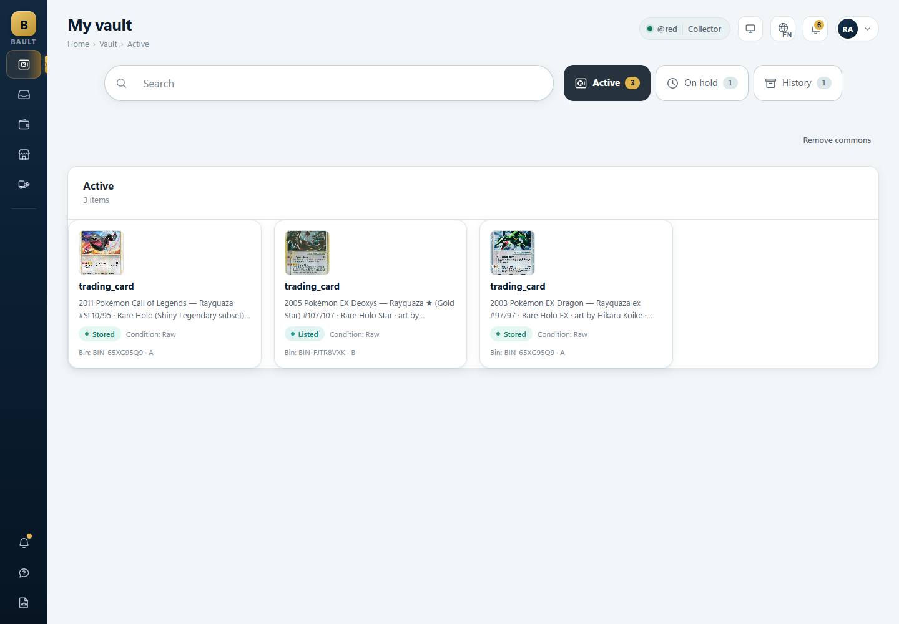
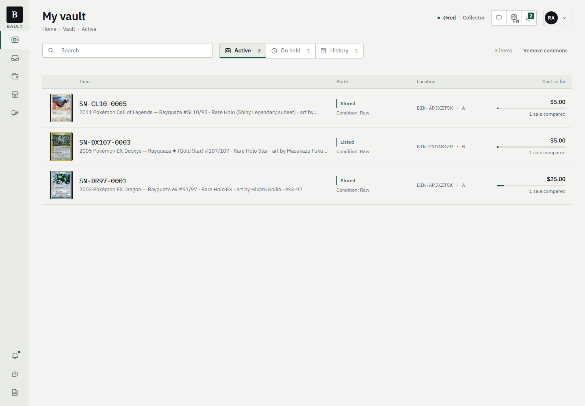
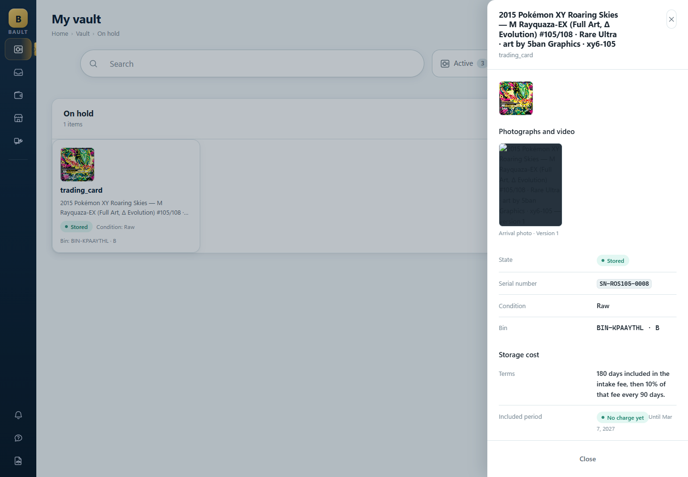
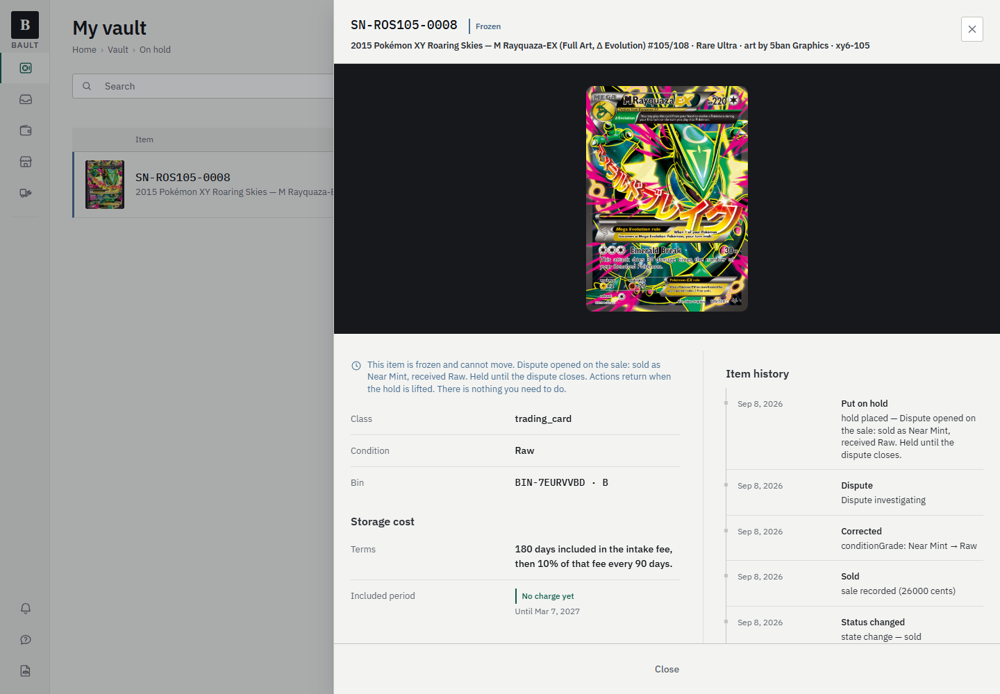
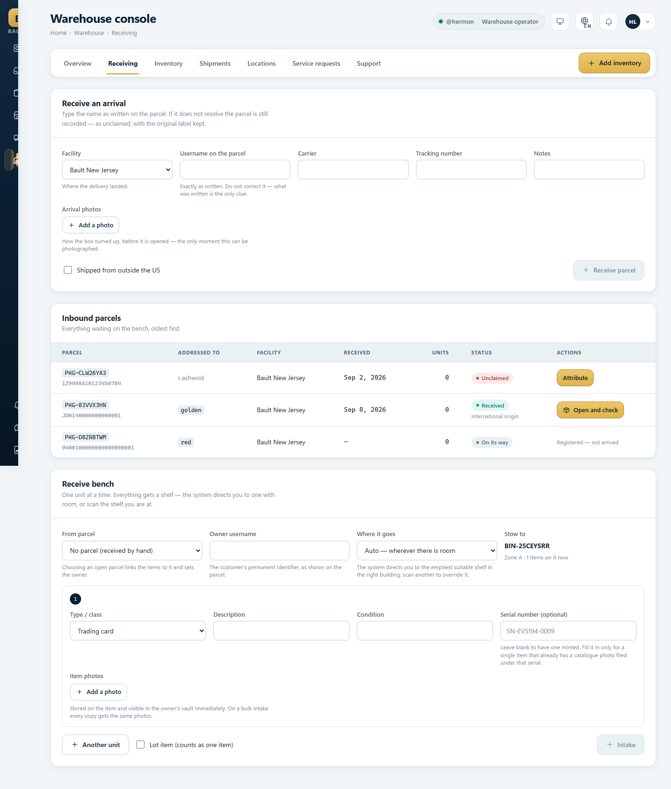
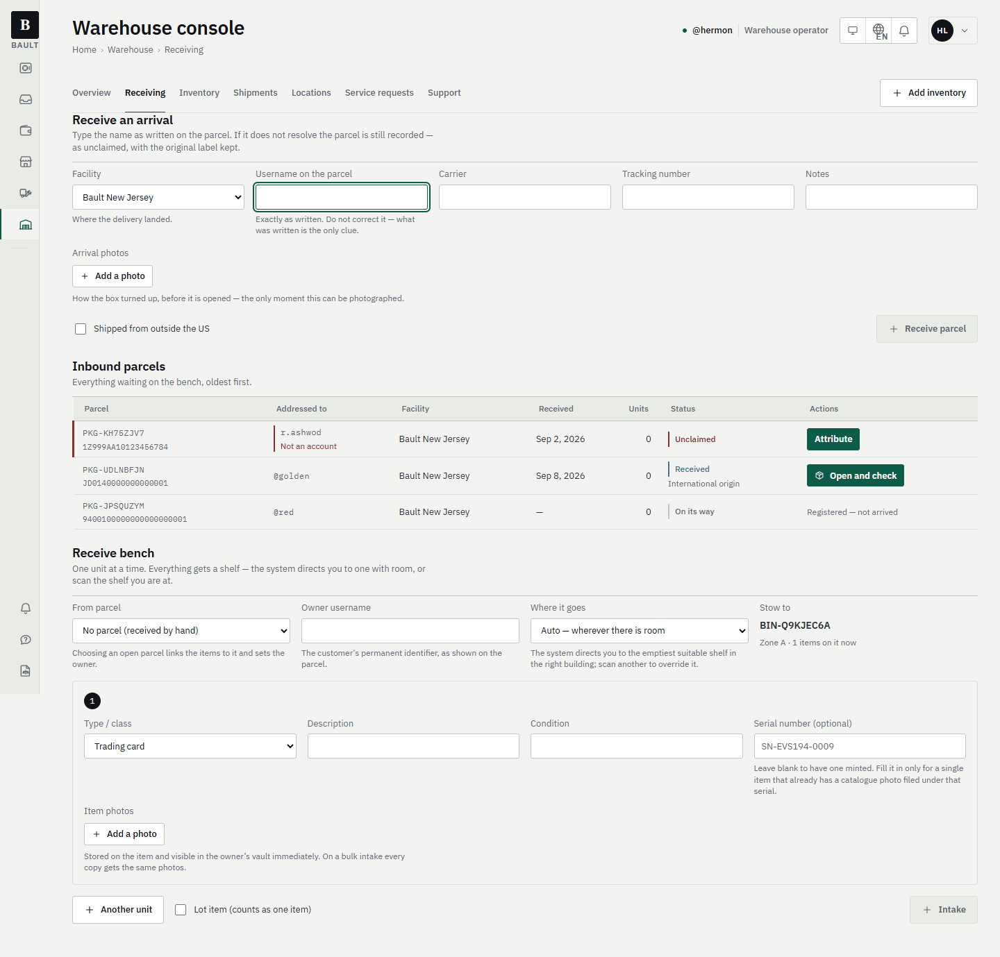
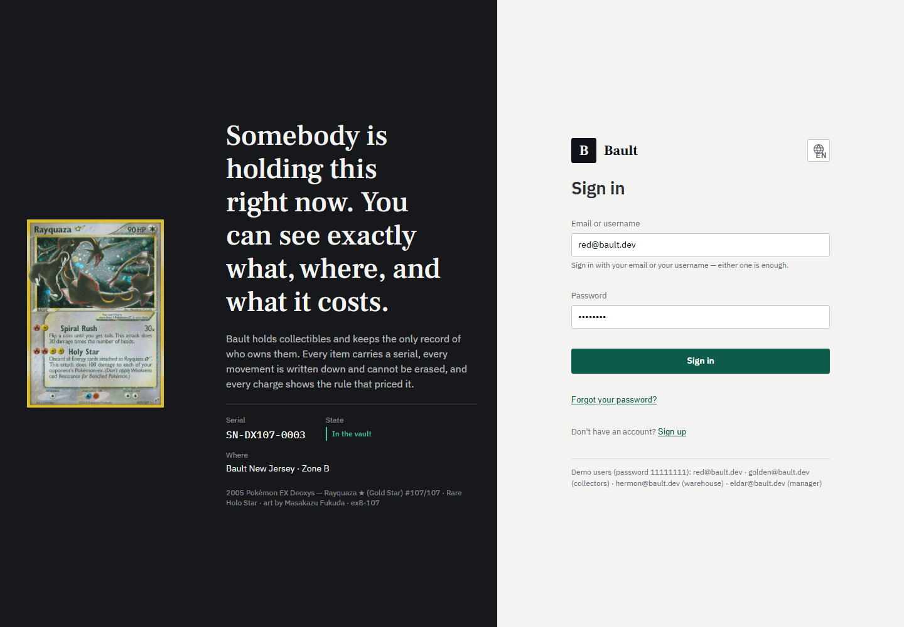
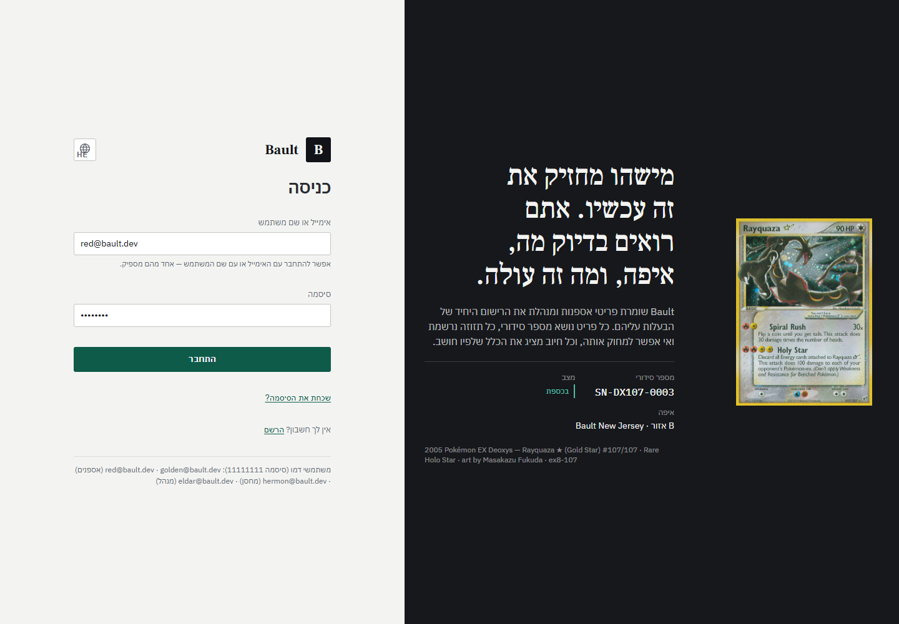

# 02 — Report

The "Custody Grade" pass on Bault: what changed, what was verified, what was left
alone, and what is still open.

**Branch:** `design/custody-grade`, 14 commits off `master` at `df1f050`.
**Design system:** [`DESIGN.md`](../../DESIGN.md).
**Audit and baseline:** [`01-audit.md`](01-audit.md), [`00-stack-notes.md`](00-stack-notes.md).
**Screenshots:** [`audit/before/`](audit/before/) and [`audit/after/`](audit/after/) — 66 and 73
files, named `<screen>-<locale>-<viewport>.png`, so any pair can be read side by side.

---

## 1. What changed, per surface

### The design system
`DESIGN.md` + `apps/web/src/index.css`. The `:root` block was replaced and the old
navy/gold/teal vocabulary re-pointed onto the new palette rather than deleted — 4 600 lines of
stylesheet reference those names, and re-pointing is what changed the whole product at once
instead of screen by screen.

- **Palette.** Off-white with a cool cast, ink in three measured weights (16.7 / 12.5 / 5.2 : 1 on
  the page), five accents with one job each — custody green, brass, frost, amber, oxblood. Each has
  an *ink* value that passes AA as text and a *mark* value for rules and seals.
- **Type.** IBM Plex Sans + IBM Plex Sans Hebrew + IBM Plex Mono + Frank Ruhl Libre, self-hosted and
  subset to latin/latin-ext/hebrew: **512 kB over 19 files**, replacing a 396 kB single-weight
  mathematical face that covered no Hebrew at all. Frank Ruhl Libre carries display size in **both**
  scripts — one family, so Hebrew and Latin share a hand by construction rather than by resemblance.
  Specimen: [`type-specimen.html`](type-specimen.html).
- **Codes and figures told apart.** Mono keeps serials, bins, parcels and barcodes. Money, dates and
  counts move to the UI face with `tabular-nums` — which was the only thing mono was being borrowed
  for, and a price that looks like a barcode is not saying what it is.
- **One radius (3 px), one border weight (1 px), one shadow** — and the shadow is only ever under
  something floating. `--shadow-card`, `--shadow-hero` and `--shadow-rail` are all `none`.
- **Three densities** off four variables. `data-density="warehouse"` on the console is the whole
  change that took the receiving bench from 1 900 px of scroll to 1 379 px for the same work.

**Fixed while doing it:** `index.css:160-164` declared five custom properties in terms of themselves
in the light theme, so `--link` resolved to the empty string; `a { color: var(--link) }` became
invalid at computed-value time, the declaration was discarded, and the property *inherited* — every
link in the default theme computed to body ink and was invisible as a link. Measured, then fixed.
And `font-weight: 550` appeared twelve times against a stack with no variable font, under a
`font-synthesis: none` the stylesheet had itself set to forbid exactly that.

| | |
| --- | --- |
| before |  |
| after |  |

### Vault — the register
`vault-active-{en,he}-{1440,390}.png`

One row per holding: photograph, then **serial**, then status, then what the item is, then what it
is costing. Every holding used to be titled **`trading_card`** — the raw `type_class` enum, in bold
at title size, four times down a page — with the item's actual identity underneath in grey,
truncated mid-word.

**The Break-Even Watch is now on the row, and it was already in the API.**
`GET /vault/break-even` has existed the whole time and nothing in the product ever called it: a
service that counts what has actually been billed against each item and compares it to the median of
real sales of the same class here, refusing to invent a valuation when it has none. The row shows
the spend, a proportion bar that goes amber before it says anything, and the basis of the comparison
in words. One request for the whole vault, not one per row. Where there is no honest value signal the
bar is absent and the figure stands alone — *"this has cost you $25 and we have no way to price it"*
is a true and useful sentence; a bar against a number nobody can source is not.

The command bar went from a 720 px centred pill 58 px tall — the largest, loudest control in the
product, searching four holdings — to a filter row and a segmented scope control, one rule tall.

### Item sheet
`item-{active,hold,history}-{en,he}-{1440,390}.png`

960 px instead of 420, opening with the **photography stage**: the one local dark moment in a light
product, the card at 260 × 325 instead of 72 px. Then the identity line — serial, status, name — then
two columns: what the item is and what can be done to it on the start side, the **custody register**
on the end side. The register is a dated vertical register with a continuous rule, not a timeline
with gold beads on it, and it offers nothing that suggests any of it can be changed.

| | |
| --- | --- |
| before |  |
| after |  |

**Frozen** now states *why*, taking the reason from the `hold_placed` custody event, and the row and
sheet both carry the frost rail. Before, a frozen item was pixel-identical to an active one apart
from which filter chip was dark.

**Departed** desaturates the photograph and changes nothing else. The old treatment painted the whole
tile near-black with white text inside a light product, which read as redaction rather than history.

### Marketplace
`marketplace-{browse,offers}-{en,he}-1440.png`

**Filters moved into the URL.** `type`, `condition`, `min`, `max`, `sort` and the search text were
`useState`, so a collector who found a graded slab under $200 could not link it, bookmark it, reload
it or send it to anybody, and Back walked out of the marketplace rather than out of the filter.
`useNavigation.setParams` merges and drops empties, and replaces rather than pushes so one keystroke
is not one history entry.

Listing rows: a 96 px photograph on a fixed 4:5 stage — it was 75 px next to a 110 px Buy button —
and **the price is the first text line**. Buy and Make offer stop being the same size: one settles
from the wallet and cannot be undone, the other opens a negotiation.

Offers rows now show the thing being bid on — a photograph and a serial, on the one screen in the
product where somebody decides what an object is worth and previously saw neither. The offer and the
asking price sit adjacent and decimal-aligned instead of 380 px apart in different sizes.

### Wallet
`wallet-{overview,transactions}-{en,he}-1440.png`

**The ledger gets a running balance.** Without one it is a list of movements, and the question
anybody actually brings to a ledger — *what did I have after that?* — cannot be answered by reading
it. Computed client-side, and that is safe rather than convenient: `LedgerService.list` returns the
whole ledger with no limit and no pagination, so the walk starts from zero at the oldest row and the
newest row's figure is exactly the balance the header shows. The code says what must change if that
endpoint ever grows a limit.

The dark navy balance card with its gold gradient, glowing text-shadow and cropped vault-door
illustration is gone; so is the 24 px tinted rounded square in front of every ledger row's type
label.

### Services, support, inbound
`shipping-services-requests-*.png`, `support-tickets-*.png`

Custom requests become the **three-step register** the flow actually is: ask (free) → an operator
proposes a price and a scope → you accept. The proposal step carries the amount *and* the scope
together, because a collector accepting a figure is agreeing to whatever the operator understood the
ask to be. A decline is not a fourth step; it is the second one answered no, in the second one's
position, with the reason.

Support: the status tones read backwards under the old palette — `info` was a teal a shade off the
success green, so an **open** ticket (nobody has looked at this yet) wore what a reader takes for the
"done" colour. Frost now, the same tone a frozen item takes and for the same reason. Threads render
as register rows rather than chat bubbles: support messages are append-only, and a bubble is the
shape of a conversation that can be deleted.

### Warehouse
`warehouse-receiving-{en,he}-{1440,390}.png`

The console runs at warehouse density — `data-density` swaps four variables and the base size, and
nothing else changes. The **unclaimed parcel** — the one row on a bench that is somebody's unopened
property with no owner attached — takes the register's state rail instead of a red dot in a pill, and
the label it arrived with is quoted and marked as unresolved rather than greyed into looking like an
empty cell. The bench's first field takes focus on a fine pointer, and does not on touch.

| | |
| --- | --- |
| before |  |
| after |  |

### Management
`admin-{yield,pricing}-{en,he}-1440.png`

The console had **no chart** — it answered "which part of the building pays for itself" with three
tables of numbers and a progress bar in a cell whose scale was never stated. There is one now, and it
is the only chart style this product gets: graphite bars, one accent marking the row to act on,
tabular labels, a stated maximum, no gradients, no rounded caps, no animation. The SVG draws bars and
nothing else — every label and figure beside it is ordinary text, so a screen reader gets the chart as
prose and text zoom works on it.

Two things it refuses to fake: revenue per shelf-month is undefined until occupancy has accrued, so
rather than drawing empty bars under an axis reading $0.00–$0.01 it falls back to plain revenue **and
says so on the axis**; and an empty zone is never the marked one, because a zone with nothing on its
shelves returns nothing by arithmetic rather than by underperforming.

### The anonymous surface
`landing-{en,he}-1440.png`, `landing-en-390.png`

There is no marketing site — the whole application is behind authentication — so sign-in *is* the
public face, and it was a 440 px white card floating on a navy radial gradient with a gold `B` above
it. It is a landing page now, built out of the argument the product makes everywhere else: **a real
item, photographed, with its serial and its custody line**, using the same photography stage, the same
`Serial` component and the same custody green as the signed-in product. The display face appears here
and nowhere else, which is what "marketing headlines only" means.

| | |
| --- | --- |
| after (en) |  |
| after (he) |  |

---

## 2. What was verified

Everything below was run against the application in a browser, not asserted from the source.

### Accessibility — `@axe-core/playwright`, zero serious or critical

| | |
| --- | --- |
| Combinations checked | **104** — 26 screens × 4 roles (collector, operator, manager, suspended) × 2 locales × 2 viewports |
| Rules | `wcag2a`, `wcag2aa`, `wcag21a`, `wcag21aa` |
| Serious/critical before | **80** |
| Serious/critical after | **0** |

Three root causes, all real:

1. **Secondary ink was too light, and the measurement that missed it was mine.** `#676c74` clears AA
   on the page ground at 4.79:1 — which is what I checked. It is used on the register header, the
   navigation rail and every other sunken surface, one step darker than the page, where the same ink
   measures **4.43:1** and fails. 61 of the 80 findings were that. A secondary colour has to clear the
   bar on the *darkest* surface it appears on. `#62676f`: 5.16:1 on the page, 4.74:1 on the sunken
   surface.
2. **The money input was never labelled.** It existed as a hand-assembled `` caption and `
`
   wrapper repeated in nine files, so nothing associated the label with the control. `MoneyField` owns
   both ends of the association; five sites are converted, every one a place where somebody types a
   number that moves real money.
3. **The photo input had no accessible name** — off the tab order, but an unlabelled form control is
   unlabelled whether or not anybody can reach it.

### Bidirectionality — a sweep, and it finds nothing

A scan over 20 Hebrew screens for any leaf element whose text begins with a neutral character before
a Latin strong character, in an `rtl` context, without isolation. It found four; it now finds zero.

**`unicode-bidi: isolate` was not enough, and this is the trap.** It fences a run off from its
surroundings but still resolves that run's direction from the element's own `direction`, which on a
Hebrew page is `rtl`. `"2011 Pokémon Call of Legends…"` begins with a **digit** — neutral, not strong
— so the line was laid out right-to-left and the leading year migrated to the far end. That is the
exact defect the audit reported, and it survived the first fix, *because* the first fix was
`isolate`. `unicode-bidi: plaintext` is the CSS equivalent of `dir="auto"`: isolate **and** resolve
from the run's own first strong character.

**A date is not a Latin run.** `Intl.DateTimeFormat('he-IL')` returns `8 בספט׳ 2026` — Hebrew, with
Hebrew's ordering — and an intermediate commit wrapped dates in `.ltr-run`, laying them out
backwards. Verified by measuring the x-position of every glyph: in Hebrew the visual order is
`2026 ׳טפסב 8`, which read right-to-left is `8 בספט׳ 2026`; in English it is `Sep 8, 2026` left to
right.

### Keyboard — both directions, 1440 px

| Check | Result |
| --- | --- |
| Tab order follows visual order | ✅ 14 stops; x ascends 0 → 1233 in LTR and descends 1369 → 167 in RTL |
| Visible focus on every stop | ✅ 14/14 carry the 2 px custody ring; 0 without |
| Enter opens a record | ✅ URL gains `?item=…`, focus moves inside the dialog |
| Escape closes it | ✅ and focus returns to the row that opened it |
| Tab strip arrow keys | ✅ direction-correct in both locales (`ArrowRight` in LTR, `ArrowLeft` in RTL) |
| Skip link | ✅ first stop in both directions |

### Reduced motion
Under `prefers-reduced-motion: reduce`, all **34** measured `animation-duration` /
`transition-duration` values on the shell, sheet, backdrop, buttons and rows collapse to `0.01 ms`.

### Real-world states
| State | How it was reached | Result |
| --- | --- | --- |
| Loading | vault request held open | 6 skeletons; **0** loading buttons had lost their label |
| Empty | `#/marketplace/browse?max=1` | no icon tile, typographic, start-aligned, names the way out ("Clear filters") — and it is a *link*, only because the filter is in the URL now |
| Error | `/vault/items` forced to 500 | `role="alert"`, message in place, shell and rail intact |
| Frozen | `#/vault/hold` | frost rail on row and sheet, reason from the custody event |
| Departed | `#/vault/history` | photograph desaturated, history intact and navigable |
| Suspended | `dana@bault.dev` | rail narrows to one destination; amber state rail on the account line; helpdesk reachable |
| Unknown parcel | `#/warehouse/receiving` | oxblood state rail; label quoted and marked "Not an account" |

### Business rules — exercised, not read
| Rule | Verified |
| --- | --- |
| A party cannot accept a price they proposed | ✅ Red (received the offer) sees **Accept / Counter / Reject**. Golden (proposed it) sees **Change offer / Withdraw** — the Accept control is *not rendered*, not disabled |
| Swaps show both sides and both approvals | ✅ trade register names each party's items and the pending status |
| Cash out is a request | ✅ *"Submitting a request does not change your balance. Money moves only when an approved request is completed."* |
| Service pricing shown before purchase | ✅ 6 of 8 actions state the amount on the control. The two without: third-party grading (priced per tier in its own form) and "Ask for something else" (**asking is free** — a price there would be a lie) |
| Custom requests are three steps | ✅ ask → propose → accept, rendered as the step register with the current step marked |
| Custody register is append-only | ✅ 2 entries, **0** interactive elements inside it |

### Tests and lint

Every suite, each run from a freshly seeded database:

| Project | Result |
| --- | --- |
| `web` | **155 passed** |
| `ux` | **98 passed** (83 existing + 15 new) |
| `contract` | **11 passed** |
| `core-contract` | **19 passed** |
| `integration` | **180 passed** |
| `core` | **195 passed** |
| `concurrency` | **1 passed** |
| `property` | **2 passed** |
| | **661 passed, 0 failed** |
| `pnpm typecheck` | clean across all six workspace projects |
| `node scripts/design-lint.mjs` | **clean** (from 47 findings) |

> **Run them with `pnpm test:seeded`, not `pnpm test`.** `scripts/test.mjs` reseeds at the END of a
> run and not at the start, so `pnpm test` executes against whatever state the database is in. Run
> straight after a long browser session it reported one failure —
> `shp-tracking-list.test.ts` expecting Golden's seeded shipment, which an earlier project in the
> same run had consumed. From a clean seed the same file passes, its project passes 180/180, and so
> does everything else. This is a pre-existing property of the runner against a shared database, not
> a regression, and `pnpm test:seeded` exists for exactly it.

`tests/ux/custody-grade.test.tsx` adds 15 cases over Serial, Amount, Code, LtrRun, Seal, the status
mark and the three item states — each run twice, once per direction. They pin behaviour rather than
pixels: a screenshot test fails on a 1 px padding change and passes on a serial rendered backwards.
They also pin that `.pill` and `.badge` are *one* status component and that the seal is deliberately
not that component.

`scripts/design-lint.mjs` stands in for the slop detector the brief assumed and this environment does
not have. Exemptions are declared and explained inline (`design-lint-allow: <why>`) rather than argued
with: two knockout rings, and the barcode's pure black on pure white, which is the quiet zone Code 128
requires and does not follow the theme — a label on a dark surface does not scan.

---

## 3. What was not changed, and why

- **Backend, migrations and business logic.** Untouched, per the guardrails. The only `apps/api`
  change is `db/seed.ts`, which is data.
- **The item view is still a URL-addressed sheet, not a route.** The brief describes a *layout*, not a
  routing requirement, and the existing drawer is already addressable (`?item=…`) with Back closing
  it. Rebuilding it as a route would have risked the flow for no gain in what the reader sees.
- **`faqContent.ts`** reproduces a competitor's price list verbatim and is exempt from the
  Rayquaza-only guard for that reason. The quotation is left alone.
- **Currency stays `$1,234.56` in both locales** rather than switching to Hebrew's trailing-symbol
  convention. USD is the platform's only settlement currency, a collector comparing a Bault price to a
  price guide is comparing the same string, and a ledger column that changes shape when somebody
  switches language is a column two people cannot read together. **This is a decision, and it is the
  one place the system deliberately departs from "locale-correct".** Dates *are* locale-formatted.
- **Screens not restyled individually**: `faq/{ask,guides,faq,policy,shows,contact,legal}`,
  `profile/{addresses,security}`, `notifications/preferences`, `inbound/{addresses,processing}`,
  `warehouse/{overview,shipments,services,support}`, `admin/{users,items,disputes,storage}`. All of
  them are built entirely from the shared primitives, so they changed with the token and component
  layer and were verified by axe and the bidi sweep — they simply had no screen-specific defect worth
  a bespoke pass.

---

## 4. Bugs found and reported rather than fixed

Three, all outside the scope of a visual pass, all real.

1. **The "still owned but departed" half of the vault History view is unreachable.**
   `vault.service.ts:233` matches a departure either by `custody_event.prev_owner_id = user` or by
   `new_owner_id = user AND new_state IN (shipped, donated, consigned, sold)`. Nothing in the
   application ever writes the second shape: `CustodyService.changeState` does not set `new_owner_id`,
   and no code path writes a `dispatch` event at all, though the query looks for one. **A card a
   collector still owns but has shipped home never appears in their History** — including the seeded
   `SN-SV146-0006`, invisible since it was written. *Fix:* add
   `and(eq(item.ownerId, userId), inArray(item.lifecycleState, TERMINAL))` as a third arm of the
   departure subquery, or set `newOwnerId` in `changeState`. The seed models Red's departure as a
   donation — the shape that genuinely works — rather than hand-writing the shape the app never
   produces, which would have made one row appear while every row the product creates stayed missing.
2. **Item media presigned URLs are unsigned.** `GET` on an `item_image` URL returns **403**; the URL
   carries only `?X-Expires=300` with no signature or credential parameters. Every item's arrival and
   professional photographs are broken. The UI now says a photograph did not load instead of sprawling
   six lines of alt text across a grey box; the storage adapter is where the fix belongs.
3. **No endpoint exposes a charge with its pricing rule.** `charge.pricing_rule_snapshot` records the
   exact rule that priced every charge — the data the brief's "every historical charge shows the
   pricing rule that applied" needs — and nothing returns it. The pricing screen shows current rules
   with their effective-from dates, which is all that can honestly be shown today. *Fix:* one admin
   endpoint listing charges with their snapshot.

---

## 5. Seed data added

Six states the redesign has to draw had **no data at all**, so they were seeded as real rows in the
real tables the real screens read (`apps/api/src/db/seed.ts`, section 12):

frozen item · departed item · suspended account · three parcels including one addressed to a username
that does not exist · a prohibited arrival recorded as a disposal rather than an item · custom
requests at all three steps · one escrow deal stopped at the inspection gate · support threads in each
of open / awaiting-customer / resolved.

`dana@bault.dev` (password `11111111`, like every seeded account) signs in, reaches the helpdesk, and
can reach nothing else.

---

## 6. Limitations and recommended next steps

1. **The wordmark is set in Frank Ruhl Libre, not commissioned.** Bault has no logotype; the mark is
   the letter `B` set in the display face. That is honest and it is not a brand. A commissioned
   bilingual wordmark is the single highest-value thing a designer could add next.
2. **The photography spec is unwritten.** The catalogue photographs are real and consistent because
   ten of them came from one source. The warehouse produces arrival and professional shots against no
   stated spec — no background, no lighting, no crop, no resolution floor — so the moment operator
   photographs start reaching the vault at scale, the photography stage will hold a ragged set. The
   stage is built for a neutral sweep; the spec should say so.
3. **Two screens cannot be judged on this data.** `admin/storage` (storage-fee runs) and
   `admin/disputes` have one row and one row respectively, and shelf yield reports "no time yet"
   against every zone because a freshly seeded facility has zero shelf-days. They are correct and they
   are unevaluated; re-look after a week of real occupancy.
4. **The seller storefront line is missing from marketplace listings.** The brief asks for it and
   `BrowseService`'s projection does not select the seller, so it cannot be rendered without a
   backend change. One line in the `select({…})`.
5. **The register prints raw API strings.** Custody summaries arrive in English regardless of locale
   and occasionally carry a bare UUID (`Moved intake → d461937b-…`) or minor units
   (`sale recorded (26000 cents)`). They are isolated so they no longer garble a Hebrew page, but they
   are the machine's vocabulary on the product's most trust-critical surface. Worth translating and
   formatting server-side.
6. **`--fs-5xl` (64 px) is declared and unused.** Nothing in the product needs it yet; it exists for
   a marketing surface that does not exist. Delete it or build the surface.

---

## 7. Deferred questions

None blocked the work; each was resolved with a stated assumption and is listed here so the
assumption can be overruled.

1. **There is no public site, so the sign-in screen was treated as the landing page.** If Bault wants
   a real marketing site at its own routes, this is the design language for it — but it is a new
   surface, not a restyle, and it was out of scope for a pass whose brief was "preserve every flow".
2. **Currency formatting** — see §3. `$1,234.56` in both locales, deliberately.
3. **The item stayed a sheet rather than becoming a route.** Say the word and it becomes
   `#/vault/item/<id>` with the same layout.
4. **The demo credentials are still printed on the sign-in screen.** This build ships with seeded
   accounts and saying so plainly is more honest than hiding them in a README — but it is obviously
   the first thing to remove before anybody real sees it.
